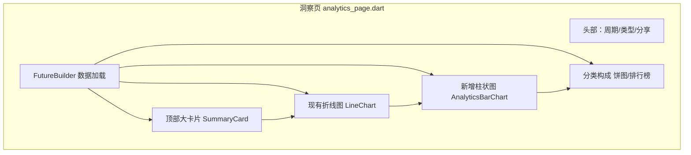

## 需求概述

对「洞察」页进行视觉与功能改造，参考报表页的样式风格，优化整体显示效果。

## 核心功能

- 顶部改为**单一数字大卡片**合计：当前视角下展示大字号金额（如"支出 ¥1,234"），替代现有"总支出+日均"的小结行
- 在**保留现有折线图基础上**，额外新增一个**柱状图**展示趋势数据
- 保留现有**分类构成**展示（分类排行榜 + 饼图切换）
- 应用范围：**全部视角**（支出/收入/结余 × 月/年/全部时间范围）统一改造
- 整体优化显示效果（卡片化、留白、视觉层级）

## 技术栈

- Flutter（现有项目，沿用现有架构与令牌体系）
- `fl_chart ^0.68.0` 已存在，使用其 `BarChart` 实现柱状图，无需新增依赖
- 现有 `LineChart` 为自定义 CustomPainter，保留不动，避免命名冲突（新增柱状图用 fl_chart 的 `BarChart`）
- 主题统一使用 `PiggyTokens` 令牌，兼容暗黑/浅色模式与 `hideAmounts`（隐藏金额）状态

## 实现方案

### 数据流

洞察页 `FutureBuilder` 已加载 `catData`、`seriesRaw`、`txCount`、`sum` 等数据，柱状图与折线图共用同一份 `values`/`xLabels`/`highlightIndex` 数据源，无需新增数据查询，避免重复 IO。

### 顶部大卡片

新增 `SummaryCard`（或改造 `AnalyticsSummary`）组件：以 `PiggyTokens.surface` 卡片为容器，大字号金额（`PiggyTextTokens` 大标题风格）居中/左对齐展示当前视角总额；金额颜色按语义区分（支出红、收入绿、结余按正负）；隐藏金额时显示 `**`；日均小字保留在卡片下方作为辅助信息。

### 柱状图组件

在 `lib/widgets/charts/` 新增 `analytics_bar_chart.dart`：

- 使用 fl_chart `BarChart`，圆角柱（`borderRadius`），主题色 `PiggyTokens.primary`
- X 轴标签、Y 轴网格、`highlightIndex`（今日高亮）复用与折线图一致的 `xLabels`/`values`/`highlightIndex`
- 支持横滑切换周期（与折线图一致的手势），支持 `hideAmounts`
- 与折线图左右排列或上下并排（横向并排节省纵向空间，适应移动端宽度建议上下或 Tab 切换，取实现合理性）

### 布局顺序

顶部大卡片 → 折线图 → 柱状图 → 分类构成标题 → 饼图/分类排行榜 → 底部留白

## 架构



单一视角与结余视角复用同一套组件；结余视角继续不展示分类构成（保持现状），仅应用大卡片+折线+柱状改造。

## 目录结构

```
lib/
├── pages/
│   └── main/
│       └── analytics_page.dart      # [MODIFY] 顶部改为大卡片、新增柱状图、重排布局
└── widgets/
    ├── charts/
    │   └── analytics_bar_chart.dart # [NEW] fl_chart 柱状图组件，复用 values/xLabels/highlightIndex
    └── analytics/
        └── analytics_summary.dart   # [MODIFY] 改造为"单一数字大卡片"样式
```

## 实现注意事项

- 复用现有 `PiggyTokens`/`PiggyTextTokens`/`PiggyDimens`/`PiggyChartTokens` 令牌，不引入新主题模式
- 保留所有现有手势（横滑切换周期/类型），柱状图手势与折线图一致
- 兼容 `hideAmounts`、暗黑/浅色模式、`statsRefreshProvider` 刷新机制
- 柱状图与折线图共用数据源，无新增数据查询，性能开销可控（单次 build 内渲染两个图表）
- 不重构无关逻辑，爆炸半径限制在 `analytics_page.dart` 与相关 widget