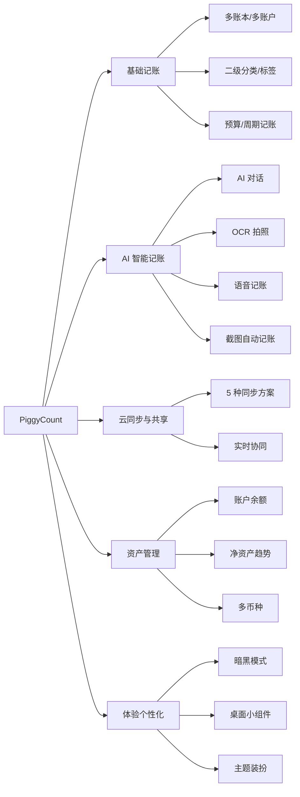
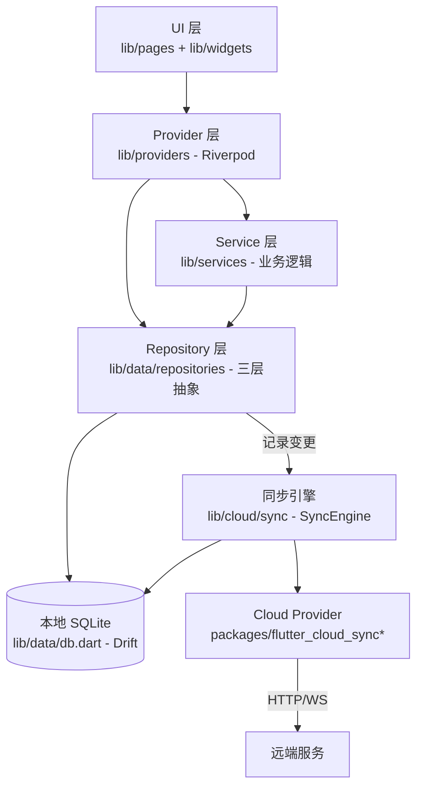
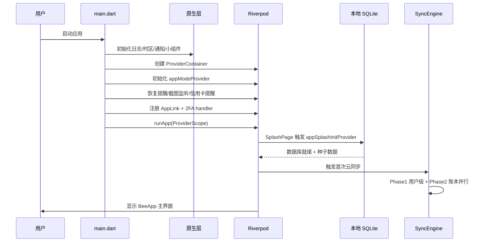
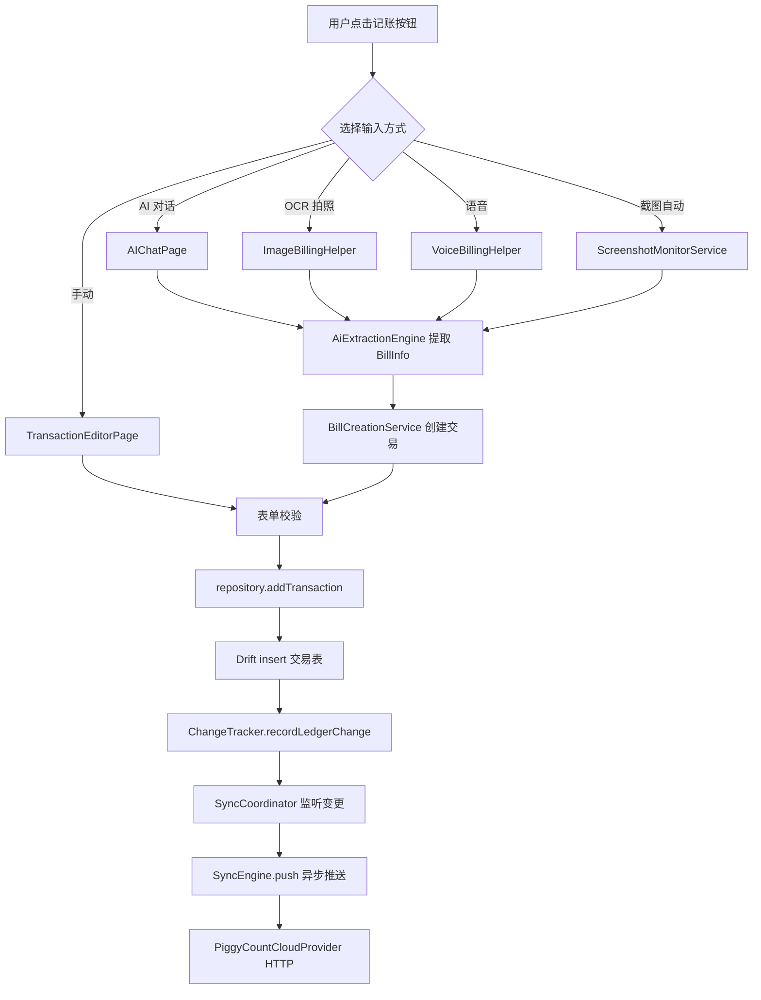
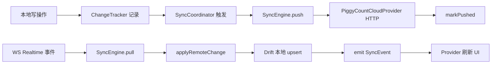

## 目录

- [1. 背景与目的](#1-背景与目的)
- [2. 核心概念](#2-核心概念)
- [3. 详细设计](#3-详细设计)
- [4. 关键流程](#4-关键流程)
- [5. 设计决策记录](#5-设计决策记录)
- [6. 注意事项与约束](#6-注意事项与约束)
- [7. 信息缺口](#7-信息缺口)
- [8. 相关文档](#8-相关文档)

---

## 1. 背景与目的

### 1.1 项目定位

PiggyCount(小猪记账)是一款**轻量、开源、隐私可控**的个人财务管理与支出追踪应用。项目由个人开发者维护,源代码托管于 GitHub:`https://github.com/mecoren/PiggyCount`(本仓库)。应用以 Flutter 构建,同时支持 Android 5.0+ 与 iOS 15.5+,并通过 PiggyCount Cloud 自带 PWA 提供 Web 端访问能力。

依据:`README.md` L41-55、`pubspec.yaml` L1-7。

### 1.2 解决的问题

传统记账应用普遍存在以下痛点,PiggyCount 针对性给出解决方案:

| 传统应用痛点 | PiggyCount 应对策略 |
|---|---|
| 数据存第三方,无法审计 | 完全开源,代码可审计(`LICENSE` Business Source License) |
| 隐私可能被分析利用 | 离线优先 + 自建云端,应用本身不收集任何数据 |
| 服务商倒闭数据丢失 | 数据主权,5 种同步方案任选,数据完全由用户掌控 |
| 高级功能付费墙 | 完全免费(包括 AI / OCR / 语音记账) |
| 广告 / 理财推荐 | 零广告 / 零追踪 / 零数据收集 |

依据:`README.md` L43-52、`PRIVACY.md` L7-13。

### 1.3 文档目标读者

本文档体系面向**一年经验的开发者**、**新加入的贡献者**、**需要理解系统设计的工程师**。所有文档以"帮助快速理解和参与项目"为目标,避免空泛架构八股,所有项目实际描述均尽量基于代码,关键结论标注依据文件路径、类名、函数名或配置文件。

### 1.4 阅读本文档能获得什么

- 了解 PiggyCount 的整体定位、核心能力、技术选型
- 掌握 5 种同步方案的差异与适用场景
- 理解项目目录组织与分层架构
- 明确本地优先、隐私优先的设计哲学
- 快速定位后续深入阅读路径

---

## 2. 核心概念

### 2.1 五大核心能力

PiggyCount 的能力可归纳为五大类,详细模块说明见 [05 核心模块详解](./05-core-modules.md)。

上图展示了 PiggyCount 的五大能力域及其子能力。基础记账是核心底座,AI 与同步是增强能力,资产管理与体验个性化是横向能力。这种划分对应 `lib/pages/` 目录的业务页面组织。

依据:`README.md` L59-93、`lib/pages/` 目录结构。

### 2.2 五种同步方案

PiggyCount 提供五种云同步方案,所有方案数据完全由用户掌控:

| 方案 | 适用场景 | 特点 | 实现位置 |
|---|---|---|---|
| **PiggyCount Cloud** | 多端实时协同 + 自托管 | Docker 一键、秒同步、自带 Web 端、多用户 | `packages/flutter_cloud_sync/lib/src/providers/piggycount_cloud_provider.dart` |
| **iCloud** | iOS 单平台用户 | 零配置、原生集成 | `packages/flutter_cloud_sync_icloud/` |
| **Supabase** | 无 NAS 的跨平台用户 | 免费额度充足、配置简单 | `packages/flutter_cloud_sync_supabase/` |
| **WebDAV** | NAS 用户 | 数据本地化、群晖/绿联云/Nextcloud | `packages/flutter_cloud_sync_webdav/` |
| **S3 协议** | 灵活云存储 | Cloudflare R2 / AWS S3 / MinIO | `packages/flutter_cloud_sync_s3/` |

依据:`README.md` L141-153、`pubspec.yaml` L64-73。

### 2.3 目标平台与分发渠道

- **Android 5.0+**:Google Play + GitHub APK 直发
- **iOS 15.5+**:App Store + TestFlight
- **Web**:PiggyCount Cloud 自带 PWA(需用户自部署 server)
- ~~HarmonyOS~~:已停止更新

依据:`README.md` L53-55、`.github/workflows/release.yml`。

### 2.4 开源协议

采用 **Business Source License**(版本 1.0,生效日期 2025-01-29):

- **非商业使用免费**:个人使用、学习研究、非营利组织、开源贡献
- **商业使用需付费授权**:作为商业产品/服务、为盈利性组织服务、基于本软件开发商业产品、集成到商业软件、提供付费云服务/SaaS

依据:`LICENSE` L1-25。

---

## 3. 详细设计

### 3.1 整体架构概览

PiggyCount 采用**分层架构 + 同步引擎旁路**的设计,所有写操作先入本地 SQLite,再异步同步到云端。

上图展示了 PiggyCount 的五层架构。UI 层只与 Provider 层交互,不直接访问数据;Provider 层通过 Riverpod 注入 Repository 与 Service;Repository 层是数据访问的唯一入口,所有写操作在完成后通知 ChangeTracker;同步引擎旁路监听本地变更表,异步推送到云端。这种设计保证了离线可用与数据一致性。

详细架构设计见 [04 系统架构设计](./04-system-architecture.md)。

依据:`lib/` 目录结构、`lib/data/repositories/base_repository.dart`、`lib/cloud/sync/change_tracker.dart`。

### 3.2 目录组织

PiggyCount 主代码位于 `lib/` 下,按职责分目录:

| 目录 | 职责 | 关键文件 |
|---|---|---|
| `lib/ai/` | AI 抽取引擎(Layer 1) | `core/ai_extraction_engine.dart` |
| `lib/cloud/` | 同步业务层 | `sync/sync_engine.dart`、`sync_service.dart` |
| `lib/data/` | 数据层(Drift + Repository) | `db.dart`、`repositories/` |
| `lib/l10n/` | 国际化(ARB 文件) | `app_en.arb`、`app_zh.arb` |
| `lib/models/` | 应用级数据模型 | `ai_quick_command.dart`、`note_history.dart` |
| `lib/pages/` | UI 页面(20+ 业务目录) | `main/`、`transaction/`、`cloud/` 等 |
| `lib/providers/` | Riverpod Provider(30 个文件) | `all_providers.dart`、`database_providers.dart` |
| `lib/services/` | 业务服务(15+ 子域) | `ai/`、`billing/`、`data/`、`import/`、`export/` |
| `lib/styles/` | 设计令牌 + 18 种皮肤 | `tokens.dart`、`header_skins/` |
| `lib/utils/` | 工具类(22 个文件) | `currencies.dart`、`format_utils.dart` |
| `lib/widget/` | 桌面小组件 | `widget_manager.dart` |
| `lib/widgets/` | 通用 Widget | `biz/`、`charts/`、`ui/` |

`packages/` 下有 6 个本地 path 依赖子包,封装 AI 与同步能力,可独立复用:

| 子包 | 职责 |
|---|---|
| `flutter_ai_kit` | AI 抽象层 + 6 种执行策略 |
| `flutter_ai_kit_zhipu` | 智谱 GLM provider |
| `flutter_ai_kit_openai` | OpenAI provider |
| `flutter_cloud_sync` | 同步框架核心(含 PiggyCountCloudProvider 内嵌) |
| `flutter_cloud_sync_supabase` | Supabase provider |
| `flutter_cloud_sync_webdav` | WebDAV provider |
| `flutter_cloud_sync_s3` | S3 / R2 / B2 / MinIO provider |
| `flutter_cloud_sync_icloud` | iCloud provider(iOS native) |

依据:`pubspec.yaml` L58-73、`lib/` 与 `packages/` 目录结构。

### 3.3 平台原生层

| 平台 | 原生代码位置 | 关键内容 |
|---|---|---|
| Android | `android/app/src/main/kotlin/com/wait/piggycount/` | `MainActivity.kt`、`LoggerPlugin.kt`、桌面小组件、AppLink、截图监听服务 |
| iOS | `ios/Runner/` + `ios/PiggyCountWidget/` | `AppDelegate.swift`、`AppIntentsBridge.swift`、`AutoBillingAppIntent.swift`、WidgetExtension |

依据:`android/` 与 `ios/` 目录结构。

---

## 4. 关键流程

### 4.1 应用启动流程

启动流程分两阶段:第一阶段是 `main.dart` 中的原生初始化(日志、时区、通知、小组件、提醒恢复),保证应用基本可用;第二阶段是 `appSplashInitProvider` 触发的数据库初始化、种子数据写入、周期交易生成、首次云同步。两阶段分离的设计让首屏更快呈现,同步等耗时操作在后台异步执行。

依据:`lib/main.dart` L43-154、`lib/app.dart`。

### 4.2 记账流程

记账流程统一收敛到 `repository.addTransaction`,无论输入方式是手动表单、AI 对话、OCR、语音还是截图自动识别。写库后通过 ChangeTracker 记录变更,SyncCoordinator 反应式监听变更表并触发异步推送。这种"写本地 + 异步同步"的设计保证了记账操作的响应速度,即使无网络也能完成记账。

依据:`lib/pages/transaction/transaction_editor_page.dart`、`lib/services/ai/ai_bookkeeper.dart`、`lib/cloud/sync/change_tracker.dart`。

### 4.3 数据同步流程

数据同步是 PiggyCount 最复杂的模块,详见 [06 数据同步与多设备离线机制](./06-data-sync-and-offline.md)。这里仅给出高层流程:

同步流程分推(push)和拉(pull)两路。推:本地写 → ChangeTracker 记录 → SyncCoordinator 监听 → SyncEngine.push → HTTP 推送到 server → markPushed。拉:WS 事件触发 → SyncEngine.pull → applyRemoteChange 应用到本地 → emit SyncEvent → Provider 刷新 UI。两路独立运行,通过单飞锁防止并发冲突。

---

## 5. 设计决策记录

### 决策 1:本地优先存储

- **决策内容**:所有交易数据优先写入本地 SQLite,再异步同步到远端。
- **原因**:保证离线可用,降低网络依赖,提升写入响应速度。
- **备选方案**:
  1. 直接写入远端数据库
  2. 本地缓存 + 远端优先
  3. 本地优先 + 异步同步(当前选择)
- **优缺点**:
  - 直接写远端:一致性好,但离线不可用,网络依赖强。
  - 远端优先:多端一致性好,但弱网体验差。
  - 本地优先:离线体验好,但需要处理同步冲突。
- **最终取舍**:选择本地优先,同步作为增强能力。冲突解决采用服务端权威 LWW(Last Write Wins)。
- **依据**:`PRIVACY.md` L29-32、`lib/cloud/sync/sync_conflict_resolver.dart`。

### 决策 2:开源 + Business Source License

- **决策内容**:源代码完全开源,但商业使用需付费授权。
- **原因**:平衡开源精神与开发者收益,个人用户完全免费,商业使用付费支持持续开发。
- **备选方案**:MIT/Apache(完全免费)、专有闭源、BSL(当前选择)。
- **优缺点**:
  - MIT/Apache:开源友好,但无法限制商业竞争对手直接 fork 商用。
  - 闭源:收益可控,但失去开源社区贡献与审计价值。
  - BSL:开源可审计 + 商业保护,但协议复杂度较高。
- **最终取舍**:选择 BSL,个人与非商业完全免费,商业需授权。
- **依据**:`LICENSE` L1-25。

### 决策 3:五种同步方案并存

- **决策内容**:同时支持 PiggyCount Cloud / iCloud / Supabase / WebDAV / S3 五种同步方案。
- **原因**:不同用户有不同的基础设施偏好(iOS 用户偏好 iCloud、NAS 用户偏好 WebDAV、极客偏好 S3、自托管偏好的选 PiggyCount Cloud),让数据主权真正落到用户手中。
- **备选方案**:
  1. 只支持 PiggyCount Cloud(自建服务)
  2. 只支持 Supabase(第三方 BaaS)
  3. 五种并存(当前选择)
- **优缺点**:
  - 单一方案:开发维护成本低,但用户失去选择权,且 PiggyCount Cloud 需用户自部署。
  - 五种并存:用户选择权最大,但开发维护成本高,五种 provider 能力不均(只有 PiggyCount Cloud 支持实时协同)。
- **最终取舍**:五种并存,PiggyCount Cloud 作为主推方案提供最完整能力,其他四种作为轻量备份方案。
- **依据**:`README.md` L141-153、`packages/flutter_cloud_sync*` 子包结构。

### 决策 4:Riverpod 作为唯一状态管理与 DI 方案

- **决策内容**:使用 `flutter_riverpod: ^2.5.1` 作为状态管理、依赖注入、反应式数据流的唯一方案,不引入 get_it / injectable / bloc 等。
- **原因**:Riverpod 同时覆盖状态管理 + DI + Stream 监听,避免多套方案并存的心智负担;编译时安全;社区活跃。
- **备选方案**:Provider(旧)、Bloc(事件驱动)、GetX(争议大)。
- **最终取舍**:Riverpod 2.5,`ProviderScope` + `ConsumerWidget` + `StateProvider` + `StreamProvider` + `family` + `autoDispose`。
- **依据**:`pubspec.yaml` L14、`lib/providers/` 30 个文件。

---

## 6. 注意事项与约束

### 6.1 项目实际约束

1. **Flutter 版本约束**:SDK `^3.6.0`,CI 锁定 Flutter `3.27.3`。`image_cropper_platform_interface` 钉死 `7.1.0`(因 7.2.0 要求 Flutter >= 3.27.6)。依据:`pubspec.yaml` L6、L94-98、`release.yml` L35。
2. **目标平台**:仅 iOS / Android(Web 通过 PiggyCount Cloud PWA,不在本仓库构建)。`record_platform_interface` 钉死 `1.2.0` 修复 record_linux 兼容问题。
3. **iOS 图标手工维护**:`flutter_launcher_icons` 配置 `ios: false`,因为 0.14.x 会重写 `Contents.json` 格式。依据:`pubspec.yaml` L102-110。
4. **Google Play 版本裁剪**:CI 构建时会移除 `REQUEST_INSTALL_PACKAGES`、`READ_MEDIA_IMAGES` 等权限,截屏自动记账功能在 Google Play 版本被砍掉。依据:`release.yml` L166-185。

### 6.2 文档使用约束

1. **第一事实来源**:本仓库本地代码是最高依据,网络资料与 GitHub 仓库如有冲突以本地代码为准。
2. **不编造**:信息不足时使用 `[推断]`、`[建议方案]`、`[待补充]` 标注,绝不编造具体实现细节。
3. **术语一致**:所有文档必须遵守 [02 术语表](./02-glossary.md) 的统一术语。
4. **交叉引用**:文档间使用相对链接,相同概念只做摘要 + 链接原文,避免重复。

### 6.3 业务约束

1. **隐私优先**:应用本身不收集任何用户数据,不上报崩溃、不内嵌广告 SDK、不做用户行为分析。AI 功能默认关闭,需用户主动配置 AI provider。依据:`PRIVACY.md` L7-13。
2. **离线可用**:所有核心功能(记账、查询、统计)在无网络环境下完全可用,云同步仅作为增强能力。
3. **数据主权**:云同步数据完全存储在用户自己的服务器(Supabase 项目 / WebDAV 服务器 / S3 桶 / PiggyCount Cloud 自部署实例),开发者无法访问。

---

## 7. 信息缺口

| 编号 | 缺口描述 | 影响章节 | 建议补充方式 |
|---|---|---|---|
| 1 | GitHub 仓库地址:任务描述 `mecoren/PiggyCount` 与 README 引用 `mecoren/PiggyCount` 不一致,本文档以任务描述为准 | §1.1 | 用户确认仓库归属 |
| 2 | 项目版本号:`pubspec.yaml` 声明 `version: 0.0.1`,实际发布版本由 CI tag 注入,无法从代码确认当前线上版本 | §1.1 | 查 GitHub Release 页面 |
| 3 | 作者信息:文档 `author` 字段统一写 `wait`,待用户补充 | 文档 frontmatter | 用户补充 |
| 4 | CHANGELOG:项目根目录无 CHANGELOG.md,版本演进只能从 db.dart schemaVersion 与 git tag 反推 | §4.3、[17 版本演进](./17-version-evolution.md) | 从 git log 或 Release Notes 提取 |
| 5 | `.docs/` 目录:代码注释大量引用 `.docs/concurrent-fullpush-bloat.md`、`.docs/full-pull-refactor/`、`.docs/2fa-design.md` 等设计文档,但目录实际不存在 | 同步相关文档 | 用户确认是否补提交设计文档 |

---

## 8. 相关文档

- [02 术语表与词汇表](./02-glossary.md) — 核心术语中英对照与边界区分
- [03 技术栈全景](./03-tech-stack.md) — 60+ 依赖分类与选型理由
- [04 系统架构设计](./04-system-architecture.md) — 分层架构与依赖方向详解
- [05 核心模块详解](./05-core-modules.md) — 12 个核心模块的职责与交互
- [06 数据同步与多设备离线机制](./06-data-sync-and-offline.md) — 同步引擎深入设计
- [INDEX](./INDEX.md) — 完整文档索引与阅读顺序建议
