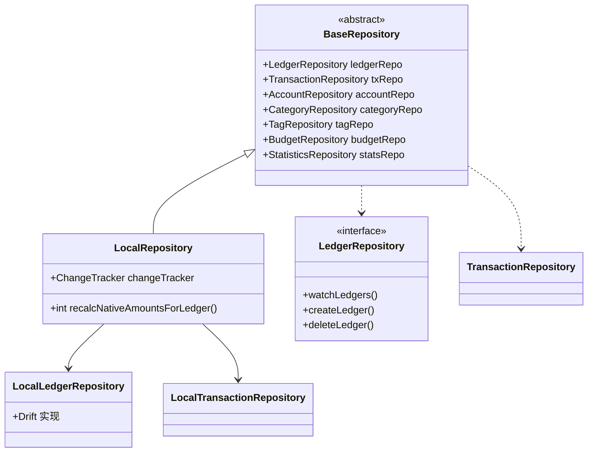
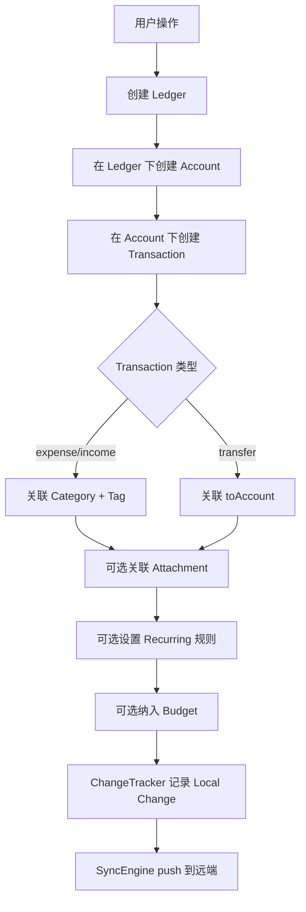
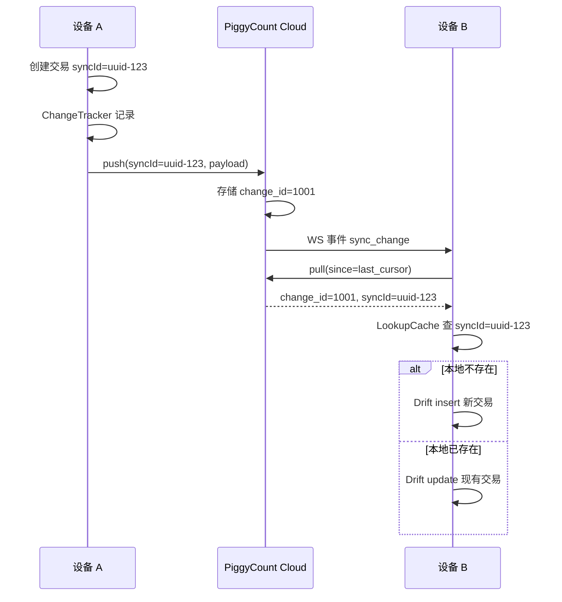

## 目录

- [1. 背景与目的](#1-背景与目的)
- [2. 核心概念](#2-核心概念)
- [3. 详细设计](#3-详细设计)
- [4. 关键流程](#4-关键流程)
- [5. 设计决策记录](#5-设计决策记录)
- [6. 注意事项与约束](#6-注意事项与约束)
- [7. 信息缺口](#7-信息缺口)
- [8. 相关文档](#8-相关文档)

---

## 1. 背景与目的

### 1.1 为什么需要术语表

PiggyCount 涉及记账业务、数据同步、AI 多模态、跨平台等多个领域,代码中同时存在中英文混合命名、业务术语与技术术语交叉、相似概念容易混淆等情况。如果没有统一的术语表,会导致:

- 文档间相同概念用不同名称,读者困惑
- 代码 review 时命名冲突难以裁决
- 新贡献者理解业务边界困难
- 中英文混用导致搜索困难

本文档作为**所有后续文档的术语权威来源**,任何 PiggyCount 文档(包括代码注释)中出现的术语必须与本表保持一致。

### 1.2 适用范围

- 本目录下所有 17 篇正式文档
- 代码中的类名、变量名、注释命名规范参考(代码标识符本身使用英文,见用户规则第 3 条)
- PR 描述、Issue 提交、Commit Message
- 用户文档与开发者文档

### 1.3 术语来源

本文档术语基于以下来源整理:

- `lib/data/db.dart` Drift 表名(L17-L411)
- `README.md` L41-93 业务功能描述
- `PRIVACY.md` 隐私政策术语
- `lib/cloud/sync/` 同步模块代码
- `lib/data/repositories/` Repository 接口命名

---

## 2. 核心概念

### 2.1 术语分类总览

PiggyCount 的术语可分为五大类,下图展示了各类之间的关系:

```mermaid
flowchart TD
    Root[PiggyCount 术语体系]

    Root --> Biz[业务实体类]
    Root --> Sync[同步相关类]
    Root --> Data[数据层类]
    Root --> AI[AI 相关类]
    Root --> Platform[平台与运维类]

    Biz --> B1[Book 账本]
    Biz --> B2[Account 账户]
    Biz --> B3[Transaction 交易]
    Biz --> B4[Category 分类]
    Biz --> B5[Tag 标签]
    Biz --> B6[Budget 预算]
    Biz --> B7[Recurring 周期记账]
    Biz --> B8[Attachment 附件]

    Sync --> S1[Sync 同步]
    Sync --> S2[ChangeTracker 变更追踪]
    Sync --> S3[SyncEngine 同步引擎]
    Sync --> S4[Provider 云提供方]
    Sync --> S5[Realtime 实时]
    Sync --> S6[Cursor 游标]

    Data --> D1[Local Database 本地数据库]
    Data --> D2[Repository 数据访问层]
    Data --> D3[Drift ORM]
    Data --> D4[syncId 同步标识]
    Data --> D5[schemaVersion 模式版本]
```

上图将 PiggyCount 的术语按业务实体、同步机制、数据层、AI、平台五大类组织。业务实体类是记账应用的核心,对应 `db.dart` 中的 Drift 表;同步相关类是 PiggyCount 区别于普通记账应用的特色;数据层类描述了 Drift ORM 与 Repository 模式;syncId 是跨设备同步的关键标识。后续章节按类别详细定义每个术语。

### 2.2 术语使用优先级

当出现同义词时,按以下优先级使用:

1. **推荐用法**(本表标注)
2. 代码中的实际命名(以 Drift 表名 / 类名为准)
3. 用户文档用语(仅在面向用户时使用)

---

## 3. 详细设计

### 3.1 业务实体术语

| 中文术语 | 英文术语 | 别名 | 推荐用法 | 说明 | 代码依据 |
|---|---|---|---|---|---|
| 账本 | Book / Ledger | 账簿 | **Ledger** | 记账的顶级容器,每本独立币种,支持 personal / shared 两种类型 | `db.dart` L17 `Ledgers` 表 |
| 账户 | Account | 账号 | **Account** | 资金载体(现金/银行卡/信用卡等),有余额、币种、信用卡字段 | `db.dart` L40 `Accounts` 表 |
| 交易 | Transaction | 账单记录、账单 | **Transaction** | 一笔收支或转账记录,type=expense/income/transfer | `db.dart` L109 `Transactions` 表 |
| 分类 | Category | 类目 | **Category** | 收支分类,支持二级(父/子),kind=expense/income | `db.dart` L91 `Categories` 表 |
| 标签 | Tag | 标记 | **Tag** | 交易的多对多标记,有颜色,用于灵活筛选 | `db.dart` L210 `Tags` 表 |
| 预算 | Budget | 预算额 | **Budget** | 月度/周度/年度预算,type=total/category | `db.dart` L300 `Budgets` 表 |
| 周期记账 | Recurring Transaction | 重复交易、循环记账 | **Recurring Transaction** | 按规则自动生成交易(frequency=daily/weekly/monthly/yearly) | `db.dart` L156 `RecurringTransactions` 表 |
| 附件 | Attachment | 交易附件 | **Attachment** | 交易关联的图片/文件,有 sha256 去重 | `db.dart` L285 `TransactionAttachments` 表 |

#### 关键边界区分

- **Ledger vs Account**:Ledger 是记账容器(可包含多个 Account),Account 是 Ledger 内的资金载体。一个 Ledger 可有多个 Account,一个 Account 只属于一个 Ledger(通过 `ledgerId` 字段关联,见 `db.dart` L42)。
- **Transaction vs Recurring Transaction**:Transaction 是实际发生的交易记录(已记账),Recurring Transaction 是生成交易的规则模板(未记账,按规则定期生成)。
- **Category vs Tag**:Category 是单选(一笔交易一个分类,`categoryId` 单字段),Tag 是多选(一笔交易多个标签,通过 `TransactionTags` 关联表)。Category 有层级(父/子),Tag 无层级。
- **Budget total vs category**:total 类型作用于整个账本的总预算,category 类型作用于单个分类的预算(通过 `categoryId` 关联)。

### 3.2 同步相关术语

| 中文术语 | 英文术语 | 别名 | 推荐用法 | 说明 | 代码依据 |
|---|---|---|---|---|---|
| 同步 | Sync | 云同步 | **Sync** | 本地数据与远端数据保持一致的过程 | `lib/cloud/sync_service.dart` |
| 同步引擎 | SyncEngine | — | **SyncEngine** | PiggyCount Cloud 的核心同步逻辑类,实现 push/pull/fullPush | `lib/cloud/sync/sync_engine.dart` L72 |
| 变更追踪 | ChangeTracker | — | **ChangeTracker** | 记录本地数据变更到 `local_changes` 表的组件 | `lib/cloud/sync/change_tracker.dart` L29 |
| 同步协调器 | SyncCoordinator | — | **SyncCoordinator** | 反应式监听变更表并触发 SyncEngine 的组件 | `lib/cloud/sync/sync_coordinator.dart` L27 |
| 云提供方 | Cloud Provider | provider | **Cloud Provider** | 同步后端的抽象接口,有 5 种实现 | `packages/flutter_cloud_sync/lib/src/core/cloud_provider.dart` |
| 实时同步 | Realtime | — | **Realtime** | 基于 WebSocket 的实时事件推送 | `lib/cloud/sync/sync_engine_realtime.dart` |
| 游标 | Cursor | serverCursor | **Cursor** | 增量拉取的位置标记,per-device per-provider | `db.dart` L237 `SyncState.serverCursor` |
| 本地变更 | Local Change | — | **Local Change** | 已记录但未推送的变更,存于 `local_changes` 表 | `db.dart` L220 `LocalChanges` 表 |
| 同步标识 | syncId | — | **syncId** | 跨设备同步的唯一标识(UUID),用于实体匹配 | `db.dart` L28、L59、L106 等字段 |
| 单飞锁 | In-flight Lock | — | **单飞锁** | 防止同一操作并发执行的锁机制 | `sync_engine.dart` `_pushInFlight` 等 |
| 全量推送 | fullPush | — | **fullPush** | 把账本所有实体推送到远端(首次同步或修复) | `sync_engine.dart` `fullPush()` |
| 增量推送 | push | — | **push** | 只推送未推送的本地变更 | `sync_engine.dart` `push()` |
| 增量拉取 | pull | — | **pull** | 从远端拉取变更应用到本地 | `sync_engine.dart` `pull()` |
| 全量拉取 | fullPull / runFullPull | — | **fullPull** | 拉取整个账本的 JSON snapshot 并应用 | `sync_engine.dart` `runFullPull()` |
| LWW | Last Write Wins | 最后写入胜出 | **LWW** | 冲突解决策略,以服务端 `server_received_at` 为准 | `sync_conflict_resolver.dart` |
| 同步拉取错误 | Sync Pull Error | — | **Sync Pull Error** | 拉取时 apply 失败的变更记录 | `db.dart` L266 `SyncPullErrors` 表 |

#### 关键边界区分

- **push vs fullPush**:push 只推 `local_changes` 表中未推送的增量;fullPush 把账本所有实体(交易、账户、分类、标签、预算)全部推送到远端。fullPush 用于首次同步或数据修复,push 用于日常增量。
- **pull vs fullPull**:pull 基于 cursor 增量拉取变更;fullPull 拉取整个账本的 JSON snapshot 并整体应用。fullPull 用于备份恢复场景。
- **user-global vs ledger-scoped**:user-global 变更影响所有账本(账户、分类、标签、汇率覆盖),`local_changes.ledger_id=0`;ledger-scoped 变更只影响单个账本(交易、预算、账本本身),`local_changes.ledger_id>0`。
- **LWW vs 字段级合并**:整体 LWW 是 server 推什么就 upsert 什么;字段级合并是 `payload.containsKey(key)` 决定是否覆盖,缺键保留本地值(用于 `excludeFromStats`、`hidden` 等可选字段)。

### 3.3 数据层术语

| 中文术语 | 英文术语 | 别名 | 推荐用法 | 说明 | 代码依据 |
|---|---|---|---|---|---|
| 本地数据库 | Local Database | — | **Local Database** | 设备本地的 SQLite 数据库,通过 Drift 访问 | `lib/data/db.dart` `BeeDatabase` 类 |
| 数据访问层 | Repository | — | **Repository** | 数据访问的抽象接口层,有三层实现 | `lib/data/repositories/` |
| Drift | Drift | — | **Drift** | Dart 的 SQLite ORM 框架,`drift: ^2.20.2` | `pubspec.yaml` L16 |
| 模式版本 | schemaVersion | — | **schemaVersion** | 数据库 schema 的版本号,当前 31 | `db.dart` L445 |
| 迁移 | Migration | — | **Migration** | schemaVersion 升级时的数据迁移逻辑 | `db.dart` L448 `MigrationStrategy` |
| 种子数据 | Seed Data | — | **Seed Data** | 首次安装时写入的默认分类/账户 | `lib/services/data/seed_service.dart` |
| 主键 | Primary Key | PK | **主键** | 表的唯一标识,Drift `autoIncrement()` 或自定义 | `db.dart` 各表 |
| 外键 | Foreign Key | FK | **外键** | 表间关联字段,如 `ledgerId` 关联 `Ledgers.id` | `db.dart` L42、L111 等 |

#### Repository 三层结构

上图展示了 Repository 的三层结构:`BaseRepository` 是聚合抽象基类(implements 11 个接口),`LocalRepository` 是其本地实现(通过委托模式持有 11 个子 Repository),每个子 Repository(如 `LocalLedgerRepository`)基于 Drift 实现具体 SQL。这种设计让 UI 只与 `BaseRepository` 抽象交互,不感知具体实现。

依据:`lib/data/repositories/base_repository.dart`、`lib/data/repositories/local/local_repository.dart`。

### 3.4 AI 相关术语

| 中文术语 | 英文术语 | 别名 | 推荐用法 | 说明 | 代码依据 |
|---|---|---|---|---|---|
| AI 记账 | AI Bookkeeping | — | **AI Bookkeeping** | 通过 AI 自动提取账单信息并创建交易 | `lib/services/ai/ai_bookkeeper.dart` |
| AI 提取引擎 | AI Extraction Engine | — | **AiExtractionEngine** | Layer 1 抽象引擎,把输入转成 BillInfo | `lib/ai/core/ai_extraction_engine.dart` L15 |
| 账单信息 | BillInfo | — | **BillInfo** | AI 提取的结构化账单数据 | `lib/ai/core/bill_info.dart` |
| AI 提供方 | AI Provider | — | **AI Provider** | AI 服务提供方(智谱 GLM / OpenAI) | `packages/flutter_ai_kit*/` |
| 执行策略 | Execution Strategy | — | **Execution Strategy** | AI 调用策略(local_first/cloud_first 等 6 种) | `packages/flutter_ai_kit/lib/src/strategies/` |
| OCR 记账 | OCR Billing | — | **OCR Billing** | 拍照识别支付截图自动记账 | `lib/utils/image_billing_helper.dart` |
| 语音记账 | Voice Billing | — | **Voice Billing** | 语音输入自动记账 | `lib/utils/voice_billing_helper.dart` |
| 对话 | Conversation | — | **Conversation** | AI 对话会话,有标题和时间戳 | `db.dart` L188 `Conversations` 表 |
| 消息 | Message | — | **Message** | AI 对话的单条消息,role=user/assistant | `db.dart` L198 `Messages` 表 |

### 3.5 平台与运维术语

| 中文术语 | 英文术语 | 别名 | 推荐用法 | 说明 | 代码依据 |
|---|---|---|---|---|---|
| 应用锁 | App Lock | — | **App Lock** | 应用启动或后台恢复时的生物认证锁 | `lib/services/security/app_lock_service.dart` |
| 双因子认证 | 2FA / Two-Factor | — | **2FA** | PiggyCount Cloud 登录的 TOTP 二次验证 | `piggycount_cloud_provider.dart` `globalTwoFactorHandler` |
| 桌面小组件 | Home Widget | — | **Home Widget** | iOS / Android 桌面快速记账小组件 | `lib/widget/widget_manager.dart` |
| 应用链接 | App Link | Deep Link | **App Link** | `piggycount://` URL Scheme 触发记账 | `lib/services/platform/app_link_service.dart` |
| 快捷操作 | Quick Action | — | **Quick Action** | 桌面长按图标的快捷方式 | `lib/services/platform/quick_actions_service.dart` |
| 共享账本 | Shared Ledger | — | **Shared Ledger** | 多人协同的账本,有 Owner / Editor 双角色 | `db.dart` L32 `isShared`、`myRole` |
| 邀请码 | Invite Code | — | **Invite Code** | 共享账本的加入凭证 | `lib/pages/cloud/invite_page.dart` |
| 净资产 | Net Worth | — | **Net Worth** | 所有账户余额之和(按币种分组) | `lib/utils/net_worth_trend_utils.dart` |
| 多币种 | Multi-currency | — | **Multi-currency** | 账本支持多币种交易,v30 引入 | `db.dart` L148 `currencyCode`、L153 `nativeAmount` |

---

## 4. 关键流程

### 4.1 术语在代码中的体现

上图展示了核心业务实体在代码中的创建与关联流程。Ledger 是顶层容器,Account 属于 Ledger,Transaction 属于 Ledger 并关联 Account。Transaction 的 type 决定关联方式:expense/income 关联 Category + Tag,transfer 关联 toAccount。所有实体创建后通过 ChangeTracker 记录变更,SyncEngine 异步推送到远端。这种术语对应关系是理解 PiggyCount 数据模型的基础。

依据:`lib/data/db.dart` 表定义、`lib/data/repositories/local/local_transaction_repository.dart`。

### 4.2 syncId 在跨设备同步中的作用

syncId 是跨设备同步的核心标识。设备 A 创建交易时生成 UUID 作为 syncId,push 到 server;设备 B 收到 WS 事件后 pull 变更,通过 LookupCache 查 syncId 是否存在于本地:不存在则 insert,存在则 update。这种设计让本地自增 `id`(设备间必然不同)与跨设备匹配解耦,syncId 是唯一的实体匹配依据。

依据:`lib/cloud/sync/sync_engine_apply.dart`、`lib/cloud/sync/sync_engine_pull.dart` `LookupCache`。

---

## 5. 设计决策记录

### 决策 1:Ledger 译为"账本"而非"账簿"

- **决策内容**:统一使用"账本"作为 Ledger 的中文译名。
- **原因**:"账本"更口语化,符合中文用户习惯;"账簿"偏书面,记账应用场景下"账本"更亲切。
- **备选方案**:账簿、账册、账本。
- **最终取舍**:账本。代码中 `Ledgers` 表保持英文,UI 与文档用"账本"。
- **依据**:`README.md` L72 "多账本"。

### 决策 2:Transaction 译为"交易"而非"账单"

- **决策内容**:统一使用"交易"作为 Transaction 的中文译名,"账单"仅用于用户面向的导入功能(如"支付宝账单导入")。
- **原因**:"交易"是技术中性词,涵盖 expense/income/transfer 三种类型;"账单"在中文语境下偏向"支出记录",且与"账单日"(billing day)易混淆。
- **备选方案**:账单记录、账单、交易。
- **最终取舍**:交易。UI 文案中"记一笔"是用户面向表述,技术文档统一用"交易"。
- **依据**:`db.dart` L109 `Transactions` 表、`README.md` L72。

### 决策 3:syncId 不译,保留英文

- **决策内容**:syncId 在所有文档中保留英文小驼峰,不译为"同步标识"等中文。
- **原因**:syncId 是代码字段名(`syncId`),保留英文便于读者在代码中搜索定位;译成中文反而增加心智负担。
- **备选方案**:同步标识、同步 ID、syncId。
- **最终取舍**:syncId。类似处理的还有 `syncStatus`、`serverCursor`、`fullPush`、`pull`、`push` 等技术术语。
- **依据**:`db.dart` L28、L59、L106 等字段。

### 决策 4:Repository 保留英文,不译

- **决策内容**:Repository 在所有文档中保留英文,不译为"仓库"或"数据访问层"。
- **原因**:Repository 是设计模式的标准命名,译成"仓库"会产生歧义(与 Git repository 混淆),译成"数据访问层"又丢失了模式语义。
- **备选方案**:仓库、数据访问层、Repository。
- **最终取舍**:Repository。需要描述职责时使用"数据访问层"作为补充说明,但术语本身用 Repository。
- **依据**:`lib/data/repositories/` 目录命名。

---

## 6. 注意事项与约束

### 6.1 术语使用约束

1. **中英文混用原则**:
   - 业务术语用中文(账本、账户、交易、分类、标签、预算)
   - 技术术语保留英文(syncId、Repository、Drift、Riverpod、fullPush)
   - 类名/表名/字段名保留英文(`Ledgers`、`Transactions`、`syncId`)
2. **同义词优先级**:本表"推荐用法"列标注的术语优先,别名仅在引用旧代码或第三方文档时使用。
3. **代码标识符英文**:所有代码中的变量名、函数名、类名、文件名必须使用英文(见用户规则第 3 条),中文仅用于 UI 文案与文档说明。

### 6.2 易混淆术语对照

| 易混淆术语 | 区分说明 |
|---|---|
| 账本 (Ledger) vs 账户 (Account) | Ledger 是容器,Account 是资金载体 |
| 交易 (Transaction) vs 账单 (Bill) | Transaction 是技术术语,Bill 仅用于用户面向的导入(如"支付宝账单") |
| 分类 (Category) vs 标签 (Tag) | Category 单选且有层级,Tag 多选无层级 |
| 周期记账 (Recurring) vs 交易 (Transaction) | Recurring 是规则模板,Transaction 是实际记录 |
| push vs fullPush | push 增量,fullPush 全量 |
| pull vs fullPull | pull 基于 cursor 增量,fullPull 拉 snapshot 全量 |
| user-global vs ledger-scoped | user-global 影响所有账本,ledger-scoped 影响单账本 |
| syncId vs id | syncId 是跨设备 UUID,id 是本地自增 int |
| LWW vs 字段级合并 | LWW 整体覆盖,字段级合并按 key 决定 |
| App Link vs Deep Link | App Link 是 PiggyCount 实现的 `piggycount://` scheme,Deep Link 是通用术语 |

### 6.3 新增术语流程

如果发现代码中存在本表未覆盖的术语:

1. 先在代码中确认术语的实际用法(类名、字段名、注释)
2. 在本表对应分类下新增条目,填写完整字段
3. 在 PR 描述中说明新增术语的原因与依据
4. 后续文档立即采用新术语,避免遗留旧称

---

## 7. 信息缺口

| 编号 | 缺口描述 | 影响章节 | 建议补充方式 |
|---|---|---|---|
| 1 | 部分内部术语(如 `LookupCache`、`AppCursorStore`、`SyncErrorStore`)未在本表展开,仅在设计文档中详细说明 | §3.2 | 在 [06 数据同步](./06-data-sync-and-offline.md) 与 [08 接口与数据访问](./08-api-and-data-access.md) 中补充 |
| 2 | 共享账本相关术语(Owner / Editor / SharedLedger* 镜像表)的完整定义未在本表展开 | §3.5 | 在 [05 核心模块详解](./05-core-modules.md) 共享账本章节补充 |
| 3 | AI 执行策略的 6 种类型(local_first / cloud_first / local_only / cloud_only / cost_optimized / custom_priority)未展开说明 | §3.4 | 在 [05 核心模块详解](./05-core-modules.md) AI 模块章节补充 |
| 4 | 用户面向术语(如"智能记账"、"快速记账")与技术术语的映射关系未完全建立 | §3.4 | 对照 `lib/l10n/app_zh.arb` 补充 |

---

## 8. 相关文档

- [01 项目全览](./01-project-overview.md) — 项目背景与整体架构
- [05 核心模块详解](./05-core-modules.md) — 各模块的术语实际使用
- [06 数据同步与多设备离线机制](./06-data-sync-and-offline.md) — 同步术语深入
- [07 数据模型设计](./07-data-model.md) — 表名与字段名术语
- [08 接口与数据访问设计](./08-api-and-data-access.md) — Repository 术语深入
- [INDEX](./INDEX.md) — 完整文档索引
