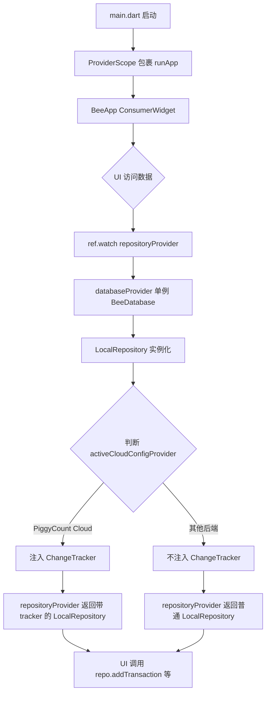
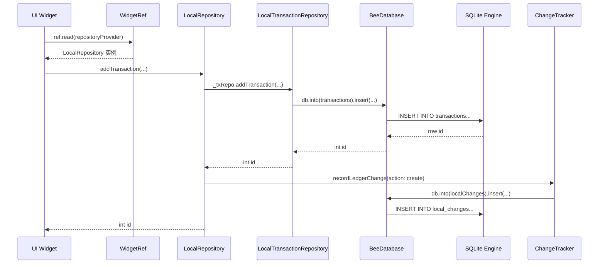
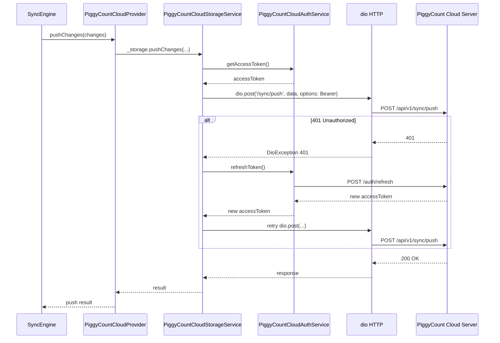

## 目录

- [1. 背景与目的](#1-背景与目的)
- [2. 核心概念](#2-核心概念)
- [3. 详细设计](#3-详细设计)
- [4. 关键流程](#4-关键流程)
- [5. 设计决策记录](#5-设计决策记录)
- [6. 注意事项与约束](#6-注意事项与约束)
- [7. 信息缺口](#7-信息缺口)
- [8. 相关文档](#8-相关文档)

---

## 1. 背景与目的

### 1.1 为什么单独写技术栈文档

PiggyCount 的 `pubspec.yaml` 直接依赖 60+ 个 package,加上 8 个本地 path 依赖子包(`packages/`),技术栈相当庞杂。新加入的贡献者面对这么多依赖,常常遇到以下困惑:

- 不知道某个依赖是用来做什么的
- 不清楚为什么选这个库而不选另一个(如为什么用 Drift 而不是 sqflite)
- 不知道哪些依赖是核心、哪些是可选、哪些是平台特定
- 修改依赖时不知道版本约束的来由(为什么有些库被钉死版本)

本文档对 PiggyCount 的全部技术栈进行分类梳理,标注每个依赖的用途、选型理由、版本约束来源,让一年经验开发者能快速建立全局认知。

### 1.2 信息来源

本文档信息主要来自:

- `pubspec.yaml`(L1-115):依赖清单与版本约束
- `pubspec.lock`:锁定版本(本文档不展开 lock,只关注 yaml 声明)
- `packages/*/pubspec.yaml`:本地子包依赖
- `analysis_options.yaml`:Lint 配置
- `l10n.yaml`:国际化配置
- 代码中的实际使用情况(通过 grep / 文件引用确认)

### 1.3 与其他文档的边界

- 本文**只讲技术选型和理由**,不讲业务流程(业务流程见 [05 核心模块详解](./05-core-modules.md))
- 本文**不讲分层架构**(分层架构见 [04 系统架构设计](./04-system-architecture.md))
- 本文**不讲同步引擎内部实现**(同步实现见 [06 数据同步与多设备离线机制](./06-data-sync-and-offline.md))

---

## 2. 核心概念

### 2.1 技术栈分类总览

PiggyCount 的技术栈可分为八大类:

```mermaid
flowchart TD
    Root[PiggyCount 技术栈]

    Root --> Core[核心框架]
    Root --> Data[数据层]
    Root --> State[状态与 DI]
    Root --> Sync[同步与云]
    Root --> AI[AI 集成]
    Root --> UI[UI 与媒体]
    Root --> Platform[平台集成]
    Root --> Dev[开发工具]

    Core --> C1[Flutter 3.27]
    Core --> C2[Dart 3.6]

    Data --> D1[Drift 2.20]
    Data --> D2[sqlite3_flutter_libs]

    State --> S1[Riverpod 2.5]

    Sync --> Sy1[flutter_cloud_sync 自研]
    Sync --> Sy2[supabase_flutter]
    Sync --> Sy3[dio + http]

    AI --> A1[flutter_ai_kit 自研]
    AI --> A2[智谱 GLM]
    AI --> A3[OpenAI]

    UI --> U1[Material 3]
    UI --> U2[image_picker/compress/cropper]
    UI --> U3[charts/fl_chart]

    Platform --> P1[local_auth]
    Platform --> P2[home_widget]
    Platform --> P3[flutter_local_notifications]

    Dev --> Dev1[flutter_test]
    Dev --> Dev2[mocktail]
    Dev --> Dev3[build_runner]
    Dev --> Dev4[flutter_launcher_icons]
```

上图展示了 PiggyCount 技术栈的八大分类。核心框架是基础,数据层与状态管理是支撑,同步与 AI 是 PiggyCount 区别于普通记账应用的特色能力,UI 与平台集成负责用户体验,开发工具保障工程质量。后续章节按类别详细说明。

### 2.2 依赖管理策略

PiggyCount 采用**保守版本约束**策略:

- 大多数依赖使用 `^x.y.z` 的兼容版本约束(允许 patch / minor 升级)
- 少数有兼容性问题的依赖**钉死版本**(使用 `x.y.z` 不带 `^`)
- 本地 path 依赖用于子包开发(`path: packages/xxx`)

钉死版本的依赖及原因见 [§6.1](#61-版本约束特殊处理)。

依据:`pubspec.yaml` L86-98、`release.yml` L35。

---

## 3. 详细设计

### 3.1 核心框架

| 依赖 | 版本 | 用途 | 选型理由 | 备注 |
|---|---|---|---|---|
| `flutter` | SDK | UI 框架 | 跨平台、生态成熟、Dart 语言友好 | CI 锁定 3.27.3 |
| `sdk: flutter` | — | Flutter SDK | — | `pubspec.yaml` L7 |
| `sdk: ">=3.6.0 <4.0.0"` | — | Dart SDK 约束 | 使用 Dart 3.6 的 pattern matching / records 等特性 | `pubspec.yaml` L6 |

### 3.2 状态管理与依赖注入

| 依赖 | 版本 | 用途 | 选型理由 | 替代方案 | 备注 |
|---|---|---|---|---|---|
| `flutter_riverpod` | `^2.5.1` | 状态管理 + DI + Stream 监听 | 编译时安全、无 BuildContext 依赖、StreamProvider 原生支持 Drift reactive query | Provider(过时)、Bloc(事件驱动过重)、GetX(争议大) | 全 app 唯一状态管理方案 |
| `riverpod_annotation` | `^2.3.5` | Riverpod codegen 注解 | 可选,用于生成 `@riverpod` provider | — | `pubspec.yaml` L15 |

Riverpod 在 PiggyCount 中的典型用法见 `lib/providers/`:

- `Provider`(同步):`databaseProvider`、`repositoryProvider`
- `StreamProvider`(异步响应式):`categoriesProvider`、`accountsStreamProvider`
- `StateProvider`(简单状态):`currentLedgerIdProvider`、`syncGenerationProvider`
- `FutureProvider.family`(参数化异步):`currentLedgerProvider`、`syncStatusProvider.family`
- `autoDispose`:部分页面级 provider

依据:`pubspec.yaml` L14-15、`lib/providers/` 30 个文件。

### 3.3 数据层

| 依赖 | 版本 | 用途 | 选型理由 | 替代方案 | 备注 |
|---|---|---|---|---|---|
| `drift` | `^2.20.2` | SQLite ORM | 类型安全、reactive query(返回 Stream)、code generation、迁移支持完善 | sqflite(裸 SQL,无类型安全)、Isar(NoSQL,生态弱)、Hive(已停止维护) | 核心 ORM |
| `sqlite3_flutter_libs` | `^0.5.24` | SQLite native 二进制 | Drift 在各平台所需的 SQLite 库 | — | — |
| `path_provider` | `^2.1.4` | 文件系统路径 | 获取 app 文档目录用于存放 SQLite 文件 | — | — |
| `path` | `^1.9.0` | 路径处理 | 拼接数据库文件路径 | — | — |
| `shared_preferences` | `^2.3.2` | 轻量 KV 存储 | 存放用户设置(主题、语言、提醒等)与同步 cursor | — | 非 Drift 表的配置项 |
| `uuid` | `^4.5.1` | UUID 生成 | 生成 `syncId`(跨设备同步标识) | — | 用于所有需要同步的实体 |

依据:`pubspec.yaml` L16-22、L37。

### 3.4 同步与网络

#### 3.4.1 自研同步框架

PiggyCount 的同步能力由自研 `flutter_cloud_sync` 框架提供,位于 `packages/` 下,通过 path 依赖引入:

| 子包 | 路径 | 用途 |
|---|---|---|
| `flutter_cloud_sync` | `packages/flutter_cloud_sync` | 同步框架核心(含 PiggyCountCloudProvider 内嵌) |
| `flutter_cloud_sync_supabase` | `packages/flutter_cloud_sync_supabase` | Supabase provider |
| `flutter_cloud_sync_webdav` | `packages/flutter_cloud_sync_webdav` | WebDAV provider |
| `flutter_cloud_sync_s3` | `packages/flutter_cloud_sync_s3` | S3 / R2 / B2 / MinIO / OSS / COS / Kodo provider |
| `flutter_cloud_sync_icloud` | `packages/flutter_cloud_sync_icloud` | iCloud provider(iOS native) |

依据:`pubspec.yaml` L64-73。

#### 3.4.2 第三方网络与同步库

| 依赖 | 版本 | 用途 | 选型理由 | 备注 |
|---|---|---|---|---|
| `dio` | `^5.4.3+1` | HTTP 客户端 | 拦截器、FormData、取消 token、超时控制完善 | PiggyCount Cloud 主用 |
| `http` | `^1.2.2` | 轻量 HTTP | Dart 官方包,无额外依赖 | 部分简单场景使用 |
| `supabase_flutter` | `^2.5.6` | Supabase SDK | Auth + Storage + Realtime 一站式 | Supabase provider 使用 |
| `webdav_client` | `^2.0.0` | WebDAV 客户端 | 现成 WebDAV 协议封装 | WebDAV provider 使用 |
| `web_socket_channel` | `^3.0.1` | WebSocket 客户端 | PiggyCount Cloud Realtime 自实现 WS 客户端 | `piggycount_cloud_provider.dart` |

依据:`pubspec.yaml` L27、L34、L37、L70-71、`packages/flutter_cloud_sync/lib/src/providers/piggycount_cloud_provider.dart` L4151。

### 3.5 AI 集成

PiggyCount 的 AI 能力由自研 `flutter_ai_kit` 框架提供,支持 6 种执行策略(local_first / cloud_first / local_only / cloud_only / cost_optimized / custom_priority):

| 子包 | 路径 | 用途 |
|---|---|---|
| `flutter_ai_kit` | `packages/flutter_ai_kit` | AI 抽象层 + 6 种执行策略 |
| `flutter_ai_kit_zhipu` | `packages/flutter_ai_kit_zhipu` | 智谱 GLM-4 provider |
| `flutter_ai_kit_openai` | `packages/flutter_ai_kit_openai` | OpenAI provider |

| 依赖 | 版本 | 用途 | 备注 |
|---|---|---|---|
| `record` | `^5.1.0` | 语音录制 | 语音记账使用 |
| `record_platform_interface` | `1.2.0`(钉死) | record 平台接口 | 钉死修复 record_linux 兼容问题 |

依据:`pubspec.yaml` L58-63、L75、L96。

### 3.6 UI 与媒体处理

#### 3.6.1 UI 框架与图标

| 依赖 | 版本 | 用途 | 选型理由 | 备注 |
|---|---|---|---|---|
| `flutter_localizations` | SDK | 国际化支持 | Flutter 官方 | — |
| `intl` | `^0.19.0` | 国际化与日期数字格式化 | Flutter 标配 | — |
| `google_fonts` | `^6.2.1` | Google 字体 | 主题字体加载 | — |
| `flutter_launcher_icons` | `^0.14.4`(dev) | 应用图标生成 | 自动生成各平台图标 | iOS 配置 `ios: false`,手工维护 |

#### 3.6.2 图片与媒体

| 依赖 | 版本 | 用途 | 备注 |
|---|---|---|---|
| `image_picker` | `^1.1.2` | 图片/视频选择 | 附件、OCR |
| `flutter_image_compress` | `^2.3.0` | 图片压缩 | 附件上传前压缩 |
| `image_cropper` | `^8.0.2` | 图片裁剪 | 附件编辑 |
| `image_cropper_platform_interface` | `7.1.0`(钉死) | cropper 平台接口 | 钉死因 7.2.0 要求 Flutter >= 3.27.6 |
| `gal` | `^2.3.0` | 保存到相册 | 海报分享 |

#### 3.6.3 图表

| 依赖 | 版本 | 用途 | 选型理由 |
|---|---|---|---|
| `fl_chart` | `^0.69.0` | 图表库 | 现代、可定制、支持折线/柱状/饼图/雷达 |

依据:`pubspec.yaml` L9-13、L46-54、L99。

### 3.7 平台集成

| 依赖 | 版本 | 用途 | 平台 | 备注 |
|---|---|---|---|---|
| `flutter_local_notifications` | `^17.2.2` | 本地通知 | 全平台 | 提醒、周期记账通知 |
| `timezone` | `^0.9.4` | 时区处理 | 全平台 | 通知时区 |
| `home_widget` | `^0.7.0` | 桌面小组件 | iOS + Android | 桌面快速记账 |
| `quick_actions` | `^1.1.0` | 应用快捷方式 | iOS + Android | 长按图标快捷方式 |
| `local_auth` | `^2.3.0` | 生物认证 | iOS + Android | 应用锁 |
| `in_app_purchase` | `^3.1.0` | 应用内购 | iOS + Android | 捐赠 |
| `connectivity_plus` | `^6.0.5` | 网络状态监听 | 全平台 | 离线恢复触发同步 |
| `package_info_plus` | `^8.0.0` | 应用信息 | 全平台 | 版本号、包名 |
| `device_info_plus` | `^11.1.0` | 设备信息 | 全平台 | 同步 deviceId |
| `url_launcher` | `^6.3.0` | 打开 URL | 全平台 | 跳转外部链接 |
| `share_plus` | `^10.0.0` | 系统分享 | 全平台 | 海报分享 |
| `app_links` | `^6.1.1` | App Link / Deep Link | iOS + Android | `piggycount://` scheme |
| `app_links_linux` | `^1.0.3` | Linux App Link | Linux | 桌面端兼容 |
| `flutter_timezone` | `^3.0.1` | 获取系统时区 | 全平台 | 通知时区初始化 |

依据:`pubspec.yaml` L39-45、L74-76、L82。

### 3.8 开发工具

| 依赖 | 版本 | 用途 | 备注 |
|---|---|---|---|
| `flutter_test` | SDK | 单元测试 / Widget 测试 | — |
| `mocktail` | `^1.0.4` | Mock 库 | 替代 mockito,无需 codegen |
| `integration_test` | SDK | 集成测试 | 已声明但未使用,见 [10 测试策略](./10-testing-strategy.md) |
| `build_runner` | `^2.4.10`(dev) | 代码生成器 | Drift codegen |
| `flutter_lints` | `^5.0.0`(dev) | Lint 规则 | Flutter 官方推荐 |
| `dart_code_metrics` | `^5.7.6`(dev) | 代码度量 | 额外的代码质量检查 |

依据:`pubspec.yaml` L83-92、`analysis_options.yaml`。

---

## 4. 关键流程

### 4.1 依赖注入流程

上图展示了 PiggyCount 的依赖注入流程。`main.dart` 在启动时用 `ProviderScope` 包裹 `runApp`,所有 Widget 通过 `ref.watch` / `ref.read` 获取依赖。`repositoryProvider` 是核心入口,内部根据 `activeCloudConfigProvider` 判断是否注入 ChangeTracker:仅 PiggyCount Cloud 后端激活时注入(走增量同步路径),其他后端不注入(走快照备份路径)。这种设计让 Repository 层无需感知同步细节,ChangeTracker 的注入由 Provider 层统一管理。

依据:`lib/main.dart`、`lib/providers/database_providers.dart`。

### 4.2 数据库访问流程

数据库访问流程严格遵循分层:UI → Provider → Repository(聚合)→ 子 Repository → Drift → SQLite。所有写操作在 Drift insert 成功后,通过 ChangeTracker 记录变更到 `local_changes` 表,供 SyncEngine 异步推送。这种"写本地 + 记录变更"的两步流程是 PiggyCount 本地优先架构的核心。

依据:`lib/data/repositories/local/local_repository.dart`、`lib/cloud/sync/change_tracker.dart`。

### 4.3 网络请求流程(PiggyCount Cloud)

PiggyCount Cloud 的网络请求流程内置了 token 自动刷新机制。当请求返回 401 时,`PiggyCountCloudStorageService` 会自动调用 `PiggyCountCloudAuthService.refreshToken()` 刷新访问令牌,然后重试原请求。这种设计让上层 SyncEngine 无需感知认证细节,只需关注业务逻辑。

依据:`packages/flutter_cloud_sync/lib/src/providers/piggycount_cloud_provider.dart` `_authedRequest` 方法。

---

## 5. 设计决策记录

### 决策 1:选择 Drift 而非 sqflite / Isar

- **决策内容**:数据层使用 Drift 2.20 作为 SQLite ORM。
- **原因**:
  - **类型安全**:Drift 生成类型安全的表定义与查询,编译时检查字段类型与表名
  - **Reactive query**:Drift 的 `watch()` 返回 `Stream<List<T>>`,数据库变更自动推送,Riverpod `StreamProvider` 原生支持
  - **迁移支持完善**:`MigrationStrategy` + `schemaVersion` 机制,PiggyCount 已用到 v31
  - **Code generation**:`db.g.dart` 自动生成,减少手写样板代码
- **备选方案**:
  - `sqflite`:裸 SQL,无类型安全,无 reactive query,迁移需手写
  - `Isar`:NoSQL,生态弱,无 SQL 灵活查询
  - `Hive`:已停止维护
- **优缺点**:
  - Drift:学习曲线略陡(codegen + Stream 概念),但长期收益高
  - sqflite:简单直接,但大型项目维护成本高
- **最终取舍**:Drift,充分利用 reactive query 简化 UI 刷新逻辑。
- **依据**:`pubspec.yaml` L16-17、`lib/data/db.dart` L445 schemaVersion=31。

### 决策 2:选择 Riverpod 而非 Bloc / GetX

- **决策内容**:状态管理使用 Riverpod 2.5,不引入其他状态管理库。
- **原因**:
  - **编译时安全**:Riverpod 2.x 完全摆脱 Provider 1.x 的 BuildContext 依赖,无 `ProviderNotFoundException` 运行时错误
  - **DI 一体化**:Riverpod 既是状态管理又是 DI,不需要额外引入 get_it
  - **Stream 原生支持**:`StreamProvider` 直接对接 Drift `watch()`,无需手动管理订阅
  - **autoDispose**:页面级 provider 自动释放,避免内存泄漏
- **备选方案**:
  - Bloc:事件驱动模式适合复杂状态机,但样板代码多,DI 需额外引入 get_it
  - GetX:API 简洁但争议大,社区不推荐用于生产
  - Provider:已过时,Riverpod 是其继任者
- **最终取舍**:Riverpod,统一状态管理 + DI + Stream 监听。
- **依据**:`pubspec.yaml` L14、`lib/providers/` 30 个文件。

### 决策 3:自研同步框架而非直接用 Supabase

- **决策内容**:同步能力由自研 `flutter_cloud_sync` 框架提供,而非直接依赖 Supabase SDK。
- **原因**:
  - **多后端支持**:PiggyCount 需支持 5 种同步方案,自研框架抽象出 `CloudProvider` 接口,各后端独立实现
  - **数据主权**:用户应能选择自己的同步后端,而非被锁定在 Supabase
  - **复用性**:`flutter_cloud_sync` 可独立发布,其他 Flutter 应用可复用
  - **可控性**:同步逻辑(冲突解决、cursor、单飞锁)需深度定制,直接用 Supabase 无法实现
- **备选方案**:
  - 直接用 Supabase SDK:开发成本低,但锁定单一后端
  - 用第三方同步框架(如 ElectricSQL):成熟度不足,Dart 支持有限
- **优缺点**:
  - 自研:开发维护成本高,但灵活性最大
  - 直接用 Supabase:开发快,但无法支持 WebDAV / S3 / iCloud
- **最终取舍**:自研框架,以 `CloudProvider` 抽象支持多后端。
- **依据**:`packages/flutter_cloud_sync/`、`pubspec.yaml` L64-73。

### 决策 4:dio 与 http 并存

- **决策内容**:同时使用 `dio: ^5.4.3+1` 与 `http: ^1.2.2` 两个 HTTP 客户端。
- **原因**:
  - **dio**:用于 PiggyCount Cloud,需要拦截器(token 刷新)、FormData(文件上传)、超时控制、取消 token 等高级特性
  - **http**:用于部分轻量场景(如汇率 API、版本检查),无需 dio 的额外特性,http 是 Dart 官方包无额外依赖
- **备选方案**:全部用 dio(增加依赖体积)、全部用 http(失去拦截器能力)
- **最终取舍**:并存,dio 用于复杂场景,http 用于简单场景。
- **依据**:`pubspec.yaml` L34、L37、代码实际使用情况。

### 决策 5:钉死部分依赖版本

- **决策内容**:`image_cropper_platform_interface: 7.1.0`、`record_platform_interface: 1.2.0` 不使用 `^` 兼容版本,直接钉死。
- **原因**:
  - `image_cropper_platform_interface 7.2.0` 要求 Flutter >= 3.27.6,而 CI 锁定 3.27.3,会构建失败
  - `record_platform_interface 1.2.0` 之后的版本引入 record_linux 兼容性问题
- **备选方案**:升级 Flutter 版本(影响其他依赖)
- **最终取舍**:钉死版本,等待 Flutter 主版本升级时一并解决。
- **依据**:`pubspec.yaml` L94-98、`release.yml` L35。

---

## 6. 注意事项与约束

### 6.1 版本约束特殊处理

| 依赖 | 约束 | 原因 | 处理建议 |
|---|---|---|---|
| `image_cropper_platform_interface` | `7.1.0`(钉死) | 7.2.0 要求 Flutter >= 3.27.6,CI 是 3.27.3 | 升级 Flutter 时一并放开 |
| `record_platform_interface` | `1.2.0`(钉死) | 修复 record_linux 兼容问题 | 等待 record 主版本更新 |
| `flutter_launcher_icons.ios` | `false` | 0.14.x 会重写 `Contents.json` 格式 | iOS 图标手工维护 |

### 6.2 Flutter SDK 约束

- **Dart SDK**:`>=3.6.0 <4.0.0`,使用 Dart 3.6 的 pattern matching / records / sealed class 等特性
- **Flutter SDK**:CI 锁定 `3.27.3`,本地开发建议使用 fvm 管理版本

依据:`pubspec.yaml` L6、`release.yml` L35。

### 6.3 平台特定依赖

| 依赖 | 平台 | 备注 |
|---|---|---|
| `flutter_cloud_sync_icloud` | iOS only | 通过 method channel 调用 iOS native |
| `app_links_linux` | Linux only | 桌面端 App Link 兼容 |
| `home_widget` | iOS + Android | 桌面小组件,Web 不支持 |

### 6.4 子包版本独立管理

`packages/` 下的子包有独立的 `pubspec.yaml`,版本独立管理:

- `flutter_cloud_sync`:独立 CHANGELOG.md
- `flutter_ai_kit`:独立版本号
- 各 provider 子包:独立版本号

修改子包时,需在子包目录单独运行 `flutter pub get` 与 `flutter test`。

---

## 7. 信息缺口

| 编号 | 缺口描述 | 影响章节 | 建议补充方式 |
|---|---|---|---|
| 1 | `flutter_cloud_sync` 等子包的内部依赖未完全展开 | §3.4.1 | 阅读各子包 `pubspec.yaml` 补充 |
| 2 | `dio` 拦截器的完整清单(token 刷新、日志、错误处理)未在本文档展开 | §4.3 | 在 [09 错误处理](./09-error-handling.md) 中补充 |
| 3 | `fl_chart` 在统计页面的具体使用模式未展开 | §3.6.3 | 在 [05 核心模块详解](./05-core-modules.md) 统计模块补充 |
| 4 | `home_widget` 的 iOS WidgetExtension 与 Android appwidgetprovider 实现细节未展开 | §3.7 | 在 [05 核心模块详解](./05-core-modules.md) 桌面小组件章节补充 |
| 5 | `in_app_purchase` 的捐赠商品配置与平台差异未展开 | §3.7 | 在 [13 构建发布](./13-build-release.md) 中补充 |
| 6 | Dart 3.6 特性在代码中的具体使用统计未做 | §6.2 | 可选,通过 grep 抽样统计 |

---

## 8. 相关文档

- [01 项目全览](./01-project-overview.md) — 项目整体定位
- [02 术语表](./02-glossary.md) — 术语统一
- [04 系统架构设计](./04-system-architecture.md) — 分层架构与依赖方向
- [06 数据同步与多设备离线机制](./06-data-sync-and-offline.md) — 同步框架深入
- [10 测试策略](./10-testing-strategy.md) — 测试相关依赖
- [13 构建发布与运维指南](./13-build-release.md) — 构建工具与 CI
- [INDEX](./INDEX.md) — 完整文档索引
