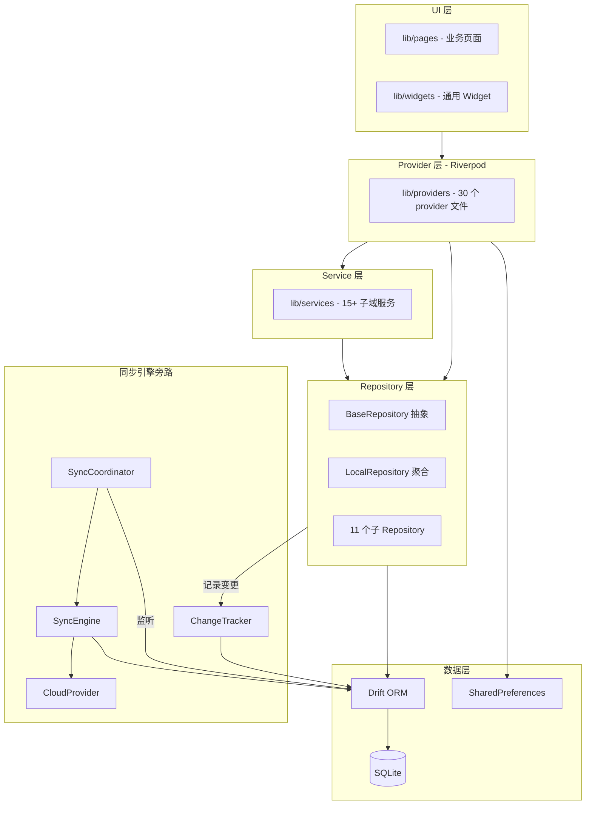
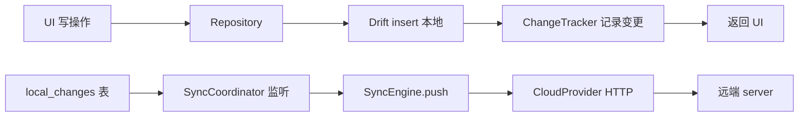
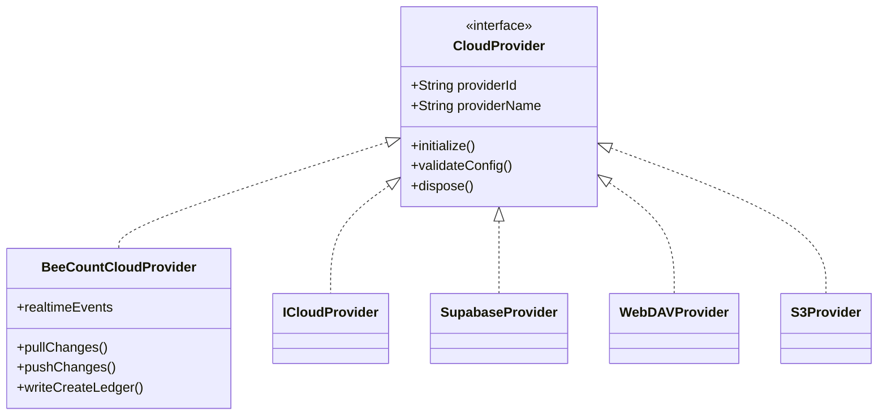
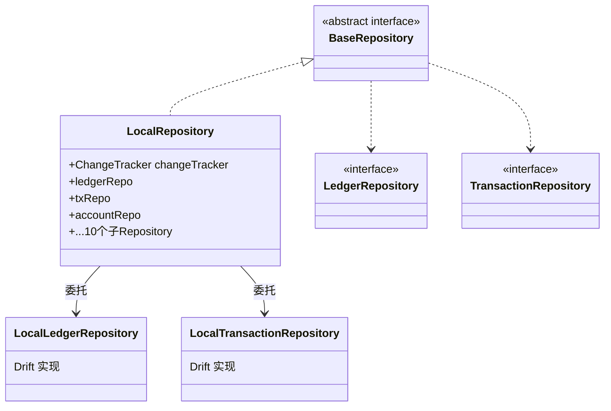
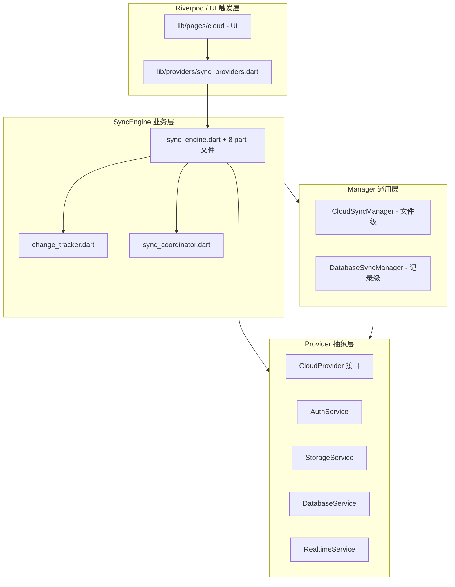
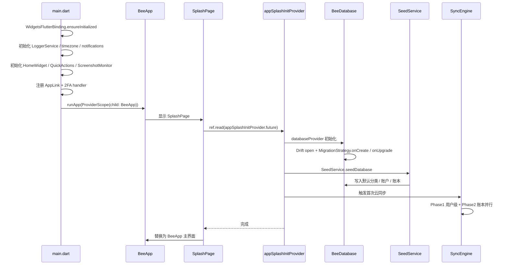
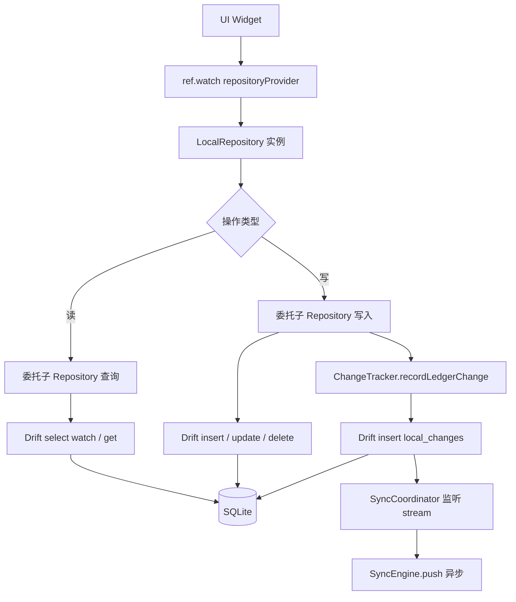
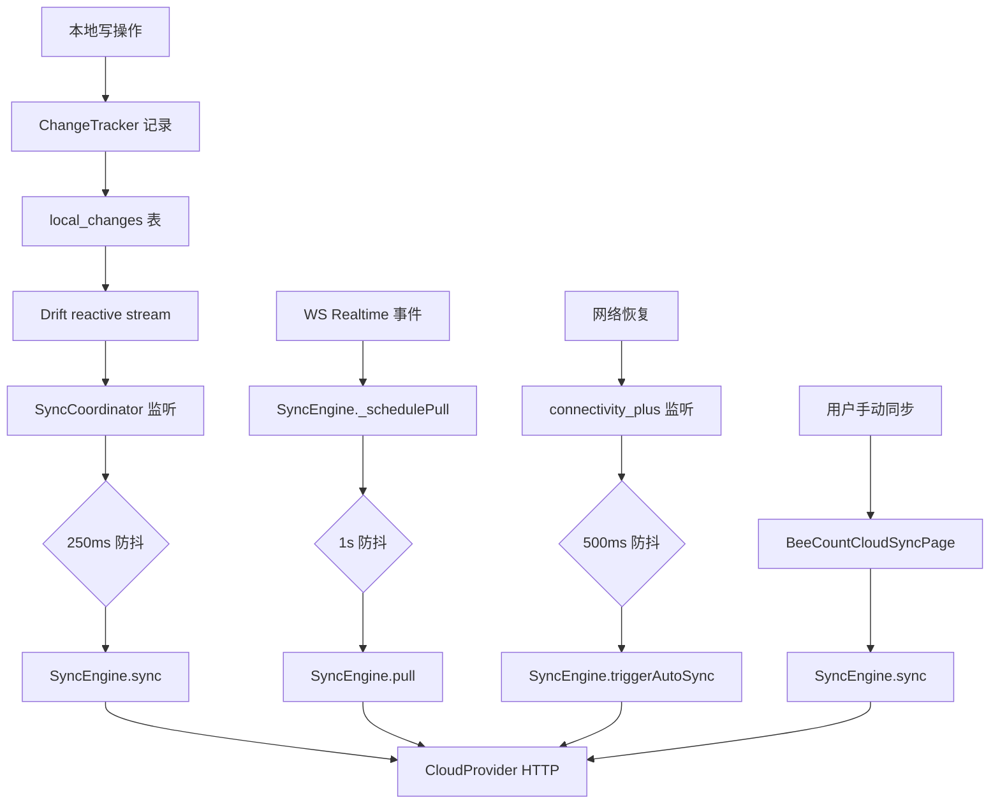

## 目录

- [1. 背景与目的](#1-背景与目的)
- [2. 核心概念](#2-核心概念)
- [3. 详细设计](#3-详细设计)
- [4. 关键流程](#4-关键流程)
- [5. 设计决策记录](#5-设计决策记录)
- [6. 注意事项与约束](#6-注意事项与约束)
- [7. 信息缺口](#7-信息缺口)
- [8. 相关文档](#8-相关文档)

---

## 1. 背景与目的

### 1.1 为什么需要系统架构文档

BeeCount 是一个功能复杂的 Flutter 应用,涉及记账业务、AI 多模态、五端同步、共享账本、桌面小组件等多个领域。如果没有清晰的架构文档,新加入的贡献者容易遇到以下困惑:

- 不知道一个新功能应该放在哪一层
- 不清楚 UI 层能不能直接访问数据库
- 不理解为什么要有 Repository 三层结构
- 不知道同步引擎为什么是旁路而不是串入主流程
- 不清楚 `packages/` 子包与 `lib/` 主代码的边界

本文档定义 BeeCount 的**分层架构、模块关系、依赖方向、关键设计模式**,让一年经验开发者能快速理解"代码应该写在哪里"。

### 1.2 与其他文档的边界

- 本文**只讲架构与分层**,不讲具体技术选型(技术选型见 [03 技术栈全景](./03-tech-stack.md))
- 本文**只讲模块关系**,不讲模块内部职责(模块职责见 [05 核心模块详解](./05-core-modules.md))
- 本文**只讲同步引擎在架构中的位置**,不讲同步实现细节(同步实现见 [06 数据同步与多设备离线机制](./06-data-sync-and-offline.md))

### 1.3 信息来源

- `lib/` 目录结构与文件分布
- `lib/data/repositories/base_repository.dart`、`local_repository.dart`
- `lib/cloud/sync/sync_engine.dart` 及 part 文件
- `lib/providers/` 30 个 provider 文件
- `lib/main.dart`、`lib/app.dart` 启动流程

---

## 2. 核心概念

### 2.1 分层架构总览

BeeCount 采用**五层架构 + 同步引擎旁路**的设计:

上图展示了 BeeCount 的五层架构与同步引擎旁路设计。UI 层只与 Provider 层交互,不直接访问 Service / Repository / 数据库;Provider 层通过 Riverpod 注入 Service 与 Repository;Service 层承载业务逻辑,可调用 Repository;Repository 层是数据访问的唯一入口;同步引擎作为旁路监听本地变更,异步推送到云端。这种分层让各层职责清晰,UI 不感知数据来源,Repository 不感知同步细节。

### 2.2 同步引擎旁路设计

BeeCount 的同步引擎**不串入主流程**,而是作为旁路存在:

上图展示了同步引擎旁路的设计。UI 写操作的返回不依赖同步完成,Repository 在 Drift insert 后立即返回,ChangeTracker 异步记录变更。SyncCoordinator 独立监听 `local_changes` 表的 Drift reactive stream,任何写入都自动触发 SyncEngine 推送。这种设计保证了:

1. **写入响应快**:UI 无需等待网络
2. **离线可用**:无网络时变更累积在 `local_changes` 表,网络恢复后批量推送
3. **解耦**:Repository 不依赖 SyncEngine,可独立测试

### 2.3 多后端抽象

BeeCount 通过 `CloudProvider` 抽象接口支持 5 种同步后端,详见 [06 数据同步与多设备离线机制](./06-data-sync-and-offline.md)。架构上,所有后端实现同一接口,SyncEngine 只与抽象交互:

只有 BeeCountCloudProvider 实现了完整的增量同步 + Realtime + 共享账本能力,其他 4 个 provider 只实现文件级 snapshot 备份能力。SyncEngine 只在 BeeCount Cloud 模式下激活,其他模式走 `TransactionsSyncManager` 快照路径。

依据:`packages/flutter_cloud_sync/lib/src/core/cloud_provider.dart`、`lib/cloud/sync/sync_engine.dart` L72、`lib/cloud/transactions_sync_manager.dart`。

---

## 3. 详细设计

### 3.1 UI 层

UI 层位于 `lib/pages/` 与 `lib/widgets/`,只与 Provider 层交互。

#### 3.1.1 UI 层组织

| 目录 | 内容 |
|---|---|
| `lib/pages/main/` | 主界面(首页 / 统计 / 报表 / 设置 4 Tab) |
| `lib/pages/transaction/` | 交易编辑、列表、详情 |
| `lib/pages/account/` | 账户管理 |
| `lib/pages/category/` | 分类管理 |
| `lib/pages/tag/` | 标签管理 |
| `lib/pages/budget/` | 预算管理 |
| `lib/pages/calendar/` | 日历视图 |
| `lib/pages/cloud/` | 云同步、共享账本 |
| `lib/pages/ai/` | AI 对话 |
| `lib/pages/data/` | 导入导出 |
| `lib/pages/settings/` | 设置(含日志中心) |
| `lib/pages/auth/` | 登录、2FA |
| `lib/widgets/` | 通用 Widget(可跨页面复用) |

#### 3.1.2 UI 层规则

- **必须**继承 `ConsumerWidget` 或 `ConsumerStatefulWidget` 以访问 `ref`
- **必须**通过 `ref.watch` / `ref.read` 获取数据,不直接 `new` Repository / Service
- **禁止**直接调用 Drift 或 SQLite
- **禁止**直接调用 CloudProvider(通过 SyncEngine 间接调用)
- **路由**使用 Navigator 1.0(`MaterialPageRoute` + `Navigator.push`),不使用 go_router / auto_route

依据:`lib/pages/` 目录、`lib/app.dart`。

### 3.2 Provider 层

Provider 层位于 `lib/providers/`,30 个文件,通过 `all_providers.dart` barrel 统一导出。

#### 3.2.1 Provider 分类

| 类型 | 用途 | 示例 |
|---|---|---|
| `Provider` | 同步依赖注入 | `databaseProvider`、`repositoryProvider` |
| `StreamProvider` | 异步响应式数据 | `categoriesProvider`、`accountsStreamProvider` |
| `StateProvider` | 简单可变状态 | `currentLedgerIdProvider`、`syncGenerationProvider` |
| `FutureProvider` | 一次性异步 | `appSplashInitProvider` |
| `FutureProvider.family` | 参数化异步 | `currentLedgerProvider`、`syncStatusProvider.family` |
| `ChangeNotifierProvider` | 复杂状态(少用) | 部分页面级 controller |

#### 3.2.2 Provider 设计模式

1. **Repository 注入**:UI 通过 `ref.watch(repositoryProvider)` 拿到 `BaseRepository` 抽象,不感知具体实现
2. **StreamProvider 优先**:账本 / 账户 / 交易等核心数据用 `StreamProvider` 监听 Drift watcher,数据库变更自动推送
3. **StateProvider 触发器**:`syncStatusRefreshProvider` / `statsRefreshProvider` 等 int 计数器,通过 `ref.watch` 让 FutureProvider 在 bump 时重算
4. **family 索引**:`currentLedgerProvider`(family)、`syncStatusProvider.family<SyncStatus, int>`
5. **autoDispose**:部分 provider 用 `autoDispose` 在页面关闭时自动取消订阅
6. **SyncEvent 派发**:`syncServiceProvider` 内部 `engine.events.listen` 把 `PullCompleted` / `PushCompleted` 等事件分发到对应 provider bump

依据:`lib/providers/all_providers.dart`、`lib/providers/database_providers.dart`、`lib/providers/sync_providers.dart`。

### 3.3 Service 层

Service 层位于 `lib/services/`,承载业务逻辑,可被 Provider 层调用,可调用 Repository 层。

#### 3.3.1 Service 分类

| 子域 | 目录 | 关键 Service |
|---|---|---|
| AI | `lib/services/ai/` | `ai_bookkeeper.dart`、`ai_message_service.dart` |
| 计费 | `lib/services/billing/` | `bill_creation_service.dart`(37 个测试用例) |
| 数据 | `lib/services/data/` | `seed_service.dart`、`migration_service.dart`、`recurring_transaction_service.dart` |
| 导出 | `lib/services/export/` | 海报分享、CSV 导出 |
| 导入 | `lib/services/import/` | `bill_parser.dart`、`data_import_service.dart` |
| 维护 | `lib/services/maintenance/` | `orphan_scanner.dart`、`orphan_cleaner.dart` |
| 营销 | `lib/services/marketing/` | — |
| 支付 | `lib/services/payment/` | — |
| 平台 | `lib/services/platform/` | `app_link_service.dart`、`quick_actions_service.dart` |
| 安全 | `lib/services/security/` | `app_lock_service.dart` |
| 系统 | `lib/services/system/` | `logger_service.dart` |
| UI | `lib/services/ui/` | — |
| 更新 | `lib/services/update/` | — |
| 货币 | `lib/services/currency/` | `exchange_rate_service.dart` |

#### 3.3.2 Service 与 Repository 的关系

Service 层**不直接访问数据库**,而是通过 `BaseRepository` 抽象访问。Service 负责业务编排(如"创建交易 + 生成周期交易规则 + 触发同步"),Repository 负责数据访问(如"insert 交易到 Drift")。

依据:`lib/services/` 目录结构。

### 3.4 Repository 层

Repository 层位于 `lib/data/repositories/`,采用**三层结构**:抽象接口层 → 本地实现层 → 聚合委托层。详细设计见 [08 接口与数据访问设计](./08-api-and-data-access.md)。

#### 3.4.1 三层结构

#### 3.4.2 各层职责

| 层 | 文件位置 | 职责 |
|---|---|---|
| 抽象接口层 | `lib/data/repositories/*.dart`(11 个抽象类) | 定义纯接口,无实现 |
| 本地实现层 | `lib/data/repositories/local/local_*.dart`(11 个 Local 类) | 基于 Drift 实现具体 SQL |
| 聚合委托层 | `lib/data/repositories/local/local_repository.dart` | `LocalRepository` 继承 `BaseRepository`,内部持有 11 个子 Repository,通过委托模式转发调用,并在前后注入 ChangeTracker |

#### 3.4.3 Repository 层规则

- **必须**通过 `BaseRepository` 抽象访问,UI 不直接持有 `LocalRepository`
- **所有写操作**(create / update / delete)**必须**通过 ChangeTracker 记录变更(仅 BeeCount Cloud 模式)
- **不直接**调用 CloudProvider / SyncEngine(由 SyncCoordinator 监听变更表自动触发)
- 多币种聚合方法(如 `recalcNativeAmountsForLedger`)放在 `BaseRepository` 而非子 Repository,因需同时访问交易表与汇率表

依据:`lib/data/repositories/base_repository.dart`、`lib/data/repositories/local/local_repository.dart`(2807 行)。

### 3.5 数据层

数据层位于 `lib/data/`,包含 Drift 数据库定义与 SharedPreferences。

#### 3.5.1 BeeDatabase

`BeeDatabase` 是 Drift 数据库主类,位于 `lib/data/db.dart`:

- `schemaVersion = 31`(L445)
- 21 张表(Ledgers / Accounts / Transactions / Categories / Tags / TransactionTags / Budgets / RecurringTransactions / Conversations / Messages / TransactionAttachments / ExchangeRates / ExchangeRateOverrides / LocalChanges / SyncState / SyncPullErrors / LedgerMembers / SharedLedgerCategories / SharedLedgerAccounts / SharedLedgerTags / TransactionTagOverrides)
- `MigrationStrategy` 包含 30 段 onUpgrade 迁移块(v2 → v31)
- `BeeDatabase.forTesting(QueryExecutor executor)` 构造函数供单元测试注入内存库

#### 3.5.2 SharedPreferences

非 Drift 表的配置项存放于 SharedPreferences:

- 用户设置:主题色、外观、语言、字体大小、提醒设置、应用锁开关
- 同步 cursor:`beecount_cloud_pull_cursor_$digest`(SHA1 hash key,per-device per-provider)
- BeeCount Cloud profile:displayName、baseCurrency、themeColor、incomeColorScheme、appearance、aiConfig

依据:`lib/data/db.dart`、`lib/cloud/sync/sync_engine_pull.dart` `AppCursorStore`。

### 3.6 同步引擎层

同步引擎层位于 `lib/cloud/`,详见 [06 数据同步与多设备离线机制](./06-data-sync-and-offline.md)。架构上分为四层:

#### 3.6.1 同步引擎四层架构

| 层 | 位置 | 职责 |
|---|---|---|
| Provider 抽象层 | `packages/flutter_cloud_sync/lib/src/core/` | 定义跨 provider 的统一契约,纯抽象接口 |
| Manager 通用层 | `packages/flutter_cloud_sync/lib/src/manager/` | 业务无关的同步编排,泛型 `T` 表示业务数据类型 |
| SyncEngine 业务层 | `lib/cloud/sync/` | BeeCount 自有的核心同步引擎,实现 `SyncService` 接口 |
| Riverpod / UI 触发层 | `lib/providers/`、`lib/pages/cloud/` | UI 入口与 provider 装配 |

#### 3.6.2 SyncEngine 的 part 文件拆分

`SyncEngine` 主类通过 `part` 文件拆分到 8 个子文件,共享同一 library:

| 文件 | 职责 |
|---|---|
| `sync_engine.dart` | 主类 + SyncService 接口实现 + push/pull/sync 主流程 |
| `sync_engine_apply.dart` | pull 路径:apply remote change 到本地 Drift(7 种 entityType) |
| `sync_engine_serialization.dart` | push 路径:本地实体 → server payload + fullPush |
| `sync_engine_pull.dart` | AppCursorStore + SyncErrorStore + LookupCache |
| `sync_engine_realtime.dart` | WS 事件监听 + auto sync/pull 防抖调度 |
| `sync_engine_profile.dart` | profile + avatar 同步 |
| `sync_engine_resolvers.dart` | 跨设备 ID 解析(syncId ↔ 本地 int id) |
| `sync_engine_status.dart` | 健康检查 + 历史种子数据 backfill |
| `sync_engine_attachments.dart` | 附件上传/下载/清理/分类图标上传 |

依据:`lib/cloud/sync/sync_engine.dart` L72 及 part 声明。

---

## 4. 关键流程

### 4.1 应用启动架构流程

启动流程分两阶段:第一阶段是 `main.dart` 中的原生初始化(日志、时区、通知、小组件),保证应用基本可用;第二阶段是 `appSplashInitProvider` 触发的数据库初始化、种子数据写入、首次云同步。两阶段分离让首屏更快呈现。

依据:`lib/main.dart` L43-154、`lib/app.dart`、`lib/providers/all_providers.dart`。

### 4.2 数据访问架构流程

上图展示了数据访问的完整架构流程。读操作直接走 Drift,可返回 `Stream` 实现响应式;写操作先 Drift insert,再通过 ChangeTracker 记录变更到 `local_changes` 表。SyncCoordinator 独立监听 `local_changes` 表的 Drift reactive stream,自动触发 SyncEngine 推送。这种"写本地 + 记录变更 + 异步同步"的三步流程是 BeeCount 本地优先架构的核心。

依据:`lib/data/repositories/local/local_repository.dart`、`lib/cloud/sync/change_tracker.dart`、`lib/cloud/sync/sync_coordinator.dart`。

### 4.3 同步触发架构流程

上图展示了同步的四种触发路径:本地写操作的反应式触发、WS Realtime 事件的拉取触发、网络恢复的自动触发、用户手动触发。四种路径都收敛到 SyncEngine,通过单飞锁防止并发冲突。每条路径有独立的防抖机制(250ms / 1s / 500ms),避免高频写入导致同步风暴。

依据:`lib/cloud/sync/sync_coordinator.dart` L27、`lib/cloud/sync/sync_engine_realtime.dart`、`lib/providers/sync_providers.dart`。

---

## 5. 设计决策记录

### 决策 1:五层架构而非三层架构

- **决策内容**:采用 UI / Provider / Service / Repository / Data 五层架构,而非传统的 UI / Logic / Data 三层。
- **原因**:
  - **Provider 独立成层**:Riverpod 既是状态管理又是 DI,值得独立成层,避免 UI 直接 new Service / Repository
  - **Service 与 Repository 分离**:Service 承载业务编排(如"创建交易 + 触发周期规则 + 同步"),Repository 只负责数据访问,职责清晰
  - **测试友好**:每层可独立 mock,如测试 Service 时 mock Repository,测试 Repository 时 mock Drift
- **备选方案**:三层架构(UI / Logic / Data)、四层架构(UI / State / Data / Sync)
- **优缺点**:
  - 五层:层次清晰但文件多,新贡献者需理解分层规则
  - 三层:简单但职责混杂,Service 与 Repository 混在一起
- **最终取舍**:五层,严格分层。
- **依据**:`lib/` 目录结构。

### 决策 2:同步引擎旁路而非串入主流程

- **决策内容**:同步引擎作为旁路存在,不串入 UI → Repository → 数据库的主流程。
- **原因**:
  - **写入响应快**:UI 写操作无需等待网络,立即返回
  - **离线可用**:无网络时变更累积在 `local_changes` 表,网络恢复后批量推送
  - **解耦**:Repository 不依赖 SyncEngine,可独立测试
  - **反应式**:SyncCoordinator 监听 Drift reactive stream,任何写入自动触发同步,无需 UI 显式调用
- **备选方案**:
  - 串入主流程(写完本地立即同步):一致性好但响应慢,离线不可用
  - UI 显式触发同步:UI 需感知同步逻辑,职责混杂
- **最终取舍**:旁路设计,通过 ChangeTracker + SyncCoordinator 实现反应式同步。
- **依据**:`lib/cloud/sync/change_tracker.dart`、`lib/cloud/sync/sync_coordinator.dart`。

### 决策 3:Repository 三层结构

- **决策内容**:Repository 采用抽象接口层 + 本地实现层 + 聚合委托层的三层结构。
- **原因**:
  - **抽象接口层**:定义纯接口,未来可扩展远端实现(虽然目前已删除 Cloud* 系列)
  - **本地实现层**:基于 Drift 实现具体 SQL,每个子 Repository 职责单一
  - **聚合委托层**:`LocalRepository` 持有 11 个子 Repository,通过委托模式转发调用,并在前后注入 ChangeTracker、多币种折算兜底等横切逻辑
- **备选方案**:
  - 单层结构(直接在 Service 中调用 Drift):简单但无法注入横切逻辑
  - 两层结构(接口 + 实现):缺少聚合层,横切逻辑分散
- **优缺点**:
  - 三层:层次清晰但文件多(11 接口 + 11 实现 + 1 聚合 = 23 文件)
  - 单层:简单但测试难,横切逻辑重复
- **最终取舍**:三层,充分解耦。
- **依据**:`lib/data/repositories/` 目录、`lib/data/repositories/local/local_repository.dart`(2807 行)。

### 决策 4:SyncEngine 用 part 文件拆分

- **决策内容**:`SyncEngine` 主类通过 `part` 文件拆分到 8 个子文件,而非拆成多个独立类。
- **原因**:
  - **共享私有成员**:`part` 文件共享同一 library,可直接访问主类的私有字段(`_pushInFlight`、`_eventsController` 等),无需暴露为 public
  - **逻辑内聚**:同步引擎的所有逻辑在同一个类中,便于理解整体流程
  - **避免过度拆分**:如果拆成 8 个独立类,需要大量参数传递与接口定义
- **备选方案**:
  - 单文件:文件过大(主类 1480 行 + apply 1093 行 + ...),难以维护
  - 多个独立类:需暴露大量 public 接口,破坏封装
- **优缺点**:
  - `part` 文件:共享 private 成员但物理分离,需理解 part 机制
  - 多个独立类:封装好但参数传递繁琐
- **最终取舍**:`part` 文件拆分,主类 + 8 个 part 文件。
- **依据**:`lib/cloud/sync/sync_engine.dart` part 声明、`lib/cloud/sync/sync_engine_apply.dart` 等。

### 决策 5:Navigator 1.0 而非 go_router

- **决策内容**:路由使用 Navigator 1.0(`MaterialPageRoute` + `Navigator.push`),不引入 go_router / auto_route。
- **原因**:
  - **简单直观**:BeeCount 是工具类应用,无复杂路由场景(如嵌套导航、Shell Route)
  - **无 Web 端路由需求**:Web 通过 BeeCount Cloud PWA,不在本仓库构建
  - **减少依赖**:go_router 引入额外学习成本与版本维护
- **备选方案**:
  - go_router:声明式路由,适合复杂场景,但 BeeCount 不需要
  - auto_route:code generation 路由,过重
- **优缺点**:
  - Navigator 1.0:简单但深嵌套时 push/pop 管理繁琐
  - go_router:强大但学习成本高
- **最终取舍**:Navigator 1.0,简单场景足够。
- **依据**:`lib/pages/` 全部使用 `Navigator.push`。

---

## 6. 注意事项与约束

### 6.1 分层规则强制约束

| 规则 | 说明 | 违反后果 |
|---|---|---|
| UI 不直接访问数据库 | 必须通过 `ref.watch(repositoryProvider)` | 代码 review 拒绝 |
| UI 不直接调用 CloudProvider | 必须通过 SyncEngine 间接调用 | 同步逻辑混乱 |
| Service 不直接访问数据库 | 必须通过 `BaseRepository` 抽象 | 测试困难 |
| Repository 写操作必须记录变更 | 通过 ChangeTracker(仅 BeeCount Cloud 模式) | 数据不同步 |
| Repository 不调用 SyncEngine | 由 SyncCoordinator 反应式触发 | 循环依赖 |

### 6.2 子包与主代码的边界

| 边界 | 规则 |
|---|---|
| `lib/` 主代码 | 可引用 `packages/` 子包 |
| `packages/` 子包 | **禁止**反向引用 `lib/` 主代码,保持独立可复用 |
| `packages/flutter_cloud_sync` | 可引用 `flutter_ai_kit`(用于 AI 同步) |
| `packages/flutter_cloud_sync_*` provider 子包 | 可引用 `flutter_cloud_sync` 核心 |

### 6.3 平台特定代码约束

- Android 原生代码位于 `android/app/src/main/kotlin/com/tntlikely/beecount/`
- iOS 原生代码位于 `ios/Runner/` 与 `ios/BeeCountWidget/`
- 平台特定功能(如截图监听、AppLink)通过 method channel / app_links 桥接
- 共享逻辑必须在 Dart 层,平台特定逻辑在原生层

### 6.4 测试架构约束

- 单元测试位于 `test/`,镜像 `lib/` 目录结构
- 测试用 `BeeDatabase.forTesting(NativeDatabase.memory())` 注入内存库
- Mock 用 `mocktail: ^1.0.4`,不用 mockito(避免 codegen)
- Widget 测试用 `flutter_test` 的 `testWidgets`
- 集成测试目录 `integration_test/` **不存在**(已声明依赖但未使用),见 [10 测试策略](./10-testing-strategy.md)

---

## 7. 信息缺口

| 编号 | 缺口描述 | 影响章节 | 建议补充方式 |
|---|---|---|---|
| 1 | `lib/services/` 各 Service 之间的调用关系图未绘制 | §3.3 | 在 [05 核心模块详解](./05-core-modules.md) 中补充 |
| 2 | `lib/widgets/` 通用 Widget 的复用关系未展开 | §3.1 | 可选,通过 grep 统计引用次数 |
| 3 | `packages/flutter_cloud_sync` 内部 Manager 层(`CloudSyncManager` / `DatabaseSyncManager`)的实际使用情况未确认 | §3.6 | 在 [06 数据同步](./06-data-sync-and-offline.md) 中确认 |
| 4 | SyncEngine 在非 BeeCount Cloud 模式下的替代路径(`TransactionsSyncManager`)未展开 | §3.6 | 在 [06 数据同步](./06-data-sync-and-offline.md) 中补充 |
| 5 | 原生层(Android Kotlin / iOS Swift)与 Dart 层的 method channel 完整清单未整理 | §6.3 | 在 [05 核心模块详解](./05-core-modules.md) 平台集成章节补充 |
| 6 | Provider 层 30 个文件的完整清单与依赖关系未展开 | §3.2 | 可选,在 [08 接口与数据访问](./08-api-and-data-access.md) 中补充 |

---

## 8. 相关文档

- [01 项目全览](./01-project-overview.md) — 项目整体定位
- [02 术语表](./02-glossary.md) — 术语统一
- [03 技术栈全景](./03-tech-stack.md) — 技术选型与依赖
- [05 核心模块详解](./05-core-modules.md) — 各模块职责
- [06 数据同步与多设备离线机制](./06-data-sync-and-offline.md) — 同步引擎深入
- [07 数据模型设计](./07-data-model.md) — 数据库表结构
- [08 接口与数据访问设计](./08-api-and-data-access.md) — Repository 三层深入
- [INDEX](./INDEX.md) — 完整文档索引
