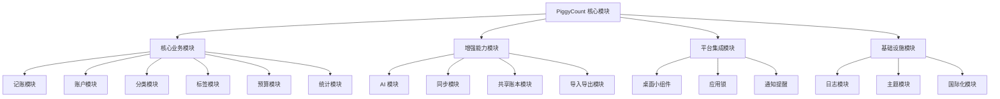
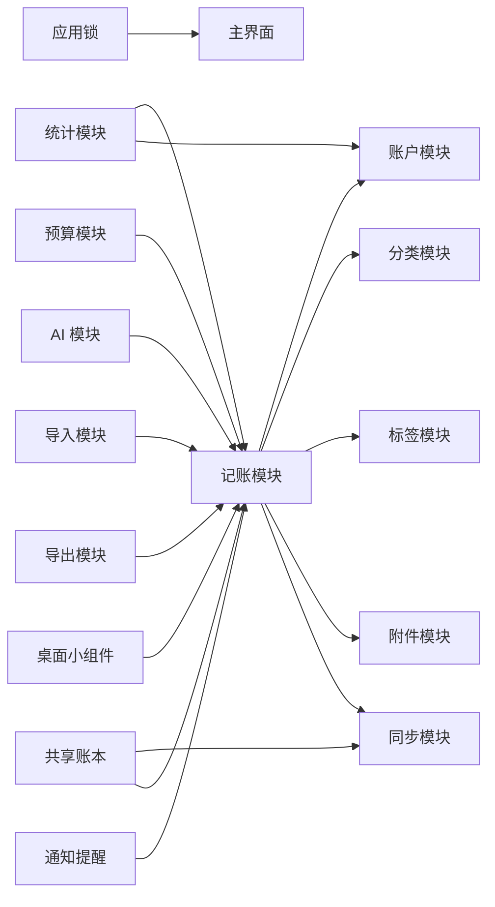
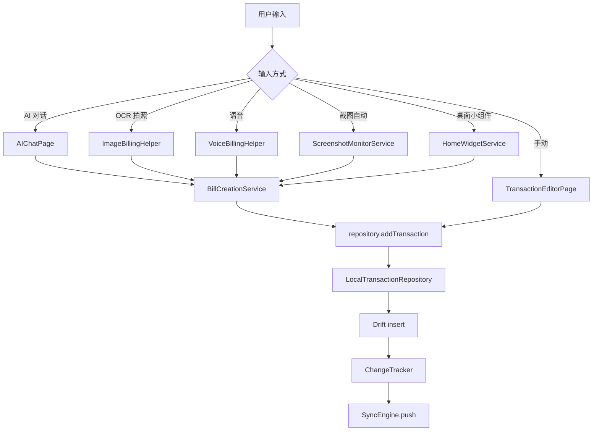
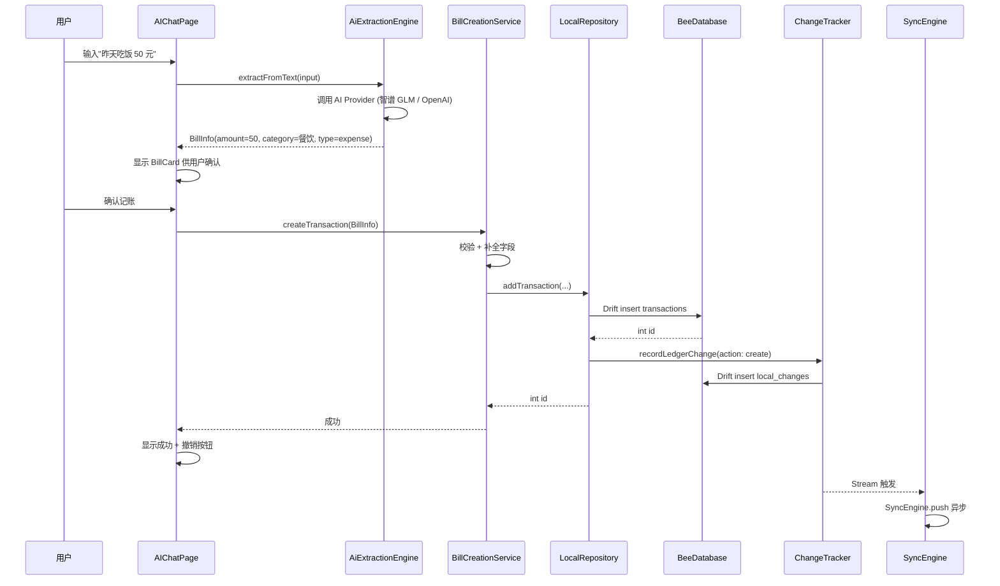
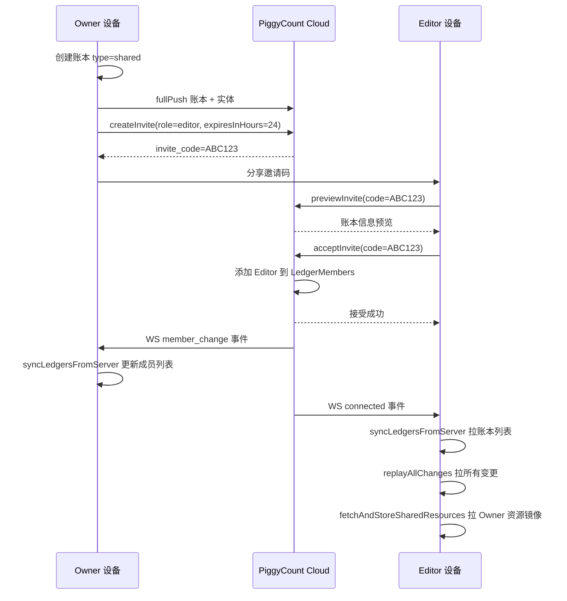
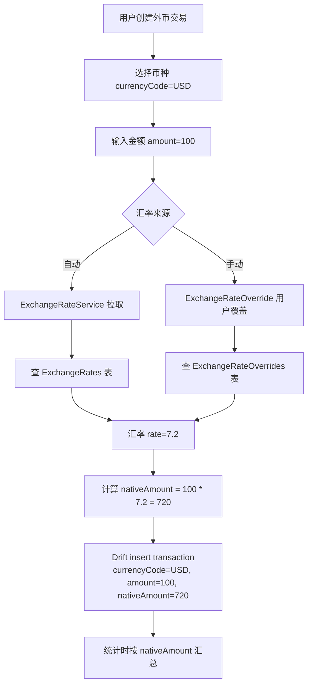

## 目录

- [1. 背景与目的](#1-背景与目的)
- [2. 核心概念](#2-核心概念)
- [3. 详细设计](#3-详细设计)
- [4. 关键流程](#4-关键流程)
- [5. 设计决策记录](#5-设计决策记录)
- [6. 注意事项与约束](#6-注意事项与约束)
- [7. 信息缺口](#7-信息缺口)
- [8. 相关文档](#8-相关文档)

---

## 1. 背景与目的

### 1.1 为什么需要模块详解文档

PiggyCount 包含 12+ 个核心业务模块,新加入的贡献者面对 `lib/pages/` 20+ 业务目录、`lib/services/` 15+ 子域,常常遇到以下困惑:

- 不知道"创建一笔交易"涉及哪些模块协作
- 不清楚 AI 记账的 4 种输入方式(对话/OCR/语音/截图)如何统一收敛
- 不理解共享账本的 Owner / Editor 双角色如何实现
- 不知道同步模块在什么时候激活、什么时候不激活
- 不清楚桌面小组件如何与主 App 通信

本文档对 PiggyCount 的 12 个核心模块逐一详解,说明每个模块的**职责边界、关键文件、与其他模块的交互关系**,让一年经验开发者能快速定位"功能在哪里实现"。

### 1.2 与其他文档的边界

- 本文**只讲模块职责与交互**,不讲分层架构(分层架构见 [04 系统架构设计](./04-system-architecture.md))
- 本文**只讲同步模块的位置与职责**,不讲同步实现细节(同步实现见 [06 数据同步与多设备离线机制](./06-data-sync-and-offline.md))
- 本文**只讲数据模型的模块归属**,不讲表结构(表结构见 [07 数据模型设计](./07-data-model.md))

### 1.3 信息来源

- `lib/pages/` 20+ 业务目录
- `lib/services/` 15+ 子域
- `lib/cloud/sync/` 同步引擎
- `lib/widgets/` 通用 Widget
- `lib/utils/` 工具类

---

## 2. 核心概念

### 2.1 模块全景图

PiggyCount 的核心模块可分为四大类:

上图展示了 PiggyCount 的 12+ 核心模块分类。核心业务模块是记账应用的底座,增强能力模块是 PiggyCount 区别于普通记账应用的特色,平台集成模块负责与原生系统交互,基础设施模块支撑全局。后续章节按类别详细说明。

### 2.2 模块协作总览

上图展示了模块间的协作关系。记账模块是核心枢纽,几乎所有其他模块都直接或间接与它交互。同步模块是横切关注点,所有写操作都通过 ChangeTracker 触发同步。这种协作关系对应代码中 `lib/data/repositories/local/local_repository.dart` 的聚合设计。

---

## 3. 详细设计

### 3.1 记账模块(Transaction)

#### 3.1.1 职责

记账模块负责交易的创建、编辑、删除、查询,是 PiggyCount 的核心模块。

#### 3.1.2 关键文件

| 文件 | 职责 |
|---|---|
| `lib/pages/transaction/transaction_editor_page.dart` | 交易编辑页 UI |
| `lib/pages/transaction/transaction_list_page.dart` | 交易列表页 |
| `lib/pages/transaction/transaction_detail_page.dart` | 交易详情页 |
| `lib/data/repositories/transaction_repository.dart` | 抽象接口(约 30 个方法) |
| `lib/data/repositories/local/local_transaction_repository.dart` | Drift 实现 |
| `lib/services/billing/bill_creation_service.dart` | AI / OCR / 语音记账的交易创建服务(37 个测试用例) |

#### 3.1.3 模块交互

记账模块的统一入口是 `repository.addTransaction`,无论输入方式是手动表单、AI 对话、OCR、语音、截图还是桌面小组件,最终都收敛到这个方法。BillCreationService 负责把 AI 提取的 BillInfo 转换为 Transaction 数据并调用 repository。这种设计让输入方式可扩展,而核心数据写入逻辑保持单一。

依据:`lib/pages/transaction/`、`lib/services/billing/bill_creation_service.dart`、`lib/data/repositories/local/local_transaction_repository.dart`。

### 3.2 账户模块(Account)

#### 3.2.1 职责

账户模块负责资金载体(现金/银行卡/信用卡等)的管理,包括余额计算、信用卡字段、多币种、隐藏账户。

#### 3.2.2 关键文件

| 文件 | 职责 |
|---|---|
| `lib/pages/account/account_manage_page.dart` | 账户管理页 |
| `lib/pages/account/account_edit_page.dart` | 账户编辑页 |
| `lib/data/repositories/account_repository.dart` | 抽象接口(约 30 个方法) |
| `lib/data/repositories/local/local_account_repository.dart` | Drift 实现 |
| `lib/utils/net_worth_trend_utils.dart` | 净资产趋势计算 |
| `lib/providers/credit_card_providers.dart` | 信用卡相关 provider |

#### 3.2.3 账户类型

| 类型 | 说明 | 特殊字段 |
|---|---|---|
| `cash` | 现金 | — |
| `bank_card` | 储蓄卡 | `bankName`、`cardLastFour` |
| `credit_card` | 信用卡 | `creditLimit`、`billingDay`、`paymentDueDay` |
| `alipay` / `wechat` | 第三方支付 | — |
| `investment` | 投资账户 | — |
| `asset` | 资产账户 | — |
| `liability` | 负债账户 | — |

#### 3.2.4 关键能力

- **隐藏账户**(v31):`accounts.hidden` 字段,隐藏后仍计入余额但不在主列表显示
- **多币种**(v30):账户有 `currency` 字段,交易有 `currencyCode` + `nativeAmount`,支持外币交易按汇率折算
- **净资产计算**:`getNetWorthBreakdown` / `getNetWorthBreakdownByCurrency` / `getNetWorthDailyBalances` / `getNetWorthTrendSeries`,按币种分组并折算
- **信用卡统计**:`getCreditCardUsedAmount` / `getCreditCardAccounts`,支持账单日 / 还款日提醒

依据:`lib/data/db.dart` L40 `Accounts` 表、`lib/data/repositories/local/local_account_repository.dart`、`lib/pages/account/`。

### 3.3 分类模块(Category)

#### 3.3.1 职责

分类模块负责收支分类的管理,支持二级分类(父/子)、自定义图标、排序、迁移。

#### 3.3.2 关键文件

| 文件 | 职责 |
|---|---|
| `lib/pages/category/category_manage_page.dart` | 分类管理页 |
| `lib/pages/category/category_edit_page.dart` | 分类编辑页 |
| `lib/data/repositories/category_repository.dart` | 抽象接口(约 25 个方法) |
| `lib/data/repositories/local/local_category_repository.dart` | Drift 实现 |
| `lib/services/category_package_service.dart` | 分类包导入服务 |
| `lib/services/custom_icon_service.dart` | 自定义图标服务 |

#### 3.3.3 图标类型(v13)

| iconType | 说明 | 存储 |
|---|---|---|
| `material` | Material Icon | `icon` 字段存 icon name |
| `custom` | 自定义图片 | `customIconPath` 本地路径 + cloud 上传 |
| `community` | 社区图标 | `communityIconId` |

#### 3.3.4 关键能力

- **二级分类**(v6):`parent_id` + `level` 字段,支持父子层级
- **分类迁移**:`migrateCategory` / `migrateCategoryTransactions`,删除分类时把交易迁移到其他分类
- **重名检测**:`isCategoryNameDuplicate`,防止同名分类
- **转账虚拟分类**:`getTransferCategory`,合并重复的转账分类

依据:`lib/data/db.dart` L91 `Categories` 表、`lib/data/repositories/local/local_category_repository.dart`。

### 3.4 标签模块(Tag)

#### 3.4.1 职责

标签模块负责交易的多对多标记,有颜色、排序、统计。

#### 3.4.2 关键文件

| 文件 | 职责 |
|---|---|
| `lib/pages/tag/tag_manage_page.dart` | 标签管理页 |
| `lib/data/repositories/tag_repository.dart` | 抽象接口(约 20 个方法) |
| `lib/data/repositories/local/local_tag_repository.dart` | Drift 实现 |

#### 3.4.3 关键设计

- **多对多关联**:通过 `TransactionTags` 关联表(transactionId + tagId)
- **共享账本 override**(v27):`TransactionTagOverrides` 表,Editor 角色 选 Owner tag 时通过 syncId 关联
- **user-global 同步**:标签是 user-global 实体,`local_changes.ledger_id=0`,所有账本共享

依据:`lib/data/db.dart` L210 `Tags` 表、`lib/data/repositories/local/local_tag_repository.dart`。

### 3.5 预算模块(Budget)

#### 3.5.1 职责

预算模块负责月度/周度/年度预算的设置与使用统计,支持总预算 + 分类预算。

#### 3.5.2 关键文件

| 文件 | 职责 |
|---|---|
| `lib/pages/budget/budget_page.dart` | 预算总览页 |
| `lib/pages/budget/budget_edit_page.dart` | 预算编辑页 |
| `lib/data/repositories/budget_repository.dart` | 抽象接口 |
| `lib/data/repositories/local/local_budget_repository.dart` | Drift 实现 |

#### 3.5.3 关键设计

- **类型**:`total`(总预算)/ `category`(分类预算,通过 `categoryId` 关联)
- **周期**:`monthly` / `weekly` / `yearly`,通过 `period` + `startDay` 配置
- **按账本月起日计算**(v27):`getBudgetUsage` / `getBudgetOverview` / `getCategoryBudgetUsages` 都按账本 `monthStartDay` 计算周期,而非自然月
- **超支提醒**:`flutter_local_notifications` 推送超支通知

依据:`lib/data/db.dart` L300 `Budgets` 表、`lib/data/repositories/local/local_budget_repository.dart`。

### 3.6 统计模块(Statistics)

#### 3.6.1 职责

统计模块负责交易的分类汇总、趋势分析、年度报告、净资产趋势。

#### 3.6.2 关键文件

| 文件 | 职责 |
|---|---|
| `lib/pages/main/analytics_page.dart` | 统计 Tab |
| `lib/pages/report/annual_report_page.dart` | 年度报告 |
| `lib/data/repositories/statistics_repository.dart` | 抽象接口 |
| `lib/data/repositories/local/local_statistics_repository.dart` | Drift 实现 |
| `lib/widgets/charts/` | 图表 Widget(fl_chart) |

#### 3.6.3 关键方法

- `totalsByCategory` / `totalsByCategoryWithHierarchy`(二级展开)
- `totalsByDay` / `totalsByMonth`(按账本起始日 12 桶)/ `totalsByYearSeries`
- `totalsInRange` / `monthlyTotals` / `yearlyTotals`(均返 `(income, expense)`)
- `getSharedSyntheticCategoriesForLedger`(共享账本 synthetic 分类映射)

#### 3.6.4 排除标志

交易有 `excludeFromStats` 字段(v25),勾选后不计入统计。统计模块的所有查询都自动过滤 `excludeFromStats=true` 的交易。

依据:`lib/data/repositories/local/local_statistics_repository.dart`、`lib/pages/main/analytics_page.dart`、`lib/pages/report/`。

### 3.7 AI 模块(AI)

#### 3.7.1 职责

AI 模块负责通过 AI 自动提取账单信息并创建交易,支持 4 种输入方式:对话、OCR 拍照、语音、截图自动识别。

#### 3.7.2 关键文件

| 文件 | 职责 |
|---|---|
| `lib/ai/core/ai_extraction_engine.dart` | Layer 1 抽取引擎(L15) |
| `lib/ai/core/bill_info.dart` | BillInfo 数据模型 |
| `lib/services/ai/ai_bookkeeper.dart` | AI 记账业务编排 |
| `lib/services/ai/ai_message_service.dart` | AI 对话消息管理 |
| `lib/pages/ai/ai_chat_page.dart` | AI 对话页 |
| `lib/utils/image_billing_helper.dart` | OCR 拍照 |
| `lib/utils/voice_billing_helper.dart` | 语音记账 |
| `lib/services/platform/screenshot_monitor_service.dart` | 截图自动记账(Android) |
| `packages/flutter_ai_kit/` | AI 抽象层 + 6 种执行策略 |
| `packages/flutter_ai_kit_zhipu/` | 智谱 GLM-4 provider |
| `packages/flutter_ai_kit_openai/` | OpenAI provider |

#### 3.7.3 AI 执行策略

`flutter_ai_kit` 提供 6 种执行策略,见 `packages/flutter_ai_kit/lib/src/strategies/`:

| 策略 | 说明 |
|---|---|
| `local_first` | 优先本地模型,失败回退云端 |
| `cloud_first` | 优先云端,失败回退本地 |
| `local_only` | 只用本地 |
| `cloud_only` | 只用云端 |
| `cost_optimized` | 成本优先,按 token 价格路由 |
| `custom_priority` | 自定义优先级 |

#### 3.7.4 数据模型

| 表 | 用途 |
|---|---|
| `Conversations`(v8) | AI 对话会话,有标题和时间戳 |
| `Messages`(v8) | AI 对话消息,role=user/assistant,messageType=text/bill_card |

AI 对话页面支持撤销记账(通过 `Messages.transactionId` 关联已创建的交易)。

依据:`lib/ai/core/ai_extraction_engine.dart`、`lib/services/ai/`、`packages/flutter_ai_kit/`、`lib/data/db.dart` L188。

### 3.8 同步模块(Sync)

同步模块是 PiggyCount 最复杂的模块,详见 [06 数据同步与多设备离线机制](./06-data-sync-and-offline.md)。这里只说明模块位置与职责:

| 文件 | 职责 |
|---|---|
| `lib/cloud/sync_service.dart` | `SyncService` 抽象接口 + `LocalOnlySyncService` |
| `lib/cloud/sync/sync_engine.dart` | SyncEngine 主类(1480 行) |
| `lib/cloud/sync/change_tracker.dart` | ChangeTracker local_changes 表 DAO |
| `lib/cloud/sync/sync_coordinator.dart` | SyncCoordinator 反应式触发器 |
| `lib/cloud/sync/sync_conflict_resolver.dart` | LWW 冲突解决 |
| `lib/cloud/sync/sync_engine_apply.dart` | apply remote change(7 种 entityType) |
| `lib/cloud/sync/sync_engine_pull.dart` | AppCursorStore + SyncErrorStore + LookupCache |
| `lib/cloud/sync/sync_engine_realtime.dart` | WS 事件监听 + 防抖调度 |
| `lib/cloud/sync/sync_engine_serialization.dart` | 实体序列化 + fullPush |
| `lib/cloud/sync/sync_engine_profile.dart` | profile + avatar 同步 |
| `lib/cloud/sync/sync_engine_resolvers.dart` | 跨设备 ID 解析 |
| `lib/cloud/sync/sync_engine_status.dart` | 健康检查 + backfill |
| `lib/cloud/sync/sync_engine_attachments.dart` | 附件上传/下载/清理 |
| `lib/cloud/sync/sync_events.dart` | SyncEvent sealed class |
| `lib/cloud/transactions_sync_manager.dart` | 非 PiggyCount Cloud 的快照同步 manager |
| `lib/cloud/transactions_json.dart` | fullPull 的 JSON 导入导出 |

### 3.9 共享账本模块(Shared Ledger)

#### 3.9.1 职责

共享账本模块支持多人协同记账,有 Owner / Editor 双角色。

#### 3.9.2 关键文件

| 文件 | 职责 |
|---|---|
| `lib/pages/cloud/invite_page.dart` | Owner 创建邀请码 |
| `lib/pages/cloud/join_shared_ledger_page.dart` | Editor 加入共享账本 |
| `lib/pages/cloud/member_list_page.dart` | 成员管理 |
| `lib/pages/cloud/member_stats_page.dart` | 成员记账统计 |
| `lib/providers/shared_ledger_providers.dart` | 共享账本 provider |

#### 3.9.3 角色与权限

| 角色 | 权限 |
|---|---|
| Owner | 创建账本、邀请成员、修改账本元数据、管理分类/账户/标签(主表) |
| Editor | 加入账本、记账、查看、使用 Owner 的分类/账户/标签(通过 SharedLedger* 镜像表) |

#### 3.9.4 镜像表设计

共享账本通过 3 张镜像表实现 Editor 对 Owner 资源的引用:

| 表 | 用途 |
|---|---|
| `SharedLedgerCategories` | Owner 分类的镜像,Editor 选择时记录 `categorySyncIdOverride` |
| `SharedLedgerAccounts` | Owner 账户的镜像 |
| `SharedLedgerTags` | Owner 标签的镜像,Editor 选择时记录 `tagSyncIdsOverride` |

v25 之前 Editor 选择 Owner 资源会 mirror 到主表,v25 改为只写 `*SyncIdOverride` 字段,本地 int id 留 null,Editor UI 走 SharedLedger* 镜像表渲染。

依据:`lib/data/db.dart` L32 `Ledgers.isShared` / `myRole`、`lib/pages/cloud/`、`lib/cloud/sync/sync_engine_apply.dart` `_applyTransactionChange`。

### 3.10 导入导出模块(Import / Export)

#### 3.10.1 职责

导入模块负责从外部数据源(支付宝/微信/通用 CSV)导入交易;导出模块负责导出 CSV、YAML 配置、海报分享。

#### 3.10.2 关键文件

| 文件 | 职责 |
|---|---|
| `lib/services/import/bill_parser.dart` | 账单解析(支付宝/微信/通用) |
| `lib/services/import/data_import_service.dart` | 导入服务 |
| `lib/pages/data/import_page.dart` | 导入页 |
| `lib/pages/data/import_confirm_page.dart` | 导入确认页 |
| `lib/services/export/` | 导出服务(CSV / YAML / 海报) |
| `lib/pages/data/export_page.dart` | 导出页 |

#### 3.10.3 关键设计

- **批量插入**:`insertTransactionsBatchWithRelations`,单事务 + tag/attachment 关联
- **多币种导入**(v30):支持导入外币交易,自动按汇率折算 nativeAmount
- **去重**:通过 `happenedAt` + `amount` + `note` 模糊匹配去重

依据:`lib/services/import/`、`lib/services/export/`、`lib/pages/data/`。

### 3.11 桌面小组件模块(Home Widget)

#### 3.11.1 职责

桌面小组件模块支持 iOS / Android 桌面快速记账小组件。

#### 3.11.2 关键文件

| 文件 | 职责 |
|---|---|
| `lib/widget/widget_manager.dart` | Dart 层小组件管理 |
| `ios/PiggyCountWidget/` | iOS WidgetExtension |
| `android/app/src/main/res/xml/piggycount_widget_info.xml` | Android 小组件配置 |
| `android/app/src/main/kotlin/.../PiggyCountWidgetProvider.kt` | Android 小组件实现 |

#### 3.11.3 关键设计

- 通过 `home_widget: ^0.7.0` 包与原生层通信
- iOS 使用 WidgetExtension(独立进程,通过 App Group 共享数据)
- Android 使用 AppWidgetProvider(BroadcastReceiver)
- 点击小组件跳转到 `piggycount://quick-add` App Link,触发记账页

依据:`lib/widget/`、`ios/PiggyCountWidget/`、`android/app/src/main/res/xml/`、`pubspec.yaml` L45。

### 3.12 平台集成模块

#### 3.12.1 应用锁

| 文件 | 职责 |
|---|---|
| `lib/services/security/app_lock_service.dart` | 应用锁服务 |
| `lib/pages/auth/app_lock_screen.dart` | 应用锁页 |
| `lib/providers/security_providers.dart` | 应用锁 provider |

- 通过 `local_auth: ^2.3.0` 实现生物认证(指纹/面容)
- 启动检查 + 后台停留超时自动锁
- 应用锁开关存于 SharedPreferences

#### 3.12.2 通知提醒

| 文件 | 职责 |
|---|---|
| `lib/utils/notification_android.dart` | Android 通知通道 |
| `lib/utils/notification_ios.dart` | iOS 通知权限 |
| `lib/services/reminder_service.dart` | 提醒服务 |
| `lib/providers/reminder_providers.dart` | 提醒 provider |

- 通过 `flutter_local_notifications: ^17.2.2` + `timezone: ^0.9.4` 实现本地通知
- 支持记账提醒、周期记账通知、信用卡账单日提醒、预算超支提醒

#### 3.12.3 截图自动记账

| 文件 | 职责 |
|---|---|
| `lib/services/platform/screenshot_monitor_service.dart` | 截图监听服务 |
| `android/app/src/main/kotlin/.../ScreenshotObserver.kt` | Android 截图监听 |

- **仅 Android**,iOS 系统限制不支持
- **Google Play 版本裁剪**:CI 构建时移除 `READ_MEDIA_IMAGES` 权限,此功能在 Google Play 版本被砍掉
- 监听到截图后调起 OCR 识别

依据:`lib/services/security/`、`lib/utils/notification_*.dart`、`lib/services/platform/`、`release.yml` L166-185。

---

## 4. 关键流程

### 4.1 完整记账流程(含 AI)

上图展示了完整的 AI 记账流程。用户输入自然语言 → AiExtractionEngine 调用 AI Provider 提取 BillInfo → UI 展示 BillCard 供确认 → BillCreationService 创建交易 → Repository 写库 + ChangeTracker 记录 → SyncEngine 异步推送。整个流程的关键设计是"AI 提取与数据写入解耦",BillInfo 是中间数据模型,可被任何输入方式(对话/OCR/语音/截图)复用。

依据:`lib/ai/core/ai_extraction_engine.dart`、`lib/services/billing/bill_creation_service.dart`、`lib/pages/ai/ai_chat_page.dart`。

### 4.2 共享账本加入流程

上图展示了共享账本的加入流程。Owner 创建账本并生成邀请码,Editor 通过邀请码加入。加入后,server 通过 WS 推送 `member_change` 事件通知 Owner,推送 `connected` 事件触发 Editor 拉取账本数据。Editor 通过 `fetchAndStoreSharedResources` 拉 Owner 的分类/账户/标签镜像到 SharedLedger* 表,后续记账时通过 `*SyncIdOverride` 引用 Owner 资源。

依据:`lib/pages/cloud/invite_page.dart`、`lib/pages/cloud/join_shared_ledger_page.dart`、`lib/cloud/sync/sync_engine_realtime.dart` `_handleMemberChange`。

### 4.3 多币种折算流程

上图展示了多币种折算流程(v30)。用户创建外币交易时选择币种,系统根据汇率(自动拉取或用户手动覆盖)计算 `nativeAmount`(折算到账本基础币种的金额)。统计时按 `nativeAmount` 汇总,保证不同币种的交易可加总。汇率覆盖(`ExchangeRateOverrides`)是 user-global 同步实体,按币对收敛(不按 syncId),双端离线各建同币对会自动合并。

依据:`lib/data/db.dart` L148 `currencyCode`、L153 `nativeAmount`、`lib/services/currency/exchange_rate_service.dart`、`lib/cloud/sync/sync_engine_apply.dart` `_applyExchangeRateOverrideChange`。

---

## 5. 设计决策记录

### 决策 1:统一记账入口

- **决策内容**:无论输入方式(手动/AI/OCR/语音/截图/小组件),最终都收敛到 `repository.addTransaction`。
- **原因**:
  - **单一数据写入路径**:便于维护、测试、注入横切逻辑(ChangeTracker)
  - **输入方式可扩展**:新增输入方式只需实现到 BillInfo 转换,无需修改数据写入逻辑
  - **统一校验**:所有输入方式的交易都经过相同校验
- **备选方案**:每种输入方式独立写入路径(代码重复、维护成本高)
- **最终取舍**:统一入口,通过 BillInfo 作为中间数据模型解耦输入与写入。
- **依据**:`lib/services/billing/bill_creation_service.dart`、`lib/data/repositories/local/local_transaction_repository.dart`。

### 决策 2:共享账本用镜像表而非主表

- **决策内容**:Editor 选择 Owner 资源(分类/账户/标签)时,只写 `*SyncIdOverride` 字段,本地 int id 留 null,Editor UI 走 SharedLedger* 镜像表渲染。
- **原因**:
  - **避免数据冗余**:Editor 不需要完整复制 Owner 的分类/账户/标签到主表
  - **避免同步冲突**:如果 mirror 到主表,Owner 修改后 Editor 主表数据会过时
  - **权限清晰**:Owner 拥有主表,Editor 只引用
- **备选方案**:
  - v25 之前的 mirror 到主表:数据冗余,Owner 修改后需同步更新 Editor 主表
  - 完全不 mirror,Editor 直接用 syncId 查询:查询性能差,需每次跨设备查
- **最终取舍**:v25 改为镜像表 + override 字段,Editor UI 走 SharedLedger* 渲染。
- **依据**:`lib/cloud/sync/sync_engine_apply.dart` `_applyTransactionChange:128+`、`lib/data/db.dart` SharedLedger* 表。

### 决策 3:AI 执行策略可配置

- **决策内容**:`flutter_ai_kit` 提供 6 种执行策略(local_first / cloud_first / local_only / cloud_only / cost_optimized / custom_priority),用户可配置。
- **原因**:
  - **成本控制**:不同策略的 token 成本不同,cost_optimized 自动路由到便宜模型
  - **隐私偏好**:local_only 适合隐私敏感用户
  - **网络环境**:弱网时 local_first 保证可用性
- **备选方案**:固定单一策略(灵活性差)
- **最终取舍**:6 种策略可配置,默认 local_first。
- **依据**:`packages/flutter_ai_kit/lib/src/strategies/`。

### 决策 4:统计排除标志字段级控制

- **决策内容**:交易有 `excludeFromStats`(v25)和 `excludeFromBudget` 字段,勾选后不计入统计/预算。
- **原因**:
  - **灵活控制**:用户可标记某些交易(如内部转账、调整分录)不计入统计
  - **字段级而非交易级**:同一笔交易可计入统计但不计入预算,反之亦然
- **备选方案**:交易级排除(一个字段控制所有统计,灵活性差)
- **最终取舍**:两个字段独立控制,统计查询自动过滤。
- **依据**:`lib/data/db.dart` L142、L146、`lib/data/repositories/local/local_statistics_repository.dart`。

### 决策 5:截图自动记账仅 Android

- **决策内容**:截图自动记账功能仅在 Android 实现,iOS 因系统限制不支持。
- **原因**:
  - **iOS 限制**:iOS 不允许应用监听截图事件
  - **Android 可行**:通过 `ContentObserver` 监听 `MediaStore.Images` 变化
- **备选方案**:无(iOS 系统限制)
- **最终取舍**:仅 Android,Google Play 版本因权限裁剪也砍掉此功能。
- **依据**:`lib/services/platform/screenshot_monitor_service.dart`、`android/app/src/main/kotlin/.../ScreenshotObserver.kt`、`release.yml` L166-185。

---

## 6. 注意事项与约束

### 6.1 模块协作约束

| 约束 | 说明 |
|---|---|
| 记账模块是核心枢纽 | 几乎所有其他模块都直接或间接与它交互 |
| 同步模块是横切关注点 | 所有写操作都通过 ChangeTracker 触发同步,无需 UI 显式调用 |
| AI 模块默认关闭 | 需用户主动配置 AI provider(智谱 GLM / OpenAI) |
| 共享账本仅 PiggyCount Cloud 支持 | 其他 4 种同步后端不支持共享账本 |
| 截图自动记账仅 Android 且 Google Play 版本砍掉 | 受系统限制 + 权限裁剪 |

### 6.2 模块边界

| 模块 | 不应做 | 应做 |
|---|---|---|
| 记账模块 | 直接调用 CloudProvider | 通过 Repository 抽象访问数据 |
| AI 模块 | 直接写数据库 | 通过 BillCreationService + Repository |
| 共享账本 | 修改 Owner 主表 | 通过 SharedLedger* 镜像表 + override 字段 |
| 同步模块 | 调用 UI 刷新 | 通过 SyncEvent 通知 Provider 层 |
| 统计模块 | 修改交易数据 | 只读查询 + 自动过滤 excludeFromStats |

### 6.3 模块测试约束

- BillCreationService 有 37 个测试用例(最多)
- 各 Local 子 Repository 测试不均,部分通过 wrapper 测试间接覆盖
- AI 模块测试集中在 `test/ai/`(7 个文件)
- 共享账本测试通过 `test/cloud/sync/sync_engine_e2e_test.dart`(44 个用例)覆盖

详见 [10 测试策略](./10-testing-strategy.md)。

---

## 7. 信息缺口

| 编号 | 缺口描述 | 影响章节 | 建议补充方式 |
|---|---|---|---|
| 1 | `lib/services/` 各 Service 之间的完整调用关系图未绘制 | §3 | 可选,通过 grep 统计 import 关系 |
| 2 | AI 执行策略的 6 种类型在代码中的具体实现差异未展开 | §3.7.3 | 阅读 `packages/flutter_ai_kit/lib/src/strategies/` 各文件 |
| 3 | 共享账本的成员统计 `fetchMemberStats` 实现细节未展开 | §3.9 | 阅读 `piggycount_cloud_provider.dart` `fetchMemberStats` |
| 4 | 桌面小组件的 iOS WidgetExtension 与 Android AppWidgetProvider 实现细节未展开 | §3.11 | 阅读 `ios/PiggyCountWidget/` 与 `android/app/src/main/kotlin/.../PiggyCountWidgetProvider.kt` |
| 5 | 信用卡账单日 / 还款日提醒的具体触发逻辑未展开 | §3.12.2 | 阅读 `lib/providers/credit_card_reminder_providers.dart` |
| 6 | 导入模块的支付宝 / 微信 / 通用 CSV 解析规则未展开 | §3.10 | 阅读 `lib/services/import/bill_parser.dart` |

---

## 8. 相关文档

- [01 项目全览](./01-project-overview.md) — 项目整体定位
- [02 术语表](./02-glossary.md) — 术语统一
- [04 系统架构设计](./04-system-architecture.md) — 分层架构
- [06 数据同步与多设备离线机制](./06-data-sync-and-offline.md) — 同步模块深入
- [07 数据模型设计](./07-data-model.md) — 表结构
- [08 接口与数据访问设计](./08-api-and-data-access.md) — Repository 接口
- [10 测试策略](./10-testing-strategy.md) — 模块测试
- [INDEX](./INDEX.md) — 完整文档索引
