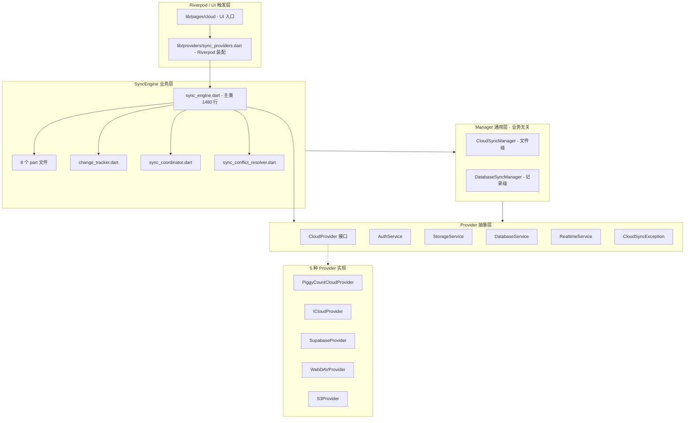
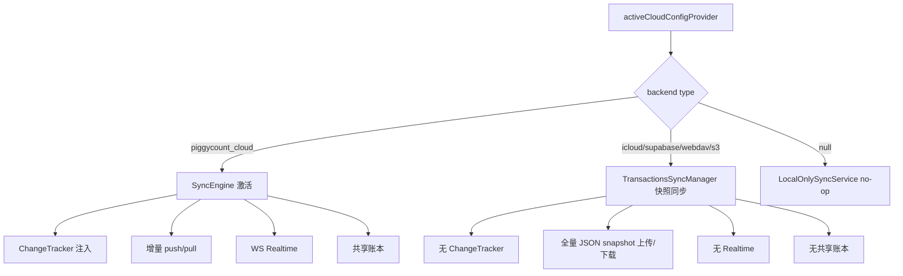
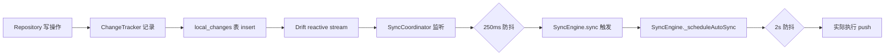
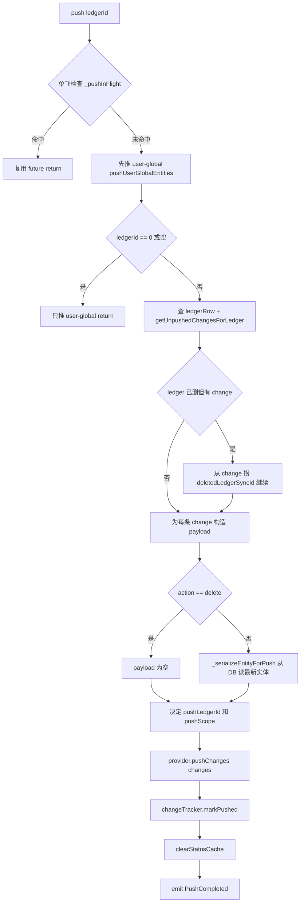
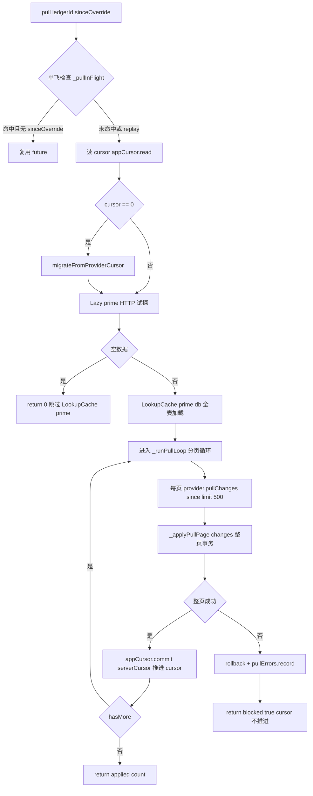
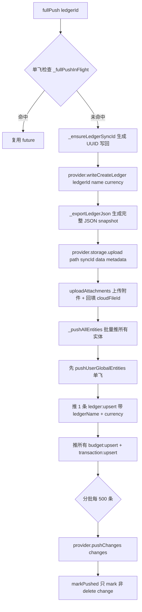
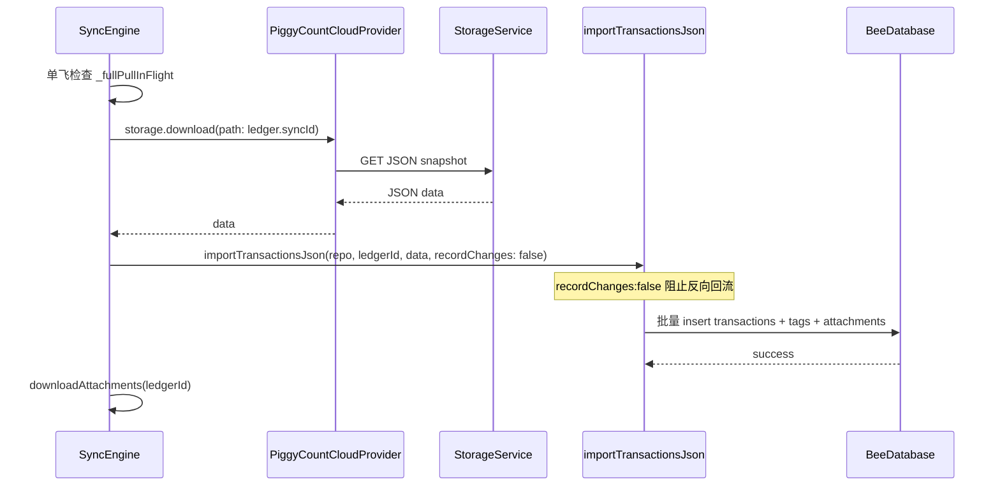
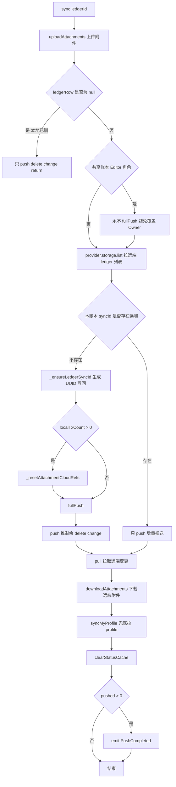
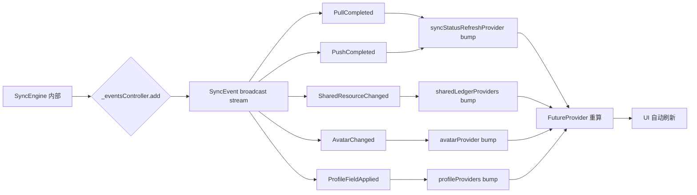
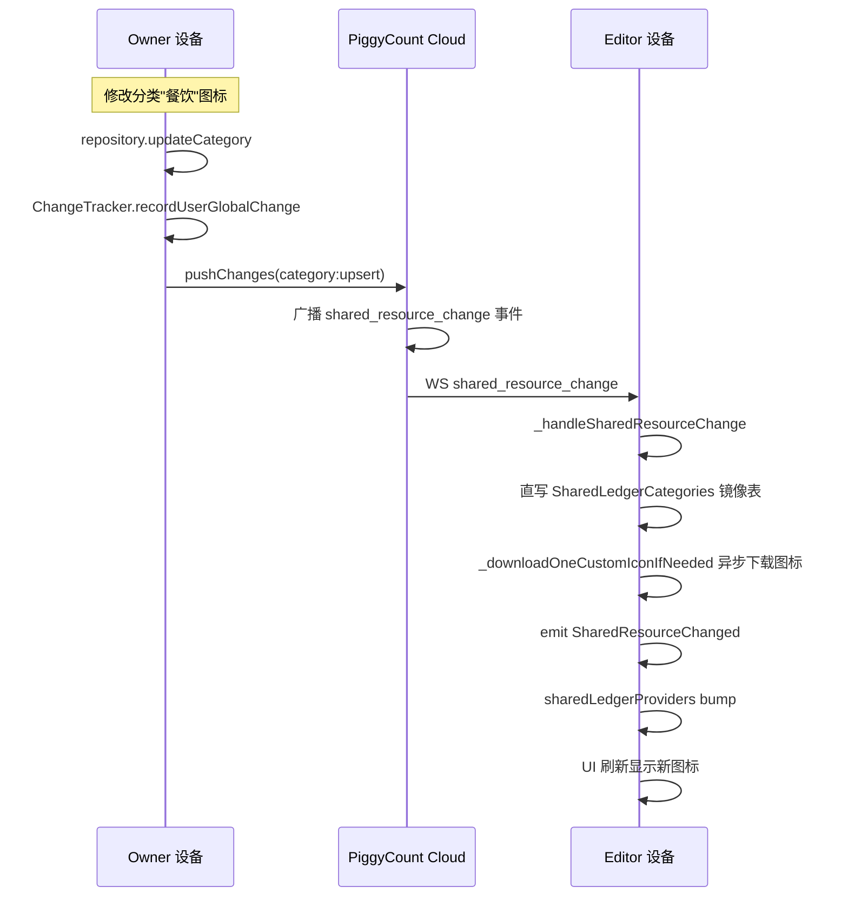

## 目录

- [1. 背景与目的](#1-背景与目的)
- [2. 核心概念](#2-核心概念)
- [3. 详细设计](#3-详细设计)
- [4. 关键流程](#4-关键流程)
- [5. 设计决策记录](#5-设计决策记录)
- [6. 注意事项与约束](#6-注意事项与约束)
- [7. 信息缺口](#7-信息缺口)
- [8. 相关文档](#8-相关文档)

---

## 1. 背景与目的

### 1.1 为什么单独写同步文档

数据同步是 PiggyCount 最复杂、最核心的模块,代码量占 `lib/cloud/` 整个目录,涉及:

- 5 种同步后端(PiggyCount Cloud / iCloud / Supabase / WebDAV / S3)
- 自研 `flutter_cloud_sync` 框架(4 层架构)
- 增量同步(push / pull)+ 全量同步(fullPush / fullPull)
- LWW 冲突解决 + 字段级合并
- WebSocket Realtime 实时同步
- 离线优先 + 变更追踪
- 共享账本多设备协同
- 附件同步 + 自定义图标同步

新加入的贡献者面对 `sync_engine.dart` 1480 行主类 + 8 个 part 文件,常常无从下手。本文档系统梳理同步模块的架构、流程、设计决策,让一年经验开发者能快速理解和参与同步模块开发。

### 1.2 与其他文档的边界

- 本文**只讲同步机制**,不讲整体架构(整体架构见 [04 系统架构设计](./04-system-architecture.md))
- 本文**只讲同步模块的接口**,不讲 Repository 内部实现(Repository 见 [08 接口与数据访问设计](./08-api-and-data-access.md))
- 本文**只讲同步涉及的表**(local_changes / sync_state / sync_pull_errors),不讲全部表(全部表见 [07 数据模型设计](./07-data-model.md))

### 1.3 信息来源

- `lib/cloud/sync/` 完整代码
- `packages/flutter_cloud_sync/lib/src/` 核心抽象层
- `packages/flutter_cloud_sync_*/lib/src/` 各 provider 实现
- `lib/data/db.dart` 同步相关表定义
- `lib/providers/sync_providers.dart` Riverpod 装配

---

## 2. 核心概念

### 2.1 同步引擎四层架构

PiggyCount 的同步体系由四层架构组成,从下到上依次为:Provider 抽象层 → 通用 Manager 层 → PiggyCount 业务 SyncEngine 层 → Riverpod/UI 触发层。

上图展示了同步引擎的四层架构。L1 Provider 抽象层定义跨 provider 的统一契约(纯抽象接口);L2 Manager 通用层提供业务无关的同步编排;L3 SyncEngine 业务层是 PiggyCount 自有的核心同步逻辑,实现 `SyncService` 接口;L4 Riverpod/UI 触发层是同步的入口与 UI 反馈。5 种 provider 实现同一 `CloudProvider` 抽象,但只有 PiggyCountCloudProvider 实现了完整的增量同步 + Realtime + 共享账本能力。

依据:`lib/cloud/sync/sync_engine.dart` L72、`packages/flutter_cloud_sync/lib/src/core/cloud_provider.dart`。

### 2.2 五种同步后端对比

| 维度 | PiggyCount Cloud | iCloud | Supabase | WebDAV | S3 |
|---|---|---|---|---|---|
| `providerId` | `piggycount_cloud` | `icloud` | `supabase` | `webdav` | `s3` |
| 同步模型 | **变更日志**(sync_changes 表)+ JSON snapshot fallback | 文件级(snapshot) | Postgres 行级 CDC + Realtime | 文件级(snapshot) | 文件级(snapshot) |
| 认证 | JWT + refresh token + 2FA TOTP | iCloud 账户 | Supabase Auth(PKCE) | Basic Auth | Access Key + Secret Key 签名 |
| Realtime | **自实现 WebSocket 客户端** | 无 | Supabase SDK 内置 Postgres CDC | 无 | 无 |
| 共享账本 | **支持** | 不支持 | 理论支持(PiggyCount 未启用) | 不支持 | 不支持 |
| 2FA | **支持**(TOTP + recovery_code) | N/A | 需 Supabase Auth 配置 | N/A | N/A |
| 在 PiggyCount 中是否实际启用 | **主用**(SyncEngine 直接消费) | 历史支持 | 历史支持(已被 PiggyCount Cloud 取代) | 历史支持 | 历史支持 |

**PiggyCount Cloud 独有的关键能力**(其他 provider 都没有):

- `pushChanges` / `pullChanges` 增量变更日志协议
- `readLedgers` / `readLedgerStats` / `fetchSharedResources` 业务专用 read API
- `writeCreateLedger` / `writeLedgerMeta` / `writeCreateTransaction` / `writeUpdateTransaction` 业务专用 write API
- `createInvite` / `previewInvite` / `acceptInvite` / `listMembers` / `updateMemberRole` / `removeMember` 共享账本管理
- `fetchMemberStats` 成员统计
- `listDevices` / `revokeDevice` 设备管理
- `fetchExchangeRates` server 汇率代理
- WebSocket Realtime(6 种事件类型)
- 2FA TOTP

依据:`packages/flutter_cloud_sync/lib/src/providers/piggycount_cloud_provider.dart`、`packages/flutter_cloud_sync_*/lib/src/` 各 provider。

### 2.3 同步激活条件

SyncEngine 只在 PiggyCount Cloud 模式下激活,其他 4 种后端走 `TransactionsSyncManager` 快照路径:

上图展示了同步的激活条件。`syncServiceProvider` 根据 `activeCloudConfigProvider` 判断后端类型:仅 PiggyCount Cloud 激活完整的 SyncEngine + ChangeTracker;其他 4 种后端走快照同步,不注入 ChangeTracker;无后端时使用 `LocalOnlySyncService`(no-op 实现)。

依据:`lib/providers/sync_providers.dart` `syncServiceProvider`。

---

## 3. 详细设计

### 3.1 ChangeTracker 变更追踪

`ChangeTracker` 是同步的入口,所有 Repository 的写操作都通过它记录变更到 `local_changes` 表。

#### 3.1.1 local_changes 表结构

| 字段 | 用途 |
|---|---|
| `id` | 自增 PK |
| `entity_type` | transaction/account/category/tag/budget/ledger/ledger_snapshot/exchange_rate_override |
| `entity_id` | 本地 int id |
| `entity_sync_id` | 跨设备 UUID |
| `ledger_id` | **0 = user-global;>0 = ledger-scoped** |
| `action` | upsert / delete / create |
| `payload_json` | 可选,服务端实际 push 时从 DB 重读最新数据序列化 |
| `pushed_at` | null = 未推;非 null = 已推 |
| `created_at` | 用于 LWW `updated_at` 字段 |

#### 3.1.2 ChangeTracker 关键方法

| 方法 | 用途 |
|---|---|
| `recordUserGlobalChange({entityType, entityId, entitySyncId, action, payloadJson})` | 记录 user-global 变更,自动 `ledgerId=0` |
| `recordLedgerChange({entityType, entityId, entitySyncId, ledgerId, action, payloadJson})` | 记录 ledger-scoped 变更,必须 `ledgerId>0` |
| `recordPulledFromServer({entityType, entityId, entitySyncId, ledgerId})` | pulledFromServer marker,`pushedAt=now` |
| `getUnpushedChanges()` | 获取所有未推变更 |
| `getUnpushedChangesForLedger(int ledgerId)` | 获取单账本未推变更 |
| `markPushed(List<int> changeIds)` | 标记已推 |
| `cleanupPushedChanges({Duration retention = 7 days})` | 清理已推变更(7 天保留) |
| `getUnpushedCount()` | 获取未推数量 |

#### 3.1.3 Scope 契约

`local_changes.ledger_id` 有两种语义:

- **user-global**(account / category / tag / exchange_rate_override):挂 `ledgerId=0`,影响所有账本
- **ledger-scoped**(transaction / budget / ledger / ledger_snapshot):挂具体 ledgerId,只影响单账本

两个 `record*Change` 方法用 `assert` 强制契约:`recordLedgerChange` 必须 `ledgerId>0`,`recordUserGlobalChange` 自动 `ledgerId=0`。

依据:`lib/cloud/sync/change_tracker.dart` L29、`lib/data/db.dart` L220 `LocalChanges` 表。

### 3.2 SyncCoordinator 反应式触发

`SyncCoordinator` 是反应式触发器,监听 `local_changes` 表的 Drift reactive stream,任何写入自动触发 SyncEngine 推送。

#### 3.2.1 关键设计

上图展示了反应式触发的双层防抖设计。SyncCoordinator 监听 `local_changes` 表的 Drift reactive stream(查询 `pushedAt.isNull()` 的行),任何写入都触发 250ms 防抖(合并 CSV 导入 / 批量删除 / migrate 等高频写入)。防抖后调 `SyncEngine.sync`,内部再走 2s 防抖(合并 WS 重连 / connectivity 恢复 / 反应式触发等多个上游事件)。双层防抖避免了高频写入导致的同步风暴。

#### 3.2.2 SyncCoordinator 关键方法

| 方法 | 用途 |
|---|---|
| `start()` | 启动监听 `db.select(db.localChanges)..where((c) => c.pushedAt.isNull()).watch()` |
| `dispose()` | 取消订阅 + 取消防抖定时器 |

仅在 PiggyCount Cloud 模式启用;S3/WebDAV 走 snapshot 同步,不读 local_changes。

依据:`lib/cloud/sync/sync_coordinator.dart` L27。

### 3.3 SyncEngine 主类

`SyncEngine` 是 PiggyCount 自有的核心同步逻辑类,实现 `app.SyncService` 接口,直接消费 `PiggyCountCloudProvider`。

#### 3.3.1 SyncService 接口实现

| 方法 | 用途 |
|---|---|
| `uploadCurrentLedger({required int ledgerId})` | 上传当前账本(走 fullPush 路径) |
| `downloadAndRestoreToCurrentLedger({required int ledgerId})` | 下载并恢复到当前账本(走 fullPull 路径) |
| `getStatus({required int ledgerId})` | 获取同步状态 |
| `markLocalChanged({required int ledgerId})` | 标记本地变更 |
| `deleteRemoteBackup({required int ledgerId})` | 删除远端备份 |
| `clearStatusCache({int? ledgerId})` | 清除状态缓存 |
| `refreshCloudFingerprint({required int ledgerId})` | 刷新云端指纹 |

#### 3.3.2 核心同步逻辑

| 方法 | 用途 |
|---|---|
| `sync({required String ledgerId})` | 完整 push+pull |
| `push(String ledgerId)` | 增量推送(单飞) |
| `pull(String ledgerId, {int? sinceOverride})` | 增量拉取(单飞) |
| `fullPush({required int ledgerId})` | 全量推送(单飞) |
| `runFullPull({required int ledgerId})` | 全量拉取(单飞) |
| `replayAllChanges()` | 从 cursor=0 重放 |
| `syncLedgersFromServer()` | 拉账本列表 |
| `pushUserGlobalEntities()` | 推 user-global 变更(全局单飞) |
| `syncMyProfile()` | 拉 `/profile/me` |

#### 3.3.3 单飞锁设计

为防止 sync_changes 表膨胀与并发冲突,SyncEngine 实现了多种单飞锁:

| 锁 | 作用域 | 用途 |
|---|---|---|
| `_pushInFlight: Map<String, Completer<int>>` | per-ledger | 防同一账本并发 push |
| `_fullPushInFlight: Map<int, Completer<void>>` | per-ledger | 防同一账本并发 fullPush |
| `_fullPullInFlight: Map<int, Completer<...>>` | per-ledger | 防同一账本并发 fullPull |
| `_pullInFlight: Completer<int>?` | 全局 | 防全局并发 pull |
| `_userGlobalPushInFlight: Completer<void>?` | 全局 | 防多账本并发各推一份 user-global |
| `_syncLedgersInFlight: static Completer<int>?` | 跨实例 static | 防 SyncEngine 多 instance 各跑各的 |

单飞锁的设计:命中时复用 future,直接 return,避免重复执行。

依据:`lib/cloud/sync/sync_engine.dart` L72-200。

### 3.4 push 流程

`push(ledgerId)` 是增量推送,只推 `local_changes` 表中未推送的变更。

#### 3.4.1 push 流程图

上图展示了 push 的完整流程。先做单飞检查(防并发),然后先推 user-global 变更(全局单飞),再推 ledger-scoped 变更。每条 change 的 payload 在 push 时从 DB 重读最新数据序列化(而非用 record 时的 payloadJson),保证推送的是最新状态。delete 变更的 payload 为空,只推 syncId 让 server 删除。

#### 3.4.2 _serializeEntityForPush 序列化

按 entityType 分支:

| entityType | 序列化内容 |
|---|---|
| `transaction` | 查 tx + category + account + toAccount + tags(含 `transactionTagOverrides` for 共享账本)+ attachments,若有 `*SyncIdOverride` 字段 → override 优先 + 反查 SharedLedger* |
| `category` | 若 iconType=='custom' 且本地有文件 → 先调 `provider.uploadCategoryIcon(bytes, fileName)` 上传拿 `fileId/sha256`,再序列化 |
| `budget` | 带 `ledgerSyncId` + `categorySyncId` |
| `ledger` | 返回 `EntitySerializer.serializeLedger(ledger)` |
| `exchange_rate_override/account/tag` | 简单序列化 |

依据:`lib/cloud/sync/sync_engine.dart` `push()` L906、`lib/cloud/sync/sync_engine_serialization.dart` L14。

### 3.5 pull 流程

`pull(ledgerId, sinceOverride)` 是增量拉取,基于 cursor 从 server 拉取变更应用到本地。

#### 3.5.1 pull 流程图

上图展示了 pull 的完整流程。关键设计包括:

1. **单飞检查**:命中且无 sinceOverride 时复用 future;replay(sinceOverride≠null)等 in-flight 完成后独立跑
2. **Lazy prime**:先 HTTP 一次试探,空数据跳过 LookupCache prime(99% 场景)
3. **LookupCache**:`prime(db)` 一次性全表加载 ledgers/categories/accounts/tags/transactions 的 syncId→id,消除 N+1 SELECT(10k 条 = 10万 SELECT → 5 prime + 极少 miss)
4. **整页事务**:每页 500 条放进 Drift `db.transaction`,atomicity 保证
5. **cursor 推进策略**:整页 apply 成功才 commit cursor;失败 rollback + record error,**cursor 不推进**(下次 pull 还能拉回这页)

#### 3.5.2 applyRemoteChange 分发器

`applyRemoteChange(change)` 是分发器,按 `entityType` 分到具体 handler:

| entityType | handler | 备注 |
|---|---|---|
| `transaction` | `_applyTransactionChange` | 跨设备 ledgerId / categoryId / accountId 都按 syncId 解析 + SharedLedger* override 路径;v30 多币种快照保护 |
| `account` | `_applyAccountChange` | syncId miss → 按 name 匹配 NULL syncId seed 行收编 |
| `category` | `_applyCategoryChange` | 自定义图标走 `pendingCustomIconJobs` queue,事务 commit 后 `drainCustomIconQueue` 并发下载 |
| `tag` | `_applyTagChange` | 同 account,seed 收编 |
| `budget` | `_applyBudgetChange` | 外键 ledger/category 都按 syncId 解析,本地未就绪 → skip 等下一轮 |
| `exchange_rate_override` | `_applyExchangeRateOverrideChange` | **按币对收敛**(base+quote 唯一索引),不按 syncId |
| `ledger` | `_applyLedgerChange` | payload 有 name+currency 时主动 insert,绕过"等 snapshot 路径"的旧 bug |
| `ledger_snapshot` | (skip) | fullPull 路径处理 |

#### 3.5.3 自我回声过滤

`change.updatedByDeviceId == deviceId` → return false(本设备推上去的 change 不再 apply),避免循环。

#### 3.5.4 SQLite busy/locked retry

`_applyOneWithBusyRetry`:SQLite busy/locked 单条 retry 2 次,指数退避 50ms/100ms。

依据:`lib/cloud/sync/sync_engine.dart` `pull()` L1064、`lib/cloud/sync/sync_engine_apply.dart`、`lib/cloud/sync/sync_engine_pull.dart`。

### 3.6 fullPush 流程

`fullPush(ledgerId)` 是全量推送,把账本所有实体推送到远端,用于首次同步或数据修复。

#### 3.6.1 fullPush 流程图

上图展示了 fullPush 的完整流程。关键设计:

1. **先建 ledger 元数据**:`provider.writeCreateLedger` 显式带 currency,修复"app 选 JPY 但 server 建成 CNY"的 bug
2. **JSON snapshot 上传**:完整账本 JSON 上传到 storage,供 fullPull 使用
3. **附件上传**:`uploadAttachments` 上传附件文件 + 回填 `cloudFileId`
4. **分批推送**:每 500 条一批调 `provider.pushChanges`(原 100 → 500,3 万条从 300 批降到 60 批)
5. **markPushed 只 mark 非 delete change**:delete change 留给后续 `push()` 推,避免 server 永远删不掉数据

依据:`lib/cloud/sync/sync_engine_serialization.dart` `_doFullPush` L298。

### 3.7 fullPull 流程

`runFullPull(ledgerId)` 是全量拉取,拉取整个账本的 JSON snapshot 并整体应用,用于备份恢复场景。

#### 3.7.1 关键设计

上图展示了 fullPull 的关键设计。`importTransactionsJson` 调用时传入 `recordChanges: false`,阻止反向回流(否则 10k 条 fullPull 触发 SyncCoordinator 反向 sync,形成循环)。

依据:`lib/cloud/sync/sync_engine.dart` `runFullPull()` L1294、`lib/cloud/transactions_json.dart` `importTransactionsJson`。

### 3.8 冲突解决策略

#### 3.8.1 整体策略 — 服务端权威 LWW

`SyncConflictResolver.shouldApplyRemote()` 永远返回 `true`,客户端不做任何决策,服务端以 `server_received_at` 为准。

#### 3.8.2 字段级细化合并策略

| 场景 | 策略 | 实现位置 |
|---|---|---|
| 普通 entity upsert | **整体 LWW**:server 推什么就 upsert 什么 | `_applyTransactionChange` 等 |
| `excludeFromStats` / `excludeFromBudget` / `hidden` / `currencyCode` / `nativeAmount` 等可选字段 | **字段级合并 / 缺键保留**:`payload.containsKey(key)` 决定是否覆盖,缺键 → `Value.absent()` 保留本地 | `_applyTransactionChange`、`_applyAccountChange` |
| v30 多币种 nativeAmount | **快照保护**:缺键时查本地旧行,amount 未变 → 保留本地折算;amount 变了 → 退化 `nativeAmount=amount`(1:1,L11 横幅可捞回) | `_applyTransactionChange:221` |
| `exchange_rate_override` | **按币对收敛**(不是按 syncId):双端离线各建同币对会产生两个 syncId,按 (baseCurrency, quoteCurrency) upsert + 吸收来包 syncId/updatedAt,实现自动合并;依赖 pull 的 change_id 递增顺序实现 LWW | `_applyExchangeRateOverrideChange` |
| `transaction_tag` | **tagSyncIds + overrides 双轨**:本地主表 tag + 共享账本 SharedLedgerTags(Editor 选 Owner tag) | `_syncTransactionTags` |
| 共享账本 Editor 的 category/account | **v25 不 mirror 主表**:仅写 `*SyncIdOverride` 字段(本地 int id 留 null),Editor UI 走 SharedLedger* 镜像表渲染 | `_applyTransactionChange:128+` |
| ledger 元数据(name/currency) | payload 缺 name 时 skip;payload 有 name+currency 时主动 insert 新行,绕过旧 bug | `_applyLedgerChange` |
| ledger 行 syncId 重复(历史 bug) | `get()` 取第一行 + 清 dup 行(级联删 tx/local_changes) | `_applyLedgerChange`、`syncLedgersFromServer` |

依据:`lib/cloud/sync/sync_conflict_resolver.dart`、`lib/cloud/sync/sync_engine_apply.dart`。

### 3.9 WebSocket Realtime 机制

`PiggyCountCloudRealtimeClient`(`piggycount_cloud_provider.dart:4151`)是自实现的 WebSocket 客户端,负责连接 / 重连 / 心跳 / 事件分发。

#### 3.9.1 连接管理

| 维度 | 设计 |
|---|---|
| URL | `{ws|wss}://{baseUrl}/{apiPrefix}/ws?token={accessToken}` |
| 心跳 | 20s 定时 `ping`,`pong` 响应(`_onMessage` 显式过滤 `message == 'pong'`) |
| 重连 | 连接断开 / onError → `_scheduleReconnect`,3 秒后先 `tryRefreshSession()` 再 `_connect()` |
| `connected` 事件 | 连接成功后 `_events.add(PiggyCountCloudRealtimeEvent(type: 'connected'))`,SyncEngine 收到后触发 `_scheduleAutoSync(reason: 'ws_connected')` flush 离线 local_changes |

#### 3.9.2 事件类型与处理

| event.type | 触发 | 处理 |
|---|---|---|
| `connected` | WS 首连 / 重连 | `_scheduleAutoSync(reason: 'ws_connected')` → `syncLedgersFromServer` + `_refreshAllSharedResourcesAfterReconnect` + `sync(ledgerId)` |
| `sync_change` | 任何 entity push 到 server | `_schedulePull(event.ledgerId)`(1s 防抖) |
| `backup_restore` | server 备份恢复 | 同 sync_change,触发 pull |
| `profile_change` | A 设备改主题色 / 收支配色 / 外观 / 头像 | `syncMyProfile()` 拉 `/profile/me` 写回本地 SharedPreferences + emit `ProfileFieldApplied` |
| `member_change` | 共享账本成员变更 | 自己被踢 → `_purgeLocalLedgerByExternalId` 清本地;自己 joined → `syncLedgersFromServer` + `replayAllChanges`;其他 → `syncLedgersFromServer` |
| `shared_resource_change` | Owner 改 category/account/tag fan-out | 直写 SharedLedger* 镜像表 + `_downloadOneCustomIconIfNeeded` 异步下载图标;**v25 不 mirror 主表**;emit `SharedResourceChanged` 精确信号 |

#### 3.9.3 防抖调度

| 防抖器 | 时间 | 用途 |
|---|---|---|
| `_pullDebounce` | 1s | WS 触发的 pull,合并多次 sync_change 事件 |
| `_autoSyncDebounce` | 2s | WS 重连 / 网络恢复,合并连续上线信号 |
| `_autoPulling` / `_autoSyncing` flag | — | 防重入 |

依据:`lib/cloud/sync/sync_engine_realtime.dart`、`packages/flutter_cloud_sync/lib/src/providers/piggycount_cloud_provider.dart` L4151。

### 3.10 离线优先与补偿机制

#### 3.10.1 离线累积

- **WS 离线累积**:WS server 不持久化离线事件(`websocket_manager.broadcast_to_user` 找不到 socket 就丢弃)。重连时 `_refreshAllSharedResourcesAfterReconnect` 对所有 Editor 角色账本并发拉 `/shared-resources` 兜底
- **connectivity 恢复**:`triggerAutoSync(reason: 'connectivity_restored')` → `_scheduleAutoSync` → `syncLedgersFromServer` + `sync(ledgerId)`
- **`markPushed` 失败重试**:push 成功后才 markPushed,失败 change 留在 local_changes 下次重试

#### 3.10.2 legacy backfill

- **`_userGlobalLegacyBackfilled` flag**(per-session 一次):扫 accounts/categories/tags,给 v19 migration 漏登记的实体补 syncId + 补 `local_changes` upsert change
- **`backfillUntrackedEntities`**(`sync_engine_status.dart:158`):`checkSyncHealth` 检测到 `localTags > remoteTags` 且 `unpushed == 0` 时调,给绕过 ChangeTracker 插入的实体补写 create change

#### 3.10.3 Pull 失败隔离

- **AppCursorStore**(SharedPreferences 持久化,SHA1 hash key = `baseUrl|userId|deviceId`)— **整页 apply 成功后才 commit**,而非 provider 内部 `_saveCursor`
- **SyncErrorStore**(`sync_pull_errors` 表 DAO)— 整页 apply 抛错时 record,UI 显示 banner + 详情列表,**只读不可处置**(PiggyCount Cloud 全自动同步,不引入"跳过"等人工干预入口),`update-first` 防 race(并发 record 同 change_id)
- **整页 retry**:SQLite busy/locked 单条 retry 2 次,指数退避 50ms/100ms

依据:`lib/cloud/sync/sync_engine_realtime.dart`、`lib/cloud/sync/sync_engine_status.dart`、`lib/cloud/sync/sync_engine_pull.dart`。

---

## 4. 关键流程

### 4.1 完整 sync(ledgerId)流程

`sync(ledgerId)` 是完整同步入口,组合 push + pull + 附件同步 + profile 同步。

上图展示了 `sync(ledgerId)` 的完整流程。关键决策点:

1. **本地已删**:只推 delete change,不拉取
2. **共享账本 Editor**:永不 fullPush(避免覆盖 Owner 状态),只 push + pull
3. **远端不存在 syncId**:首次同步,走 fullPush 建立远端数据
4. **远端存在 syncId**:日常同步,只 push 增量
5. **附件双向同步**:先上传本地新附件,再下载远端新附件
6. **profile 兜底**:每次 sync 都拉一次 `/profile/me`,保证用户配置同步

依据:`lib/cloud/sync/sync_engine.dart` `sync()` L371。

### 4.2 SyncEvent 事件总线

SyncEngine 通过 `_eventsController: StreamController<SyncEvent>.broadcast(sync: true)` 对外广播事件,UI 通过 `syncEventStreamProvider` 订阅。

上图展示了 SyncEvent 事件总线的设计。`sync: true` 关键:同步调 listener,多次 emit 在同一 microtask 内 batch 成一帧 rebuild,避免高频事件导致 UI 卡顿。事件类型是 sealed class(`PullCompleted` / `PushCompleted` / `SharedResourceChanged` / `AvatarChanged` / `ProfileFieldApplied`),UI 通过模式匹配处理。

依据:`lib/cloud/sync/sync_events.dart`、`lib/providers/sync_providers.dart` `syncEventStreamProvider`。

### 4.3 共享账本多设备协同

上图展示了共享账本的多设备协同流程。Owner 修改分类后,push 到 server,server 通过 WS `shared_resource_change` 事件 fan-out 到所有 Editor 设备。Editor 直写 SharedLedgerCategories 镜像表(v25 不 mirror 主表),异步下载自定义图标,emit `SharedResourceChanged` 事件触发 UI 刷新。这种设计让 Editor 实时感知 Owner 的资源变更,无需轮询。

依据:`lib/cloud/sync/sync_engine_realtime.dart` `_handleSharedResourceChange`、`lib/cloud/sync/sync_engine_apply.dart`。

---

## 5. 设计决策记录

### 决策 1:服务端权威 LWW 而非客户端冲突解决

- **决策内容**:冲突解决采用服务端权威 LWW(Last Write Wins),客户端不做决策。
- **原因**:
  - **简单可控**:客户端无需维护复杂的版本向量或 CRDT
  - **服务端有全局视图**:server 收到所有变更,以 `server_received_at` 排序,可确定最后写入
  - **避免客户端时钟问题**:不同设备时钟可能不准,服务端时间更可靠
- **备选方案**:
  - 客户端 CRDT(无冲突数据类型):复杂度高,实现成本大
  - 三方合并(本地 + 远端 + base):需要保存 base 版本,存储成本高
  - 客户端版本向量:需维护设备向量,复杂
- **优缺点**:
  - LWW:简单但可能丢失并发修改(如 A 改标题,B 改金额,后到的覆盖前者)
  - CRDT:无冲突但实现复杂
- **最终取舍**:服务端权威 LWW,对可选字段用字段级合并减少数据丢失。
- **依据**:`lib/cloud/sync/sync_conflict_resolver.dart`。

### 决策 2:增量同步 + JSON snapshot 双轨

- **决策内容**:PiggyCount Cloud 同时支持增量同步(sync_changes 表)和 JSON snapshot 全量同步(fullPush/fullPull)。
- **原因**:
  - **增量同步**:日常场景高效,只推变更
  - **JSON snapshot**:备份恢复场景需要,整体导入导出
  - **首次同步**:新设备加入时,fullPush 建立远端数据,fullPull 拉取到本地
- **备选方案**:
  - 只用增量同步:首次同步慢,需 replay 所有 change
  - 只用 JSON snapshot:日常同步低效,每次全量
- **最终取舍**:双轨,日常用增量,备份恢复 / 首次同步用 snapshot。
- **依据**:`lib/cloud/sync/sync_engine.dart` `fullPush` / `runFullPull`。

### 决策 3:整页事务 + cursor 推进策略

- **决策内容**:pull 时每页 500 条放进 Drift `db.transaction`,整页 apply 成功才 commit cursor;失败 rollback + record error,cursor 不推进。
- **原因**:
  - **atomicity**:整页事务保证一页内的变更原子应用,不会半应用
  - **cursor 不推进**:失败时下次 pull 还能拉回这页,保证最终一致
  - **错误隔离**:失败的 change 记录到 `sync_pull_errors` 表,UI 显示但不阻塞其他 change
- **备选方案**:
  - 单条事务 + 单条 cursor 推进:性能差(10k 条 = 10k 事务)
  - 整页事务 + 整页 cursor 推进(即使部分失败):数据丢失
- **最终取舍**:整页事务 + 成功才推进 cursor,失败 record error。
- **依据**:`lib/cloud/sync/sync_engine_pull.dart` `_runPullLoop`。

### 决策 4:LookupCache 消除 N+1

- **决策内容**:pull 入口 `LookupCache().prime(db)` 一次性全表加载 ledgers/categories/accounts/tags/transactions 的 syncId→id,消除 N+1 SELECT。
- **原因**:
  - **性能**:10k 条 pull = 10万 SELECT(syncId→id 反查),改用 LookupCache 后 5 prime + 极少 miss
  - **Lazy prime**:先 HTTP 试探一次,空数据跳过 prime(99% 场景)
- **备选方案**:
  - 每条 change 单独 SELECT:性能差
  - 在 SQLite 建 syncId 索引:已有索引,但 SELECT 次数仍多
- **最终取舍**:LookupCache 全表加载,Lazy prime 优化。
- **依据**:`lib/cloud/sync/sync_engine_pull.dart` `LookupCache` L231。

### 决策 5:WebSocket 而非轮询

- **决策内容**:PiggyCount Cloud 使用自实现 WebSocket 客户端实现 Realtime,而非 HTTP 轮询。
- **原因**:
  - **实时性**:WS 推送延迟 < 1s,轮询延迟 = 轮询间隔
  - **省电省流量**:WS 长连接,轮询频繁唤醒
  - **服务端推送**:多设备协同场景,server 主动推送 `sync_change` / `member_change` 等事件
- **备选方案**:
  - HTTP 长轮询:实现简单但延迟高
  - SSE(Server-Sent Events):单向推送,无法双向通信
  - Supabase Realtime:已用于 Supabase provider,但 PiggyCount Cloud 是自建后端
- **优缺点**:
  - WS:实时性好但需自管心跳/重连
  - 轮询:简单但延迟高、省电差
- **最终取舍**:自实现 WS 客户端,20s 心跳 + 3s 重连。
- **依据**:`packages/flutter_cloud_sync/lib/src/providers/piggycount_cloud_provider.dart` L4151 `PiggyCountCloudRealtimeClient`。

### 决策 6:五种 provider 但能力分层

- **决策内容**:支持 5 种同步后端,但只有 PiggyCount Cloud 提供完整能力(增量同步 + Realtime + 共享账本 + 2FA),其他 4 种只提供文件级 snapshot 备份。
- **原因**:
  - **实现成本**:5 种都实现完整能力成本过高
  - **后端限制**:iCloud / WebDAV / S3 不支持 WebSocket,无法 Realtime
  - **用户选择权**:让用户根据需求选择,需要实时协同选 PiggyCount Cloud,只需备份选其他
- **备选方案**:
  - 只支持 PiggyCount Cloud:用户失去选择权,且需自部署 server
  - 5 种都实现完整能力:成本过高,部分后端(iCloud/WebDAV)技术上不可行
- **最终取舍**:5 种并存,PiggyCount Cloud 完整能力,其他 4 种轻量备份。
- **依据**:`packages/flutter_cloud_sync*/` 子包结构。

---

## 6. 注意事项与约束

### 6.1 同步模块约束

| 约束 | 说明 |
|---|---|
| SyncEngine 只在 PiggyCount Cloud 模式激活 | 其他后端走 TransactionsSyncManager 快照同步 |
| ChangeTracker 只在 PiggyCount Cloud 模式注入 | 其他后端不读 local_changes 表 |
| 共享账本仅 PiggyCount Cloud 支持 | 其他后端不支持 |
| 截图自动记账仅 Android 且 Google Play 版本砍掉 | 受系统限制 + 权限裁剪 |
| WS server 不持久化离线事件 | 重连时需 `_refreshAllSharedResourcesAfterReconnect` 兜底 |

### 6.2 同步模块边界

| 模块 | 不应做 | 应做 |
|---|---|---|
| SyncEngine | 直接访问 UI | 通过 SyncEvent 通知 Provider 层 |
| ChangeTracker | 决定是否推送 | 只负责记录变更,推送由 SyncCoordinator 触发 |
| SyncCoordinator | 执行推送逻辑 | 只负责监听 + 防抖 + 触发 SyncEngine |
| CloudProvider | 实现业务逻辑 | 只负责 HTTP/WS 通信 |
| applyRemoteChange | 决定冲突解决 | 按 LWW + 字段级合并策略 apply |

### 6.3 同步性能约束

| 指标 | 数值 | 备注 |
|---|---|---|
| push 分批 | 500 条/批 | 原 100,3 万条从 300 批降到 60 批 |
| pull 分页 | 500 条/页 | — |
| LookupCache prime | 5 次 SELECT | ledgers/categories/accounts/tags/transactions |
| WS 心跳 | 20s | — |
| WS 重连 | 3s | — |
| SyncCoordinator 防抖 | 250ms | 合并高频写入 |
| SyncEngine 防抖 | 2s | 合并多上游事件 |
| pull 防抖 | 1s | 合并 WS sync_change 事件 |
| SQLite busy retry | 2 次,50ms/100ms 退避 | — |
| cleanupPushedChanges 保留 | 7 天 | — |

---

## 7. 信息缺口

| 编号 | 缺口描述 | 影响章节 | 建议补充方式 |
|---|---|---|---|
| 1 | `sync_engine_attachments.dart` 附件上传/下载/清理的并发模型、retry 策略、sha256 去重细节未直接核对 | §3.4.2 | 阅读该 part 文件补充 |
| 2 | `entity_serializer.dart` 各实体的 server payload 字段完整清单未直接核对 | §3.4.2 | 阅读该文件,对照 apply 路径反推 |
| 3 | `PiggyCountCloudAuthService` 完整 token refresh / 2FA / device 注册流程未读取 | §2.2 | 阅读 `piggycount_cloud_provider.dart:1116` 开始的 `PiggyCountCloudAuthService` 类 |
| 4 | `PiggyCountCloudStorageService` 的 cursor 持久化逻辑(`_loadCursor` / `_saveCursor`)未读取 | §3.5 | 阅读该类的 cursor 相关方法 |
| 5 | Supabase / WebDAV / S3 的具体 auth/storage service 实现未读取 | §2.2 | 阅读各 provider 的 `*_service.dart` 文件 |
| 6 | `flutter_cloud_sync` 包的 config 子目录(`cloud_service_config.dart` / `cloud_service_store.dart` / `provider_factory.dart`)未读取 | §2.1 | 阅读 `packages/flutter_cloud_sync/lib/src/config/` |
| 7 | `lib/cloud/transactions_sync_manager.dart` 非 PiggyCount Cloud 模式的快照同步实现未展开 | §2.3 | 阅读该文件补充 |
| 8 | `lib/cloud/sync_diff_service.dart` 未读取 | — | 阅读该文件确认 diff 服务职责 |
| 9 | `.docs/` 目录不存在,代码注释引用的设计文档(concurrent-fullpush-bloat / full-pull-refactor / user-global-refactor / 2fa-design)无法核对 | 全文 | 用户确认是否补提交设计文档 |
| 10 | PiggyCount Cloud server 端代码不在本仓库,接口只能基于 client 调用反推 | §3.4-3.7 | 标注 `[推断: 基于 client provider 调用反推 server API]` |

---

## 8. 相关文档

- [01 项目全览](./01-project-overview.md) — 项目整体定位
- [02 术语表](./02-glossary.md) — 同步术语统一
- [04 系统架构设计](./04-system-architecture.md) — 同步引擎在架构中的位置
- [05 核心模块详解](./05-core-modules.md) — 同步模块与其他模块的协作
- [07 数据模型设计](./07-data-model.md) — 同步相关表(local_changes / sync_state / sync_pull_errors)
- [08 接口与数据访问设计](./08-api-and-data-access.md) — PiggyCountCloudProvider API 详解
- [09 错误处理与容错策略](./09-error-handling.md) — 同步错误处理
- [11 性能优化方案](./11-performance.md) — 同步性能优化
- [INDEX](./INDEX.md) — 完整文档索引
