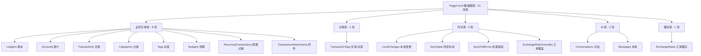
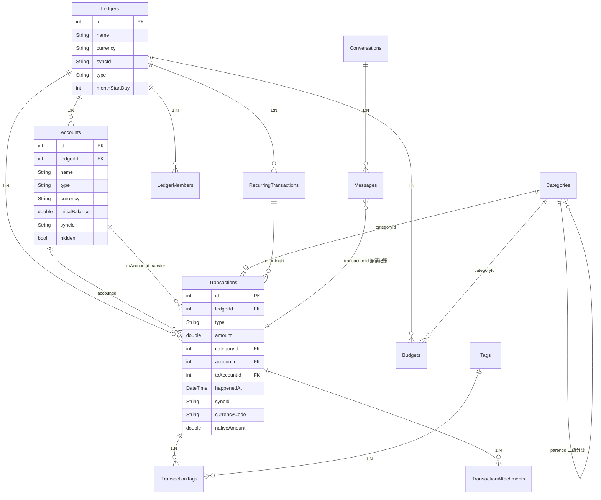
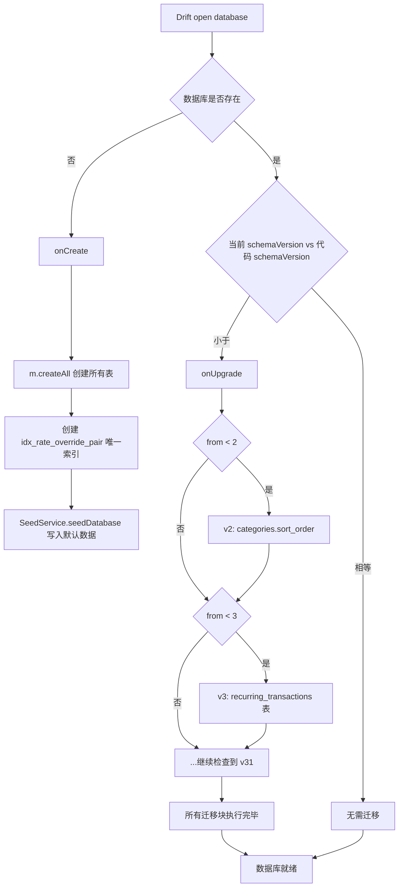
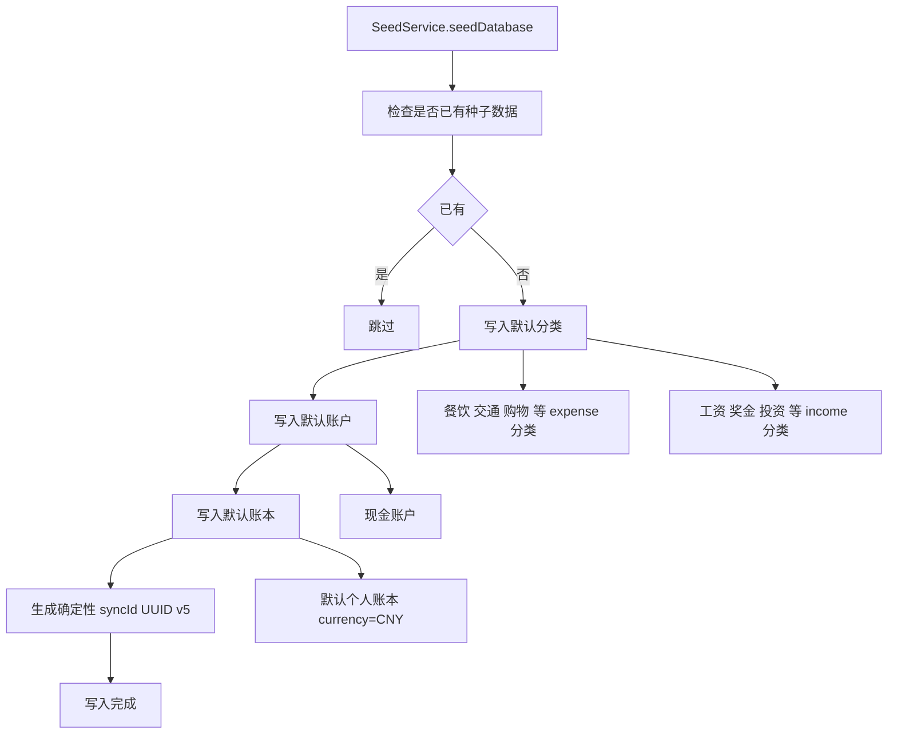
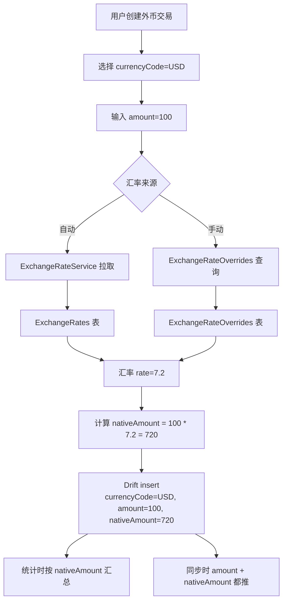

## 目录

- [1. 背景与目的](#1-背景与目的)
- [2. 核心概念](#2-核心概念)
- [3. 详细设计](#3-详细设计)
- [4. 关键流程](#4-关键流程)
- [5. 设计决策记录](#5-设计决策记录)
- [6. 注意事项与约束](#6-注意事项与约束)
- [7. 信息缺口](#7-信息缺口)
- [8. 相关文档](#8-相关文档)

---

## 1. 背景与目的

### 1.1 为什么单独写数据模型文档

PiggyCount 的数据模型是整个应用的基石,涉及:

- Drift 表(业务实体 + 关联表 + 同步表 + AI 表 + 缓存表;数量与清单以 `lib/data/db.dart` 为准)
- 31 个 schemaVersion(从 v2 到 v31,30 段迁移块)
- 复杂的表间关系(外键、唯一约束、索引)
- 跨设备同步标识 syncId
- 多币种支持(currencyCode + nativeAmount)

新加入的贡献者面对 `lib/data/db.dart` 1300+ 行的 schema 定义,常常遇到以下困惑:

- 不知道某张表的完整字段与索引
- 不理解 syncId 与本地 id 的区别
- 不清楚多币种字段如何折算
- 不知道修改表结构时如何写迁移

本文档系统梳理 PiggyCount 的全部数据模型,让一年经验开发者能快速定位"字段在哪里、表关系是什么、迁移怎么写"。

### 1.2 与其他文档的边界

- 本文**只讲表结构与关系**,不讲 Repository 接口(Repository 见 [08 接口与数据访问设计](./08-api-and-data-access.md))
- 本文**只讲同步相关表的字段定义**,不讲同步流程(同步流程见 [06 数据同步与多设备离线机制](./06-data-sync-and-offline.md))
- 本文**只讲表归属的模块**,不讲模块职责(模块职责见 [05 核心模块详解](./05-core-modules.md))

### 1.3 信息来源

- `lib/data/db.dart` L1-1300 完整 schema 定义
- `lib/data/db.g.dart` Drift codegen 产物
- `lib/services/data/seed_service.dart` 种子数据
- `lib/services/data/migration_service.dart` 账户独立改造迁移
- `lib/data/repositories/` Repository 接口

---

## 2. 核心概念

### 2.1 数据模型分类总览

PiggyCount 的 21 张表可分为五大类:

上图展示了 PiggyCount 各表的分类。业务实体表是记账应用的核心;关联表实现多对多关系;同步表支撑云快照同步;AI 表存储对话历史;缓存表存汇率(可整表重建)。**共享账本镜像表(`SharedLedger*`)与 `LedgerMembers` 已随该功能整体下线,在 v50 / v51 迁移 DROP(2026-10-08),不再属于 schema** —— 表清单与数量一律以 `lib/data/db.dart` 为准。后续章节按类别详细说明每张表。

### 2.2 syncId 与本地 id 的区别

PiggyCount 的每张业务表都有两种 id:

| 字段 | 类型 | 作用域 | 用途 |
|---|---|---|---|
| `id` | `int` (autoIncrement) | 设备本地 | 本地数据库主键,设备间必然不同 |
| `syncId` | `String` (UUID) | 跨设备 | 跨设备同步的实体匹配依据,所有设备同一实体的 syncId 相同 |

跨设备同步时,通过 syncId 匹配实体:本地不存在则 insert,存在则 update。这种设计让本地自增 id 与跨设备匹配解耦。

### 2.3 schemaVersion 与迁移

- **当前 schemaVersion**:`31`(`lib/data/db.dart` L445)
- **迁移策略**:`MigrationStrategy`(`db.dart` L448-1167)采用 `if (from < N)` 顺序升级模式
- **onUpgrade**:从 v2 到 v31 共 30 段迁移块,逐版本执行
- **onCreate**:`m.createAll()` + 创建 `idx_rate_override_pair` 唯一索引
- **幂等性保障**:`_addColumnIfMissing(table, column, ddl)`(PRAGMA 检查列是否存在)、`_createTableIfMissing(m, tableName, table)`(检查 `sqlite_master`)

---

## 3. 详细设计

### 3.1 业务实体表

#### 3.1.1 Ledgers(账本)

| 字段 | 类型 | 可空 | 默认值 | 说明 | 引入版本 |
|---|---|---|---|---|---|
| `id` | int | 否 | autoIncrement | 主键 | v1 |
| `name` | String | 否 | — | 账本名称 | v1 |
| `currency` | String | 否 | `'CNY'` | 基础币种 | v1 |
| `syncId` | String | 否 | UUID | 跨设备同步标识 | v15 / v20 |
| `type` | String | 否 | `'personal'` | `'personal'` / `'shared'` | v9 |
| `monthStartDay` | int | 否 | `1` | 自定义每月起始日(1-28) | v27 |

**索引**:无显式索引,`syncId` 通过查询使用。

#### 3.1.2 Accounts(账户)

| 字段 | 类型 | 可空 | 默认值 | 说明 | 引入版本 |
|---|---|---|---|---|---|
| `id` | int | 否 | autoIncrement | 主键 | v1 |
| `ledgerId` | int | 否 | — | 所属账本 id(外键) | v1 |
| `name` | String | 否 | — | 账户名称 | v1 |
| `type` | String | 否 | `'cash'` | 账户类型(cash/bank_card/credit_card/alipay/wechat/investment/asset/liability) | v1 |
| `currency` | String | 否 | `'CNY'` | 账户币种 | v5 |
| `initialBalance` | double | 否 | `0` | 初始余额 | v4 |
| `sortOrder` | int | 否 | `0` | 排序 | v16 |
| `syncId` | String | 否 | UUID | 跨设备同步标识 | v19 |
| `creditLimit` | double? | 是 | null | 信用卡额度 | v17 |
| `billingDay` | int? | 是 | null | 账单日(1-28) | v17 |
| `paymentDueDay` | int? | 是 | null | 还款日(1-28) | v17 |
| `bankName` | String? | 是 | null | 银行名称 | v18 |
| `cardLastFour` | String? | 是 | null | 卡号后四位 | v18 |
| `note` | String? | 是 | null | 备注 | v18 |
| `hidden` | bool | 否 | `false` | 是否隐藏(仍计余额) | v31 |
| `createdAt` | DateTime | 否 | now | 创建时间 | v5 |
| `updatedAt` | DateTime | 否 | now | 更新时间 | v5 |

**索引**:无显式索引。

#### 3.1.3 Transactions(交易)

| 字段 | 类型 | 可空 | 默认值 | 说明 | 引入版本 |
|---|---|---|---|---|---|
| `id` | int | 否 | autoIncrement | 主键 | v1 |
| `ledgerId` | int | 否 | — | 所属账本 id | v1 |
| `type` | String | 否 | — | `'expense'` / `'income'` / `'transfer'` | v1 |
| `amount` | double | 否 | — | 金额(原币种) | v1 |
| `categoryId` | int? | 是 | null | 分类 id(expense/income 必填) | v1 |
| `accountId` | int | 否 | — | 账户 id | v1 |
| `toAccountId` | int? | 是 | null | 转入账户 id(transfer 必填) | v1 |
| `happenedAt` | DateTime | 否 | now | 发生时间 | v1 |
| `note` | String? | 是 | null | 备注 | v1 |
| `recurringId` | int? | 是 | null | 周期记账规则 id | v3 |
| `excludeFromStats` | bool | 否 | `false` | 不计入统计 | v25 |
| `excludeFromBudget` | bool | 否 | `false` | 不计入预算 | v25 |
| `syncId` | String | 否 | UUID | 跨设备同步标识 | v15 |
| `createdByUserId` | String? | 是 | null | 创建者 userId(本地专有列,不进快照) | v24 |
| `lastEditedByUserId` | String? | 是 | null | 最后编辑者 userId(本地专有列,不进快照) | v24 |
| `currencyCode` | String? | 是 | null | 交易币种(多币种) | v30 |
| `nativeAmount` | double? | 是 | null | 折算到账本基础币种的金额 | v30 |

**索引**:`syncId` 索引(v15)。

#### 3.1.4 Categories(分类)

| 字段 | 类型 | 可空 | 默认值 | 说明 | 引入版本 |
|---|---|---|---|---|---|
| `id` | int | 否 | autoIncrement | 主键 | v1 |
| `name` | String | 否 | — | 分类名称 | v1 |
| `kind` | String | 否 | — | `'expense'` / `'income'` | v1 |
| `icon` | String | 否 | `'category'` | Material Icon name | v1 |
| `sortOrder` | int | 否 | `0` | 排序 | v2 |
| `parentId` | int? | 是 | null | 父分类 id(二级分类) | v6 |
| `level` | int | 否 | `1` | 层级(1=顶级,2=二级) | v6 |
| `syncId` | String | 否 | UUID | 跨设备同步标识 | v19 |
| `iconType` | String | 否 | `'material'` | `'material'` / `'custom'` / `'community'` | v13 |
| `customIconPath` | String? | 是 | null | 自定义图标本地路径 | v13 |
| `communityIconId` | String? | 是 | null | 社区图标 id | v13 |

#### 3.1.5 Tags(标签)

| 字段 | 类型 | 可空 | 默认值 | 说明 | 引入版本 |
|---|---|---|---|---|---|
| `id` | int | 否 | autoIncrement | 主键 | v10 |
| `name` | String | 否 | — | 标签名称 | v10 |
| `color` | int? | 是 | null | 颜色(ARGB) | v10 |
| `sortOrder` | int | 否 | `0` | 排序 | v10 |
| `syncId` | String | 否 | UUID | 跨设备同步标识 | v19 |
| `createdAt` | DateTime | 否 | now | 创建时间 | v10 |

#### 3.1.6 Budgets(预算)

| 字段 | 类型 | 可空 | 默认值 | 说明 | 引入版本 |
|---|---|---|---|---|---|
| `id` | int | 否 | autoIncrement | 主键 | v11 |
| `ledgerId` | int | 否 | — | 所属账本 id | v11 |
| `type` | String | 否 | — | `'total'` / `'category'` | v11 |
| `categoryId` | int? | 是 | null | 分类 id(type=category 必填) | v11 |
| `amount` | double | 否 | — | 预算金额 | v11 |
| `period` | String | 否 | `'monthly'` | `'monthly'` / `'weekly'` / `'yearly'` | v11 |
| `startDay` | int | 否 | `1` | 起始日 | v11 |
| `enabled` | bool | 否 | `true` | 是否启用 | v11 |
| `syncId` | String | 否 | UUID | 跨设备同步标识 | v22 |

#### 3.1.7 RecurringTransactions(周期记账)

| 字段 | 类型 | 可空 | 默认值 | 说明 | 引入版本 |
|---|---|---|---|---|---|
| `id` | int | 否 | autoIncrement | 主键 | v3 |
| `ledgerId` | int | 否 | — | 所属账本 id | v3 |
| `type` | String | 否 | — | `'expense'` / `'income'` / `'transfer'` | v3 |
| `amount` | double | 否 | — | 金额 | v3 |
| `frequency` | String | 否 | — | `'daily'` / `'weekly'` / `'monthly'` / `'yearly'` | v3 |
| `interval` | int | 否 | `1` | 间隔(每 N 个频率) | v3 |
| `dayOfMonth` | int? | 是 | null | 每月第几天 | v3 |
| `dayOfWeek` | int? | 是 | null | 每周第几天 | v3 |
| `monthOfYear` | int? | 是 | null | 每年第几月 | v3 |
| `startDate` | DateTime | 否 | — | 开始日期 | v3 |
| `endDate` | DateTime? | 是 | null | 结束日期 | v3 |
| `lastGeneratedDate` | DateTime? | 是 | null | 上次生成日期 | v3 |
| `enabled` | bool | 否 | `true` | 是否启用 | v3 |

**注意**:RecurringTransactions **不进同步**,本地独立生成。`syncId` 字段不存在。

#### 3.1.8 TransactionAttachments(附件)

| 字段 | 类型 | 可空 | 默认值 | 说明 | 引入版本 |
|---|---|---|---|---|---|
| `id` | int | 否 | autoIncrement | 主键 | v12 |
| `transactionId` | int | 否 | — | 所属交易 id | v12 |
| `fileName` | String | 否 | — | 存储文件名 | v12 |
| `originalName` | String | 否 | — | 原始文件名 | v12 |
| `fileSize` | int | 否 | `0` | 文件大小(字节) | v12 |
| `width` | int? | 是 | null | 图片宽度 | v12 |
| `height` | int? | 是 | null | 图片高度 | v12 |
| `sortOrder` | int | 否 | `0` | 排序 | v12 |
| `cloudFileId` | String? | 是 | null | 云端文件 id | v12 |
| `cloudSha256` | String? | 是 | null | 云端 sha256(去重) | v12 |

### 3.2 关联表

#### 3.2.1 TransactionTags(交易-标签)

| 字段 | 类型 | 可空 | 说明 |
|---|---|---|---|
| `transactionId` | int | 否 | 交易 id(外键) |
| `tagId` | int | 否 | 标签 id(外键) |

**主键**:复合主键 `(transactionId, tagId)`。
**索引**:v10 创建索引。

#### 3.2.2 TransactionTagOverrides——已移除(2026-10-08)

> 该表随共享账本整体下线在 **v51** 迁移 DROP。标签关联现只走 `TransactionTags`
> 主表(快照契约键 `tagSyncIds` 即来自它);同批 DROP 的还有 `transactions` 上的
> `category_sync_id_override / account_sync_id_override /
> to_account_sync_id_override / tag_sync_ids_override` 四个 override 列。

### 3.3 同步表

#### 3.3.1 LocalChanges(本地变更)

| 字段 | 类型 | 可空 | 默认值 | 说明 |
|---|---|---|---|---|
| `id` | int | 否 | autoIncrement | 主键 |
| `entityType` | String | 否 | — | `transaction` / `account` / `category` / `tag` / `budget` / `ledger` / `ledger_snapshot` / `exchange_rate_override` |
| `entityId` | int | 否 | — | 本地 int id |
| `entitySyncId` | String | 否 | — | 跨设备 UUID |
| `ledgerId` | int | 否 | — | **0 = user-global;>0 = ledger-scoped** |
| `action` | String | 否 | — | `create` / `update` / `delete` |
| `payloadJson` | String? | 是 | null | 可选,push 时从 DB 重读最新数据序列化 |
| `pushedAt` | DateTime? | 是 | null | null = 未推;非 null = 已推 |
| `createdAt` | DateTime | 否 | now | 创建时间(用于 LWW) |

#### 3.3.2 SyncState(同步状态)

| 字段 | 类型 | 可空 | 说明 |
|---|---|---|---|
| `id` | int | 否 | autoIncrement 主键 |
| `deviceId` | String | 否 | 设备 id |
| `providerType` | String | 否 | provider 类型 |
| `serverCursor` | int | 否 | 增量拉取游标 |
| `lastPushAt` | DateTime? | 是 | 上次推送时间 |
| `lastPullAt` | DateTime? | 是 | 上次拉取时间 |

#### 3.3.3 SyncPullErrors(同步拉取错误,v29)

| 字段 | 类型 | 可空 | 说明 |
|---|---|---|---|
| `id` | int | 否 | autoIncrement 主键 |
| `changeId` | int | 否 | server 端 change_id(unique) |
| `ledgerExternalId` | String? | 是 | 账本 external id |
| `entityType` | String | 否 | 实体类型 |
| `entitySyncId` | String | 否 | 实体 syncId |
| `action` | String | 否 | upsert / delete |
| `rawChangeJson` | String | 否 | 原始 change JSON |
| `errorClass` | String | 否 | 错误类名 |
| `errorMessage` | String | 否 | 错误信息 |
| `stackTrace` | String? | 是 | 堆栈 |
| `attemptCount` | int | 否 | 尝试次数 |
| `userAction` | String? | 是 | 用户操作(预留,目前只读) |
| `resolvedAt` | DateTime? | 是 | 解决时间 |

#### 3.3.4 ExchangeRateOverrides(汇率覆盖,user-global 同步)

| 字段 | 类型 | 可空 | 说明 |
|---|---|---|---|
| `id` | int | 否 | autoIncrement 主键 |
| `baseCurrency` | String | 否 | 基础币种 |
| `quoteCurrency` | String | 否 | 报价币种 |
| `rate` | double | 否 | 汇率 |
| `syncId` | String | 否 | UUID |
| `updatedAt` | DateTime | 否 | 更新时间 |

**唯一索引**:`idx_rate_override_pair` on `(baseCurrency, quoteCurrency)`(v28)。按币对收敛,不按 syncId。

### 3.4 共享账本镜像表——已移除(2026-10-08)

> 本节原列的 4 张表(`SharedLedgerCategories` / `SharedLedgerAccounts` /
> `SharedLedgerTags` / `LedgerMembers`)已随共享账本整体下线删除:
> `LedgerMembers` 在 **v50** 迁移 DROP,其余三张在 **v51** 迁移 DROP。
> 同批 DROP 的还有 `transaction_tag_overrides` 表、`ledgers` 的
> `is_shared / my_role / member_count / owner_user_id` 四列、`transactions` 的
> 四个 override 列。当前 schema 以 `lib/data/db.dart` 为准。

### 3.5 AI 表

#### 3.5.1 Conversations(对话,v8)

| 字段 | 类型 | 可空 | 说明 |
|---|---|---|---|
| `id` | int | 否 | autoIncrement 主键 |
| `ledgerId` | int? | 是 | 已弃用(对话改全局) |
| `title` | String | 否 | 对话标题 |
| `createdAt` | DateTime | 否 | 创建时间 |
| `updatedAt` | DateTime | 否 | 更新时间 |

#### 3.5.2 Messages(消息,v8)

| 字段 | 类型 | 可空 | 说明 |
|---|---|---|---|
| `id` | int | 否 | autoIncrement 主键 |
| `conversationId` | int | 否 | 所属对话 id |
| `role` | String | 否 | `user` / `assistant` |
| `content` | String | 否 | 内容 |
| `messageType` | String | 否 | `text` / `bill_card` |
| `metadata` | String? | 是 | JSON 元数据 |
| `transactionId` | int? | 是 | 关联交易 id(用于撤销记账) |
| `createdAt` | DateTime | 否 | 创建时间 |

### 3.6 缓存表

#### 3.6.1 ExchangeRates(汇率缓存,不进同步)

| 字段 | 类型 | 可空 | 说明 |
|---|---|---|---|
| `baseCurrency` | String | 否 | 基础币种 |
| `quoteCurrency` | String | 否 | 报价币种 |
| `rateDate` | DateTime | 否 | 汇率日期 |
| `rate` | double | 否 | 汇率 |
| `source` | String | 否 | 数据源 |
| `fetchedAt` | DateTime | 否 | 拉取时间 |

**特点**:append-only,可整表重建,不进同步。

### 3.7 ER 图

上图展示了 PiggyCount 核心业务表的 ER 关系。Ledgers 是顶层容器,与 Accounts / Transactions / Budgets / RecurringTransactions / LedgerMembers 形成 1:N 关系。Transactions 通过 accountId / toAccountId / categoryId / recurringId 与多表关联。Categories 自关联实现二级分类(parentId)。Transactions 与 Tags 通过 TransactionTags 关联表实现多对多。Conversations 与 Messages 是 AI 对话的 1:N 关系,Messages 通过 transactionId 关联已创建的交易(用于撤销记账)。

---

## 4. 关键流程

### 4.1 数据库迁移流程

上图展示了数据库迁移流程。首次安装时走 `onCreate`,创建所有表 + 唯一索引 + 种子数据。已安装用户升级时走 `onUpgrade`,按 `if (from < N)` 顺序执行 v2 到 v31 的迁移块。每个迁移块用 `_addColumnIfMissing` / `_createTableIfMissing` 保证幂等性,避免 partial state 重跑时报 duplicate column / table already exists。

依据:`lib/data/db.dart` L448-1167 `MigrationStrategy`。

### 4.2 种子数据写入流程

上图展示了种子数据写入流程。首次安装时,SeedService 检查是否已有种子数据,若无则写入默认分类(餐饮、交通、购物等 expense + 工资、奖金等 income)、默认账户(现金)、默认账本(CNY)。所有种子实体使用 UUID v5 确定性生成 syncId(基于固定命名空间 + 实体名),保证不同设备首次安装时种子数据的 syncId 一致,避免同步时产生重复。

依据:`lib/services/data/seed_service.dart`、`_seedSyncNamespace` 常量。

### 4.3 多币种字段折算流程

上图展示了多币种字段的折算流程(v30)。交易有 `amount`(原币种金额)和 `nativeAmount`(折算到账本基础币种的金额)两个字段。统计时按 `nativeAmount` 汇总,保证不同币种的交易可加总。同步时两个字段都推送,远端 apply 时若缺 `nativeAmount` 键,按 `amount` 是否变化决定保留本地或退化(1:1,L11 横幅可捞回)。

依据:`lib/data/db.dart` L148、L153、`lib/cloud/sync/sync_engine_apply.dart` `_applyTransactionChange:221`。

---

## 5. 设计决策记录

### 决策 1:syncId 用 UUID 而非自增 id

- **决策内容**:所有需要同步的业务表都有 `syncId` 字段(UUID),作为跨设备实体匹配的依据。
- **原因**:
  - **跨设备唯一**:本地自增 id 设备间必然不同,无法匹配
  - **离线生成**:UUID 可在离线时生成,无需服务端分配
  - **确定性种子**:种子数据用 UUID v5(基于命名空间 + 实体名),保证不同设备首次安装时 syncId 一致
- **备选方案**:
  - 服务端分配 id:需在线,离线不可用
  - 自增 id + 设备前缀:可读性差,仍可能冲突
- **最终取舍**:UUID,种子数据用 v5,运行时用 v4。
- **依据**:`lib/data/db.dart` L28、L59、L106 等 syncId 字段、`lib/services/data/seed_service.dart`。

### 决策 2:迁移用 if (from < N) 顺序升级

- **决策内容**:`MigrationStrategy.onUpgrade` 采用 `if (from < N)` 顺序升级模式,从 v2 到 v31 共 30 段迁移块。
- **原因**:
  - **顺序升级**:支持跨版本升级(如 v5 → v31 会依次执行 v6/v7/.../v31 所有迁移块)
  - **代码可读**:每段迁移块独立,便于维护
  - **幂等性保障**:`_addColumnIfMissing` / `_createTableIfMissing` 检查列/表是否存在,避免 partial state 重跑时报错
- **备选方案**:
  - 一次性迁移(从 N 跳到最新):跨版本升级时需写大量条件分支
  - Drift migrate_utils:第三方包,增加依赖
- **最终取舍**:if (from < N) 顺序升级 + 幂等性保障。
- **依据**:`lib/data/db.dart` L448-1167。

### 决策 3:LocalChanges 表 ledgerId 双语义

- **决策内容**:`local_changes.ledger_id` 有两种语义:0 = user-global(影响所有账本),>0 = ledger-scoped(影响单账本)。
- **原因**:
  - **复用表结构**:无需为 user-global 单独建表
  - **查询统一**:`getUnpushedChangesForLedger(0)` 查 user-global,`getUnpushedChangesForLedger(ledgerId)` 查 ledger-scoped
  - **推送分流**:push 时根据 ledgerId 决定 pushScope(user / ledger)
- **备选方案**:
  - 两张表(user_global_changes + ledger_changes):结构重复
  - 加 scope 字段:语义重复(ledgerId=0 已表达 user-global)
- **最终取舍**:单表 + ledgerId 双语义,用 assert 强制契约。
- **依据**:`lib/cloud/sync/change_tracker.dart` L29。

### 决策 4:ExchangeRateOverrides 按币对收敛

- **决策内容**:汇率覆盖表按 `(baseCurrency, quoteCurrency)` 唯一索引,而非按 syncId 匹配。
- **原因**:
  - **双端离线场景**:A 设备和B设备离线时各建同币对的覆盖,会产生两个 syncId
  - **自动合并**:按币对 upsert + 吸收来包 syncId/updatedAt,实现自动合并
  - **依赖 pull 顺序**:pull 的 change_id 递增顺序实现 LWW
- **备选方案**:
  - 按 syncId 匹配:双端离线各建会产生两条记录,永不合并
  - 让用户手动合并:体验差
- **最终取舍**:按币对收敛,自动合并双端离线创建。
- **依据**:`lib/data/db.dart` `idx_rate_override_pair` 唯一索引(v28)、`lib/cloud/sync/sync_engine_apply.dart` `_applyExchangeRateOverrideChange`。

### 决策 5:RecurringTransactions 不进同步

- **决策内容**:周期记账规则(RecurringTransactions)不进同步,本地独立生成。
- **原因**:
  - **设备独立**:周期记账是设备本地的提醒规则,各设备独立配置
  - **避免重复生成**:如果同步,多设备会同时生成交易,产生重复
  - **lastGeneratedDate 本地化**:每设备的生成进度独立,不应跨设备同步
- **备选方案**:
  - 同步规则 + 不同步 lastGeneratedDate:复杂,且仍有重复生成风险
  - 同步全部:重复生成问题严重
- **最终取舍**:不同步,各设备独立管理周期记账规则。
- **依据**:`lib/data/db.dart` L156 `RecurringTransactions` 表无 syncId 字段。

### 决策 6:共享账本用镜像表而非主表(已作废,2026-10-08)

> 该决策随共享账本整体下线作废:三张镜像表与 `*SyncIdOverride` 列已在
> **v51** 迁移 DROP(`lib/data/db.dart`)。标题保留仅为决策编号连续。

---

## 6. 注意事项与约束

### 6.1 表结构修改约束

| 约束 | 说明 |
|---|---|
| 新增字段必须可空或有默认值 | 避免迁移时旧数据报错 |
| 新增字段必须写迁移块 | 在 `onUpgrade` 中添加 `if (from < N)` 块 |
| 迁移块必须幂等 | 用 `_addColumnIfMissing` / `_createTableIfMissing` 检查 |
| schemaVersion 必须递增 | 不能跳过版本号 |
| 修改字段类型需重建表 | SQLite 不支持 ALTER COLUMN,需 `CREATE TABLE new / COPY / DROP / RENAME` |

### 6.2 同步字段约束

| 字段 | 约束 |
|---|---|
| `syncId` | 所有需要同步的表必须有,UUID 格式 |
| `ledgerId` (LocalChanges) | 0 = user-global,>0 = ledger-scoped |
| `excludeFromStats` / `excludeFromBudget` | 字段级合并,缺键保留本地 |
| `currencyCode` / `nativeAmount` | v30 多币种,缺键时快照保护 |

### 6.3 索引约束

| 索引 | 用途 |
|---|---|
| `idx_rate_override_pair` | `(baseCurrency, quoteCurrency)` 唯一索引,按币对收敛 |
| Transactions `syncId` 索引 | 跨设备同步时反查 |
| `TransactionTags` 索引 | 多对多关联查询 |

### 6.4 测试约束

- 测试用 `BeeDatabase.forTesting(NativeDatabase.memory())` 注入内存库
- `test/data/migration_v30_test.dart` 验证 v30 多币种回填 SQL 语义
- `test/data/exchange_rate_schema_test.dart` 验证汇率表 schema
- `test/data/sync_pull_errors_schema_test.dart` 验证拉取错误表 schema
- 其他 29 段迁移块**无独立回归测试**,见 [10 测试策略](./10-testing-strategy.md) 与 [16 已知问题](./16-known-issues.md)

---

## 7. 信息缺口

| 编号 | 缺口描述 | 影响章节 | 建议补充方式 |
|---|---|---|---|
| 1 | `AccountMigrationService` v1.15.0 账户独立改造的 backup/createTable/migrateData/rollback 流程未完整查看 | §4.1 | 阅读 `lib/services/data/migration_service.dart` 完整实现 |
| 2 | `SeedService.seedDatabase` 完整入口实现未读全,默认分类清单、UUID v5 命名空间规则未完整核对 | §4.2 | 阅读 `lib/services/data/seed_service.dart` 完整实现 |
| 3 | 部分表的完整字段清单基于代码注释和迁移块推断,可能与实际 Drift codegen 产物有细微差异 | §3 | 对照 `lib/data/db.g.dart` 补充 |
| 4 | 索引完整清单未整理(除 `idx_rate_override_pair` 和 Transactions syncId 外) | §6.3 | grep `customConstraints` / `customConstraints` 补充 |
| 5 | v25、v26 等 schemaVersion 迁移块的具体内容未在本文档展开 | §4.1 | 阅读 `db.dart` 对应迁移块 |
| 6 | v9 `Ledgers.type` 字段从 personal 扩展到 shared 的具体迁移逻辑未展开 | §3.1.1 | 阅读 `db.dart` v9 迁移块 |

---

## 8. 相关文档

- [01 项目全览](./01-project-overview.md) — 项目整体定位
- [02 术语表](./02-glossary.md) — 数据模型术语统一
- [04 系统架构设计](./04-system-architecture.md) — 数据层在架构中的位置
- [05 核心模块详解](./05-core-modules.md) — 各模块的数据模型使用
- [06 数据同步与多设备离线机制](./06-data-sync-and-offline.md) — 同步相关表的使用
- [08 接口与数据访问设计](./08-api-and-data-access.md) — Repository 如何访问这些表
- [10 测试策略](./10-testing-strategy.md) — 数据模型测试
- [16 已知问题与技术债务](./16-known-issues.md) — 迁移块无回归测试
- [INDEX](./INDEX.md) — 完整文档索引
