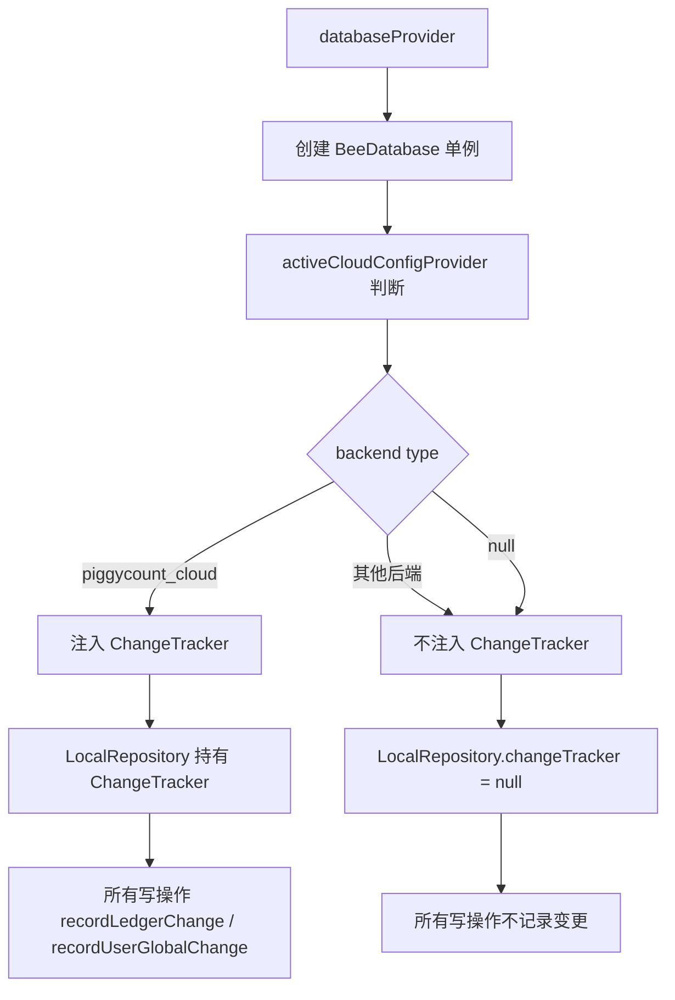
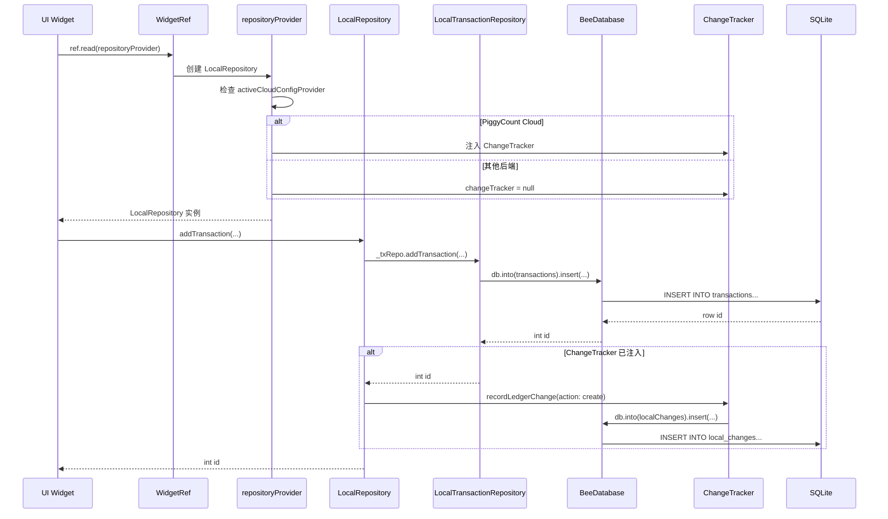
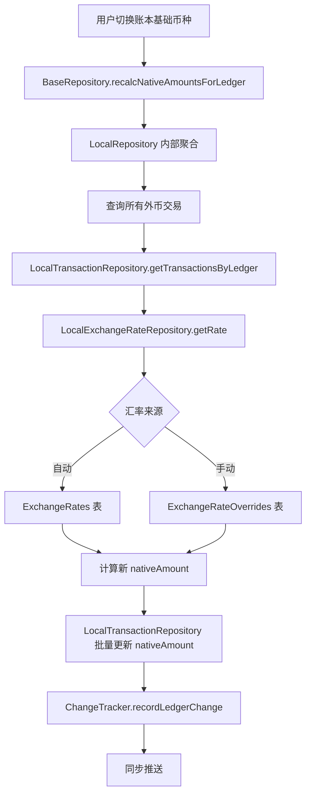
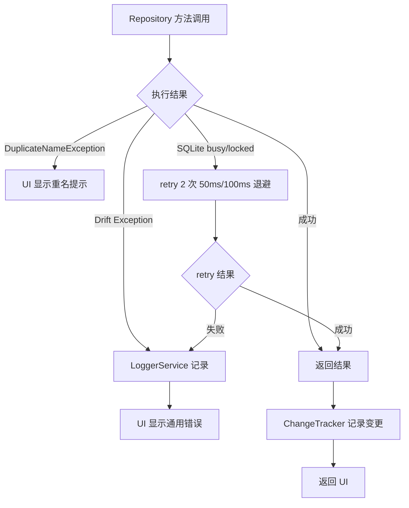

## 目录

- [1. 背景与目的](#1-背景与目的)
- [2. 核心概念](#2-核心概念)
- [3. 详细设计](#3-详细设计)
- [4. 关键流程](#4-关键流程)
- [5. 设计决策记录](#5-设计决策记录)
- [6. 注意事项与约束](#6-注意事项与约束)
- [7. 信息缺口](#7-信息缺口)
- [8. 相关文档](#8-相关文档)

---

## 1. 背景与目的

### 1.1 为什么单独写接口与数据访问文档

PiggyCount 的数据访问采用 Repository 三层架构,涉及:

- 11 个抽象接口(`lib/data/repositories/*.dart`)
- 11 个本地实现(`lib/data/repositories/local/local_*.dart`)
- 1 个聚合委托层(`local_repository.dart`,2807 行)
- PiggyCount Cloud HTTP API(基于 client 反推 server)
- Dart 方法签名、Repository 接口、异常体系

新加入的贡献者面对 23 个 Repository 文件,常常遇到以下困惑:

- 不知道一个数据操作应该调用哪个 Repository 方法
- 不清楚 BaseRepository 与子 Repository 的委托关系
- 不理解 ChangeTracker 如何注入到 Repository
- 不知道 PiggyCount Cloud 的 HTTP API 长什么样
- 不清楚异常类型与返回值语义

本文档系统梳理 PiggyCount 的接口与数据访问设计,让一年经验开发者能快速定位"方法在哪里、API 是什么、异常怎么处理"。

### 1.2 与其他文档的边界

- 本文**只讲接口设计**,不讲表结构(表结构见 [07 数据模型设计](./07-data-model.md))
- 本文**只讲 Repository 内部接口**,不讲同步引擎内部接口(同步引擎见 [06 数据同步与多设备离线机制](./06-data-sync-and-offline.md))
- 本文**只讲模块接口的位置**,不讲模块职责(模块职责见 [05 核心模块详解](./05-core-modules.md))

### 1.3 信息来源

- `lib/data/repositories/` 全部接口与实现文件
- `lib/data/repositories/local/local_repository.dart` 聚合层(2807 行)
- `lib/data/repositories/base_repository.dart` 聚合抽象基类
- `packages/flutter_cloud_sync/lib/src/providers/piggycount_cloud_provider.dart` HTTP API
- `lib/data/repositories/exceptions.dart` 异常体系

### 1.4 项目无 HTTP API 的说明

PiggyCount 客户端**本身不对外暴露 HTTP API**,所有数据访问通过 Repository 内部接口。但 PiggyCount Cloud 同步需要调用 server 端 HTTP API,server 端代码不在本仓库(独立仓库 `PiggyCount-Cloud`)。本文档基于 client 调用反推 server API,标注 `[推断: 基于 client provider 调用反推 server API]`。

---

## 2. 核心概念

### 2.1 Repository 三层架构

PiggyCount 的数据访问采用三层架构:

```mermaid
flowchart TD
    subgraph L1[抽象接口层]
        BASE[BaseRepository 抽象基类<br/>implements 11 个接口]
        I1[LedgerRepository]
        I2[TransactionRepository]
        I3[AccountRepository]
        I4[CategoryRepository]
        I5[TagRepository]
        I6[BudgetRepository]
        I7[StatisticsRepository]
        I8[RecurringTransactionRepository]
        I9[AIRepository]
        I10[AttachmentRepository]
        I11[ExchangeRateRepository]
    end

    subgraph L2[本地实现层]
        LOCAL[LocalRepository 聚合委托层 2807 行]
        L1[LocalLedgerRepository]
        L2[LocalTransactionRepository]
        L3[LocalAccountRepository]
        L4[LocalCategoryRepository]
        L5[LocalTagRepository]
        L6[LocalBudgetRepository]
        L7[LocalStatisticsRepository]
        L8[LocalRecurringTransactionRepository]
        L9[LocalAIRepository]
        L10[LocalAttachmentRepository]
        L11[LocalExchangeRateRepository]
    end

    subgraph L3[数据层]
        DRIFT[Drift ORM]
        SQLITE[(SQLite)]
    end

    BASE <|-- LOCAL
    BASE ..> I1
    BASE ..> I2
    LOCAL --> L1
    LOCAL --> L2
    LOCAL --> L3
    LOCAL --> L11
    L1 --> DRIFT
    L2 --> DRIFT
    L11 --> DRIFT
    DRIFT --> SQLITE
```

上图展示了 Repository 的三层架构。L1 抽象接口层定义 11 个纯接口,`BaseRepository` 是聚合抽象基类(implements 11 个接口);L2 本地实现层基于 Drift 实现具体 SQL,`LocalRepository` 是聚合委托层,内部持有 11 个子 Repository,通过委托模式转发调用;L3 数据层是 Drift ORM 与 SQLite。这种设计让 UI 只与 `BaseRepository` 抽象交互,不感知具体实现,且每个子 Repository 职责单一,便于测试。

依据:`lib/data/repositories/base_repository.dart`、`lib/data/repositories/local/local_repository.dart`。

### 2.2 BaseRepository 聚合抽象基类

`BaseRepository` 使用 `implements` 组合 11 个接口:

| 接口 | 职责 |
|---|---|
| `LedgerRepository` | 账本 CRUD + 统计 |
| `TransactionRepository` | 交易 CRUD + 批量 + 查询(约 30 个方法) |
| `AccountRepository` | 账户 CRUD + 余额统计 + 净资产(约 30 个方法) |
| `CategoryRepository` | 分类 CRUD + 二级 + 图标(约 25 个方法) |
| `TagRepository` | 标签 CRUD + 关联(约 20 个方法) |
| `BudgetRepository` | 预算 CRUD + 使用统计 |
| `StatisticsRepository` | 统计查询 |
| `RecurringTransactionRepository` | 周期记账 CRUD |
| `AIRepository` | AI 对话 CRUD |
| `AttachmentRepository` | 附件 CRUD + cloud ref |
| `ExchangeRateRepository` | 汇率 upsert + 查询 + override |

额外声明 5 个 v30 多币种聚合方法(因需同时访问交易表与汇率表):

- `recalcNativeAmountsForLedger(int ledgerId, String newBase)` — 全量重算
- `recomputeForeignTxForLedger(int ledgerId)` — 补折算未折算外币
- `countUnconvertedForeignTx(int ledgerId)` — 检测未折算条数
- `countForeignCurrencyTx(int ledgerId)` — 外币交易总数
- `getLedgerForeignCurrencies(int ledgerId)` — 外币集合

### 2.3 ChangeTracker 注入策略



上图展示了 ChangeTracker 的注入策略。`databaseProvider` 中根据 `activeCloudConfigProvider` 判断:仅 PiggyCount Cloud 后端激活时注入 ChangeTracker,走增量同步路径;其他后端不注入,走快照备份路径。`LocalExchangeRateRepository` 通过 `trackerGetter` 闭包注入 tracker,规避 `LocalRepository.changeTracker` 可变字段的时序问题。

依据:`lib/providers/database_providers.dart` `databaseProvider`、`repositoryProvider`。

---

## 3. 详细设计

### 3.1 抽象接口层

#### 3.1.1 LedgerRepository

```dart
abstract class LedgerRepository {
  Stream<List<Ledger>> watchLedgers();
  Stream<Ledger?> watchLedger(int id);
  Future<List<Ledger>> getAllLedgers();
  Future<Ledger?> getLedgerById(int id);
  Future<int> getLedgerCount();
  Future<int> ledgerCount();
  Future<({int dayCount, int txCount})> getCountsForLedger({required int ledgerId});
  Future<({int dayCount, int txCount})> getCountsAll();
  Future<({double balance, int transactionCount})> getLedgerStats({
    required int ledgerId,
    bool accountFeatureEnabled,
    List<Transaction>? transactions,
  });
  Future<int> createLedger({required String name, String currency = 'CNY'});
  Future<void> updateLedgerName({required int id, required String name});
  Future<void> updateLedger({required int id, String? name, String? currency, int? monthStartDay});
  Future<void> deleteLedger(int id);
  Future<int> getMaxLedgerId();
  Future<int> getNextFreeLedgerId();
  Future<void> clearLedgerTransactions(int ledgerId);
  Future<void> reassignLedgerId({required int fromId, required int toId});
  Future<double> getTotalInitialBalance(int ledgerId);
}
```

#### 3.1.2 TransactionRepository(约 30 个方法,核心)

```dart
abstract class TransactionRepository {
  // Watch 系列(响应式)
  Stream<List<Transaction>> watchRecentTransactions({...});
  Stream<List<Transaction>> watchTransactionsInMonth({...});
  Stream<List<TransactionWithCategory>> watchTransactionsWithCategoryAll({...});
  Stream<List<TransactionWithCategory>> transactionsWithCategoryAll({...});
  Stream<List<TransactionWithCategory>> watchTransactionsWithCategoryInMonth({...});
  Stream<List<TransactionWithCategory>> watchTransactionsWithCategoryInYear({...});
  Stream<List<Transaction>> watchTransactionsForCategoryInRange({...});

  // CRUD
  Future<int> addTransaction({...});  // 支持 categorySyncIdOverride 共享账本、currencyCode/nativeAmount 多币种
  Future<void> updateTransaction({...});
  Future<void> deleteTransaction(int id);
  Future<Transaction?> getTransactionById(int id);
  Future<Transaction?> getTransactionBySyncId(String syncId);

  // 批量
  Future<List<int>> insertTransactionsBatch({...});
  Future<int> insertTransactionCompanion(TransactionsCompanion companion);
  Future<void> insertTransactionsBatchWithRelations({...});  // 单事务 + tag/attachment 关联
  Future<void> updateTransactionsBatchBySyncId({...});
  Future<void> deleteTransactionsBatchBySyncIds(List<String> syncIds);

  // 查询
  Future<List<Transaction>> getTransactionsByLedger(int ledgerId);
  Future<List<Transaction>> getTransactionsByLedgerInRange({...});
  Future<int> countByTypeInRange({...});
  Future<Transaction?> getFirstTransactionByLedger(int ledgerId);
  Future<Transaction?> getLastTransactionByLedger(int ledgerId);
  Future<DateTime?> getEarliestTransactionDate(int ledgerId);

  // 字段更新
  Future<void> updateTransactionFields({...});  // 共享账本 synthetic 账户
  Future<void> updateTransactionLedger({...});
  Future<void> updateTransactionBySyncId({...});

  // 日历
  Future<Map<DateTime, double>> getDailyTotalsByMonth({...});
  Future<List<Transaction>> getTransactionsByDate({...});
  Future<List<Transaction>> getTransactionsByDateRange({...});
  Future<Set<DateTime>> getTransactionDatesByMonth({...});

  // 备注
  Future<List<NoteHistoryEntry>> getNoteHistory({...});

  // 估值
  Future<int> createAdjustmentTransaction({...});
}
```

#### 3.1.3 AccountRepository(约 30 个方法)

核心方法分类:

- **Watch**:`watchAccountsForLedger` / `watchAllAccounts` / `watchAccount` / `watchAccountTransactions`
- **CRUD**:`createAccount`(支持信用卡字段、bankName/cardLastFour)/ `upsertAccount` / `updateAccount`(含 `hidden`、`clearCreditCardFields`)/ `deleteAccount` / `setAccountHidden`
- **查询**:`getAccount` / `getAllAccounts` / `getAvailableAccountsForLedger` / `getAccountsByCurrency` / `getAccountsGroupedByCurrency` / `getAccountsByIds` / `getCreditCardAccounts`
- **余额统计**:`getAccountBalance` / `getAccountGlobalBalance` / `getAccountBalanceInLedger` / `getAllAccountBalances` / `getAccountExpense` / `getAccountIncome` / `getAccountStats` / `getAllAccountStats` / `getAllAccountsTotalStats` / `getAccountUsageInLedgers` / `getCreditCardUsedAmount` / `getTransactionCountByAccount` / `hasTransactions`
- **净值**:`getNetWorthBreakdown` / `getNetWorthBreakdownByCurrency` / `getNetWorthDailyBalances` / `getNetWorthTrendSeries`(支持多币种折算)/ `getAssetCompositionByType` / `getAssetCompositionByTypeAndCurrency`
- **账户流**:`getAccountTransactions`(分页 + flow 过滤)/ `getAccountDailyBalances` / `getAccountCategoryStats` / `updateAccountValuation`
- **批量**:`batchInsertAccounts` / `updateAccountSortOrders` / `migrateAccount` / `getUsedCurrencies`
- **共享**:`getSharedAccountBySyncId`

#### 3.1.4 CategoryRepository(约 25 个方法)

- **CRUD**:`createCategory`(支持 `level`/`parentId`/`syncId`)/ `createSubCategory` / `updateCategory` / `deleteCategory` / `deleteCategoriesByIds` / `upsertCategory` / `insertCategory` / `batchInsertCategories`
- **查询**:`getCategoryById` / `getAllCategories` / `getAllCategoriesIncludingShared` / `getTopLevelCategories` / `getSubCategories` / `getUsableCategories` / `getCategoryFullName`
- **统计**:`getTransactionCountByCategory` / `getAllCategoryTransactionCounts` / `getCategorySummary` / `hasSubCategories` / `getSubCategoryCount`
- **关联交易**:`getTransactionsByCategory` / `getTransactionsByCategoryWithSort`
- **迁移**:`migrateCategory` / `migrateCategoryTransactions` / `getCategoryMigrationInfo`
- **排序**:`updateCategorySortOrders`
- **图标**:`updateCategoryIcon`(支持 material/custom/community)/ `clearCategoryCustomIcon` / `getCustomIconPaths`
- **Watch**:`watchCategory` / `watchTransactionsByCategory` / `watchCategoryWithSubs` / `watchCategoriesWithCount`
- **重名**:`isCategoryNameDuplicate` / `getTransferCategory`(被动合并重复)

#### 3.1.5 TagRepository(约 20 个方法)

- **CRUD**:`createTag` / `upsertTag` / `updateTag` / `deleteTag` / `getTagById` / `getTagByName` / `getAllTags` / `batchInsertTags`
- **交易-标签关联**:`addTagToTransaction` / `addTagsToTransaction` / `removeTagFromTransaction` / `removeAllTagsFromTransaction` / `updateTransactionTags`
- **查询**:`getTagsForTransaction` / `getTagsForTransactions`(批量)/ `getTransactionIdsByTag` / `getTransactionsByTag` / `getTransactionsByTagInRange`
- **统计**:`getTransactionCountByTag` / `getAllTagTransactionCounts` / `getTagStats` / `getRecentlyUsedTags`
- **Watch**:`watchAllTags` / `watchTagsWithStats` / `watchTag` / `watchTagsForTransaction` / `watchTransactionsByTag`
- **辅助**:`isTagNameDuplicate` / `updateTagSortOrders`

#### 3.1.6 BudgetRepository

```dart
abstract class BudgetRepository {
  Future<int> createBudget({...});
  Future<void> updateBudget({...});
  Future<void> deleteBudget(int id);
  Future<Budget?> getTotalBudget(int ledgerId);
  Future<List<Budget>> getCategoryBudgets(int ledgerId);
  Future<Budget?> getBudgetByCategory({required int ledgerId, required int categoryId});
  Future<List<Budget>> getAllBudgets(int ledgerId);
  Future<List<Budget>> getAllBudgetsForExport(int ledgerId);

  // 统计(均按账本 monthStartDay 计算周期)
  Future<BudgetUsage> getBudgetUsage({required int budgetId, required DateTime month});
  Future<BudgetOverview> getBudgetOverview({required int ledgerId, required DateTime month});
  Future<List<CategoryBudgetUsage>> getCategoryBudgetUsages({required int ledgerId, required DateTime month});

  Stream<List<Budget>> watchBudgets(int ledgerId);
}
```

#### 3.1.7 StatisticsRepository

```dart
abstract class StatisticsRepository {
  Future<List<CategoryTotal>> totalsByCategory({...});
  Future<List<CategoryTotal>> totalsByCategoryWithHierarchy({...});  // 二级展开
  Future<Map<DateTime, double>> totalsByDay({...});
  Future<List<MonthlyTotal>> totalsByMonth({...});  // 按账本起始日 12 桶
  Future<List<YearlyTotal>> totalsByYearSeries({...});
  Future<TotalsInRange> totalsInRange({...});
  Future<List<MonthlyTotal>> monthlyTotals({...});
  Future<List<YearlyTotal>> yearlyTotals({...});
  Future<List<SyntheticCategory>> getSharedSyntheticCategoriesForLedger(int ledgerId);
}
```

#### 3.1.8 其他子 Repository

- **RecurringTransactionRepository**:周期记账 CRUD + `getEnabledRecurringTransactions` / `toggleRecurringTransaction` / `updateLastGeneratedDate` / `getActiveRecurringCountByAccount` + Watch 系列
- **AIRepository**(`local_ai_repository.dart`):对话管理 CRUD,Conversation / Message 双实体
- **AttachmentRepository**(`local_attachment_repository.dart`):附件 CRUD + 批量 + cloud ref(`updateAttachmentCloudRef`)+ 文件名查询 + Watch
- **ExchangeRateRepository**(`local_exchange_rate_repository.dart`):自动汇率 upsert / 查询 + override 手动覆盖(upsert / remove / watch)

依据:`lib/data/repositories/*.dart`、`lib/data/repositories/local/local_*.dart`。

### 3.2 异常体系

`lib/data/repositories/exceptions.dart` 定义了 Repository 层的异常:

| 异常 | 用途 |
|---|---|
| `DuplicateNameException` | 重名冲突(分类、标签、账户等) |
| 其他异常(待补充) | [待补充: 需要阅读 `exceptions.dart` 完整定义] |

### 3.3 PiggyCount Cloud HTTP API

> [推断: 基于 client provider 调用反推 server API]

PiggyCount Cloud server 端代码不在本仓库,以下 API 基于 `PiggyCountCloudProvider` 的 client 调用反推。

#### 3.3.1 同步核心 API

| 方法 | 路径 | 用途 |
|---|---|---|
| `pullChanges` | `GET /sync/pull?since={cursor}&limit={limit}` | 增量拉取变更 |
| `pushChanges` | `POST /sync/push` | 推送变更批量 |
| `writeCreateLedger` | `POST /write/ledgers` | 创建账本(显式带 currency) |
| `writeLedgerMeta` | `PATCH /write/ledgers/{id}` | 更新账本元数据 |
| `writeCreateTransaction` | `POST /write/transactions` | 创建交易(业务专用) |
| `writeUpdateTransaction` | `PATCH /write/transactions/{id}` | 更新交易(业务专用) |

**认证方式**:JWT Bearer Token,自动 refresh。

**请求示例**(pushChanges):

```json
POST /api/v1/sync/push
Authorization: Bearer {accessToken}
Content-Type: application/json

{
  "changes": [
    {
      "ledger_id": "uuid-ledger-123",
      "scope": "ledger",
      "entity_type": "transaction",
      "entity_sync_id": "uuid-tx-456",
      "action": "upsert",
      "payload": {
        "amount": 50.0,
        "type": "expense",
        "category_sync_id": "uuid-cat-789",
        "account_sync_id": "uuid-acct-012",
        "happened_at": "2026-07-25T10:00:00Z",
        "note": "午餐",
        "currency_code": "CNY",
        "native_amount": 50.0
      }
    }
  ]
}
```

**响应示例**:

```json
{
  "received": 1,
  "server_cursor": 1002
}
```

#### 3.3.2 Read API

| 方法 | 路径 | 用途 |
|---|---|---|
| `readLedgers` | `GET /read/ledgers` | 拉账本列表 |
| `readLedgerStats` | `GET /read/ledgers/{id}/stats` | 账本统计 |
| `fetchSharedResources` | `GET /read/ledgers/{id}/shared-resources` | 共享账本资源 |

#### 3.3.3 附件 API

| 方法 | 路径 | 用途 |
|---|---|---|
| `uploadAttachment` | `POST /attachments` | 上传附件(per-ledger) |
| `uploadCategoryIcon` | `POST /attachments/category-icon` | 上传分类图标(user-global) |
| `downloadAttachment` | `GET /attachments/{fileId}` | 下载附件 |
| `attachmentBatchExists` | `POST /attachments/batch-exists` | 批量检查 sha256 |

#### 3.3.4 Profile / Avatar API

| 方法 | 路径 | 用途 |
|---|---|---|
| `getMyProfile` | `GET /profile/me` | 拉用户 profile |
| `updateMyProfileDisplayName` | `PATCH /profile/me/display-name` | 更新显示名 |
| `updateMyProfileBaseCurrency` | `PATCH /profile/me/base-currency` | 更新基础币种 |
| `updateMyProfileIncomeColorScheme` | `PATCH /profile/me/income-color-scheme` | 更新收支配色 |
| `updateMyProfileThemeColor` | `PATCH /profile/me/theme-color` | 更新主题色 |
| `updateMyProfileAppearance` | `PATCH /profile/me/appearance` | 更新外观 |
| `updateMyProfileAiConfig` | `PATCH /profile/me/ai-config` | 更新 AI 配置 |
| `uploadMyAvatar` | `POST /profile/me/avatar` | 上传头像 |
| `downloadMyAvatar` | `GET /profile/avatar/{userId}?version={v}` | 下载头像 |

#### 3.3.5 共享账本 API

| 方法 | 路径 | 用途 |
|---|---|---|
| `createInvite` | `POST /shared-ledgers/{id}/invites` | 创建邀请码 |
| `previewInvite` | `GET /invites/{code}/preview` | 预览邀请 |
| `acceptInvite` | `POST /invites/{code}/accept` | 接受邀请 |
| `listMembers` | `GET /shared-ledgers/{id}/members` | 成员列表 |
| `updateMemberRole` | `PATCH /shared-ledgers/{id}/members/{userId}` | 更新成员角色 |
| `removeMember` | `DELETE /shared-ledgers/{id}/members/{userId}` | 移除成员 |
| `fetchMemberStats` | `GET /shared-ledgers/{id}/member-stats` | 成员统计 |

#### 3.3.6 其他 API

| 方法 | 路径 | 用途 |
|---|---|---|
| `listDevices` | `GET /devices` | 设备列表 |
| `revokeDevice` | `DELETE /devices/{id}` | 撤销设备 |
| `fetchExchangeRates` | `GET /exchange-rates` | server 汇率代理 |
| `getTwoFactorStatus` | `GET /auth/2fa/status` | 2FA 状态 |

#### 3.3.7 认证 API

| 方法 | 路径 | 用途 |
|---|---|---|
| `signInWithEmail` | `POST /auth/login` | 登录(支持 2FA challenge) |
| `signUpWithEmail` | `POST /auth/signup` | 注册 |
| `signOut` | `POST /auth/logout` | 登出 |
| `refreshToken` | `POST /auth/refresh` | 刷新 token |
| `sendPasswordResetEmail` | `POST /auth/password-reset` | 发送密码重置邮件 |
| `resendEmailVerification` | `POST /auth/verify-email/resend` | 重发验证邮件 |

#### 3.3.8 错误码示例

```json
{
  "error": "invalid_cursor",
  "message": "Cursor 9999 is ahead of server cursor 1000",
  "status": 400
}
```

| 错误码 | 含义 | 处理 |
|---|---|---|
| `invalid_cursor` | cursor 超前 | 重置 cursor 到 0,replay |
| `not_authenticated` | token 无效或过期 | 自动 refresh,失败则跳转登录 |
| `two_factor_required` | 需要 2FA 验证 | 弹 `Login2FAChallengeView` |
| `rate_limited` | 限流 | 退避重试 |
| `ledger_not_found` | 账本不存在 | 提示用户 |
| `permission_denied` | 权限不足 | 提示用户 |

### 3.4 WebSocket Realtime API

> [推断: 基于 client provider 调用反推 server API]

WS URL:`{ws|wss}://{baseUrl}/{apiPrefix}/ws?token={accessToken}`

**事件类型**:

| event.type | 触发 | 数据 |
|---|---|---|
| `connected` | WS 首连/重连 | — |
| `sync_change` | 任何 entity push | `{ledgerId, serverCursor}` |
| `backup_restore` | server 备份恢复 | `{ledgerId, serverCursor}` |
| `profile_change` | A 设备改 profile | `{field}` |
| `member_change` | 共享账本成员变更 | `{ledgerId, action, member}` |
| `shared_resource_change` | Owner 改 category/account/tag fan-out | `{ledgerId, resourceType, resourceSyncId}` |

**心跳**:20s 定时发送 `ping`,server 回 `pong`。
**重连**:3s 后先 refresh token 再重连。

---

## 4. 关键流程

### 4.1 数据访问完整流程



上图展示了数据访问的完整流程。UI 通过 `ref.read(repositoryProvider)` 获取 LocalRepository 实例,Provider 层根据 `activeCloudConfigProvider` 判断是否注入 ChangeTracker。Repository 写操作先 Drift insert,再通过 ChangeTracker 记录变更到 `local_changes` 表(仅 PiggyCount Cloud 模式)。这种设计让 Repository 层无需感知同步细节,ChangeTracker 的注入由 Provider 层统一管理。

依据:`lib/providers/database_providers.dart`、`lib/data/repositories/local/local_repository.dart`。

### 4.2 多币种聚合方法调用流程



上图展示了多币种聚合方法的调用流程。`recalcNativeAmountsForLedger` 是 `BaseRepository` 的聚合方法,因需同时访问交易表(LocalTransactionRepository)与汇率表(LocalExchangeRateRepository),所以放在聚合层而非子 Repository。这种设计避免了子 Repository 之间的循环依赖,通过聚合层统一协调。

依据:`lib/data/repositories/base_repository.dart` v30 聚合方法、`lib/data/repositories/local/local_repository.dart`。

### 4.3 Repository 异常处理流程



上图展示了 Repository 的异常处理流程。Repository 层主要处理 `DuplicateNameException`(重名冲突,UI 显示具体提示)和 Drift/SQLite 异常(通用错误,LoggerService 记录)。SQLite busy/locked 在 sync apply 路径有专门 retry 机制(`_applyOneWithBusyRetry`),普通 Repository 调用不内置 retry。

[建议方案: 当前代码未明确实现统一的 Repository 异常处理,以下为推荐实践]
建议在 `BaseRepository` 或 `LocalRepository` 聚合层引入统一的异常包装,把 Drift 异常转为业务异常,便于 UI 层处理。

依据:`lib/data/repositories/exceptions.dart`、`lib/cloud/sync/sync_engine_apply.dart` `_applyOneWithBusyRetry`。

---

## 5. 设计决策记录

### 决策 1:Repository 三层架构

- **决策内容**:Repository 采用抽象接口层 + 本地实现层 + 聚合委托层的三层结构。
- **原因**:
  - **抽象接口层**:定义纯接口,未来可扩展远端实现(虽然目前已删除 Cloud* 系列)
  - **本地实现层**:基于 Drift 实现具体 SQL,每个子 Repository 职责单一
  - **聚合委托层**:`LocalRepository` 持有 11 个子 Repository,通过委托模式转发调用,并在前后注入 ChangeTracker、多币种折算兜底等横切逻辑
- **备选方案**:
  - 单层结构(直接在 Service 中调用 Drift):简单但无法注入横切逻辑
  - 两层结构(接口 + 实现):缺少聚合层,横切逻辑分散
- **优缺点**:
  - 三层:层次清晰但文件多(11 接口 + 11 实现 + 1 聚合 = 23 文件)
  - 单层:简单但测试难,横切逻辑重复
- **最终取舍**:三层,充分解耦。
- **依据**:`lib/data/repositories/` 目录、`lib/data/repositories/local/local_repository.dart`(2807 行)。

### 决策 2:委托模式而非继承

- **决策内容**:`LocalRepository` 通过**委托模式**持有 11 个子 Repository,而非通过继承复用子 Repository 的方法。
- **原因**:
  - **Dart 单继承限制**:Dart 不支持多继承,无法继承 11 个子 Repository
  - **组合优于继承**:委托模式(持有 + 转发)更灵活,可运行时替换子 Repository
  - **测试友好**:可 mock 子 Repository 测试聚合层
- **备选方案**:
  - mixin:Dar 不支持多重 mixin 同名方法
  - 继承 BaseRepository + 在 LocalRepository 实现所有方法:代码重复
- **最终取舍**:委托模式,`LocalRepository` 持有 11 个子 Repository 实例。
- **依据**:`lib/data/repositories/local/local_repository.dart`。

### 决策 3:多币种聚合方法放 BaseRepository

- **决策内容**:多币种聚合方法(如 `recalcNativeAmountsForLedger`)放在 `BaseRepository` 而非子 Repository。
- **原因**:
  - **跨表访问**:需同时访问交易表与汇率表,单子 Repository 无法完成
  - **避免循环依赖**:若放 LocalTransactionRepository,需引用 LocalExchangeRateRepository,产生循环依赖
  - **聚合层协调**:聚合层天然适合跨子 Repository 的协调操作
- **备选方案**:
  - 在 Service 层协调:增加 Service 层复杂度
  - 在子 Repository 间直接引用:循环依赖
- **最终取舍**:放 BaseRepository,通过聚合层协调。
- **依据**:`lib/data/repositories/base_repository.dart`。

### 决策 4:ChangeTracker 闭包注入

- **决策内容**:`LocalExchangeRateRepository` 通过 `trackerGetter` 闭包注入 tracker,而非构造时直接传入。
- **原因**:
  - **时序问题**:`LocalRepository.changeTracker` 是可变字段,子 Repository 构造时 tracker 可能还未赋值
  - **闭包延迟求值**:`trackerGetter` 闭包在调用时才求值,保证拿到最新的 tracker
- **备选方案**:
  - 构造时传入 null,后续手动 set:API 不友好
  - 把 changeTracker 改为 final:无法在 Provider 层延迟注入
- **最终取舍**:闭包注入,规避时序问题。
- **依据**:`lib/data/repositories/local/local_exchange_rate_repository.dart`。

### 决策 5:抽象接口无 Cloud 实现

- **决策内容**:Repository 抽象接口只有 Local 实现,没有 Cloud 实现(历史上曾存在 `Cloud*` 系列,在 PiggyCount Cloud 上线后整组删除)。
- **原因**:
  - **架构演进**:PiggyCount Cloud 上线后,同步范式从"数据完全存 Supabase"改为"LocalRepository + ChangeTracker 推 PiggyCount Cloud"
  - **避免重复**:不再需要 Cloud* Repository 直接访问 Supabase
  - **统一数据访问**:所有数据访问通过 LocalRepository,同步由 ChangeTracker + SyncEngine 处理
- **备选方案**:
  - 保留 Cloud* Repository:代码重复,维护成本高
  - 抽象接口只保留 Local:更简洁
- **最终取舍**:删除 Cloud* Repository,统一为 LocalRepository + ChangeTracker。
- **依据**:`lib/data/repositories/` 无 Cloud* 文件、`lib/cloud/sync/change_tracker.dart`。

---

## 6. 注意事项与约束

### 6.1 接口设计约束

| 约束 | 说明 |
|---|---|
| 抽象接口无实现 | `lib/data/repositories/*.dart` 只定义纯接口 |
| 子 Repository 不直接被 UI 调用 | UI 通过 `BaseRepository` 抽象访问 |
| 多币种聚合方法放 BaseRepository | 不放子 Repository,避免循环依赖 |
| ChangeTracker 通过闭包注入 | 规避可变字段时序问题 |
| 返回值用 records(Dart 3) | 如 `({int dayCount, int txCount})` |

### 6.2 方法命名规范

| 前缀 | 用途 | 示例 |
|---|---|---|
| `watch*` | 返回 Stream(响应式) | `watchLedgers` / `watchTransactionsInMonth` |
| `get*` | 返回 Future(一次性) | `getLedgerById` / `getTransactionsByLedger` |
| `create*` | 创建 | `createLedger` / `createTransaction` |
| `update*` | 更新 | `updateLedger` / `updateTransaction` |
| `delete*` | 删除 | `deleteLedger` / `deleteTransaction` |
| `count*` | 计数 | `countByTypeInRange` |
| `insert*Batch*` | 批量插入 | `insertTransactionsBatch` |
| `migrate*` | 迁移 | `migrateCategory` / `migrateAccount` |
| `is*Duplicate` | 重名检测 | `isCategoryNameDuplicate` |

### 6.3 异常处理约束

| 异常 | 处理 |
|---|---|
| `DuplicateNameException` | UI 显示重名提示 |
| Drift Exception | LoggerService 记录 + UI 显示通用错误 |
| SQLite busy/locked | sync apply 路径 retry 2 次,普通调用不 retry |
| 网络异常 | SyncEngine 层处理,Repository 不感知 |

### 6.4 测试约束

- 测试用 `BeeDatabase.forTesting(NativeDatabase.memory())` 注入内存库
- Repository 实现层测试不均:仅 `local_category_repository_test`、`month_start_day_stats_test`、`exchange_rate_repository_test`、`local_repository_bulk_sync_test` 等少量覆盖
- `LocalLedgerRepository`、`LocalAccountRepository`、`LocalTagRepository`、`LocalBudgetRepository`、`LocalStatisticsRepository`、`LocalAttachmentRepository`、`LocalAIRepository`、`LocalRecurringTransactionRepository`、`LocalExchangeRateRepository` 等无独立单测(部分通过 wrapper 测试间接覆盖)

详见 [10 测试策略](./10-testing-strategy.md)。

---

## 7. 信息缺口

| 编号 | 缺口描述 | 影响章节 | 建议补充方式 |
|---|---|---|---|
| 1 | `lib/data/repositories/exceptions.dart` 完整异常清单未读取 | §3.2 | 阅读该文件补充 |
| 2 | PiggyCount Cloud server 端代码不在本仓库,HTTP API 基于 client 调用反推 | §3.3 | 标注 `[推断: 基于 client provider 调用反推 server API]` |
| 3 | `entity_serializer.dart` 各实体的 server payload 字段完整清单未直接核对 | §3.3.1 | 阅读该文件,对照 apply 路径反推 |
| 4 | `PiggyCountCloudStorageService._authedRequest` 的完整拦截器链未展开 | §3.3 | 阅读 `piggycount_cloud_provider.dart` 该方法 |
| 5 | `TransactionUpdateBySyncIdData`、`BatchAttachmentData` 等数据类的完整字段未展开 | §3.1.2 | 阅读 `transaction_repository.dart` 数据类定义 |
| 6 | 各子 Repository 的完整方法签名未在本文档全部展开(只列了核心) | §3.1 | 阅读 `lib/data/repositories/*.dart` 各接口文件 |
| 7 | Repository 层的统一错误处理是否已实现未确认 | §4.3 | grep `try.*catch` 在 `local_repository.dart` 中的使用情况 |
| 8 | 401 自动 refresh token 的完整重试逻辑未展开 | §3.3 | 阅读 `PiggyCountCloudStorageService._authedRequest` |

---

## 8. 相关文档

- [01 项目全览](./01-project-overview.md) — 项目整体定位
- [02 术语表](./02-glossary.md) — Repository 术语统一
- [04 系统架构设计](./04-system-architecture.md) — Repository 在架构中的位置
- [05 核心模块详解](./05-core-modules.md) — 各模块如何使用 Repository
- [06 数据同步与多设备离线机制](./06-data-sync-and-offline.md) — ChangeTracker 与 SyncEngine
- [07 数据模型设计](./07-data-model.md) — Repository 访问的表结构
- [09 错误处理与容错策略](./09-error-handling.md) — 异常处理深入
- [10 测试策略](./10-testing-strategy.md) — Repository 测试
- [INDEX](./INDEX.md) — 完整文档索引
