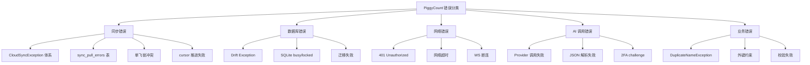
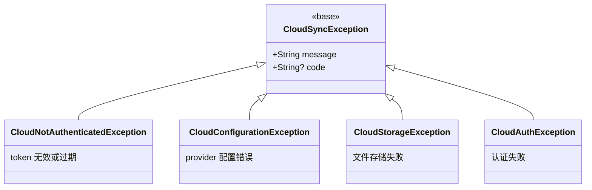
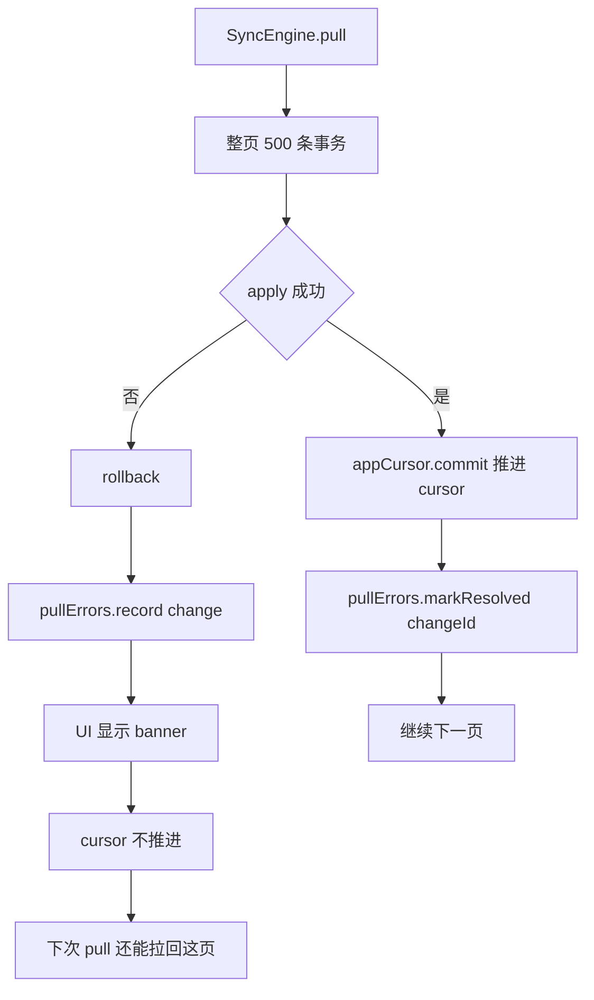
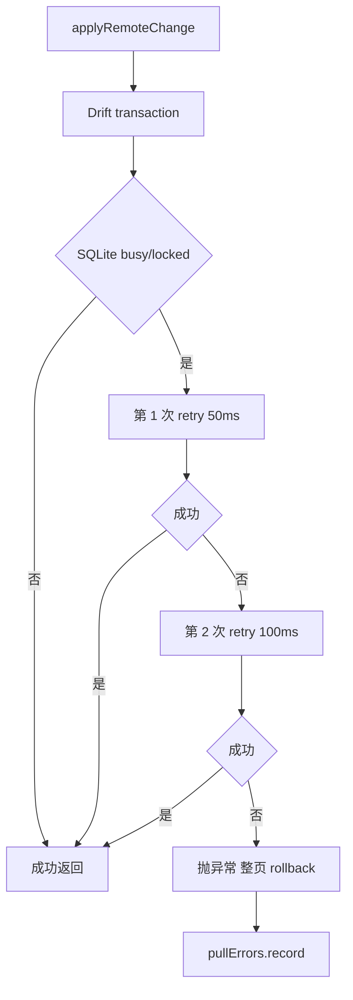
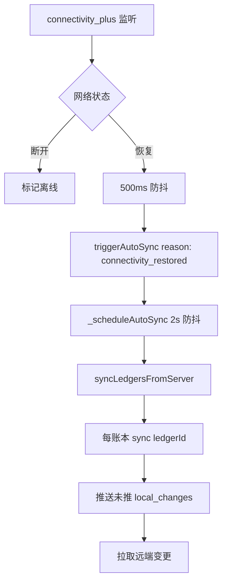
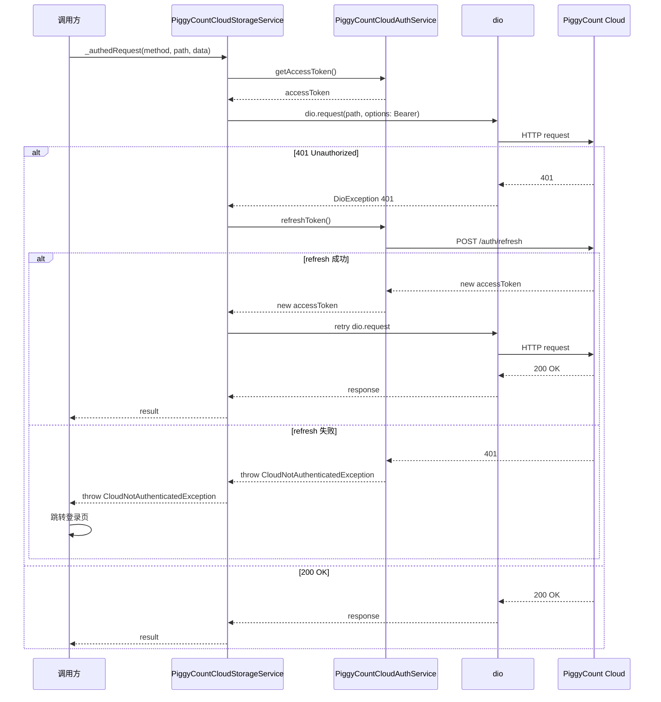
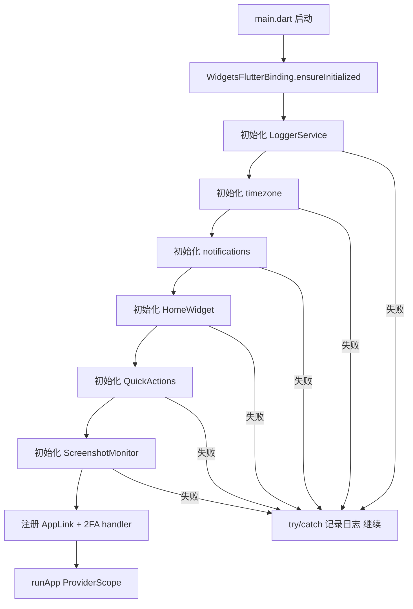
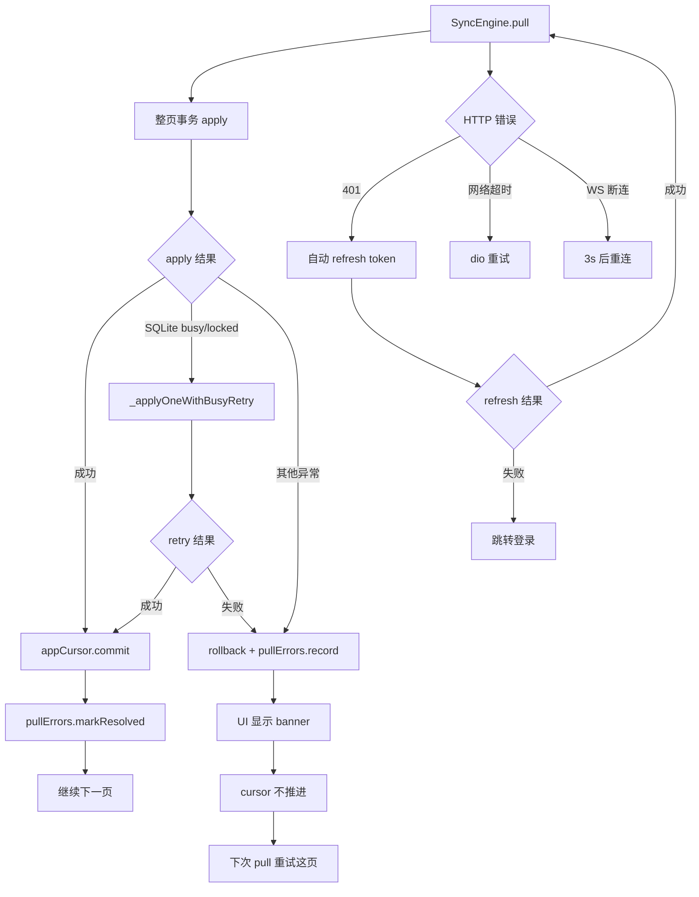
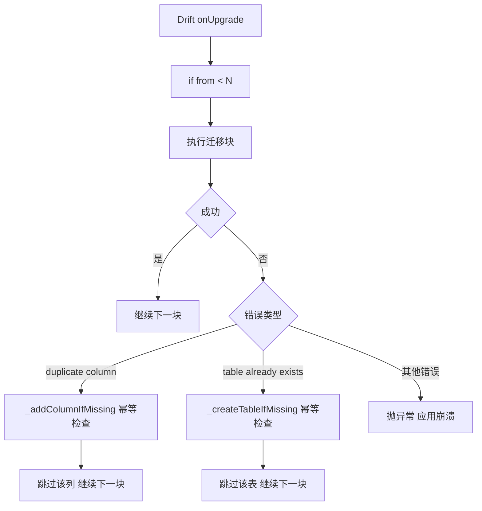

## 目录

- [1. 背景与目的](#1-背景与目的)
- [2. 核心概念](#2-核心概念)
- [3. 详细设计](#3-详细设计)
- [4. 关键流程](#4-关键流程)
- [5. 设计决策记录](#5-设计决策记录)
- [6. 注意事项与约束](#6-注意事项与约束)
- [7. 信息缺口](#7-信息缺口)
- [8. 相关文档](#8-相关文档)

---

## 1. 背景与目的

### 1.1 为什么单独写错误处理文档

PiggyCount 是一款离线优先的记账应用,涉及本地数据库、云同步、AI 调用、附件上传等多个可能失败的场景。如果没有清晰的错误处理策略,会导致:

- 同步失败时数据不一致
- 网络异常时用户体验差
- 数据库错误时应用崩溃
- AI 调用失败时无法回退
- 附件上传失败时数据丢失

本文档梳理 PiggyCount 的错误处理与容错策略,包括:

- CloudSyncException 异常体系
- sync_pull_errors 表的失败隔离
- 单飞锁防并发冲突
- 整页事务 retry 机制
- 网络恢复自动重试
- 应用启动容错
- 建议方案(项目未明确实现的部分)

### 1.2 与其他文档的边界

- 本文**只讲错误处理与容错**,不讲同步流程(同步流程见 [06 数据同步与多设备离线机制](./06-data-sync-and-offline.md))
- 本文**只讲测试相关的错误模拟**,不讲测试策略本身(测试策略见 [10 测试策略](./10-testing-strategy.md))
- 本文**只讲日志记录的位置**,不讲日志系统设计(日志系统见 [14 日志规范与可观测性建议](./14-logging.md))

### 1.3 信息来源

- `packages/flutter_cloud_sync/lib/src/core/exceptions.dart` 异常体系
- `lib/data/db.dart` `SyncPullErrors` 表
- `lib/cloud/sync/sync_engine_apply.dart` retry 机制
- `lib/cloud/sync/sync_engine.dart` 单飞锁
- `lib/cloud/sync/sync_engine_realtime.dart` 网络恢复
- `lib/main.dart` 启动容错

### 1.4 项目实际 vs 建议方案

> **重要**:PiggyCount **没有统一的错误处理框架**,错误处理分散在各模块。本文档区分:
> - **项目实际**:基于代码确认的实现
> - **[建议方案]**:当前代码未明确实现,以下为推荐实践

---

## 2. 核心概念

### 2.1 错误分类总览

PiggyCount 的错误可分为五大类:

上图展示了 PiggyCount 错误的五大分类。同步错误是最复杂的部分,有专门的异常体系和失败隔离表;数据库错误主要是 Drift/SQLite 异常;网络错误集中在 401/超时/WS 断连;AI 调用错误包括 Provider 失败和 JSON 解析失败;业务错误主要是重名冲突和校验失败。后续章节按类别详细说明处理策略。

### 2.2 容错策略总览

| 策略 | 适用场景 | 实现位置 |
|---|---|---|
| **重试** | SQLite busy/locked、网络超时 | `_applyOneWithBusyRetry`、dio 重试 |
| **失败隔离** | 同步拉取失败 | `sync_pull_errors` 表 |
| **单飞锁** | 同步操作并发 | `_pushInFlight` 等 |
| **自动恢复** | 网络断开恢复 | `connectivity_plus` 监听 |
| **降级** | AI 调用失败 | `local_first` 策略回退 |
| **用户提示** | 业务错误 | UI 显示错误信息 |
| **日志记录** | 所有错误 | `LoggerService` |

---

## 3. 详细设计

### 3.1 CloudSyncException 异常体系

`packages/flutter_cloud_sync/lib/src/core/exceptions.dart` 定义了同步层的异常体系:

上图展示了 CloudSyncException 的异常体系。`CloudSyncException` 是基类,4 个子类分别对应不同错误场景。每个接口都提供 `Noop*` 实现(用于本地 only 模式),所有方法抛 `UnsupportedError`。

#### 异常处理策略

| 异常 | 处理 | 实现位置 |
|---|---|---|
| `CloudNotAuthenticatedException` | 自动 refresh token,失败则跳转登录 | `PiggyCountCloudStorageService._authedRequest` |
| `CloudConfigurationException` | UI 显示配置错误提示 | provider 初始化时 |
| `CloudStorageException` | 记录日志 + UI 显示存储错误 | 附件上传/下载 |
| `CloudAuthException` | UI 显示认证错误(如 2FA 失败) | 登录流程 |

依据:`packages/flutter_cloud_sync/lib/src/core/exceptions.dart`。

### 3.2 sync_pull_errors 表失败隔离

`SyncPullErrors` 表(`db.dart` L266)是同步拉取失败的隔离机制。

#### 3.2.1 工作流程

上图展示了 sync_pull_errors 的失败隔离流程。整页 500 条放进 Drift `db.transaction`,apply 成功才 commit cursor;失败时 rollback + record error,cursor 不推进。下次 pull 还能拉回这页,保证最终一致。失败的 change 记录到 `sync_pull_errors` 表,UI 显示 banner + 详情列表。

#### 3.2.2 关键设计

- **只读不可处置**:PiggyCount Cloud 全自动同步,不引入"跳过"等人工干预入口
- **`update-first` 防 race**:并发 record 同 change_id 时用 `INSERT OR REPLACE`
- **attemptCount 字段**:记录尝试次数,用于判断是否需特殊处理
- **userAction 字段**:预留用户操作,目前未使用

依据:`lib/data/db.dart` L266、`lib/cloud/sync/sync_engine_pull.dart` `SyncErrorStore`。

### 3.3 单飞锁防并发冲突

SyncEngine 实现了多种单飞锁防止并发冲突,详见 [06 数据同步与多设备离线机制](./06-data-sync-and-offline.md) §3.3.3。

| 锁 | 作用域 | 用途 |
|---|---|---|
| `_pushInFlight: Map<String, Completer<int>>` | per-ledger | 防同一账本并发 push |
| `_fullPushInFlight: Map<int, Completer<void>>` | per-ledger | 防同一账本并发 fullPush |
| `_fullPullInFlight: Map<int, Completer<...>>` | per-ledger | 防同一账本并发 fullPull |
| `_pullInFlight: Completer<int>?` | 全局 | 防全局并发 pull |
| `_userGlobalPushInFlight: Completer<void>?` | 全局 | 防多账本并发各推一份 user-global |
| `_syncLedgersInFlight: static Completer<int>?` | 跨实例 static | 防 SyncEngine 多 instance 各跑各的 |

#### 错误处理

单飞锁命中时**不抛异常**,而是复用 future 直接 return,避免重复执行。这种设计让调用方无需感知并发,自动去重。

依据:`lib/cloud/sync/sync_engine.dart` L200+。

### 3.4 SQLite busy/locked retry

`_applyOneWithBusyRetry` 在 sync apply 路径实现了 SQLite busy/locked 的 retry 机制。

#### 3.4.1 retry 流程

上图展示了 SQLite busy/locked 的 retry 流程。单条 apply 时如果遇到 SQLite busy/locked(其他事务持有锁),会指数退避 retry 2 次(50ms / 100ms)。retry 仍失败则抛异常,触发整页 rollback + record error。

#### 3.4.2 普通调用不内置 retry

普通 Repository 调用(非 sync apply 路径)**不内置 retry**,因为:

- UI 操作通常串行,不会高并发触发 busy/locked
- retry 会增加 UI 响应延迟
- busy/locked 通常意味着数据库真的繁忙,应让用户感知

[建议方案: 当前代码未明确实现普通 Repository 调用的 retry,以下为推荐实践]
建议在 `BaseRepository` 或 `LocalRepository` 聚合层为关键写操作(如 `addTransaction`)引入 1 次 retry,处理偶发的 busy/locked。

依据:`lib/cloud/sync/sync_engine_apply.dart` `_applyOneWithBusyRetry`。

### 3.5 网络恢复自动重试

`lib/providers/sync_providers.dart` 监听 `connectivity_plus` 的网络状态变化,自动触发同步重试。

#### 3.5.1 流程

上图展示了网络恢复的自动重试流程。`connectivity_plus` 监听网络状态变化,从离线恢复时 500ms 防抖(避免抖动触发),然后调 `triggerAutoSync(reason: 'connectivity_restored')`,内部再走 2s 防抖(合并多个上游事件),最后执行 `syncLedgersFromServer` + 每账本 `sync(ledgerId)` 推送未推变更 + 拉取远端变更。

#### 3.5.2 WS 断连重连

WS 断连时:

- WS server 不持久化离线事件(`websocket_manager.broadcast_to_user` 找不到 socket 就丢弃)
- 重连成功后由 `connected` 事件触发 `syncLedgersFromServer` + `sync` 重新对齐,并触发 `_scheduleAutoSync(reason: 'ws_connected')` flush 离线 local_changes(原共享账本的 `_refreshAllSharedResourcesAfterReconnect` 兜底已随功能下线删除)

依据:`lib/providers/sync_providers.dart`、`lib/cloud/sync/sync_engine_realtime.dart`。

### 3.6 401 自动 refresh token

`PiggyCountCloudStorageService._authedRequest` 内置了 401 自动 refresh token 机制。

#### 3.6.1 流程

上图展示了 401 自动 refresh token 的流程。`_authedRequest` 在请求返回 401 时自动调用 `refreshToken()` 刷新访问令牌,然后重试原请求。refresh 失败则抛 `CloudNotAuthenticatedException`,调用方跳转登录页。这种设计让上层 SyncEngine 无需感知认证细节。

依据:`packages/flutter_cloud_sync/lib/src/providers/piggycount_cloud_provider.dart` `_authedRequest`。

### 3.7 应用启动容错

`lib/main.dart` 的启动流程有容错设计,避免单个初始化失败导致应用崩溃。

#### 3.7.1 容错策略

上图展示了启动容错策略。每个初始化步骤都用 try/catch 包裹,失败时记录日志并继续,避免单个模块失败导致应用无法启动。这种设计保证了应用的基本可用性,即使某个原生模块(如通知、小组件)初始化失败,记账核心功能仍可使用。

[推断: 基于 `main.dart` 的 try/catch 使用模式推断]

依据:`lib/main.dart` L43-154。

### 3.8 AI 调用错误处理

AI 调用涉及多个失败场景,错误处理分散在各处:

| 错误场景 | 处理 | 实现位置 |
|---|---|---|
| AI Provider 调用失败 | 按执行策略回退(如 `local_first` 回退到本地) | `packages/flutter_ai_kit/lib/src/strategies/` |
| JSON 解析失败 | 显示错误提示,不创建交易 | `lib/ai/core/ai_extraction_engine.dart` |
| 2FA challenge | 弹 `Login2FAChallengeView` | `piggycount_cloud_provider.dart` `globalTwoFactorHandler` |
| 网络超时 | dio 超时配置 | `PiggyCountCloudStorageService` |
| 用户取消 | 不创建交易,保留对话历史 | `lib/pages/ai/ai_chat_page.dart` |

### 3.9 业务错误处理

业务错误主要是用户输入校验失败,处理策略:

| 错误 | 处理 | 实现位置 |
|---|---|---|
| `DuplicateNameException` | UI 显示"名称已存在"提示 | `lib/data/repositories/exceptions.dart` |
| 必填字段为空 | UI 表单校验,不提交 | `TransactionEditorPage` |
| 金额格式错误 | UI 输入校验 | `TransactionEditorPage` |
| 外键约束失败 | Drift 抛异常,LoggerService 记录 | Repository 层 |
| 转账账户相同 | UI 校验,不允许选择相同账户 | `TransactionEditorPage` |

---

## 4. 关键流程

### 4.1 同步错误完整处理流程

上图展示了同步错误的完整处理流程。错误分三个层面:页面 apply 层(SQLite busy/locked retry + 整页 rollback + record error)、HTTP 层(401 自动 refresh + 网络超时重试)、WS 层(3s 重连)。三层独立处理,互不干扰。

依据:`lib/cloud/sync/sync_engine_apply.dart`、`lib/cloud/sync/sync_engine_pull.dart`、`piggycount_cloud_provider.dart`。

### 4.2 数据库迁移错误处理

上图展示了数据库迁移的错误处理。`_addColumnIfMissing` 和 `_createTableIfMissing` 通过 PRAGMA / sqlite_master 检查幂等性,避免 partial state 重跑时报 duplicate column / table already exists。这种设计让迁移块可在失败后安全重跑。

[建议方案: 当前代码未明确实现迁移失败的回滚机制,以下为推荐实践]
建议在 `MigrationStrategy.onUpgrade` 失败时提供回滚选项,如备份当前数据库 + 失败时恢复。

依据:`lib/data/db.dart` L448-1167、`_addColumnIfMissing` L1175、`_createTableIfMissing` L1191。

---

## 5. 设计决策记录

### 决策 1:整页事务 + 失败隔离而非单条事务

- **决策内容**:pull 时每页 500 条放进 Drift `db.transaction`,整页 apply 失败时 rollback + record error,cursor 不推进。
- **原因**:
  - **atomicity**:整页事务保证一页内的变更原子应用
  - **失败隔离**:失败的 change 记录到 `sync_pull_errors` 表,不阻塞其他 change
  - **最终一致**:cursor 不推进,下次 pull 还能拉回这页
- **备选方案**:
  - 单条事务 + 单条 cursor 推进:性能差(10k 条 = 10k 事务)
  - 整页事务 + 整页 cursor 推进(即使部分失败):数据丢失
- **最终取舍**:整页事务 + 成功才推进 cursor,失败 record error。
- **依据**:`lib/cloud/sync/sync_engine_pull.dart` `_runPullLoop`。

### 决策 2:sync_pull_errors 只读不可处置

- **决策内容**:`sync_pull_errors` 表对用户只读,不提供"跳过"等人工干预入口。
- **原因**:
  - **自动化优先**:PiggyCount Cloud 全自动同步,不引入人工干预增加心智负担
  - **最终一致**:失败的 change 会随下次 pull 重试,最终要么成功要么持续失败(需开发者修复)
  - **避免误操作**:用户跳过可能导致数据不一致
- **备选方案**:
  - 提供"跳过"按钮:用户可能误操作,数据不一致
  - 提供"重试"按钮:与自动重试冗余
- **最终取舍**:只读,UI 显示错误详情供用户了解,但不提供处置入口。
- **依据**:`lib/cloud/sync/sync_engine_pull.dart` `SyncErrorStore`。

### 决策 3:401 自动 refresh 而非跳转登录

- **决策内容**:HTTP 401 时自动 refresh token,失败才跳转登录。
- **原因**:
  - **用户体验**:token 过期是常见场景,自动 refresh 避免频繁跳转登录
  - **透明性**:上层 SyncEngine 无需感知认证细节
- **备选方案**:
  - 直接跳转登录:用户体验差
  - 让上层处理:增加上层复杂度
- **最终取舍**:自动 refresh,失败才跳转。
- **依据**:`piggycount_cloud_provider.dart` `_authedRequest`。

### 决策 4:启动容错而非快速失败

- **决策内容**:应用启动时每个初始化步骤用 try/catch 包裹,失败记录日志并继续。
- **原因**:
  - **基本可用**:即使某个原生模块失败,记账核心功能仍可使用
  - **用户体验**:启动失败让用户无处可去,远比某个功能不可用糟糕
- **备选方案**:
  - 快速失败:某个模块失败就崩溃,用户无法使用应用
  - 严格模式:开发环境快速失败,生产环境容错
- **最终取舍**:容错优先,记录日志供排查。
- **依据**:`lib/main.dart` L43-154。

---

## 6. 注意事项与约束

### 6.1 错误处理约束

| 约束 | 说明 |
|---|---|
| Repository 层不直接处理网络错误 | 由 SyncEngine / CloudProvider 层处理 |
| SyncEngine 不直接抛业务异常 | 通过 SyncEvent 通知 UI |
| UI 层不直接处理 Drift 异常 | 通过 Repository 异常体系转换 |
| sync_pull_errors 只读 | 不提供人工干预入口 |
| 单飞锁命中不抛异常 | 复用 future 直接 return |

### 6.2 错误处理边界

| 模块 | 不应做 | 应做 |
|---|---|---|
| Repository | 处理网络错误 | 处理业务异常(DuplicateNameException 等) |
| SyncEngine | 处理 UI 交互 | 通过 SyncEvent 通知 UI |
| CloudProvider | 实现业务逻辑 | 处理 HTTP/WS 错误 |
| UI | 直接处理 Drift 异常 | 通过 Repository 异常体系处理业务错误 |

### 6.3 [建议方案] 改进建议

[建议方案: 当前代码未明确实现以下改进,以下为推荐实践]

1. **统一错误处理框架**:在 `BaseRepository` 或 `LocalRepository` 聚合层引入统一的异常包装,把 Drift 异常转为业务异常
2. **普通 Repository 调用 retry**:为关键写操作(如 `addTransaction`)引入 1 次 retry,处理偶发的 busy/locked
3. **迁移失败回滚**:在 `MigrationStrategy.onUpgrade` 失败时提供回滚选项,如备份当前数据库 + 失败时恢复
4. **错误上报**:虽然是隐私优先应用,但可考虑提供可选的错误上报机制(用户主动开启),便于排查问题
5. **错误码标准化**:为业务错误定义标准错误码,便于 UI 国际化

---

## 7. 信息缺口

| 编号 | 缺口描述 | 影响章节 | 建议补充方式 |
|---|---|---|---|
| 1 | `lib/data/repositories/exceptions.dart` 完整异常清单未读取 | §3.9 | 阅读该文件补充 |
| 2 | `dio` 拦截器的完整错误处理链未展开 | §3.6 | 阅读 `PiggyCountCloudStorageService` 拦截器配置 |
| 3 | `LoggerService` 的错误记录格式与级别未展开 | §3.7 | 在 [14 日志规范](./14-logging.md) 补充 |
| 4 | 普通 Repository 调用是否内置 retry 未确认 | §3.4.2 | grep `retry` 在 `local_repository.dart` 中的使用 |
| 5 | 迁移失败的回滚机制是否存在未确认 | §4.2 | 阅读 `MigrationStrategy` 完整实现 |
| 6 | AI 调用错误的完整处理链未展开 | §3.8 | 阅读 `flutter_ai_kit` 各 strategy 实现 |
| 7 | 2FA challenge 的完整流程未展开 | §3.8 | 阅读 `piggycount_cloud_provider.dart` `globalTwoFactorHandler` |
| 8 | 错误处理的测试覆盖率未统计 | — | 在 [10 测试策略](./10-testing-strategy.md) 补充 |

---

## 8. 相关文档

- [01 项目全览](./01-project-overview.md) — 项目整体定位
- [04 系统架构设计](./04-system-architecture.md) — 错误处理在架构中的位置
- [06 数据同步与多设备离线机制](./06-data-sync-and-offline.md) — 同步错误处理深入
- [08 接口与数据访问设计](./08-api-and-data-access.md) — Repository 异常体系
- [10 测试策略](./10-testing-strategy.md) — 错误模拟测试
- [14 日志规范与可观测性建议](./14-logging.md) — 错误日志记录
- [16 已知问题与技术债务](./16-known-issues.md) — 错误处理相关债务
- [INDEX](./INDEX.md) — 完整文档索引
