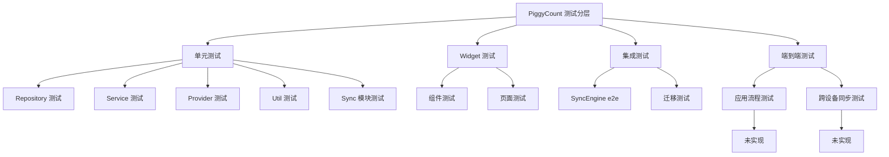
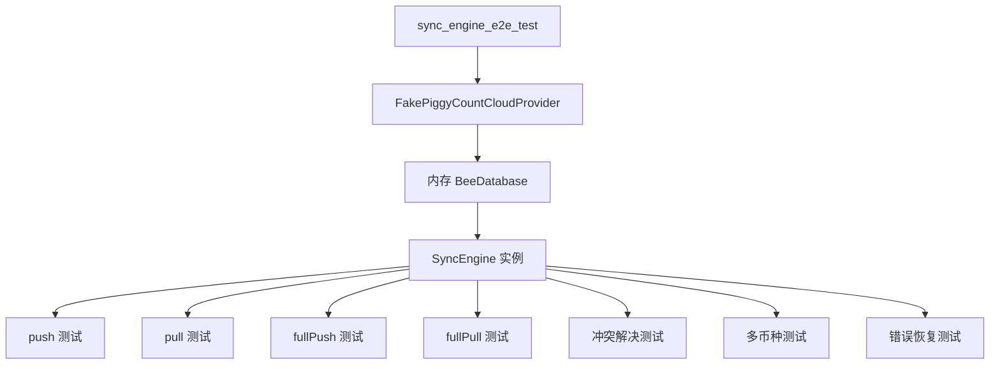
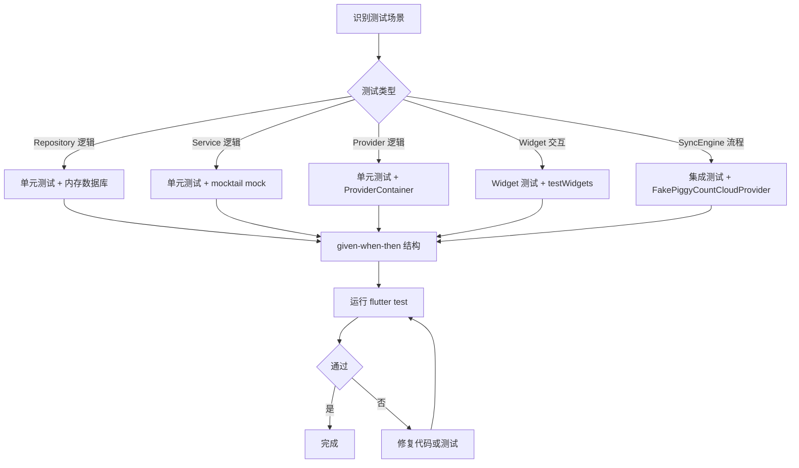
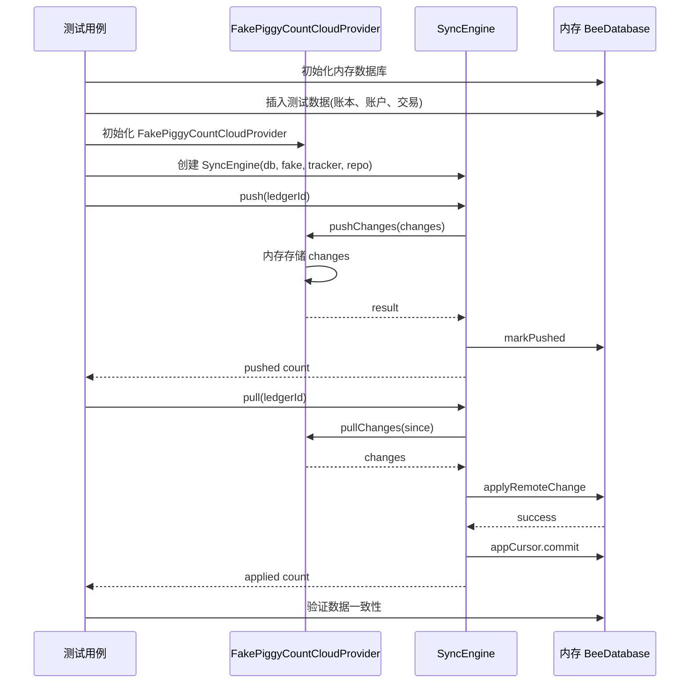

## 目录

- [1. 背景与目的](#1-背景与目的)
- [2. 核心概念](#2-核心概念)
- [3. 详细设计](#3-详细设计)
- [4. 关键流程](#4-关键流程)
- [5. 设计决策记录](#5-设计决策记录)
- [6. 注意事项与约束](#6-注意事项与约束)
- [7. 信息缺口](#7-信息缺口)
- [8. 相关文档](#8-相关文档)

---

## 1. 背景与目的

### 1.1 为什么单独写测试策略文档

PiggyCount 是一款涉及本地数据库、云同步、AI 调用、附件处理等多个复杂模块的记账应用,测试是保障质量的关键。但项目的测试现状存在以下问题:

- 测试文件 57 个、用例 451 个,但分布不均
- 无 `integration_test/` 目录(已声明依赖但未使用)
- 无覆盖率工具配置
- Widget 测试仅 3 个,核心页面无覆盖
- db.dart 30 段迁移块只有 v30 有回归测试
- CI 不跑测试(`.github/workflows/` 无 test.yml)

本文档系统梳理 PiggyCount 的测试现状、测试分层、测试技术、信息缺口与建议方案,让一年经验开发者能快速理解和参与测试开发。

### 1.2 与其他文档的边界

- 本文**只讲测试策略**,不讲错误处理(错误处理见 [09 错误处理与容错策略](./09-error-handling.md))
- 本文**只讲测试工具的用法**,不讲技术选型(技术选型见 [03 技术栈全景](./03-tech-stack.md))
- 本文**只讲测试相关的债务**,不讲全部债务(全部债务见 [16 已知问题与技术债务](./16-known-issues.md))

### 1.3 信息来源

- `test/` 目录 57 个测试文件
- `pubspec.yaml` 测试依赖
- `lib/data/db.dart` `BeeDatabase.forTesting` 构造函数
- `test/cloud/sync/_fakes/fake_piggycount_cloud_provider.dart` Fake 类
- `.github/workflows/` CI 配置

---

## 2. 核心概念

### 2.1 测试分层总览

PiggyCount 的测试可分为四层:



上图展示了 PiggyCount 的测试分层。单元测试是主体(57 个文件中绝大多数),Widget 测试很少(3 个),集成测试只有 SyncEngine e2e 和迁移测试,端到端测试**完全缺失**(`integration_test/` 目录不存在)。后续章节按层级详细说明。

### 2.2 测试统计

| 维度 | 数值 | 备注 |
|---|---|---|
| 测试文件总数 | **57 个** `*_test.dart` | — |
| 测试用例总数 | **451 个** `test()` / `testWidgets()` / `group()` | — |
| 集成测试目录 | **不存在** | `pubspec.yaml` 已声明 `integration_test` 依赖但未使用 |
| Widget 测试文件 | **3 个** | `transfer_form_account_hidden_test`、`amount_editor_currency_test`、`header_skins_test` |
| 测试 fake/辅助文件 | **1 个** | `fake_piggycount_cloud_provider.dart` |
| 覆盖率工具配置 | **无** | 无 `.coveragerc` / `lcov.info` / `coverage/` |
| CI 是否跑测试 | **否** | `.github/workflows/` 只有 `issue-lint.yml`、`pullfrog.yml`、`release.yml` |

依据:`test/` 目录、`pubspec.yaml` L83-92、`.github/workflows/`。

### 2.3 测试技术栈

| 依赖 | 版本 | 用途 | 备注 |
|---|---|---|---|
| `flutter_test` | SDK | 单元测试 / Widget 测试 | Flutter 官方 |
| `mocktail` | `^1.0.4` | Mock 库 | 替代 mockito,无需 codegen |
| `integration_test` | SDK | 集成测试 | 已声明但未使用 |
| 内存数据库 | — | `BeeDatabase.forTesting(NativeDatabase.memory())` | 跳过文件系统副作用 |
| Fake 类 | — | `FakePiggyCountCloudProvider` | extends 真类,覆盖 ~20 个方法 |

---

## 3. 详细设计

### 3.1 测试目录分布

```mermaid
flowchart TD
    A[test/ 目录] --> B[ai/ - 7 文件]
    A --> C[cloud/sync/ - 9 文件]
    A --> D[data/ - 4 文件]
    A --> E[data/repositories/ - 5 文件]
    A --> F[maintenance/ - 2 文件]
    A --> G[providers/ - 4 文件]
    A --> H[repositories/ - 6 文件]
    A --> I[services/ - 8 文件]
    A --> J[styles/ - 1 文件]
    A --> K[sync/ - 3 文件]
    A --> L[utils/ - 6 文件]
    A --> M[widgets/ - 3 文件]

    B --> B1[ai 抽取上下文]
    B --> B2[账单信息解析]
    B --> B3[JSON 响应解析]
    B --> B4[隐私同意 store]
    B --> B5[provider factory]
    B --> B6[provider manager voice sync]
    B --> B7[prompt builder]

    C --> C1[change_tracker]
    C --> C2[entity_serializer]
    C --> C3[exchange_rate_override_apply]
    C --> C4[ledger_apply_month_start_day]
    C --> C5[lookup_cache]
    C --> C6[sync_engine_e2e - 44 用例]
    C --> C7[sync_error_store]
    C --> C8[_fakes/fake_provider]
    C --> C9[其他]
```



上图展示了 `test/` 目录的分布。`test/` 镜像 `lib/` 目录结构,按业务模块分目录。`test/cloud/sync/` 是测试最密集的目录(9 个文件,含 44 个用例的 sync_engine_e2e),反映了同步模块的复杂性与测试投入。`test/widgets/` 只有 3 个文件,核心页面无 Widget 测试。

### 3.2 测试覆盖范围

| 目录 | 文件数 | 覆盖内容 |
|---|---|---|
| `test/ai/` | 7 | AI 抽取上下文、账单信息解析、JSON 响应解析、隐私同意 store、provider factory、provider manager voice sync、prompt builder |
| `test/cloud/sync/` | 9 | change_tracker、entity_serializer、exchange_rate_override_apply、ledger_apply_month_start_day、lookup_cache、**sync_engine_e2e(44 个用例)**、sync_error_store、fake provider |
| `test/data/` | 4 | exchange_rate_schema、migration_v30、sync_pull_errors_schema、(根级 schema 测试) |
| `test/data/repositories/` | 5 | exchange_rate_repository、local_repository_bulk_sync、net_worth_trend、local/(month_start_day_stats、local_category_repository) |
| `test/maintenance/` | 2 | orphan_scanner、orphan_cleaner |
| `test/providers/` | 4 | currency_providers、ledger_currency_providers、refresh_extra_quotes、voice_billing_settings |
| `test/repositories/` | 6 | account_hidden、account_stats_exclude_flags、budget_exclude_flags、multi_currency_repository、multi_currency_statistics、statistics_exclude_flags、transaction_exclude_flags |
| `test/services/` | 8 | ai/ai_bookkeeper、billing/**bill_creation_service(37 用例)**、data/recurring_transaction_service、data/seed_categories_unique、config_app_settings_note_display、data_import_multi_currency、exchange_rate_service、rate_math(_native) |
| `test/styles/` | 1 | header_skins |
| `test/sync/` | 3 | account_hidden_apply、transaction_exclude_flags_apply、transaction_multi_currency_apply |
| `test/utils/` | 6 | analytics_average、currencies、date_parser、month_range、net_worth_trend_utils、website_urls |
| `test/widgets/` | 3 | amount_editor_currency、transaction_row_title、transfer_form_account_hidden |

### 3.3 单元测试

#### 3.3.1 测试入口

```dart
// 内存数据库注入
final db = BeeDatabase.forTesting(NativeDatabase.memory());
final repo = LocalRepository(db: db, changeTracker: null);

// 测试用例
test('addTransaction should insert transaction and record change', () async {
  // given
  final ledgerId = await repo.createLedger(name: 'Test', currency: 'CNY');

  // when
  final txId = await repo.addTransaction(
    ledgerId: ledgerId,
    type: 'expense',
    amount: 50.0,
    happenedAt: DateTime.now(),
  );

  // then
  expect(txId, greaterThan(0));
  final tx = await repo.getTransactionById(txId);
  expect(tx, isNotNull);
  expect(tx!.amount, 50.0);
});
```

#### 3.3.2 mocktail 用法

```dart
// Mock Repository
class MockRepository extends Mock implements BaseRepository {}

void main() {
  test('Service should call repository', () async {
    // given
    final mockRepo = MockRepository();
    when(() => mockRepo.addTransaction(...)).thenAnswer((_) async => 1);
    final service = BillCreationService(repository: mockRepo);

    // when
    final result = await service.createTransaction(billInfo);

    // then
    verify(() => mockRepo.addTransaction(...)).called(1);
    expect(result, 1);
  });
}
```

`mocktail` 相比 `mockito` 的优势:

- **无需 codegen**:不用 `@GenerateMocks` 与 `build_runner`
- **API 简洁**:`when(() => ...)` 与 `verify(() => ...)`
- **Dart 风格**:更符合 Dart 语言习惯

依据:`pubspec.yaml` L90、`test/services/billing/bill_creation_service_test.dart`(37 用例)。

### 3.4 Widget 测试

PiggyCount 的 Widget 测试很少,只有 3 个:

| 文件 | 覆盖 | 类型 |
|---|---|---|
| `test/widgets/transfer_form_account_hidden_test.dart` | 转账表单隐藏账户 | testWidgets |
| `test/widgets/amount_editor_currency_test.dart` | 金额编辑器外币 | testWidgets |
| `test/widgets/header_skins_test.dart` | header 皮肤 | test() 单元测试(实际是函数测试) |

#### 缺失的 Widget 测试

- 账本页 / 统计页 / 预算页 / AI 聊天页等核心页面无 Widget 测试
- 交易编辑页无完整 Widget 测试
- 设置页无 Widget 测试

[建议方案: 当前代码未明确实现核心页面 Widget 测试,以下为推荐实践]
建议优先为核心页面(如 `TransactionEditorPage`、`AnalyticsPage`、`BudgetPage`)添加 Widget 测试,覆盖关键交互流程。

### 3.5 集成测试

#### 3.5.1 SyncEngine e2e 测试

`test/cloud/sync/sync_engine_e2e_test.dart` 是测试最密集的文件,包含 44 个用例。



上图展示了 SyncEngine e2e 测试的结构。使用 `FakePiggyCountCloudProvider`(extends 真类,覆盖 ~20 个方法)模拟 server,内存数据库隔离副作用,SyncEngine 实例测试完整 push/pull/fullPush/fullPull 流程。用例覆盖冲突解决、多币种、错误恢复等场景。

#### 3.5.2 迁移测试

`test/data/migration_v30_test.dart` 是唯一有独立测试的迁移块,验证 v30 多币种回填 SQL 语义。

```dart
test('v30 migration should backfill nativeAmount for existing transactions', () async {
  // given: v29 schema database with transactions
  // when: migrate to v30
  // then: nativeAmount should be set to amount for CNY transactions
  //       nativeAmount should be null for foreign currency transactions
});
```

其他 29 段迁移块(v2-v29、v31)**无独立回归测试**,是已知技术债务,见 [16 已知问题与技术债务](./16-known-issues.md)。

### 3.6 测试辅助文件

#### 3.6.1 FakePiggyCountCloudProvider

`test/cloud/sync/_fakes/fake_piggycount_cloud_provider.dart`:

- extends 真实的 `PiggyCountCloudProvider`
- 覆盖 ~20 个方法(pullChanges / pushChanges / writeCreateLedger 等)
- 模拟 server 状态(内存存储 changes)
- 用于 SyncEngine e2e 测试

#### 3.6.2 BeeDatabase.forTesting

`lib/data/db.dart` L442:

```dart
BeeDatabase.forTesting(QueryExecutor executor) : super(executor);
```

- 跳过 `_openConnection` 的文件系统副作用
- 供单元测试用 `NativeDatabase.memory()` 注入内存库
- 测试间隔离,无状态污染

依据:`lib/data/db.dart` L442、`test/cloud/sync/_fakes/fake_piggycount_cloud_provider.dart`。

### 3.7 测试工具配置

#### 3.7.1 analysis_options.yaml

`analysis_options.yaml` 配置了 `flutter_lints: ^5.0.0` 与 `dart_code_metrics: ^5.7.6`,但**无测试覆盖率配置**。

#### 3.7.2 CI 配置

`.github/workflows/` 只有:

| 文件 | 用途 | 是否跑测试 |
|---|---|---|
| `issue-lint.yml` | Issue 模板校验 | 否 |
| `pullfrog.yml` | PR 处理 | 否 |
| `release.yml` | 发布构建 | 否(只构建不测试) |

[建议方案: 当前 CI 不跑测试,以下为推荐实践]
建议增加 `.github/workflows/test.yml`,在 PR 时触发 `flutter test`,保证代码质量。

---

## 4. 关键流程

### 4.1 测试编写流程



上图展示了测试的编写流程。先识别测试场景,根据类型选择测试方式:Repository 用内存数据库,Service 用 mocktail mock,Provider 用 ProviderContainer,Widget 用 testWidgets,SyncEngine 用 FakePiggyCountCloudProvider。所有测试遵循 given-when-then 结构。

### 4.2 SyncEngine e2e 测试流程



上图展示了 SyncEngine e2e 测试的流程。测试用例初始化内存数据库与 FakePiggyCountCloudProvider,创建 SyncEngine 实例,执行 push/pull 操作,然后验证数据一致性。FakePiggyCountCloudProvider 模拟 server 行为(内存存储 changes),让测试无需真实 server 即可验证完整同步流程。

依据:`test/cloud/sync/sync_engine_e2e_test.dart`。

### 4.3 测试运行流程

```bash
# 运行全部测试
flutter test

# 运行特定文件
flutter test test/cloud/sync/sync_engine_e2e_test.dart

# 运行特定用例
flutter test test/cloud/sync/sync_engine_e2e_test.dart --name "push should"

# 运行并生成覆盖率(需配置)
flutter test --coverage
```

[建议方案: 当前项目未配置覆盖率工具,以下为推荐实践]
建议在 `pubspec.yaml` 添加 `test_coverage` 或使用 `flutter test --coverage` + `lcov` 生成覆盖率报告。

---

## 5. 设计决策记录

### 决策 1:mocktail 而非 mockito

- **决策内容**:Mock 库使用 `mocktail: ^1.0.4`,而非 mockito。
- **原因**:
  - **无需 codegen**:mocktail 不需要 `@GenerateMocks` 与 `build_runner`,减少构建步骤
  - **API 简洁**:`when(() => ...)` 与 `verify(() => ...)` 更符合 Dart 风格
  - **运行时 mock**:可 mock 任何类,无需提前生成
- **备选方案**:
  - mockito:需 codegen,构建步骤多
  - 手写 fake:工作量大
- **最终取舍**:mocktail。
- **依据**:`pubspec.yaml` L90。

### 决策 2:内存数据库而非文件数据库

- **决策内容**:测试用 `BeeDatabase.forTesting(NativeDatabase.memory())` 注入内存数据库。
- **原因**:
  - **隔离性**:每个测试用例独立内存库,无状态污染
  - **速度**:内存数据库比文件数据库快
  - **并行安全**:无文件锁竞争
- **备选方案**:
  - 文件数据库 + setUp/tearDown 清理:慢且有残留风险
  - 真实 SQLite 文件:无法并行
- **最终取舍**:内存数据库。
- **依据**:`lib/data/db.dart` L442 `BeeDatabase.forTesting`。

### 决策 3:FakePiggyCountCloudProvider 而非真实 server

- **决策内容**:SyncEngine e2e 测试用 `FakePiggyCountCloudProvider` 模拟 server。
- **原因**:
  - **无 server 依赖**:测试无需部署 PiggyCount Cloud server
  - **可控性**:Fake 可精确控制 server 行为(如模拟冲突、错误)
  - **速度**:内存操作比 HTTP 快
- **备选方案**:
  - 真实 server:需部署,CI 复杂
  - mocktail mock:无法模拟复杂 server 状态
- **最终取舍**:Fake 类,extends 真实 Provider。
- **依据**:`test/cloud/sync/_fakes/fake_piggycount_cloud_provider.dart`。

### 决策 4:测试目录镜像 lib 结构

- **决策内容**:`test/` 目录镜像 `lib/` 目录结构(如 `test/cloud/sync/` 对应 `lib/cloud/sync/`)。
- **原因**:
  - **可定位**:测试文件与源文件一一对应,易于查找
  - **组织清晰**:按模块分类,避免测试文件混乱
  - **社区惯例**:Flutter 官方推荐
- **备选方案**:
  - 按测试类型分(unit/widget/integration):不利于按模块查找
  - 扁平结构:文件多时难以管理
- **最终取舍**:镜像 lib 结构。
- **依据**:`test/` 目录结构。

---

## 6. 注意事项与约束

### 6.1 测试约束

| 约束 | 说明 |
|---|---|
| 测试用内存数据库 | `BeeDatabase.forTesting(NativeDatabase.memory())` |
| Mock 用 mocktail | 不用 mockito |
| 测试目录镜像 lib | `test/cloud/sync/` 对应 `lib/cloud/sync/` |
| SyncEngine 测试用 Fake | `FakePiggyCountCloudProvider` |
| 集成测试缺失 | `integration_test/` 不存在 |
| CI 不跑测试 | 需手动 `flutter test` |

### 6.2 测试编写规则

| 规则 | 说明 |
|---|---|
| given-when-then 结构 | 测试用例遵循三段式 |
| 一个测试一个断言 | 避免多断言导致定位困难 |
| 测试名描述意图 | `should insert transaction and record change` |
| 避免测试实现细节 | 测试行为而非实现 |
| setUp/tearDown 隔离 | 每个用例独立状态 |

### 6.3 测试覆盖率现状

| 模块 | 覆盖情况 | 备注 |
|---|---|---|
| SyncEngine | 高 | 44 个 e2e 用例 |
| BillCreationService | 高 | 37 个用例 |
| AI 抽取引擎 | 中 | 7 个文件 |
| Repository 实现层 | 不均 | 部分有独立测试,部分通过 wrapper 间接覆盖 |
| Widget | 低 | 仅 3 个文件 |
| 迁移块 | 极低 | 仅 v30 有测试 |
| Provider | 低 | 仅 4 个文件 |
| 集成测试 | 无 | `integration_test/` 不存在 |
| 端到端 | 无 | 无跨设备同步测试 |

---

## 7. 信息缺口

| 编号 | 缺口描述 | 影响章节 | 建议补充方式 |
|---|---|---|---|
| 1 | 无覆盖率工具配置 | §3.7 | 添加 `test_coverage` 或使用 `flutter test --coverage` |
| 2 | CI 不跑测试 | §3.7.2 | 增加 `.github/workflows/test.yml` |
| 3 | `integration_test/` 不存在 | §3.5 | 创建目录,添加端到端测试 |
| 4 | Widget 测试仅 3 个 | §3.4 | 为核心页面添加 Widget 测试 |
| 5 | 迁移块无回归测试(除 v30) | §3.5.2 | 为各迁移块添加幂等性回归测试 |
| 6 | Repository 实现层测试不均 | §3.3 | 为 LocalLedgerRepository / LocalAccountRepository 等添加独立单测 |
| 7 | Provider 测试薄弱 | §3.3 | 为 syncServiceProvider / repositoryProvider 等添加单测 |
| 8 | 具体测试用例内容未抽样 | — | 阅读测试文件,评估测试质量 |
| 9 | `pullfrog.yml` 与 `issue-lint.yml` 是否跑测试未确认 | §3.7.2 | 阅读 CI 配置确认 |
| 10 | 测试是否在开发流程中强制 | — | 阅读 CONTRIBUTING 确认 |

---

## 8. 相关文档

- [01 项目全览](./01-project-overview.md) — 项目整体定位
- [03 技术栈全景](./03-tech-stack.md) — 测试相关依赖
- [04 系统架构设计](./04-system-architecture.md) — 测试架构约束
- [06 数据同步与多设备离线机制](./06-data-sync-and-offline.md) — SyncEngine e2e 测试
- [07 数据模型设计](./07-data-model.md) — 迁移测试
- [08 接口与数据访问设计](./08-api-and-data-access.md) — Repository 测试
- [09 错误处理与容错策略](./09-error-handling.md) — 错误模拟测试
- [15 开发规范与工作流](./15-development-guidelines.md) — 测试规范
- [16 已知问题与技术债务](./16-known-issues.md) — 测试相关债务
- [INDEX](./INDEX.md) — 完整文档索引
