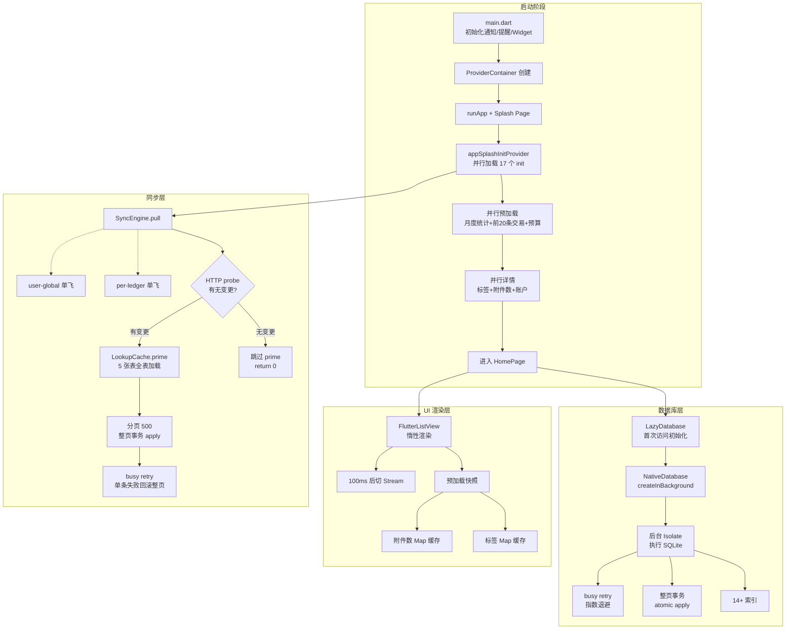
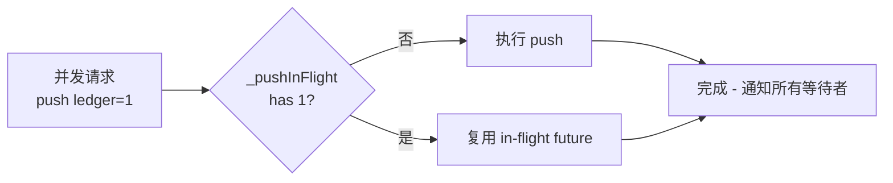
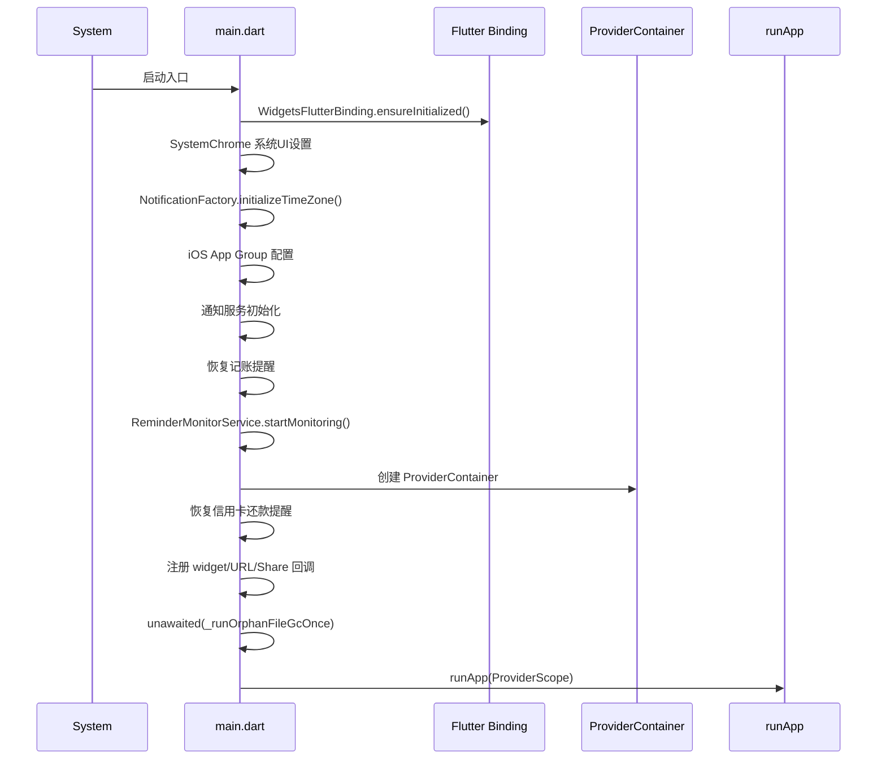

# 11. 性能优化

> 文档版本：v1.0
> 最后更新：2026-07-25
> 作者：wait
> 信息源：项目源码（本仓库）+ 代码静态审查

---

## 1. 背景

PiggyCount 作为一款**离线优先**的个人记账应用，性能表现直接影响用户体验：
- **首屏加载**：用户打开应用后应在 1-2 秒内看到月度统计与最近交易
- **滚动流畅**：交易列表是高频交互页面，需保持 60fps 不掉帧
- **同步效率**：多账本云同步不能阻塞 UI，并避免 N+1 查询
- **AI 调用**：长文本/图片识别需避免主线程阻塞
- **图片附件**：缩略图加载与原图存储需平衡内存与磁盘

本文档梳理项目已实施的性能优化策略、关键代码位置、效果与改进点，为后续性能调优与新特性开发提供参考。

---

## 2. 核心概念

| 概念 | 含义 |
|---|---|
| **LazyDatabase** | Drift 提供的延迟初始化数据库连接，首次访问才创建 |
| **NativeDatabase.createInBackground** | 将 SQLite 操作放到后台 isolate，避免阻塞主线程 |
| **LookupCache** | 同步 pull 路径的内存缓存，一次性加载全表消除 N+1 SELECT |
| **单飞锁（SingleFlight）** | 同类并发请求只执行一次，后续复用 future 结果 |
| **Lazy prime** | 先 HTTP 探测有无变更，99% 空场景跳过全表 prime |
| **预加载快照 + Stream 模式切换** | 首屏用 Splash 阶段快照数据，导航动画后切到 Stream |
| **ABI Splits** | APK 按指令集拆分，arm64 主包减小体积 |
| **autoDispose** | Riverpod 自动释放 provider，离开页面即释放内存 |

---

## 3. 整体性能架构



---

## 4. 性能优化详细设计

### 4.1 数据库性能

#### 4.1.1 索引设计

**实现位置**：[db.dart](../lib/data/db.dart)（迁移脚本中声明）

| 索引名 | 字段 | 用途 |
|---|---|---|
| `idx_transaction_tags_transaction` | `transaction_tags(transaction_id)` | 反查交易标签 |
| `idx_transaction_tags_tag` | `transaction_tags(tag_id)` | 按标签查交易 |
| `idx_budgets_ledger` | `budgets(ledger_id)` | 按账本查预算 |
| `idx_budgets_category` | `budgets(category_id)` | 按分类查预算 |
| `idx_budgets_ledger_type` | `budgets(ledger_id, type)` | 复合索引：账本+类型 |
| `idx_attachments_transaction` | `transaction_attachments(transaction_id)` | 反查交易附件 |
| `idx_transactions_sync_id` | `transactions(sync_id)` | 同步 syncId 反查 |
| `idx_accounts_sync_id` | `accounts(sync_id)` | 同步 syncId 反查 |
| `idx_categories_sync_id` | `categories(sync_id)` | 同步 syncId 反查 |
| `idx_tags_sync_id` | `tags(sync_id)` | 同步 syncId 反查 |
| `idx_ledgers_sync_id` | `ledgers(sync_id)` | 同步 syncId 反查 |
| `idx_budgets_sync_id` | `budgets(sync_id)` | 同步 syncId 反查 |
| `idx_rate_override_pair` (UNIQUE) | `exchange_rate_overrides(base, quote)` | 汇率唯一约束 |
| `idx_accounts_currency` | `accounts(currency)` | 按币种筛选账户 |

全部索引使用 `CREATE INDEX IF NOT EXISTS` 幂等保护。

**[待补充]**：`transactions` 表缺少 `(ledger_id, happened_at)` 复合索引，首页交易列表按时间倒序分页查询的最热路径，数据量增长后会触发全表扫描。建议在 schemaVersion=32 迁移中补充。

#### 4.1.2 后台 Isolate 执行

**实现位置**：[db.dart:1240-1260](../lib/data/db.dart)

```dart
LazyDatabase _openConnection() {
  return LazyDatabase(() async {
    final dir = await getApplicationDocumentsDirectory();
    final file = File(p.join(dir.path, 'piggycount.sqlite'));
    return NativeDatabase.createInBackground(file);  // 后台 Isolate
  });
}
```

**优化效果**：
- `LazyDatabase` 延迟初始化，启动时不创建连接
- `NativeDatabase.createInBackground` 将 SQLite 操作放到独立 isolate，主线程不阻塞
- 通过 `databaseProvider` 单例管理

#### 4.1.3 整页事务 + busy retry

**实现位置**：`sync_engine.dart:1222-1232`、`sync_engine.dart:1257-1275`

```dart
// 整页事务：任何一条失败触发整页回滚
final result = await db.transaction(() async {
  for (final ch in page.changes) {
    await _applyOneWithBusyRetry(ch);
  }
  return page.changes.length;
});

// SQLite busy/locked 指数退避
Future<bool> _applyOneWithBusyRetry(PiggyCountCloudSyncChange ch) async {
  var attempts = 0;
  while (true) {
    try {
      return await applyRemoteChange(ch);
    } catch (e) {
      final msg = e.toString().toLowerCase();
      final transient = (msg.contains('sqlite') || msg.contains('database')) &&
          (msg.contains('busy') || msg.contains('locked'));
      if (transient && attempts < 2) {
        attempts++;
        await Future.delayed(Duration(milliseconds: 50 * (1 << attempts)));
        continue;
      }
      rethrow;
    }
  }
}
```

**优化效果**：
- 最多 2 次重试，指数退避（100ms、200ms）
- 通过 `e.toString()` 探测异常避免引入 sqlite3 包依赖
- 仅处理 busy/locked 瞬时错误，其他异常上抛触发整页 rollback

#### 4.1.4 分页与批量操作

| 场景 | 分页/批量大小 | 文件位置 |
|---|---|---|
| 同步 pull 单页 | 500 条 | `sync_engine.dart:1121` |
| 同步 push 分批 | 500 条 | `sync_engine_serialization.dart:583-595` |
| 首屏预加载 | 20 条交易 | [ui_state_providers.dart:236](../lib/providers/ui_state_providers.dart) |
| 账户详情页 | 50 条/页 | account_detail_page.dart:54 |
| transaction_tags 批量插入 | `db.batch((b) => ...)` | `sync_engine_apply.dart:960` |

#### 4.1.5 WAL 模式

**[未实现]**：项目代码中**没有**显式 `PRAGMA journal_mode=WAL` 配置。但 [db.dart:1247-1252](../lib/data/db.dart) 检测了 `.sqlite-shm` / `.sqlite-wal` 文件存在，说明实际运行时 SQLite 处于 WAL 模式（Drift `NativeDatabase` 默认启用）。

**建议**：显式声明避免不同平台/版本默认值差异。

---

### 4.2 同步性能

#### 4.2.1 LookupCache 消除 N+1

**实现位置**：`sync_engine_pull.dart:231-296`

```dart
class LookupCache {
  final Map<String, int> _ledger = {};
  final Map<String, int> _category = {};
  final Map<String, int> _account = {};
  final Map<String, int> _tag = {};
  final Map<String, _TxCacheEntry> _tx = {};

  Future<void> prime(BeeDatabase db) async {
    // 一次性加载 5 张表全表 syncId → id
  }
}
```

**优化效果**：
- pull 路径上 `syncId → 本地 int id` 一次性加载
- 10k 条 sync_change 从 ~10 万次 SELECT 降到 ~5 次（prime）+ 少量 miss
- pull 入口 prime，pull 结束清空 `activePullCache = null`，避免长期持有大 map

#### 4.2.2 Lazy prime 优化

**实现位置**：`sync_engine.dart:1115-1128`

```dart
// Lazy prime：先 HTTP 一次试探有没有数据。99% 场景(无变更)直接 return，
// 跳过 LookupCache 全表 SELECT(transactions 10k+ 行的 prime 每次都要
// 200-500ms 主线程时间)
final probe = await provider.pullChanges(since: nextSince, limit: 500, persistCursor: false);
if (probe.changes.isEmpty) {
  logger.info('SyncEngine', 'pull: since=$nextSince 无新变更,跳过 LookupCache prime');
  return 0;
}
// 有数据 → prime LookupCache
final cache = LookupCache();
await cache.prime(db);
```

**优化效果**：99% 空场景跳过 5 张表全表 SELECT，多账本启动场景节省 1-2s。

#### 4.2.3 多层单飞锁

**实现位置**：`sync_engine.dart:151-175`



| 单飞锁类型 | 范围 | 用途 |
|---|---|---|
| `_pushInFlight` | per-ledger | 不同账本可并发，同账本复用 |
| `_fullPushInFlight` | per-ledger | 全量推送同上 |
| `_userGlobalPushInFlight` | user-global | 多账本共享 user-global 实体只推一次 |
| `_pullInFlight` | 全局 | 全局 pull 单飞 |
| `_fullPullInFlight` | per-ledger | 全量 pull per-ledger |
| `_syncLedgersInFlight` | static 跨实例 | 修复 join page 与 WS listener 双实例并发 bug |

#### 4.2.4 push 分批推送

**实现位置**：`sync_engine_serialization.dart:583-595`

```dart
const batchSize = 500;
for (var i = 0; i < syncChanges.length; i += batchSize) {
  final end = (i + batchSize > syncChanges.length) ? syncChanges.length : i + batchSize;
  final batch = syncChanges.sublist(i, end);
  // 推送批次 - 单批失败不影响其它批
}
```

---

### 4.3 启动性能

#### 4.3.1 启动流程

**实现位置**：[main.dart:43-154](../lib/main.dart)



**优化点**：
- 大量 `try/catch` 静默失败，确保启动不被次要服务阻塞
- `_runOrphanFileGcOnce` 使用 `unawaited` 后台执行
- ProviderContainer 在 runApp 前创建，确保 repository 可用

#### 4.3.2 Splash 并行预加载

**实现位置**：[ui_state_providers.dart](../lib/providers/ui_state_providers.dart) `appSplashInitProvider`

```dart
final appSplashInitProvider = FutureProvider<void>((ref) async {
  // 1. 并行加载 17 个基础配置 provider
  await Future.wait([
    ref.watch(primaryColorInitProvider.future),
    ref.watch(themeModeInitProvider.future),
    ref.watch(appInitProvider.future),
    // ... 14 个其它 init provider
  ]);

  // 2. 并行预加载：月度统计 + 交易列表(前 20 条) + 预算概览
  const preloadLimit = 20;
  final results = await Future.wait([
    timed('月度统计', ref.read(monthlyTotalsProvider(monthlyParams).future)),
    timed('交易列表(前$preloadLimit条)', repo.getRecentTransactionsWithCategory(ledgerId: ledgerId, limit: preloadLimit)),
    timed('预算概览', ref.read(budgetOverviewProvider.future)),
  ]);

  // 3. 并行加载详情：标签 + 附件数量 + 账户
  final detailResults = await Future.wait([
    timed('标签数据', repo.getTagsForTransactions(transactionIds)),
    timed('附件数量', repo.getAttachmentCountsForTransactions(transactionIds)),
    timed('账户数据', repo.getAccountsByIds(accountIds.toList())),
  ]);
});
```

**优化效果**：
- 17 个基础配置 provider 并行加载（vs 串行节省 ~16 × 单 provider 时长）
- 首屏只加载前 20 条交易（vs 全量加载）
- 三组核心数据（月度统计、列表、预算）并行
- `timed()` 包装器记录每步耗时便于性能分析

#### 4.3.3 Isolate 使用

**实现位置**：[import_confirm_page.dart:71](../lib/pages/data/import_confirm_page.dart)

```dart
final parsed = await compute(_parseRowsIsolate, widget.csvText);
```

**优化效果**：CSV 导入解析放到 isolate 执行，避免阻塞 UI。

**[未实现]**：启动路径未使用 isolate（数据库已通过 `NativeDatabase.createInBackground` 在后台 isolate 处理）。

---

### 4.4 列表渲染性能

#### 4.4.1 FlutterListView 惰性渲染

**实现位置**：[transaction_list.dart:358-584](../lib/widgets/biz/transaction_list.dart)

```dart
return FlutterListView(
  controller: _controller,
  physics: const BouncingScrollPhysics(),
  delegate: FlutterListViewDelegate(
    (BuildContext context, int index) { ... },
    childCount: _flatItems.length,
  ),
);
```

**优化效果**：使用 `flutter_list_view` 包的 `FlutterListView` 替代 `ListView.builder`，提供 `FlutterListViewController` 支持精准 `jumpToIndex` 跳转（用于月份切换），同时按需构建 item。

#### 4.4.2 预加载快照 + Stream 模式切换

**实现位置**：[transaction_list.dart:70-79, 230-248](../lib/widgets/biz/transaction_list.dart)

```dart
Map<int, List<Tag>> _cachedTagsMap = {};
List<int> _cachedTransactionIds = [];
Map<int, int> _cachedAttachmentCounts = {};
bool _usePreloadedData = true;

void switchToStreamMode() {
  if (_usePreloadedData) {
    Future.delayed(const Duration(milliseconds: 100), () {
      if (mounted && _usePreloadedData) {
        setState(() { _usePreloadedData = false; });
        _loadTags();
        _loadAttachmentCounts();
      }
    });
  }
}
```

**优化效果**：
- 首屏使用 Splash 阶段预加载的快照数据，避免二次查询闪烁
- 用户交互后延迟 100ms 切换到 Stream 模式（导航动画期间用户无感知）
- 标签 / 附件数量通过 `Map<int, ...>` 缓存，避免重复 DB 查询
- `_listEquals` 检测交易 ID 列表变化才触发 reload

#### 4.4.3 const 构造器与 Key

- `TransactionListItem` 大量参数支持 const
- `_kPieColors` const 列表
- `BeeTokens` / `BeeDimens` 等设计 token 类使用 static const
- `Key('tx-${it.t.id}-$index')`（Dismissible key）

**[待补充]**：拼接 index 进 key 在列表排序变化时会失去复用意义，建议改为纯 `ValueKey(it.t.id)`。

#### 4.4.4 RepaintBoundary

**实现位置**：[annual_report_page.dart:488, 1757](../lib/pages/report/annual_report_page.dart)、share_poster_service.dart

**[待补充]**：交易列表、图表组件（`CategoryPieChart` 等）未使用 `RepaintBoundary` 包裹，长列表滚动时可能引发不必要的重绘。

---

### 4.5 状态管理性能

#### 4.5.1 autoDispose 使用

**实现位置**：[statistics_providers.dart](../lib/providers/statistics_providers.dart)

```dart
final ledgerCountProvider = FutureProvider.autoDispose<int>((ref) async { ... });
final countsForLedgerProvider = FutureProvider.family
    .autoDispose<({int dayCount, int txCount}), int>((ref, ledgerId) async { ... });
final monthlyTotalsProvider = FutureProvider.family
    .autoDispose<(double income, double expense), ({int ledgerId, DateTime month})>( ... );
final accountStatsProvider = FutureProvider.family
    .autoDispose<({double balance, double expense, double income}), int>( ... );
```

**优化效果**：统计类 provider 几乎全部使用 `autoDispose`，离开页面后自动释放内存；family 参数化支持多账本/多月份独立缓存。

#### 4.5.2 keepAlive 模式

**实现位置**：[ui_state_providers.dart:117-122, 137-141](../lib/providers/ui_state_providers.dart)

```dart
final searchAmountFilterEnabledProvider =
    FutureProvider.autoDispose<bool>((ref) async {
  final prefs = await SharedPreferences.getInstance();
  final link = ref.keepAlive();           // 首次加载后常驻内存
  ref.onDispose(() => link.close());
  return prefs.getBool('search_amount_filter_enabled') ?? false;
});
```

**优化效果**：对从 SharedPreferences 读取的全局开关使用 `autoDispose + keepAlive`，避免重复异步读取。

#### 4.5.3 select 精细化监听

**[未实现]**：检索全项目未发现 `.select(...)` 调用。Riverpod 2.x 推荐使用 `ref.watch(provider.select((value) => value.xxx))` 减少 rebuild，当前代码全部为粗粒度 `ref.watch`。

**建议**：对返回大对象的 provider（如 `currentLedgerProvider`）使用 select 仅监听所需字段。

---

### 4.6 缓存机制

#### 4.6.1 LRU 缓存

**实现位置**：[lru_cache.dart](../lib/utils/lru_cache.dart)

```dart
class LRUCache {
  final String _key;
  final int _maxSize;
  LRUCache({required String key, int maxSize = 20});

  Future<List<int>> getOrderedIds() async { ... }
  Future<void> recordUsage(int id) async {
    List<int> ids = await getOrderedIds();
    ids.remove(id);
    ids.insert(0, id);
    if (ids.length > _maxSize) ids = ids.sublist(0, _maxSize);
    await prefs.setString(_key, json.encode(ids));
  }
}
```

**优化效果**：基于 SharedPreferences + JSON 序列化的轻量 LRU，默认 maxSize=20，用于账户 ID 等最近使用排序。

**[待补充]**：每次 recordUsage 都要一次 SharedPreferences 读 + JSON 解码 + 一次写入，高频写入场景有性能损耗，建议加内存层 cache。

#### 4.6.2 汇总数据缓存

- `lastMonthlyTotalsProvider`（[statistics_providers.dart:68](../lib/providers/statistics_providers.dart)）：`StateProvider.family` 缓存上次月度收支总额
- `cachedTransactionsProvider` / `cachedTransactionsWithCategoryProvider`（ui_state_providers.dart:174-179）：缓存首屏交易数据
- `SyncEngine._statusCache`（`sync_engine.dart:79`）：`Map<int, SyncStatus>` 缓存同步状态，`_localChanged` 标记失效

#### 4.6.3 APK 更新缓存

**实现位置**：[update_cache.dart](../lib/services/update/update_cache.dart)

```dart
static Future<String?> getCachedApkPath() async {
  // 检查文件是否存在 + 是否在 7 天内下载的
  final daysSinceDownload = DateTime.now().difference(cachedTime).inDays;
  if (daysSinceDownload <= 7) return cachedPath;
  else await clearCachedApk();
}

static Future<bool> validateApkFile(String filePath) async {
  // 1. 文件存在 2. 大小 5MB-200MB 3. 可读 4. ZIP 魔数 (PK)
  final bytes = await file.openRead(0, 4).first;
  if (bytes.length < 2 || bytes[0] != 0x50 || bytes[1] != 0x4B) return false;
}
```

**优化效果**：APK 下载文件复用，7 天有效期 + 文件完整性校验（ZIP 魔数 + 大小区间）+ 过期自动清理。

---

### 4.7 图片与附件性能

#### 4.7.1 缩略图生成

**实现位置**：[attachment_service.dart:22, 40-47, 273-277](../lib/services/attachment_service.dart)

```dart
static const int thumbnailSize = 200;

Future<Directory> getThumbnailDirectory() async {
  final cacheDir = await getTemporaryDirectory();
  final dir = Directory('${cacheDir.path}/attachment_thumbs');
  // ...
}

final result = await FlutterImageCompress.compressAndGetFile(
  ..., minWidth: thumbnailSize, minHeight: thumbnailSize,
);
```

**优化效果**：
- 缩略图固定 200x200，存缓存目录（系统可清理）
- 原图存 `getApplicationDocumentsDirectory/attachments`
- 缩略图存 `getTemporaryDirectory/attachment_thumbs`
- 命名规则：`<basename(fileName)>_thumb.jpg`

#### 4.7.2 双阶段压缩

**实现位置**：[attachment_service.dart:19-21, 49-79, 349-351](../lib/services/attachment_service.dart)

```dart
static const int maxWidth = 1920;
static const int maxHeight = 1920;
static const int quality = 80;

Future<List<File>> pickFromGallery({int maxCount = 9}) async {
  final images = await _picker.pickMultiImage(
    maxWidth: maxWidth.toDouble(),
    maxHeight: maxHeight.toDouble(),
    imageQuality: quality,
  );
}
```

**urgent 模式优化**（[attachment_service.dart:85-90](../lib/services/attachment_service.dart)）：

```dart
/// [urgent] 紧急模式:跳过 FlutterImageCompress,直接 sync 文件复制。
/// 用于 iOS 后台 launch 场景 —— FlutterImageCompress 是 platform channel,
/// 一旦 iOS 把 app 推到 background,channel 调用会被冻结
```

**优化效果**：
- ImagePicker 阶段先压缩到 1920x1920 / quality 80
- 保存阶段再次压缩
- urgent 模式跳过压缩避免 iOS 后台冻结

#### 4.7.3 一次性 GC 清理孤立文件

**实现位置**：[main.dart:606-707](../lib/main.dart)

```dart
Future<void> _runOrphanFileGcOnce(ProviderContainer container) async {
  // SharedPreferences 标志位 orphan_file_gc_v1_done 保证只跑一次
  // 给主线程让路,启动关键路径先跑完
  await Future.delayed(const Duration(seconds: 3));
  // 清理 attachments / attachment_thumbs / custom_icons 三类孤立文件
}
```

**优化效果**：启动 3 秒后后台执行，不阻塞首屏；SharedPreferences flag 保证只跑一次；通过对比 DB 行的 `fileName` 识别磁盘孤立文件。

---

### 4.8 AI 性能

#### 4.8.1 超时配置

| 服务 | connectTimeout | receiveTimeout | 文件位置 |
|---|---|---|---|
| 货币汇率 | 4s | - | exchange_rate_service.dart:46 |
| GitHub 镜像 | 10s | 10s | github_mirror_service.dart:110-111 |
| 更新检查 | 30s | - | update_checker.dart:91 |
| AI 文本 | 60s | 60s | ai_provider_factory.dart:24-25 |
| AI 视觉/语音 | - | 120s | ai_provider_factory.dart:415-416 |

#### 4.8.2 流式响应与取消

**[未实现]**：
- `ai_bookkeeper.dart` 全文未出现 stream / StreamController
- `ai_chat_page.dart` 未匹配到 stream / StreamSubscription / CancelToken 关键词
- 当前 AI 调用是同步 await 模式

**建议**：
- 流式响应可改善首字延迟体验
- 长文本/图片识别应支持 CancelToken + 用户主动取消
- AI 结果缓存（同文本/图片二次识别）

---

## 5. 关键代码示例

### 5.1 Splash 并行加载模式

```dart
final appSplashInitProvider = FutureProvider<void>((ref) async {
  // 阶段1：基础配置并行加载
  await Future.wait([
    ref.watch(primaryColorInitProvider.future),
    ref.watch(themeModeInitProvider.future),
    ref.watch(languageInitProvider.future),
    ref.watch(appLockInitProvider.future),
    // ... 13 个其它配置
  ]);

  // 阶段2：首屏数据并行加载
  final results = await Future.wait([
    ref.read(monthlyTotalsProvider(monthlyParams).future),
    repo.getRecentTransactionsWithCategory(ledgerId: ledgerId, limit: 20),
    ref.read(budgetOverviewProvider.future),
  ]);

  // 阶段3：详情数据并行加载
  final detailResults = await Future.wait([
    repo.getTagsForTransactions(transactionIds),
    repo.getAttachmentCountsForTransactions(transactionIds),
    repo.getAccountsByIds(accountIds.toList()),
  ]);
});
```

### 5.2 LookupCache 一次性加载

```dart
class LookupCache {
  final Map<String, int> _ledger = {};
  final Map<String, int> _category = {};
  final Map<String, int> _account = {};
  final Map<String, int> _tag = {};
  final Map<String, _TxCacheEntry> _tx = {};

  Future<void> prime(BeeDatabase db) async {
    // 一次性加载 5 张表全表 syncId → id 映射
    // 10k 条 sync_change 从 ~10 万次 SELECT 降到 ~5 次（prime）+ 少量 miss
  }
}
```

### 5.3 单飞锁 per-ledger 并发

```dart
final Map<String, Completer<int>> _pushInFlight = {};

Future<int> push({required int ledgerId}) async {
  final key = 'push_$ledgerId';
  if (_pushInFlight[key] != null) {
    return _pushInFlight[key]!.future;  // 复用 in-flight future
  }
  final completer = Completer<int>();
  _pushInFlight[key] = completer;
  try {
    final count = await _doPush(ledgerId: ledgerId);
    completer.complete(count);
    return count;
  } catch (e) {
    completer.completeError(e);
    rethrow;
  } finally {
    _pushInFlight.remove(key);
  }
}
```

---

## 6. 性能监控与度量

### 6.1 Splash 阶段 timed 包装器

**实现位置**：[ui_state_providers.dart](../lib/providers/ui_state_providers.dart)

```dart
Future<T> timed<T>(String label, Future<T> future) async {
  final sw = Stopwatch()..start();
  try {
    return await future;
  } finally {
    sw.stop();
    logger.info('Splash', '$label: ${sw.elapsedMilliseconds}ms');
  }
}
```

**用途**：记录每个并行任务的耗时，便于性能瓶颈定位。

### 6.2 同步日志

**实现位置**：`sync_engine.dart`

```dart
logger.info('SyncEngine', 'pull: since=$nextSince 无新变更,跳过 LookupCache prime');
logger.info('SyncEngine', 'pull: applied ${page.changes.length} changes in ${sw.elapsedMilliseconds}ms');
```

### 6.3 [待补充] 性能监控缺口

- **[未实现]** 无全局性能埋点（如 Sentry Performance、Firebase Performance）
- **[未实现]** 无关键路径耗时上报（首屏 TTI、同步完成时长）
- **[未实现]** 无内存监控（OOM 上报）
- **[未实现]** 无 FPS 监控

---

## 7. 性能优化建议（优先级排序）

| # | 优化项 | 位置 | 优先级 | 预期收益 |
|---|---|---|---|---|
| 1 | `(ledger_id, happened_at)` 复合索引 | db.dart transactions 表 | 高 | 首页列表查询从全表扫描 → 索引扫描 |
| 2 | AI 流式响应 + CancelToken + timeout | ai_bookkeeper.dart | 高 | 改善首字延迟，支持取消 |
| 3 | 显式 `PRAGMA journal_mode=WAL` + `synchronous=NORMAL` | db.dart `_openConnection` | 中 | 不同平台一致性 |
| 4 | Riverpod `.select()` 精细化监听 | transaction_list_item.dart 等 | 中 | 减少 rebuild |
| 5 | 交易列表 RepaintBoundary 包裹 | transaction_list.dart | 中 | 减少滚动重绘 |
| 6 | AI 结果缓存 | ai_bookkeeper.dart | 中 | 同文本二次识别零延迟 |
| 7 | 配置导出/导入加内存层 cache | lru_cache.dart | 低 | 减少 SharedPreferences IO |
| 8 | Dismissible key 不拼接 index | transaction_list.dart:450 | 低 | 列表排序变化时复用 |
| 9 | 同步路径使用 `compute` 处理大批量序列化 | sync_engine_serialization.dart | 低 | 大批量同步不阻塞主线程 |
| 10 | 全局性能埋点 + 关键路径耗时上报 | 全项目 | 中 | 可量化性能指标 |

---

## 8. 参考与延伸阅读

### 8.1 相关文档
- [04-system-architecture.md](04-system-architecture.md)：五层架构设计
- [06-data-sync-and-offline.md](06-data-sync-and-offline.md)：同步引擎详细设计
- [09-error-handling.md](09-error-handling.md)：busy retry 错误处理
- [10-testing-strategy.md](10-testing-strategy.md)：性能测试策略

### 8.2 关键源码文件
- [lib/main.dart](../lib/main.dart)：启动入口
- [lib/data/db.dart](../lib/data/db.dart)：数据库初始化与索引
- `lib/cloud/sync/sync_engine.dart`：同步引擎
- `lib/cloud/sync/sync_engine_pull.dart`：LookupCache 实现
- [lib/providers/ui_state_providers.dart](../lib/providers/ui_state_providers.dart)：Splash 预加载
- [lib/widgets/biz/transaction_list.dart](../lib/widgets/biz/transaction_list.dart)：列表优化
- [lib/services/attachment_service.dart](../lib/services/attachment_service.dart)：图片压缩
- [lib/utils/lru_cache.dart](../lib/utils/lru_cache.dart)：LRU 缓存

### 8.3 外部参考
- Drift 性能优化：https://drift.simonbinder.eu/docs/advanced-features/isolates/
- Riverpod 性能：https://docs-v2.riverpod.dev/docs/concepts/combining-providers#select
- Flutter 列表性能：https://docs.flutter.dev/perf/best-practices
