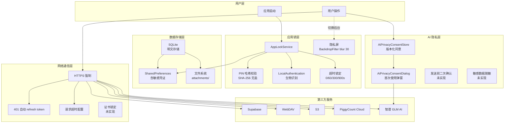
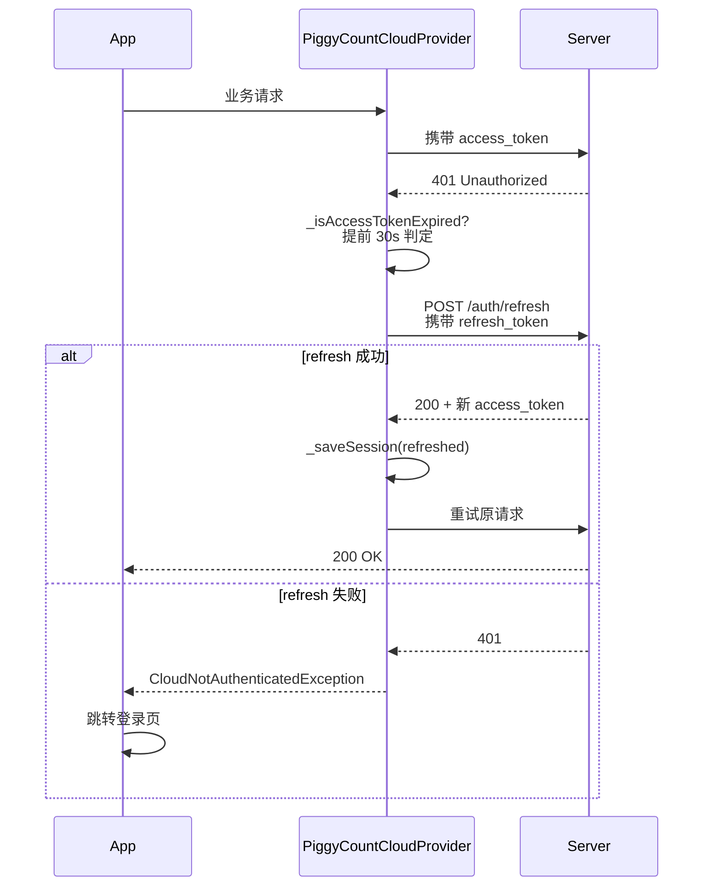
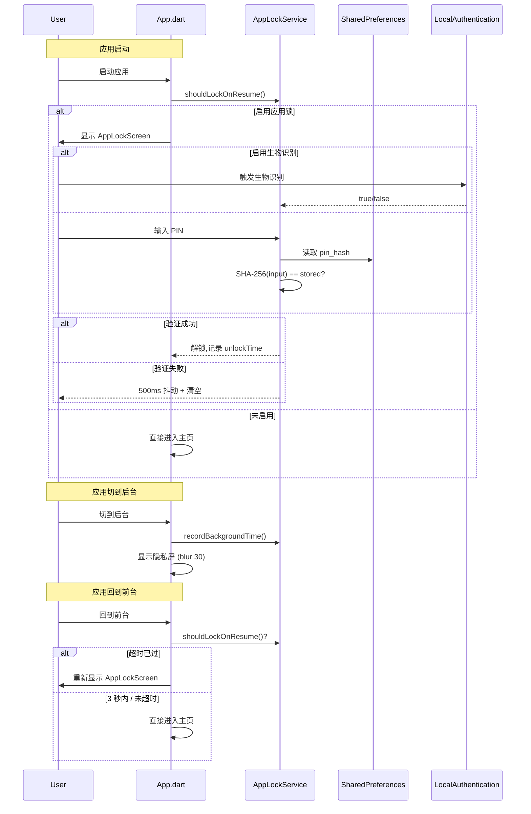

# 12. 安全机制

> 文档版本：v1.0
> 最后更新：2026-07-25
> 作者：wait
> 信息源：项目源码（d:\DevTools\project\PiggyCount）+ 代码静态审查

---

## 1. 背景

PiggyCount 是一款**离线优先**、**隐私优先**的个人记账应用，遵循 **零数据收集** 原则（详见 [PRIVACY.md](file:///d:/DevTools/project/PiggyCount/PRIVACY.md)）。但作为一款管理用户财务数据的应用，仍需在以下维度建立安全机制：

1. **本地数据安全**：防止设备丢失/被盗时数据泄露
2. **应用锁**：防止他人借用设备时查看记账数据
3. **凭证存储**：云同步凭证（API Token、密码）的安全存储
4. **网络通信**：HTTPS 传输、证书校验
5. **AI 隐私**：用户对数据发送给第三方 AI 服务商的知情同意
6. **数据导出/备份**：避免敏感字段外泄
7. **输入验证**：防 SQL 注入、路径遍历
8. **开源审计**：代码可审计性

本文档梳理项目已实施的安全机制、关键代码位置、存在的安全风险与改进建议。

> ⚠️ **重要说明**：经代码静态审查发现，[PRIVACY.md](file:///d:/DevTools/project/PiggyCount/PRIVACY.md) 中的部分声明（如使用 Android Keystore、MIT License）与实际代码实现不符。本文档第 10 节"已知问题与建议"中详细列出，建议项目维护者尽快修订。

---

## 2. 核心概念

| 概念 | 含义 |
|---|---|
| **隐私优先** | 默认不上报任何数据，AI/云同步均为可选功能 |
| **离线优先** | 数据存本地 SQLite，云同步是可选能力 |
| **应用锁** | PIN + 生物识别解锁，超时自动锁定 |
| **隐私屏** | 应用切到后台时模糊屏幕，防止多任务预览泄露 |
| **AI 隐私同意** | 版本化同意机制，文案变更需重新同意 |
| **参数化查询** | 通过 Drift `Variable<T>` 绑定变量防 SQL 注入 |
| **零数据收集** | 无埋点、无崩溃报告、无广告 SDK |

---

## 3. 安全架构总览



---

## 4. 安全机制详细设计

### 4.1 本地数据安全

#### 4.1.1 SQLite 数据库（明文存储）

**实现位置**：[lib/data/db.dart:1240-1260](file:///d:/DevTools/project/PiggyCount/lib/data/db.dart)

```dart
LazyDatabase _openConnection() {
  return LazyDatabase(() async {
    final dir = await getApplicationDocumentsDirectory();
    final file = File(p.join(dir.path, 'piggycount.sqlite'));
    return NativeDatabase.createInBackground(file);  // ← 明文 SQLite
  });
}
```

**安全效果**：
- 使用 `getApplicationDocumentsDirectory()`，位于应用私有沙箱（Android `/data/data/<package>/files/`、iOS `Documents/`）
- 正常情况下其他 App 无法访问 ✓
- **未加密** ✗

**风险**：
- 在 root 过的 Android 设备 / 已越狱 iOS 设备 / 备份提取场景下，所有账本数据（金额、备注、账户名、银行卡后四位等）可直接被读取
- 全局 Grep `sqlcipher|SQLCipher|encrypted.*database` 在 `lib/` 中 **零匹配**

#### 4.1.2 Android Keystore / iOS Keychain（未使用）

**[未实现]**：全局 Grep `AndroidKeystore|iOSKeychain|Keystore|Keychain` 在 `lib/` 中 **零匹配**。

**关键矛盾**：
- [PRIVACY.md:93](file:///d:/DevTools/project/PiggyCount/PRIVACY.md) 声称 "Authentication credentials are stored securely using Android Keystore"
- 但代码中 PIN 哈希、API Token、密码全部存储在 `SharedPreferences`（明文 XML 文件）
- 这是一处**隐私政策与实现不符的严重问题**

#### 4.1.3 数据库备份加密

**[未实现]**：云同步（Supabase/WebDAV/PiggyCount Cloud）上传的是业务数据 JSON / 二进制，**未发现任何对备份内容加密后再上传的代码**。备份内容受 HTTPS 传输保护，但服务端可见明文。

---

### 4.2 应用锁（PIN / Biometric）

#### 4.2.1 PIN 码存储

**实现位置**：[lib/services/security/app_lock_service.dart:26-37](file:///d:/DevTools/project/PiggyCount/lib/services/security/app_lock_service.dart)

```dart
/// SHA-256 哈希 PIN 码
static String hashPin(String pin) {
  final bytes = utf8.encode(pin);
  return sha256.convert(bytes).toString();  // ← 无 salt、无慢哈希
}

/// 设置 PIN 码
static Future<void> setPin(String pin) async {
  final prefs = await SharedPreferences.getInstance();
  await prefs.setString(_keyPinHash, hashPin(pin));  // ← 存在 SharedPreferences
  await prefs.setBool(_keyEnabled, true);
}
```

**安全效果与问题**：
- **优点**：未明文存 PIN，验证时比对哈希 ✓
- **缺点 1**：4 位 PIN 仅 10000 种组合，无盐 SHA-256 可在毫秒级被彩虹表/暴力破解 ✗
- **缺点 2**：未使用 bcrypt / PBKDF2 / Argon2 等慢哈希 ✗
- **缺点 3**：哈希存储在 `SharedPreferences`（明文 XML），root 设备可直接读取哈希后离线破解 ✗
- **缺点 4**：PIN 长度硬编码为 4 位（[app_lock_screen.dart:57](file:///d:/DevTools/project/PiggyCount/lib/pages/auth/app_lock_screen.dart) `if (_pin.length >= 4) return;`）✗

#### 4.2.2 生物识别

**实现位置**：[lib/services/security/app_lock_service.dart:127-153](file:///d:/DevTools/project/PiggyCount/lib/services/security/app_lock_service.dart)

```dart
static Future<bool> authenticateWithBiometrics(
    {String reason = '请验证身份以解锁应用'}) async {
  try {
    return await _localAuth.authenticate(
      localizedReason: reason,
      options: const AuthenticationOptions(
        stickyAuth: true,
        biometricOnly: true,  // ← 仅生物识别，不允许 PIN fallback
      ),
    );
  } catch (e) {
    logger.error('AppLock', '生物识别认证失败', e);
    return false;
  }
}
```

**安全效果**：
- 使用官方 `local_auth` 包 ✓
- `biometricOnly: true` 防止降级为设备 PIN ✓
- 启动时若启用生物识别则自动触发 ✓
- **[未实现]**：失败后无失败次数上限/冷却时间

#### 4.2.3 自动锁定策略

**实现位置**：[lib/services/security/app_lock_service.dart:95-124](file:///d:/DevTools/project/PiggyCount/lib/services/security/app_lock_service.dart)、[lib/app.dart:658-688](file:///d:/DevTools/project/PiggyCount/lib/app.dart)

```dart
// app.dart 生命周期监听
void didChangeAppLifecycleState(AppLifecycleState state) {
  if (state == AppLifecycleState.inactive) {
    if (ref.read(appLockEnabledProvider)) {
      ref.read(showPrivacyScreenProvider.notifier).state = true;  // 多任务切换模糊屏
    }
  } else if (state == AppLifecycleState.paused) {
    AppLockService.recordBackgroundTime();  // 记录后台时间
  } else if (state == AppLifecycleState.resumed) {
    ref.read(showPrivacyScreenProvider.notifier).state = false;
    _checkAppLockOnResume();  // 检查超时锁定
  }
}
```

**shouldLockOnResume 逻辑**：
- 解锁后 3 秒内不重锁（防止生物识别弹窗触发 resumed 事件导致死循环）
- 超时时间可配置：0=立即, 60=1分钟, 300=5分钟, 900=15分钟
- 默认超时为 0（立即锁定）

#### 4.2.4 隐私屏

**实现位置**：[lib/main.dart:560-580](file:///d:/DevTools/project/PiggyCount/lib/main.dart)

```dart
if (showPrivacyScreen) {
  BackdropFilter(
    filter: ImageFilter.blur(sigmaX: 30, sigmaY: 30),
    child: Container(color: Colors.white),
  )
}
```

**安全效果**：多任务切换时显示模糊屏，防止应用预览泄露 ✓

#### 4.2.5 截屏保护（未实现）

**[未实现]**：全局 Grep `FLAG_SECURE|setWindowFlags|secureWindow` 在整个项目中 **零匹配**。

**风险**：
- Android 系统截屏、录屏、多任务缩略图**未通过 FLAG_SECURE 阻止** ✗
- 仅通过 `AppLifecycleState.inactive` 触发的模糊屏部分缓解（系统截屏快捷键可能不触发 inactive）

**建议**：在 `MainActivity.kt` 中添加 `window.setFlags(LayoutParams.FLAG_SECURE, LayoutParams.FLAG_SECURE)`

#### 4.2.6 失败次数限制（未实现）

**[未实现]**：[app_lock_screen.dart:75-91](file:///d:/DevTools/project/PiggyCount/lib/pages/auth/app_lock_screen.dart) 中 `_verifyPin` 失败仅 500ms 抖动后清空，**无失败计数、无指数退避、无 wipe 选项**。PIN 可被无限次暴力尝试。

---

### 4.3 凭证存储

#### 4.3.1 SharedPreferences 中存储的敏感数据汇总

**[未实现]**：全局 Grep `flutter_secure_storage|SecureStorage` 在 `lib/` 中 **零匹配**。

| SharedPreferences 键 | 内容 | 风险 |
|---|---|---|
| `app_lock_pin_hash` | SHA-256(PIN) 无盐 | 高（可离线爆破） |
| `cloud_supabase_cfg` | URL+anonKey+email+明文 password | 极高 |
| `cloud_webdav_cfg` | URL+username+明文 password | 极高 |
| `cloud_s3_cfg` | endpoint+accessKey+明文 secretKey | 极高 |
| `cloud_piggycount_cloud_cfg` | baseUrl+email+明文 password | 极高 |
| PiggyCount Cloud `_sessionStorageKey` | access_token + refresh_token JSON | 极高 |
| `ai_glm_api_key` / 自定义 provider apiKey | 明文 API Key | 高 |

#### 4.3.2 PiggyCount Cloud Token 存储

**实现位置**：`packages/flutter_cloud_sync/lib/src/providers/piggycount_cloud_provider.dart:1748-1754`

```dart
Future<void> _saveSession(_PiggyCountCloudSession session) async {
  _session = session;
  final prefs = await SharedPreferences.getInstance();
  await prefs.setString(_sessionStorageKey, jsonEncode(session.toJson()));  // ← access+refresh token 明文 JSON
  await prefs.setString(_localDeviceIdStorageKey, session.deviceId);
}
```

#### 4.3.3 Supabase / PiggyCount Cloud 密码存储

**实现位置**：[lib/pages/auth/login_page.dart:69-113](file:///d:/DevTools/project/PiggyCount/lib/pages/auth/login_page.dart)

```dart
Future<void> _saveCredentials(String email, String password) async {
  final updatedConfig = CloudServiceConfig(
    type: cloudConfig.type,
    supabaseEmail: _rememberAccount ? email : null,
    supabasePassword: _rememberAccount ? password : null,  // ← 明文密码
  );
  await store.saveOnly(updatedConfig);  // → 最终写入 SharedPreferences
}
```

#### 4.3.4 WebDAV / S3 / AI API Key

- WebDAV 密码：[config_export_service.dart:1262-1279](file:///d:/DevTools/project/PiggyCount/lib/services/export/config_export_service.dart) 读取 `cloud_webdav_cfg`，含明文 `webdavPassword`
- S3 密钥：[config_export_service.dart:1283-1305](file:///d:/DevTools/project/PiggyCount/lib/services/export/config_export_service.dart) 读取 `cloud_s3_cfg`，含 `s3AccessKey` + `s3SecretKey` 明文
- AI API Key：[config_export_service.dart:1336](file:///d:/DevTools/project/PiggyCount/lib/services/export/config_export_service.dart) `prefs.getString(AIConstants.keyGlmApiKey)`，明文存 SharedPreferences

**风险**：
- 全部凭证均为明文存储于 SharedPreferences XML 文件
- 在 root 设备 / 备份提取 / 恶意应用利用 CVE 提权场景下，所有云服务凭证可被直接窃取
- **严重不符合 [PRIVACY.md:93](file:///d:/DevTools/project/PiggyCount/PRIVACY.md) 关于 "Android Keystore" 的声明**

---

### 4.4 网络通信安全

#### 4.4.1 HTTPS 强制

**实现位置**：全局 Grep `lib/**/*.dart` 中的 `https?://` 匹配 60 条，**全部为 `https://`**，未发现 `http://` 业务调用。

**关键 URL**：
- AI 默认：`https://open.bigmodel.cn/api/paas/v4`（[ai_provider_config.dart:49](file:///d:/DevTools/project/PiggyCount/lib/ai/providers/ai_provider_config.dart)）
- 汇率：`https://latest.currency-api.pages.dev/...`（exchange_rate_service.dart:61）
- 文档站：`https://count.beejz.com`（[website_urls.dart:11](file:///d:/DevTools/project/PiggyCount/lib/utils/website_urls.dart)）

**[待补充]**：未对用户自配置的 WebDAV/S3/Supabase/PiggyCount Cloud URL 强制 `https://` 协议校验，用户可填入 `http://` 暴露凭证。

#### 4.4.2 证书锁定（未实现）

**[未实现]**：全局 Grep `certificatePinning|badCertificateCallback|onCertificateCheck` **零匹配**。

**风险**：
- 无证书锁定，理论上中间人攻击（CA 投毒、企业代理 CA、用户安装的根证书）可解密 HTTPS 流量
- 对自部署的 PiggyCount Cloud / WebDAV / S3 尤其敏感

#### 4.4.3 请求超时

| 服务 | connectTimeout | receiveTimeout | 文件位置 |
|---|---|---|---|
| 货币汇率 | 4s | - | exchange_rate_service.dart:46 |
| GitHub 镜像 | 10s | 10s | github_mirror_service.dart:110-111 |
| 更新检查 | 30s | - | update_checker.dart:91 |
| 更新下载 | 30s | - | update_downloader.dart:16 |
| AI 文本 | 60s | 60s | ai_provider_factory.dart:24-25 |
| AI 视觉/语音 | - | 120s | ai_provider_factory.dart:415-416 |

#### 4.4.4 401 处理与 Token 刷新

**实现位置**：`packages/flutter_cloud_sync/lib/src/providers/piggycount_cloud_provider.dart:1745`



**安全效果**：
- 内置 401 自动刷新机制 ✓
- access token 提前 30 秒判定为过期减少 401 频率 ✓
- **缺点**：refresh token 同样明文存 SharedPreferences，与 access token 一起泄露风险高

---

### 4.5 AI 隐私保护

#### 4.5.1 同意流程

**实现位置**：[lib/ai/privacy/ai_privacy_consent.dart](file:///d:/DevTools/project/PiggyCount/lib/ai/privacy/ai_privacy_consent.dart)（全文 30 行）

```dart
const int kAiPrivacyConsentVersion = 1;  // ← 文案版本号，变更时 +1 强制重新同意

class AiPrivacyConsentStore {
  static const String prefsKey = 'ai_privacy_consent_version';

  static Future<bool> isConsented() async {
    return await readVersion() >= kAiPrivacyConsentVersion;
  }

  static Future<void> accept() async {
    final prefs = await SharedPreferences.getInstance();
    await prefs.setInt(prefsKey, kAiPrivacyConsentVersion);
  }
}
```

**安全效果**：
- 版本化同意机制 ✓（文案变更可强制重同意）
- 同意状态存 SharedPreferences（无防篡改，root 用户可手动写入 version 跳过对话框）

#### 4.5.2 同意对话框

**实现位置**：[lib/widgets/ai/ai_privacy_consent_dialog.dart:14-27](file:///d:/DevTools/project/PiggyCount/lib/widgets/ai/ai_privacy_consent_dialog.dart)

```dart
Future<bool> ensureAiPrivacyConsent(BuildContext context, WidgetRef ref) async {
  if (await AiPrivacyConsentStore.isConsented()) return true;
  if (!context.mounted) return false;
  final agreed = await showDialog<bool>(
        context: context,
        barrierDismissible: false,  // ← 不可点外部关闭
        builder: (_) => const AiPrivacyConsentDialog(),
      ) ?? false;
  if (agreed) {
    await ref.read(aiPrivacyConsentProvider.notifier).accept();
  }
  return agreed;
}
```

**安全效果**：
- `barrierDismissible: false` 防止绕过 ✓
- 首次使用 AI 时弹窗

#### 4.5.3 同意流程触发点

**全局 Grep `ensureAiPrivacyConsent\(`**：仅在 3 处调用：
1. [ai_privacy_consent_dialog.dart:14](file:///d:/DevTools/project/PiggyCount/lib/widgets/ai/ai_privacy_consent_dialog.dart)（函数定义本身）
2. [ai_settings_page.dart:40](file:///d:/DevTools/project/PiggyCount/lib/pages/ai/ai_settings_page.dart)（进入 AI 设置页时检查已启用但未同意的存量用户）
3. [ai_settings_page.dart:106](file:///d:/DevTools/project/PiggyCount/lib/pages/ai/ai_settings_page.dart)（开启 AI 总开关时弹窗）

**关键问题**：
- [ai_settings_page.dart:33](file:///d:/DevTools/project/PiggyCount/lib/pages/ai/ai_settings_page.dart) 注释声称 "其它直接使用 AI 的入口由 AIProviderFactory 的二道关兜底(未同意即中止)"
- **但阅读 `ai_provider_factory.dart` 全文（663 行），未发现任何 `isConsented` / `ensureAiPrivacyConsent` 检查**
- 意味着用户一旦同意过一次，后续即使将 consent version 手动清零，直接调用 `AIProviderFactory.chat/vision/speechToText` 也不会被拦截
- 同样地，从桌面小组件、分享扩展、Deep Link 触发的 AI 调用可能绕过同意流程

#### 4.5.4 数据发送前的二次确认（未实现）

**[未实现]**：`ensureAiPrivacyConsent` 仅在 AI 设置页入口触发，**未在每次 AI 请求前再次确认**。用户首次同意后，后续所有 AI 请求（拍照记账、语音记账、文本对话）均静默发送数据，无二次确认对话框。

#### 4.5.5 敏感数据脱敏（未实现）

**全局 Grep `redact|mask|脱敏|sanitize`**：
- [lib/cloud/transactions_json.dart:14](file:///d:/DevTools/project/PiggyCount/lib/cloud/transactions_json.dart) 的 `_sanitizeString` 仅做 JSON 安全转义，**不是隐私脱敏**
- [lib/ai/core/json_response_parser.dart](file:///d:/DevTools/project/PiggyCount/lib/ai/core/json_response_parser.dart) 的 `_sanitize` 是 AI 返回结果的字段校验，**不是发送前脱敏**

**实际发送给 AI 的数据**（[PRIVACY.md:132](file:///d:/DevTools/project/PiggyCount/PRIVACY.md) 自述）：
- 账单/截图图片
- 语音录音
- 用户输入文字
- 分类名称、账户名称、相关交易记录

**风险**：未发现任何对账户名（含银行名 / 卡号后四位）、备注、金额等字段的脱敏逻辑。用户若在备注中写入手机号、身份证号等敏感信息，会原样发送给第三方 AI 服务商。

---

### 4.6 数据导出/备份安全

#### 4.6.1 配置导出含明文敏感字段

**实现位置**：[lib/services/export/config_export_service.dart](file:///d:/DevTools/project/PiggyCount/lib/services/export/config_export_service.dart)

| 字段 | 行号 | 风险 |
|---|---|---|
| Supabase `password:` | 1761 | 明文 |
| WebDAV `password:` | 1771 | 明文 |
| S3 `secret_key:` | 1784 | 明文 |
| PiggyCount Cloud `password:` | 1807 | 明文 |
| PiggyCount Cloud `access_token:` | 1810 | 明文（需 `piggycountCloudCredentials=true`） |
| PiggyCount Cloud `refresh_token:` | 1813 | 明文（需 `piggycountCloudCredentials=true`） |
| AI `apiKey:` | 1852 | 明文 |

```dart
// config_export_service.dart:1807-1813
if (bc.containsKey('password')) {
  buffer.writeln('  password: "${bc['password']}"');
}
if (bc.containsKey('access_token')) {
  buffer.writeln('  access_token: "${bc['access_token']}"');
}
```

**安全效果**：
- 默认 `piggycountCloudCredentials=false`，token 不导出 ✓
- 但 Supabase/WebDAV/S3 密码与 AI API Key **默认导出且无加密** ✗
- 导出的 YAML 文件无密码保护、无加密、无水印

#### 4.6.2 CSV 导出

CSV 导出（[lib/pages/data/export_page.dart](file:///d:/DevTools/project/PiggyCount/lib/pages/data/export_page.dart)）按字段输出交易记录，**包含金额、备注、账户名、分类名**。CSV 文件本身明文，无加密选项。

#### 4.6.3 数据导入校验

**CSV 解析**：[lib/services/import/csv_parser.dart](file:///d:/DevTools/project/PiggyCount/lib/services/import/csv_parser.dart) 主要做分隔符检测与引号转义，**未对字段内容做安全校验**（如长度上限、危险字符）。

**数据库写入**：[config_export_service.dart:2461-2818](file:///d:/DevTools/project/PiggyCount/lib/services/export/config_export_service.dart) 的导入逻辑使用 Drift `CategoriesCompanion.insert` / `AccountsCompanion.insert` 等**类型安全的参数化构造器**，SQL 注入风险低 ✓。

#### 4.6.4 路径遍历防护（未实现）

**[未实现]**：未发现对自定义图标路径 (`custom_icon_path`)、附件文件名等做 `..` 路径遍历校验。Grep `path_traversal|\.\./` 零匹配。

#### 4.6.5 配置导入风险

`importFromYaml` 接受任意 YAML 内容并直接覆盖 `SharedPreferences` 中的云服务配置。若用户被诱导导入恶意 YAML：
- 可将云同步地址替换为攻击者控制的服务器
- 可注入恶意 AI baseUrl 拦截 AI 请求
- **缺少导入前的来源校验 / 二次确认**

---

### 4.7 权限管理

#### 4.7.1 AndroidManifest 权限清单

**实现位置**：[android/app/src/main/AndroidManifest.xml:3-34](file:///d:/DevTools/project/PiggyCount/android/app/src/main/AndroidManifest.xml)

| 权限 | 用途 | 是否必要 |
|---|---|---|
| INTERNET | 网络同步、AI、更新检查 | 必要 |
| RECORD_AUDIO | 语音记账 | 可选 |
| WRITE_EXTERNAL_STORAGE (maxSdk=29) | APK 下载、图片保存 | 必要（旧版本） |
| READ_MEDIA_IMAGES | 截图读取（Android 13+） | 必要 |
| READ_EXTERNAL_STORAGE (maxSdk=32) | 截图读取（Android 10-12） | 必要 |
| REQUEST_INSTALL_PACKAGES | APK 自更新 | 必要 |
| POST_NOTIFICATIONS | 通知 | 可选 |
| WAKE_LOCK | 通知唤醒 | 可选 |
| SCHEDULE_EXACT_ALARM / USE_EXACT_ALARM | 精确提醒 | 可选 |
| RECEIVE_BOOT_COMPLETED | 开机自启通知 | 可选 |
| VIBRATE | 通知震动 | 可选 |
| FOREGROUND_SERVICE | 前台服务通知 | 可选 |
| REQUEST_IGNORE_BATTERY_OPTIMIZATIONS | 电池优化白名单 | 可选 |
| USE_BIOMETRIC | 生物识别解锁 | 可选 |

#### 4.7.2 最小权限原则评估

**优点**：
- `WRITE_EXTERNAL_STORAGE` 已设 `maxSdkVersion="29"` ✓
- `READ_EXTERNAL_STORAGE` 已设 `maxSdkVersion="32"` ✓
- 按需声明，无 READ_CONTACTS / READ_SMS 等过度权限 ✓

**缺点**：
- `REQUEST_INSTALL_PACKAGES` 是高敏感权限，自更新功能若被滥用可安装恶意 APK
- `FOREGROUND_SERVICE` 未声明 `foregroundServiceType`（Android 14+ 要求）

#### 4.7.3 运行时权限请求

[PRIVACY.md:60-85](file:///d:/DevTools/project/PiggyCount/PRIVACY.md) 描述了权限用途说明，但代码中未发现统一的权限请求工具类。`RECORD_AUDIO` / `READ_MEDIA_IMAGES` / `POST_NOTIFICATIONS` 通常在 Flutter 插件层（`permission_handler` / `record` / `image_picker`）首次调用时触发系统对话框。

---

### 4.8 输入验证与防注入

#### 4.8.1 SQL 注入防护 — Drift 参数化查询

**实现位置**：[lib/data/repositories/local/local_transaction_repository.dart:700-735](file:///d:/DevTools/project/PiggyCount/lib/data/repositories/local/local_transaction_repository.dart)

```dart
final whereClauses = <String>[
  'ledger_id = ?',
  'note IS NOT NULL',
  "TRIM(note) <> ''",
];
final variables = <d.Variable>[d.Variable.withInt(ledgerId)];

if (categorySyncId != null && categorySyncId.isNotEmpty) {
  whereClauses.add('category_sync_id_override = ?');
  variables.add(d.Variable.withString(categorySyncId));  // ← 参数化绑定
}

final rows = await db.customSelect(
  '''
  SELECT ... FROM transactions
  WHERE ${whereClauses.join(' AND ')}
  GROUP BY TRIM(note)
  ORDER BY $orderBy
  LIMIT ?
  ''',
  variables: variables,  // ← 所有变量通过 parameters 绑定
  readsFrom: {db.transactions},
).get();
```

**安全效果**：
- 所有用户可控输入均通过 `d.Variable<T>` 绑定 ✓
- `whereClauses` 字符串拼接部分为**硬编码 SQL 片段**，不含用户输入 ✓
- `orderBy` 来自 `NoteHistorySort` 枚举（`frequency` / `recent`），仅二选一，无注入风险 ✓
- 全局未发现 `db.rawQuery('SELECT ... $userInput')` 模式 ✓

#### 4.8.2 邮箱格式校验

**实现位置**：[lib/pages/auth/login_page.dart:122-126](file:///d:/DevTools/project/PiggyCount/lib/pages/auth/login_page.dart)

```dart
bool isValidEmail(String s) {
  final t = s.trim();
  final emailRe = RegExp(r'^[^@\s]+@[^@\s]+\.[^@\s]+$');
  return emailRe.hasMatch(t);
}
```

**安全效果**：基本邮箱格式校验 ✓，但未阻止异常 Unicode 字符（同形攻击）。

#### 4.8.3 XSS / 路径遍历

**XSS**：
- Flutter UI 非 Web View 渲染，文本默认转义，XSS 风险低
- 但 WebView 页面（`HelpCenterPage` 等）若加载用户可控 URL / 内容需另行评估

**路径遍历** `[未实现]`：
- `custom_icon_path`（[config_export_service.dart:1025](file:///d:/DevTools/project/PiggyCount/lib/services/export/config_export_service.dart)）从 YAML 导入后直接使用，未校验是否包含 `../`
- 附件文件名（`attachment_export_import_service.dart`）未发现规范化校验

#### 4.8.4 数值边界校验

**实现位置**：[local_transaction_repository.dart:699](file:///d:/DevTools/project/PiggyCount/lib/data/repositories/local/local_transaction_repository.dart)

```dart
final effectiveLimit = limit.clamp(1, 100).toInt();  // ← 限制 1~100
```

**安全效果**：备注历史 limit 已做边界 clamp ✓。但其他数值字段（如 `noteHistoryLimit` 导入时第 2430-2433 行）仅做 `>= 1 && <= 100` 校验，其余字段缺少统一边界检查。

---

### 4.9 开源审计能力

#### 4.9.1 LICENSE 文件

**实现位置**：[LICENSE](file:///d:/DevTools/project/PiggyCount/LICENSE)（66 行）

```
PiggyCount 软件许可协议
版本 1.0，生效日期：2025-01-29
- 个人使用 / 学习研究 / 开源贡献：免费
- 商业使用：需付费授权
```

**重要矛盾**：
- [PRIVACY.md:111](file:///d:/DevTools/project/PiggyCount/PRIVACY.md) 声称 "PiggyCount is fully open source under the MIT License"
- 实际 LICENSE 是**自定义的非商业许可协议**，**不是 MIT**
- 这是隐私政策与许可证的**事实性冲突**，需修正其中一处

#### 4.9.2 PRIVACY.md

**实现位置**：[PRIVACY.md](file:///d:/DevTools/project/PiggyCount/PRIVACY.md)（230 行，中英双语）

**优点**：
- 明确"零数据收集"原则
- 详尽列出权限用途
- 提供开源审计入口
- AI 第三方共享条款独立成节（§10）

**问题**：
- §5 声称使用 Android Keystore → 与代码不符
- §8 声称 MIT License → 与 LICENSE 文件不符
- §4 iOS 权限描述提到 Camera/Microphone/Photo Library，但项目主要为 Android 实现

#### 4.9.3 代码可审计性

**优点**：
- 完整开源：`https://github.com/TNT-Likely/PiggyCount`
- 代码结构清晰：`lib/services/security/`、`lib/ai/privacy/` 等安全相关代码独立成目录
- 关键服务（`AppLockService`、`AiPrivacyConsentStore`）独立可测

**缺点**：
- `lib/data/db.g.dart` 是 Drift 代码生成产物，体量大，人工审计成本高
- 云同步 provider 部分代码位于 `packages/flutter_cloud_sync/` 子包，与主项目分离，需独立审计

---

## 5. 关键代码示例

### 5.1 应用锁完整流程



### 5.2 AI 隐私同意流程

```dart
// 1. 版本化同意机制
const int kAiPrivacyConsentVersion = 1;

class AiPrivacyConsentStore {
  static Future<bool> isConsented() async {
    return await readVersion() >= kAiPrivacyConsentVersion;
  }

  static Future<void> accept() async {
    final prefs = await SharedPreferences.getInstance();
    await prefs.setInt(prefsKey, kAiPrivacyConsentVersion);
  }
}

// 2. 首次使用弹窗
Future<bool> ensureAiPrivacyConsent(BuildContext context, WidgetRef ref) async {
  if (await AiPrivacyConsentStore.isConsented()) return true;
  final agreed = await showDialog<bool>(
    context: context,
    barrierDismissible: false,  // ← 不可点外部关闭
    builder: (_) => const AiPrivacyConsentDialog(),
  ) ?? false;
  if (agreed) {
    await ref.read(aiPrivacyConsentProvider.notifier).accept();
  }
  return agreed;
}
```

### 5.3 Drift 参数化查询示例

```dart
// 防止 SQL 注入的标准模式
final whereClauses = <String>['ledger_id = ?'];
final variables = <d.Variable>[d.Variable.withInt(ledgerId)];

// 用户输入通过 Variable 绑定，不参与 SQL 拼接
if (categorySyncId != null && categorySyncId.isNotEmpty) {
  whereClauses.add('category_sync_id_override = ?');
  variables.add(d.Variable.withString(categorySyncId));
}

// orderBy 仅枚举值，无注入风险
final orderBy = sort == NoteHistorySort.frequency
    ? 'frequency DESC'
    : 'last_used DESC';

final rows = await db.customSelect(
  'SELECT ... FROM transactions WHERE ${whereClauses.join(' AND ')} ORDER BY $orderBy LIMIT ?',
  variables: variables,
  readsFrom: {db.transactions},
).get();
```

---

## 6. 安全审计 Checklist

| # | 检查项 | 实现状态 | 说明 |
|---|---|---|---|
| 1 | SQLite 加密 | ❌ 未实现 | 明文存储，沙箱隔离 |
| 2 | Keystore / Keychain | ❌ 未实现 | 与 PRIVACY.md 声明不符 |
| 3 | PIN 加盐哈希 | ❌ 未实现 | SHA-256 无盐 |
| 4 | PIN 失败次数限制 | ❌ 未实现 | 可无限次尝试 |
| 5 | PIN 长度可配置 | ❌ 未实现 | 硬编码 4 位 |
| 6 | 生物识别 | ✅ 已实现 | local_auth + biometricOnly |
| 7 | 自动锁定 | ✅ 已实现 | 0/60/300/900s 可配置 |
| 8 | 隐私屏 | ✅ 已实现 | BackdropFilter blur 30 |
| 9 | FLAG_SECURE | ❌ 未实现 | 截屏未保护 |
| 10 | 凭证安全存储 | ❌ 未实现 | 全部明文 SharedPreferences |
| 11 | HTTPS 强制 | ✅ 已实现 | 全部 https:// |
| 12 | 证书锁定 | ❌ 未实现 | 无 pinning |
| 13 | 请求超时 | ✅ 已实现 | 按服务差异化配置 |
| 14 | 401 自动刷新 | ✅ 已实现 | refresh token 流程 |
| 15 | AI 隐私同意 | ⚠️ 部分实现 | 仅设置页入口，缺二道关 |
| 16 | AI 数据脱敏 | ❌ 未实现 | 原样发送 |
| 17 | SQL 注入防护 | ✅ 已实现 | Drift 参数化查询 |
| 18 | 路径遍历防护 | ❌ 未实现 | 缺少校验 |
| 19 | 邮箱格式校验 | ✅ 已实现 | RegExp |
| 20 | 数值边界校验 | ⚠️ 部分实现 | 仅 limit 字段 |
| 21 | 配置导出加密 | ❌ 未实现 | 明文 YAML |
| 22 | 配置导入校验 | ❌ 未实现 | 无来源校验 |
| 23 | 开源审计 | ✅ 已实现 | GitHub 完整开源 |
| 24 | LICENSE 一致性 | ❌ 不一致 | 自定义协议 vs MIT 声明 |
| 25 | PRIVACY.md 准确性 | ❌ 部分失实 | Keystore/MIT 声明与代码不符 |

---

## 7. 关键风险与建议优先级

| # | 风险项 | 严重程度 | 建议修复 |
|---|---|---|---|
| 1 | 凭证全部明文存 SharedPreferences（与 PRIVACY.md 声明矛盾） | 极高 | 引入 `flutter_secure_storage`（Android Keystore / iOS Keychain） |
| 2 | PRIVACY.md 误称使用 Android Keystore & MIT License | 高 | 修正 PRIVACY.md 与代码/许可证一致 |
| 3 | PIN 用无盐 SHA-256 + 4 位 + 无失败限流 | 高 | 改用 PBKDF2/bcrypt + 加盐 + 6 位以上 + 5 次失败后指数退避 |
| 4 | AI 同意流程仅 1 处实际触发，无 AIProviderFactory 二道关 | 高 | 在 `AIProviderFactory.chat/vision/speechToText` 入口加 `isConsented` 检查 |
| 5 | 配置导出含明文密码/API Key 且无加密 | 高 | 导出文件支持密码加密，或默认不导出凭证 |
| 6 | 无 FLAG_SECURE 截屏保护 | 中 | MainActivity 中 `window.setFlags(FLAG_SECURE, FLAG_SECURE)` |
| 7 | SQLite 数据库未加密 | 中 | 引入 `drift_sqlcipher` 或在备份导出时加密 |
| 8 | 无证书锁定 | 中 | 对 PiggyCount Cloud 默认域名做证书锁定 |
| 9 | AI 数据发送前无脱敏 | 中 | 对账户名/备注做可选脱敏（如掩码）后再发送 |
| 10 | 路径遍历防护缺失 | 中 | 导入 `custom_icon_path` 等字段时规范化路径 |
| 11 | 配置导入无来源校验 | 中 | 导入前展示差异预览 + 二次确认 |
| 12 | 无 401 之外的统一错误重试上限审计 | 低 | 复核 refresh token 重试是否会被无限循环 |

---

## 8. 参考与延伸阅读

### 8.1 相关文档
- [03-tech-stack.md](file:///d:/DevTools/project/PiggyCount/docoments/03-tech-stack.md)：技术栈与依赖
- [09-error-handling.md](file:///d:/DevTools/project/PiggyCount/docoments/09-error-handling.md)：错误处理与 401 流程
- [13-build-release.md](file:///d:/DevTools/project/PiggyCount/docoments/13-build-release.md)：构建发布与签名

### 8.2 关键源码文件
- [lib/services/security/app_lock_service.dart](file:///d:/DevTools/project/PiggyCount/lib/services/security/app_lock_service.dart)：应用锁核心
- [lib/providers/security_providers.dart](file:///d:/DevTools/project/PiggyCount/lib/providers/security_providers.dart)：应用锁 providers
- [lib/ai/privacy/ai_privacy_consent.dart](file:///d:/DevTools/project/PiggyCount/lib/ai/privacy/ai_privacy_consent.dart)：AI 隐私同意
- [lib/widgets/ai/ai_privacy_consent_dialog.dart](file:///d:/DevTools/project/PiggyCount/lib/widgets/ai/ai_privacy_consent_dialog.dart)：AI 同意对话框
- [lib/pages/auth/app_lock_screen.dart](file:///d:/DevTools/project/PiggyCount/lib/pages/auth/app_lock_screen.dart)：解锁页面
- [lib/pages/auth/pin_setup_page.dart](file:///d:/DevTools/project/PiggyCount/lib/pages/auth/pin_setup_page.dart)：PIN 设置页面
- [lib/services/export/config_export_service.dart](file:///d:/DevTools/project/PiggyCount/lib/services/export/config_export_service.dart)：配置导出
- [lib/data/db.dart](file:///d:/DevTools/project/PiggyCount/lib/data/db.dart)：数据库初始化
- [android/app/src/main/AndroidManifest.xml](file:///d:/DevTools/project/PiggyCount/android/app/src/main/AndroidManifest.xml)：Android 权限
- [PRIVACY.md](file:///d:/DevTools/project/PiggyCount/PRIVACY.md)：隐私政策
- [LICENSE](file:///d:/DevTools/project/PiggyCount/LICENSE)：许可证

### 8.3 外部参考
- flutter_secure_storage：https://pub.dev/packages/flutter_secure_storage
- local_auth：https://pub.dev/packages/local_auth
- OWASP Mobile Security：https://owasp.org/www-project-mobile-security-testing-guide/
- Drift 安全最佳实践：https://drift.simonbinder.eu/docs/testing/
