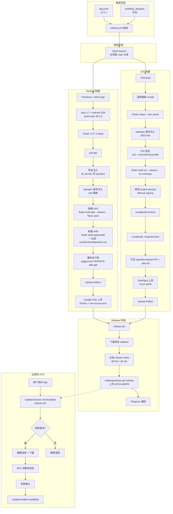
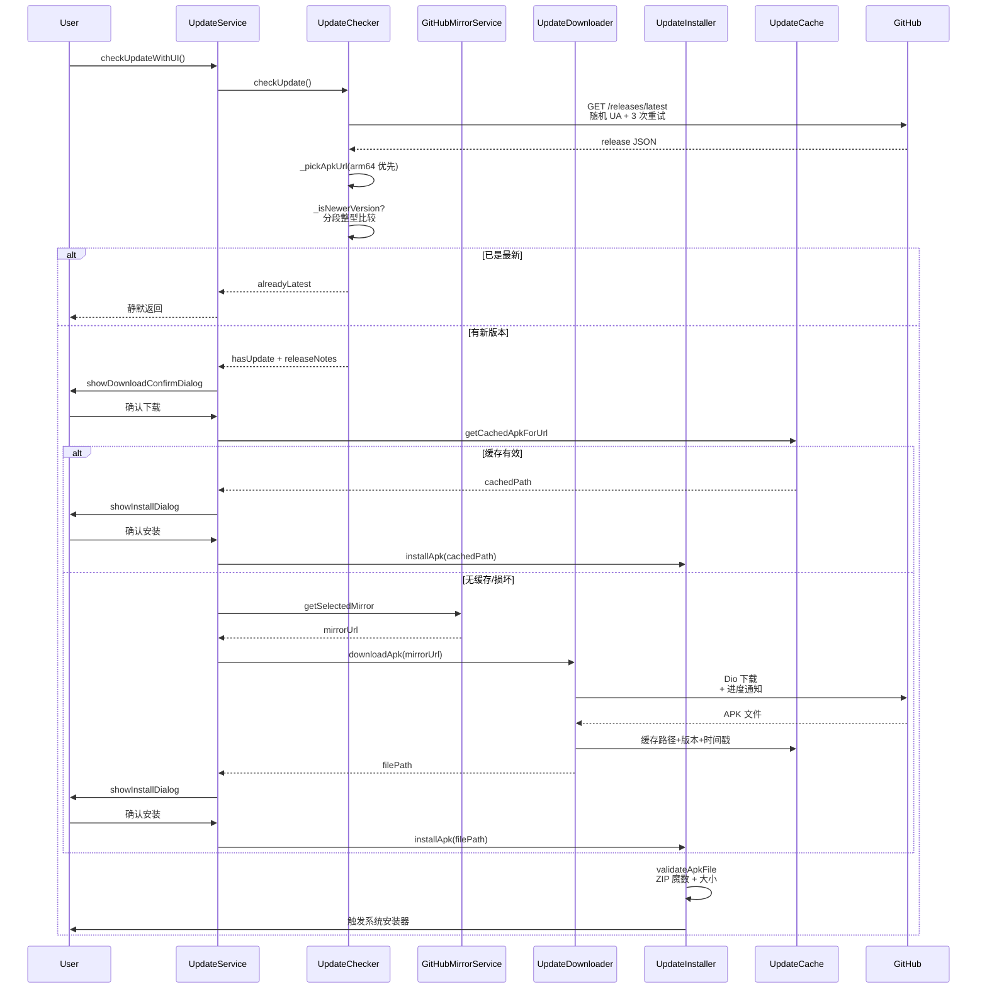

# 13. 构建发布

> 文档版本：v1.0
> 最后更新：2026-07-25
> 作者：wait
> 信息源：项目源码（d:\DevTools\project\PiggyCount）+ CI 配置文件

---

## 1. 背景

PiggyCount 是一款 Flutter 跨平台记账应用，同时支持 Android 与 iOS，并通过以下渠道分发：

| 渠道 | 平台 | 产物 | 上传方式 |
|---|---|---|---|
| GitHub Release | Android + iOS | APK（4 个 ABI 拆分）+ AAB + IPA | softprops/action-gh-release |
| Google Play | Android | AAB | Python + google-api-python-client |
| TestFlight | iOS | 签名 IPA | xcrun altool |
| 应用内 OTA | Android | APK | GitHub Releases + 镜像加速 |

构建发布流程需要解决以下问题：
1. **多渠道构建**：同一份代码生成 Android APK/AAB 与 iOS IPA
2. **多 Flavor 区分**：dev（测试）与 prod（生产）双包共存
3. **代码签名**：Android keystore 与 iOS 证书/Profile 从 GitHub Secrets 注入
4. **版本管理**：基于 git tag 自动注入版本号与构建号
5. **Google Play 合规**：AAB 构建时移除特定权限
6. **国内网络优化**：GitHub 镜像加速 APK 下载
7. **完整 OTA 流程**：应用内检查更新 + 下载 + 安装

本文档详细梳理项目构建配置、CI/CD 流程、产物命名规则、应用更新机制，为发布新版本、排查构建问题、新增分发渠道提供参考。

---

## 2. 核心概念

| 概念 | 含义 |
|---|---|
| **Flavor** | Android Gradle productFlavors，区分 dev/prod 双包 |
| **ABI Splits** | APK 按指令集拆分（arm64-v8a / armeabi-v7a / x86_64 / universal） |
| **AAB** | Android App Bundle，Google Play 分发格式 |
| **--dart-define** | Flutter 编译期环境变量注入机制 |
| **CI_VERSION / GIT_COMMIT / BUILD_TIME** | 通过 dart-define 注入的构建元数据 |
| **GOOGLE_PLAY** | AAB 构建专用 dart-define，用于关闭应用内更新入口 |
| **GitHub Secrets** | CI 中存储签名证书、密码等敏感信息 |
| **provisioning profile** | iOS 分发证书关联的描述文件 |
| **OTA 更新** | Over-The-Air 应用内更新，PiggyCount 通过 GitHub Releases 实现 |

---

## 3. 整体构建发布流程



---

## 4. 构建配置详细设计

### 4.1 项目构建配置（pubspec.yaml）

**实现位置**：[pubspec.yaml](file:///d:/DevTools/project/PiggyCount/pubspec.yaml)

- **应用名**：`piggycount`（第 1 行）
- **初始版本**：`version: 0.0.1`（第 4 行，CI 构建时会通过 `sed` 覆盖为 tag + run_number）
- **Dart SDK**：`^3.6.0`（第 7 行）
- **关键依赖**：drift、supabase_flutter、flutter_riverpod、in_app_purchase、flutter_local_notifications、home_widget、webview_flutter、local_auth、record 等
- **本地路径包**：`flutter_ai_kit`、`flutter_cloud_sync` 及其各后端实现
- **dev_dependencies**：build_runner、drift_dev、flutter_launcher_icons、mocktail、integration_test
- **dependency_overrides**：
  - `record_platform_interface: 1.2.0`（修复 record_linux 兼容性）
  - `image_cropper_platform_interface: 7.1.0`（钉死兼容 Flutter < 3.27.6）
- **flutter_launcher_icons 配置**：`android: true`，`ios: false`（iOS 图标手工维护）

### 4.2 Android 构建配置

#### 4.2.1 android/app/build.gradle 关键配置

**实现位置**：[android/app/build.gradle](file:///d:/DevTools/project/PiggyCount/android/app/build.gradle)

| 配置项 | 值 | 说明 |
|---|---|---|
| namespace / applicationId | `com.wait.piggycount` | 主包名 |
| compileSdk | 36 | 编译 SDK |
| ndkVersion | "27.0.12077973" | NDK 版本 |
| minSdk | 23 | record_android 录音需要 |
| targetSdk | flutter.targetSdkVersion | 跟随 Flutter |
| Java/Kotlin | VERSION_17 | 启用 coreLibraryDesugaring |

**默认 flavor 策略**：`missingDimensionStrategy "env", "dev"`（避免 Flutter 调试找不到 APK）

#### 4.2.2 signingConfigs（签名配置）

**实现位置**：[android/app/build.gradle:82-136](file:///d:/DevTools/project/PiggyCount/android/app/build.gradle)

```gradle
// 优先读 key.properties（不提交 VCS）
def keystoreProperties = new Properties()
def keystorePropertiesFile = rootProject.file('key.properties')
if (keystorePropertiesFile.exists()) {
    keystoreProperties.load(new FileInputStream(keystorePropertiesFile))
}

// CI/本地兜底：若无 key.properties，自动生成 ci-debug.keystore
// keytool RSA-2048，10000 天有效期，密码 android，alias androiddebugkey
// 极端兜底：用 ~/.android/debug.keystore
// 全部失败则输出 unsigned APK
```

**Secrets**：
- `ANDROID_KEYSTORE_BASE64`：keystore 文件 base64 编码
- `ANDROID_KEYSTORE_PASSWORD` / `ANDROID_KEY_ALIAS` / `ANDROID_KEY_PASSWORD`

#### 4.2.3 buildTypes（构建类型）

**实现位置**：[android/app/build.gradle:138-153](file:///d:/DevTools/project/PiggyCount/android/app/build.gradle)

| 类型 | 配置 |
|---|---|
| `debug` | 追加 `.debug` 后缀、`-debug` versionName 后缀、应用名 "小猪记账测试版" |
| `release` | 使用 `signingConfigs.release`、`minifyEnabled true`、`shrinkResources true`、ProGuard `proguard-android-optimize.txt` |

#### 4.2.4 splits.abi（关键设计）

**实现位置**：[android/app/build.gradle:73-80](file:///d:/DevTools/project/PiggyCount/android/app/build.gradle)

```gradle
splits {
    abi {
        enable = !gradle.startParameter.taskNames.any { it.toLowerCase().contains("bundle") }
        reset()
        include 'arm64-v8a', 'armeabi-v7a', 'x86_64'
        universalApk true
    }
}
```

**说明**：APK 构建开启 ABI splits，AAB（bundle）构建关闭（避免 R8 重复产 shrunk-resources 报错）。

#### 4.2.5 16KB 页面大小支持

**实现位置**：[android/app/build.gradle:156-160](file:///d:/DevTools/project/PiggyCount/android/app/build.gradle)

```gradle
packaging {
    jniLibs {
        useLegacyPackaging = true
    }
}
```

#### 4.2.6 variantFilter

**实现位置**：[android/app/build.gradle:165-170](file:///d:/DevTools/project/PiggyCount/android/app/build.gradle)

```gradle
variantFilter { variant ->
    if (variant.name == "prodDebug") {
        variant.ignore = true  // 忽略 prodDebug，让 flutter run 默认走 devDebug
    }
}
```

#### 4.2.7 APK 命名规则

**实现位置**：[android/app/build.gradle:178-202](file:///d:/DevTools/project/PiggyCount/android/app/build.gradle)

| ABI | 命名 |
|---|---|
| arm64-v8a | `app-<flavor>-release-v<ver>(<code>).apk`（主分发保持原名） |
| armeabi-v7a / x86_64 | `app-<flavor>-<abi>-release-v<ver>(<code>).apk` |
| universal | `app-<flavor>-universal-release-v<ver>(<code>).apk` |

### 4.3 AndroidManifest.xml

**实现位置**：[android/app/src/main/AndroidManifest.xml](file:///d:/DevTools/project/PiggyCount/android/app/src/main/AndroidManifest.xml)

- **application label**：`@string/app_name`（由 flavor 的 resValue 注入）
- **关键权限**：INTERNET、RECORD_AUDIO、WRITE_EXTERNAL_STORAGE（maxSdk=29）、READ_MEDIA_IMAGES、READ_EXTERNAL_STORAGE（maxSdk=32）、**REQUEST_INSTALL_PACKAGES**、POST_NOTIFICATIONS、SCHEDULE_EXACT_ALARM、USE_EXACT_ALARM、REQUEST_IGNORE_BATTERY_OPTIMIZATIONS、USE_BIOMETRIC 等
- **MainActivity**：`singleTask` 启动模式、URL Scheme `piggycount://`、接收图片分享 intent-filter
- **FileProvider**：authorities `${applicationId}.fileprovider`（支持按 flavor 切换）
- **桌面小组件**：`PiggyCountWidgetProvider`
- **queries**：声明 PROCESS_TEXT、VIEW https/http、SENDTO mailto（解决 url_launcher 在 Android 11+ 包可见性限制）

**flavor 目录结构**：项目根目录下**仅存在 `main/`、`debug/`、`profile/` 三个 sourceSet**（不含 `prod/`、`dev/` 静态目录）。`prod/` 目录在 CI 构建 AAB 时**动态生成并删除**。

### 4.4 iOS 构建配置

#### 4.4.1 ios/Runner/Info.plist

**实现位置**：[ios/Runner/Info.plist](file:///d:/DevTools/project/PiggyCount/ios/Runner/Info.plist)

| 配置项 | 值 | 说明 |
|---|---|---|
| CFBundleDisplayName / CFBundleName | `$(APP_DISPLAY_NAME)` | 由 Debug/Release.xcconfig 注入 |
| CFBundleShortVersionString | `$(FLUTTER_BUILD_NAME)` | Flutter 注入版本名 |
| CFBundleVersion | `$(FLUTTER_BUILD_NUMBER)` | Flutter 注入构建号 |
| CFBundleIdentifier | `$(PRODUCT_BUNDLE_IDENTIFIER)` | 由 xcconfig 注入 |
| CFBundleLocalizations | en、zh-Hans、zh-Hant | 解决 App Store 2.3.8 审核 |
| URL Scheme | `piggycount` | Deep Link |
| iCloud 容器 | `iCloud.com.wait.piggycount` | CloudDocuments |
| 隐私描述 | 照片库、相机、麦克风、Face ID | iOS 必需 |
| NSAppTransportSecurity | `NSAllowsArbitraryLoads=true` | Supabase 用 |

#### 4.4.2 Debug.xcconfig 与 Release.xcconfig

**实现位置**：
- [ios/Flutter/Debug.xcconfig](file:///d:/DevTools/project/PiggyCount/ios/Flutter/Debug.xcconfig)
- [ios/Flutter/Release.xcconfig](file:///d:/DevTools/project/PiggyCount/ios/Flutter/Release.xcconfig)

```
// Debug.xcconfig
APP_DISPLAY_NAME=小猪记账测试版
PRODUCT_BUNDLE_IDENTIFIER=com.wait.piggycount.dev
#include "Generated.xcconfig"

// Release.xcconfig
APP_DISPLAY_NAME=小猪记账
PRODUCT_BUNDLE_IDENTIFIER=com.wait.piggycount
#include "Generated.xcconfig"
```

**iOS flavor 同步策略**：iOS 端**没有用 Xcode flavor/scheme**，而是通过 `Debug` 与 `Release` 两个 build configuration 直接区分 dev/prod：
- Debug：`com.wait.piggycount.dev`，显示名 "小猪记账测试版"
- Release：`com.wait.piggycount`，显示名 "小猪记账"

#### 4.4.3 project.pbxproj 关键配置

**实现位置**：[ios/Runner.xcodeproj/project.pbxproj](file:///d:/DevTools/project/PiggyCount/ios/Runner.xcodeproj/project.pbxproj)

| 配置项 | 值 |
|---|---|
| DEVELOPMENT_TEAM | `JS3KDL8437` |
| CODE_SIGN_STYLE | `Automatic`（仓库默认；CI 改为 `Manual`） |
| CODE_SIGN_IDENTITY | `iPhone Developer` / `Apple Development`（CI 改为 `Apple Distribution`） |
| CURRENT_PROJECT_VERSION | `$(FLUTTER_BUILD_NUMBER)` |
| 主应用 PRODUCT_BUNDLE_IDENTIFIER | `$(PRODUCT_BUNDLE_IDENTIFIER)`（来自 xcconfig） |
| Widget Extension | `com.wait.piggycount.PiggyCountWidgetExtension`（Release） |
| Widget Extension (Debug) | `com.wait.piggycount.dev.PiggyCountWidgetExtension` |
| IPHONEOS_DEPLOYMENT_TARGET | 15.5 |

#### 4.4.4 ios/Runner/Runner.entitlements

**实现位置**：[ios/Runner/Runner.entitlements](file:///d:/DevTools/project/PiggyCount/ios/Runner/Runner.entitlements)

- iCloud 容器 `iCloud.com.wait.piggycount`，CloudDocuments 服务
- App Group：`group.com.wait.piggycount`（与 Widget 共享数据）

#### 4.4.5 ios/Podfile

**实现位置**：[ios/Podfile](file:///d:/DevTools/project/PiggyCount/ios/Podfile)

- **platform :ios, '15.5'**（注释说明：保留 15.5 是因 AppIntents API 仍要 iOS 16+ 弱链接 + 运行时回退）
- `project 'Runner'` 映射 Debug/Profile/Release
- **permission_handler GCC_PREPROCESSOR_DEFINITIONS**：仅启用 CAMERA、MICROPHONE、PHOTOS、NOTIFICATIONS（避免 App Store 审核拒）
- sqlite3 警告抑制

#### 4.4.6 iOS 本地化应用名

**实现位置**：`ios/Runner/{en,zh-Hans,zh-Hant}.lproj/InfoPlist.strings`

- `en.lproj/InfoPlist.strings`：`"PiggyCount"`（解决 App Store 2.3.8 英文环境显示问题）
- `zh-Hans.lproj/InfoPlist.strings`：`"小猪记账"`
- `zh-Hant.lproj/InfoPlist.strings`：`"小豬記帳"`

---

## 5. CI/CD 流程

项目共有三个 workflow：

### 5.1 release.yml（主发布流程）

**实现位置**：[.github/workflows/release.yml](file:///d:/DevTools/project/PiggyCount/.github/workflows/release.yml)

**触发**：tag push (`*`) 或 workflow_dispatch（手动，可选 tag_name、release_name、prerelease、create_release 输入）
**并发**：`cancel-in-progress: true`
**权限**：`contents: write`
**Flutter 版本**：`3.27.3`

#### 5.1.1 Job 1：check-branch

手动触发时校验当前分支必须是 main。

#### 5.1.2 Job 2：android

1. Checkout（fetch-depth=0、fetch-tags=true）
2. 元数据准备：tag 触发取 tag，手动触发取 input 或 `manual-<short_sha>`
3. Java 17 (Zulu) + Android SDK + build-tools 35.0.0 + platforms android-35/36
4. Flutter setup + pub get
5. **签名注入**（第 109-130 行）：从 secrets 写入 `android/app/ci-release.keystore` 和 `android/key.properties`
6. **pubspec 版本注入**（第 132-146 行）：`sed -i "s/^version: .*/version: ${CLEAN_VERSION}+${BUILD_NUMBER}/" pubspec.yaml`
7. **构建 APK**（第 148-158 行）：`flutter build apk --release --flavor prod` + 三个 dart-define
8. **构建 AAB**（第 160-194 行）—— 关键技术细节：
   - 动态生成 `android/app/src/prod/AndroidManifest.xml`，通过 `tools:node="remove"` 移除以下权限：
     - `REQUEST_INSTALL_PACKAGES`（Google Play 不需要应用内安装）
     - `READ_MEDIA_IMAGES/VIDEO/AUDIO`、`READ_EXTERNAL_STORAGE`（截屏自动记账功能在 Google Play 版本被砍掉，符合 Photo & Video Permissions 政策）
   - 增加 `--dart-define=GOOGLE_PLAY=true`
   - 构建后 `rm -rf android/app/src/prod` 清理
9. **重命名产物**（第 205-246 行）
10. **Upload Artifact**（第 248-255 行）：`actions/upload-artifact@v4`
11. **Google Play 上传**（第 257-351 行）

#### 5.1.3 Job 3：ios

1. Checkout + 元数据（同 Android）
2. **选择最新 Xcode**：`ls -d /Applications/Xcode*.app | sort -V | tail -1` + `sudo xcode-select -s`
3. Flutter setup + pub-cache 缓存
4. pubspec 版本注入（macOS sed 用 `sed -i ""`）
5. **iOS 签名**（第 442-546 行）
6. **flutter build ios --release --no-codesign**（第 548-556 行）
7. **动态修改 project.pbxproj 配置手动签名**（第 558-594 行）：sed 改 CODE_SIGN_STYLE 为 Manual、CODE_SIGN_IDENTITY 为 Apple Distribution，perl 注入 DEVELOPMENT_TEAM 和 PROVISIONING_PROFILE_SPECIFIER
8. **xcodebuild archive**（第 596-619 行）：`xcodebuild archive -workspace ios/Runner.xcworkspace -scheme Runner -configuration Release -archivePath build/ios/Runner.xcarchive`
9. **xcodebuild -exportArchive**（第 621-657 行）：使用动态生成的 `ios/ExportOptions.plist`，method=app-store，manual signing
10. **复制签名 IPA**：`piggycount-${VERSION}-signed.ipa`（第 659-674 行）
11. **Keychain 清理**（第 676-679 行）：`security delete-keychain`
12. **iOS Debug Simulator 构建**：`flutter build ios --debug --simulator`（第 681-689 行）
13. **打包 Runner.app（unsigned）**：`ditto -c -k` 生成 `piggycount-${VERSION}-iphoneos.app.zip`，再用 zip 生成 `piggycount-${VERSION}-unsigned.ipa`（第 691-707 行）
14. **打包 Simulator 版本**：`piggycount-${VERSION}-iphonesimulator.app.zip`（第 709-720 行）
15. **TestFlight 上传**（第 722-750 行）：`xcrun altool --upload-app`
16. **Upload Artifact**（第 752-760 行）

#### 5.1.4 Job 4：release

1. 依赖 check-branch、android、ios 都成功
2. 准备 release metadata：tag 触发 prerelease=false、create_release=true；手动触发 prerelease 默认 true、create_release 默认 false
3. 下载 android、ios artifacts
4. **生成 release notes**（第 843-874 行）：`git log --no-merges`，逐 commit 通过 `gh api` 反查 GitHub 登录名生成 `[@login](url)`，写入 `RELEASE_NOTES.md`
5. **softprops/action-gh-release@v2**（第 876-889 行）：上传 `dist/android/**/*.apk`、`dist/android/**/*.aab`、`dist/ios/*`
6. **Telegram 通知**（第 891-934 行）：`curl -s -X POST https://api.telegram.org/bot.../sendMessage`，含 emoji、commit 列表（URL 编码）

### 5.2 其他 workflow

- **pullfrog.yml**：第三方 Pullfrog AI agent 集成（workflow_dispatch 触发），与构建发布流程无直接关系
- **issue-lint.yml**：Issue 质量校验，标题 < 14 字符、过于模糊、正文去模板后 < 40 字符则打 `needs-info` label + 中英双语 bot 评论

---

## 6. 构建命令

### 6.1 APK 构建（含 ABI splits）

```bash
flutter build apk --release --flavor prod \
  --dart-define=CI_VERSION="$CI_VERSION" \
  --dart-define=GIT_COMMIT="$GIT_COMMIT" \
  --dart-define=BUILD_TIME="$BUILD_TIME"
```

**来源**：[release.yml 第 155-158 行](file:///d:/DevTools/project/PiggyCount/.github/workflows/release.yml)

Gradle `splits.abi` 自动产出 4 个 APK（arm64-v8a、armeabi-v7a、x86_64、universal）。

### 6.2 AAB 构建（Google Play）

```bash
flutter build appbundle --release --flavor prod \
  --dart-define=CI_VERSION="$CI_VERSION" \
  --dart-define=GIT_COMMIT="$GIT_COMMIT" \
  --dart-define=BUILD_TIME="$BUILD_TIME" \
  --dart-define=GOOGLE_PLAY=true
```

**来源**：[release.yml 第 187-191 行](file:///d:/DevTools/project/PiggyCount/.github/workflows/release.yml)

`GOOGLE_PLAY=true` 用于在 Dart 代码中通过 `bool.fromEnvironment('GOOGLE_PLAY')` 隐藏应用内更新入口与截屏自动记账功能。

### 6.3 iOS 构建

- 第一步（无签名）：`flutter build ios --release --no-codesign`
- 第二步（archive）：`xcodebuild archive -workspace ios/Runner.xcworkspace -scheme Runner -configuration Release -archivePath build/ios/Runner.xcarchive`
- 第三步（export）：`xcodebuild -exportArchive -archivePath build/ios/Runner.xcarchive -exportPath build/ios/ipa -exportOptionsPlist ios/ExportOptions.plist`
- iOS Simulator 构建：`flutter build ios --debug --simulator`

### 6.4 --dart-define 配置

| 变量名 | 来源 | 用途 |
|--------|------|------|
| `CI_VERSION` | tag_name | 真实版本号（替换 pubspec 的 0.0.1） |
| `GIT_COMMIT` | github.sha | 构建对应的 commit hash |
| `BUILD_TIME` | github.run_id | 构建时间标识 |
| `GOOGLE_PLAY` | "true"（仅 AAB） | 渠道标识，关闭应用内更新 / 截屏记账 |

---

## 7. 多 Flavor 配置

### 7.1 Android flavor

**实现位置**：[android/app/build.gradle:46-57](file:///d:/DevTools/project/PiggyCount/android/app/build.gradle)

```gradle
flavorDimensions += ["env"]
productFlavors {
    dev {
        dimension "env"
        applicationIdSuffix ".dev"
        resValue "string", "app_name", "小猪记账测试版"
    }
    prod {
        dimension "env"
        resValue "string", "app_name", "小猪记账"
    }
}
```

| Flavor | applicationId | app_name | sourceSet 目录 |
|--------|---------------|----------|----------------|
| dev | `com.wait.piggycount.dev` | 小猪记账测试版 | 无（共享 main） |
| prod | `com.wait.piggycount` | 小猪记账 | CI 时动态创建 prod/AndroidManifest.xml |

**关键设计**：flavor 不通过独立 sourceSet 区分，而是用 `resValue` 注入 `app_name` 字符串资源，main AndroidManifest 引用 `@string/app_name`。`applicationIdSuffix ".dev"` 给 dev 加包名后缀，与生产包共存。

### 7.2 iOS flavor 同步

iOS 不使用 Xcode scheme flavor，而是用 Debug/Release 配置区分：
- Debug = dev（`com.wait.piggycount.dev`，"小猪记账测试版"）
- Release = prod（`com.wait.piggycount`，"小猪记账"）
- 实现：[ios/Flutter/Debug.xcconfig](file:///d:/DevTools/project/PiggyCount/ios/Flutter/Debug.xcconfig) 与 [Release.xcconfig](file:///d:/DevTools/project/PiggyCount/ios/Flutter/Release.xcconfig)

### 7.3 图标差异

- Android：dev/prod 共用同一套 launcher icon（不分 flavor），通过 `flutter_launcher_icons` 生成
- iOS：手工维护，不分 Debug/Release 图标
- 生成脚本：`scripts/gen_adaptive_icons.py`（生成 1024x1024 前景 + monochrome 线框版）

### 7.4 prod flavor 的临时 Manifest

**实现位置**：[release.yml 第 170-185 行](file:///d:/DevTools/project/PiggyCount/.github/workflows/release.yml)

CI 构建 AAB 前动态写入 `android/app/src/prod/AndroidManifest.xml`，用 `tools:node="remove"` 移除：
- `REQUEST_INSTALL_PACKAGES`
- `READ_MEDIA_IMAGES` / `READ_MEDIA_VIDEO` / `READ_MEDIA_AUDIO`
- `READ_EXTERNAL_STORAGE`

构建后立即 `rm -rf android/app/src/prod` 清理，不影响其他构建。

---

## 8. 版本管理

### 8.1 pubspec.yaml version 字段

**实现位置**：[pubspec.yaml 第 4 行](file:///d:/DevTools/project/PiggyCount/pubspec.yaml)

```yaml
version: 0.0.1
```

仓库中固定为 `0.0.1`，仅作为本地开发占位。

### 8.2 CI 自动更新版本号策略

**实现位置**：[release.yml 第 132-146 行](file:///d:/DevTools/project/PiggyCount/.github/workflows/release.yml)（Android）、第 427-440 行（iOS）

```bash
CLEAN_VERSION=${VERSION#v}              # 去掉 tag 前缀 v
BUILD_NUMBER=${{ github.run_number }}   # GitHub Actions 运行编号
sed -i "s/^version: .*/version: ${CLEAN_VERSION}+${BUILD_NUMBER}/" pubspec.yaml
```

- tag `v3.2.1` + run_number `42` → `version: 3.2.1+42`
- iOS 用 `sed -i ""`（BSD sed 语法）
- 构建前 `cp pubspec.yaml pubspec.yaml.backup` 备份

### 8.3 构建号

**取自 `github.run_number`**（每次 workflow 运行自动递增的整数），用作 Flutter `versionCode` / iOS `CURRENT_PROJECT_VERSION`（即 `$(FLUTTER_BUILD_NUMBER)`）。

### 8.4 运行时版本读取

**实现位置**：[lib/services/update/update_checker.dart:222-233](file:///d:/DevTools/project/PiggyCount/lib/services/update/update_checker.dart)

```dart
static Future<AppInfo> _getAppInfo() async {
  final p = await PackageInfo.fromPlatform();
  final commit = const String.fromEnvironment('GIT_COMMIT');
  final buildTime = const String.fromEnvironment('BUILD_TIME');
  final ciVersion = const String.fromEnvironment('CI_VERSION');

  final version = ciVersion.isNotEmpty ? ciVersion : 'dev-${p.version}';
  return AppInfo(version, p.buildNumber,
      commit: commit.isEmpty ? null : commit,
      buildTime: buildTime.isEmpty ? null : buildTime);
}
```

- 优先使用 CI 注入的 `CI_VERSION`，否则显示 `dev-{pubspec版本}`
- 同样逻辑在 [lib/pages/settings/about_page.dart:460-474](file:///d:/DevTools/project/PiggyCount/lib/pages/settings/about_page.dart) 重复实现

---

## 9. 代码签名

### 9.1 Android keystore 配置

**配置文件**：`android/key.properties`（不提交 VCS，CI 动态生成）

**CI 注入流程**（[release.yml 第 109-130 行](file:///d:/DevTools/project/PiggyCount/.github/workflows/release.yml)）：

```bash
echo "$ANDROID_KEYSTORE_BASE64" | base64 -d > android/app/ci-release.keystore
printf '%s\n' \
  'storeFile=ci-release.keystore' \
  "storePassword=${ANDROID_KEYSTORE_PASSWORD}" \
  "keyAlias=${ANDROID_KEY_ALIAS}" \
  "keyPassword=${ANDROID_KEY_PASSWORD}" \
  > android/key.properties
```

**Secrets**：
- `ANDROID_KEYSTORE_BASE64`：keystore 文件 base64 编码
- `ANDROID_KEYSTORE_PASSWORD` / `ANDROID_KEY_ALIAS` / `ANDROID_KEY_PASSWORD`

**Gradle 端读取**（[build.gradle 第 8-13 行](file:///d:/DevTools/project/PiggyCount/android/app/build.gradle)）：通过 `Properties` 加载 `rootProject.file('key.properties')`。

**兜底**（无 secrets 时）：自动生成 `ci-debug.keystore`，保证 CI 不失败但产物不可上 Play。

### 9.2 iOS 签名

**实现位置**：[release.yml 第 442-546 行](file:///d:/DevTools/project/PiggyCount/.github/workflows/release.yml)

**Secrets**：
- `APPLE_CERTIFICATE_P12`：分发证书 P12 base64
- `APPLE_CERTIFICATE_PASSWORD`：P12 密码
- `APPLE_PROVISIONING_PROFILE`：主应用 provisioning profile base64
- `APPLE_PROVISIONING_PROFILE_WIDGET`：Widget Extension profile base64
- `APPLE_TEAM_ID`：`JS3KDL8437`

**流程**：
1. 创建临时 keychain：`security create-keychain` + `set-keychain-settings -lut 21600`
2. 导入 P12 证书：`security import $CERTIFICATE_PATH -P "$IOS_P12_PASSWORD" -A -t cert -f pkcs12 -k $KEYCHAIN_PATH`
3. 安装 provisioning profile：`security cms -D` 提取 UUID，复制到 `~/Library/MobileDevice/Provisioning Profiles/${PP_UUID}.mobileprovision`
4. 安装 Widget provisioning profile（同上）
5. `security set-key-partition-list -S apple-tool:,apple:,codesign:`
6. 动态生成 `ios/ExportOptions.plist`（method=app-store、signingStyle=manual、signingCertificate=Apple Distribution、provisioningProfiles 指定 PiggyCount_AppStore 和 PiggyCount_Widget_AppStore）

**project.pbxproj 修改**（[release.yml 第 558-594 行](file:///d:/DevTools/project/PiggyCount/.github/workflows/release.yml)）：
- sed 改 `CODE_SIGN_STYLE = Automatic` → `Manual`
- sed 改 `CODE_SIGN_IDENTITY[sdk=iphoneos*]` 从 `iPhone Developer` → `Apple Distribution`
- perl 为所有 buildSettings 插入 `DEVELOPMENT_TEAM = ${APPLE_TEAM_ID}`
- perl 在 `PRODUCT_BUNDLE_IDENTIFIER = com.wait.piggycount.PiggyCountWidgetExtension` 前插入 `PROVISIONING_PROFILE_SPECIFIER = "PiggyCount_Widget_AppStore"`
- 在 `CODE_SIGN_ENTITLEMENTS = Runner/Runner.entitlements` 前插入 `PROVISIONING_PROFILE_SPECIFIER = "PiggyCount_AppStore"`

**清理**：`security delete-keychain $RUNNER_TEMP/app-signing.keychain-db`

### 9.3 Google Play 服务账号

**实现位置**：[release.yml 第 257-349 行](file:///d:/DevTools/project/PiggyCount/.github/workflows/release.yml)

**Secret**：`GOOGLE_PLAY_SERVICE_ACCOUNT_JSON`（Google Play Developer API 服务账户 JSON）

**使用方式**：base64 解码后写入 `/tmp/service-account.json`，传给 Python 脚本作为 `service_account.Credentials.from_service_account_file` 凭据。

---

## 10. 产物命名规则

### 10.1 Android APK 命名

**实现位置**：[release.yml 第 205-246 行](file:///d:/DevTools/project/PiggyCount/.github/workflows/release.yml)

| Gradle 内部名 | 重命名为 | 说明 |
|--------------|---------|------|
| `app-prod-release-v<ver>(<code>).apk` | `piggycount-<VERSION>.apk` | arm64-v8a 主分发 |
| `app-prod-armeabi-v7a-release-v<ver>(<code>).apk` | `piggycount-<VERSION>-armeabi-v7a.apk` | armv7 老设备 |
| `app-prod-x86_64-release-v<ver>(<code>).apk` | `piggycount-<VERSION>-x86_64.apk` | Intel/模拟器 |
| `app-prod-universal-release-v<ver>(<code>).apk` | `piggycount-<VERSION>-universal.apk` | 三 ABI 兜底 |

### 10.2 AAB 命名

**实现位置**：[release.yml 第 240-244 行](file:///d:/DevTools/project/PiggyCount/.github/workflows/release.yml)

- `app-prod-release.aab` → `piggycount-<VERSION>.aab`（AAB 不按 ABI 拆，Google Play 按设备分发）

### 10.3 iOS 产物命名

**实现位置**：[release.yml 第 659-674、691-720 行](file:///d:/DevTools/project/PiggyCount/.github/workflows/release.yml)

| 产物 | 命名 | 实现方式 |
|------|------|---------|
| 签名 IPA | `piggycount-<VERSION>-signed.ipa` | xcodebuild -exportArchive 后 `cp` |
| 未签名 IPA | `piggycount-<VERSION>-unsigned.ipa` | `ditto` + `zip` 打包 Payload |
| 真机 .app.zip | `piggycount-<VERSION>-iphoneos.app.zip` | `ditto -c -k --sequesterRsrc --keepParent` |
| 模拟器 .app.zip | `piggycount-<VERSION>-iphonesimulator.app.zip` | 同上 |

---

## 11. 应用商店分发

### 11.1 Google Play 上传脚本

**实现位置**：[release.yml 第 257-351 行](file:///d:/DevTools/project/PiggyCount/.github/workflows/release.yml)

**触发条件**：`(github.event_name == 'push' && startsWith(github.ref, 'refs/tags/')) || github.event_name == 'workflow_dispatch'`

**实现方式**：内联 Python 脚本使用 `google-api-python-client`，主要流程：
1. `pip install google-auth google-auth-oauthlib google-auth-httplib2 google-api-python-client`
2. Python 脚本逻辑：
   - `service_account.Credentials.from_service_account_file('/tmp/service-account.json', scopes=['https://www.googleapis.com/auth/androidpublisher'])`
   - `service.edits().insert(...)` 创建编辑
   - `service.edits().bundles().upload(...)` 上传 AAB（MediaFileUpload resumable=True）
   - `service.edits().tracks().update(track='production', body={'releases': [{'versionCodes': [version_code], 'status': 'completed'}]})` 分配到 production track
   - `service.edits().commit(...)` 提交

**关键参数**：
- `PACKAGE_NAME = 'com.wait.piggycount'`
- `TRACK = 'production'`

**清理**：`rm -f /tmp/service-account.json /tmp/upload_to_play.py`

### 11.2 GitHub Release Artifacts

**实现位置**：[release.yml 第 876-889 行](file:///d:/DevTools/project/PiggyCount/.github/workflows/release.yml)

```yaml
- name: Create Release
  if: ${{ steps.meta.outputs.create_release == 'true' }}
  uses: softprops/action-gh-release@v2
  with:
    tag_name: ${{ steps.meta.outputs.tag_name }}
    name: ${{ steps.meta.outputs.release_name }}
    prerelease: ${{ steps.meta.outputs.prerelease == 'true' }}
    body_path: ${{ steps.notes.outputs.notes_file }}
    files: |
      dist/android/**/*.apk
      dist/android/**/*.aab
      dist/ios/*
```

### 11.3 TestFlight 上传

**实现位置**：[release.yml 第 722-750 行](file:///d:/DevTools/project/PiggyCount/.github/workflows/release.yml)

```bash
xcrun altool --upload-app \
  --type ios \
  --file "$IPA_FILE" \
  --username "$APPLE_ID" \
  --password "$APPLE_APP_SPECIFIC_PASSWORD" \
  --verbose
```

使用 APPLE_ID + APPLE_APP_SPECIFIC_PASSWORD（应用专用密码，非 2FA），比 App Store Connect API key 简单。

### 11.4 Telegram 通知

**实现位置**：[release.yml 第 891-934 行](file:///d:/DevTools/project/PiggyCount/.github/workflows/release.yml)

`curl -s -X POST https://api.telegram.org/bot${TELEGRAM_BOT_TOKEN}/sendMessage`，发送 Markdown 格式消息，含版本号、release 链接、commit 列表（URL 编码换行符 `%0A`）。

---

## 12. 应用更新机制（OTA）

**目录**：[lib/services/update/](file:///d:/DevTools/project/PiggyCount/lib/services/update/)（9 个文件）+ [lib/services/system/update_service.dart](file:///d:/DevTools/project/PiggyCount/lib/services/system/update_service.dart)（编排层）

### 12.1 update_checker.dart（版本检查）

**实现位置**：[lib/services/update/update_checker.dart](file:///d:/DevTools/project/PiggyCount/lib/services/update/update_checker.dart)

- **API**：`https://api.github.com/repos/TNT-Likely/PiggyCount/releases/latest`
- **重试机制**：最多 3 次，每次间隔 1 秒
- **User-Agent 随机化**：9 个真实浏览器 UA 池，按时间戳取模，避免 GitHub 限流
- **APK URL 选择策略**（`_pickApkUrl`）：
  1. 优先 `piggycount-<ver>.apk`（arm64 主包）
  2. 其次 `piggycount-<ver>-universal.apk`（兜底）
  3. 任意 `.apk`（最后兜底）

  **历史 bug 修复说明**：之前按字母序取第一个 APK，因 GitHub assets 字母序 `-armeabi-v7a.apk` 排第一，arm64 真机装上跑 32-bit 兼容层导致严重卡顿。

- **release notes 清理**（`_cleanReleaseNotes`）：移除 commit hash 链接、Full Changelog 行、空行
- **版本比较**（`_isNewerVersion`）：split by `.`，按段整型比较，缺失段补 0
- **版本归一化**（`_normalizeVersion`）：去 `v` 前缀、去 `dev-` 前缀、去 `-suffix`

### 12.2 update_downloader.dart（APK 下载）

**实现位置**：[lib/services/update/update_downloader.dart](file:///d:/DevTools/project/PiggyCount/lib/services/update/update_downloader.dart)

- 使用 **Dio** HTTP 客户端，超时：connect 30s、receive 10min（大文件）、send 2min
- **下载路径**：Android 用 `getExternalStorageDirectory()`，其他用 `getApplicationDocumentsDirectory()`
- **文件命名**：`PiggyCount_<fileName>.apk`，例如 `PiggyCount_v3.2.1.apk`
- **镜像加速**：先调 `GitHubMirrorService.getSelectedMirror()` 取镜像，再 `convertToMirrorUrl` 转换 URL
- **进度通知**：1% 阈值更新，避免频繁刷新
- **取消机制**：`CancelToken`，支持用户点击取消按钮
- **请求头伪装**：模拟浏览器 Referer `https://github.com/TNT-Likely/PiggyCount/releases`、随机 UA

### 12.3 update_installer.dart（APK 安装）

**实现位置**：[lib/services/update/update_installer.dart](file:///d:/DevTools/project/PiggyCount/lib/services/update/update_installer.dart)

- **双安装路径**：
  - 生产环境（`bool.fromEnvironment('dart.vm.product')`）：先尝试 `_installApkWithIntent`（MethodChannel 调原生 Android Intent），失败兜底 `OpenFilex.open`
  - 开发环境：直接 `OpenFilex.open`
- **原生 MethodChannel**：`com.wait.piggycount/install`，方法 `installApk`，参数 `filePath`
- **本地 APK 查找**（`showLocalApkInstallOption`）：扫描下载目录所有 PiggyCount APK，按修改时间排序
- **缓存 APK 安装**（`showCachedApkInstallOption`）：从 `UpdateCache` 取缓存路径，确认后安装，成功后清理缓存
- **完整日志埋点**：所有关键步骤打 `UPDATE_CRASH:` 前缀日志

### 12.4 update_cache.dart（版本检查缓存）

**实现位置**：[lib/services/update/update_cache.dart](file:///d:/DevTools/project/PiggyCount/lib/services/update/update_cache.dart)

- **SharedPreferences keys**：`cached_apk_path`、`cached_apk_version`、`cached_apk_timestamp`
- **APK 文件查找**：从 URL 提取版本号（正则 `piggycount-([0-9]+\.[0-9]+\.[0-9]+)\.apk`）
- **APK 完整性验证**：
  - 文件大小范围：5MB - 200MB
  - ZIP 魔数检查（`PK` = 0x50 0x4B）
  - 文件可读性检查
- **过期清理**：缓存超过 7 天自动清理

### 12.5 github_mirror_service.dart（GitHub 镜像加速）

**实现位置**：[lib/services/update/github_mirror_service.dart](file:///d:/DevTools/project/PiggyCount/lib/services/update/github_mirror_service.dart)

- **6 个镜像源**：
  1. `direct`：GitHub 直连（默认）
  2. `ghproxy`：`https://ghproxy.com/`
  3. `mirror_ghproxy`：`https://mirror.ghproxy.com/`
  4. `gh_ddlc`：`https://gh.ddlc.top/`
  5. `moeyy`：`https://github.moeyy.xyz/`
  6. `gh_proxy`：`https://gh-proxy.com/`
- **URL 转换**：直连返回原 URL，其他在前面加 `urlPrefix`
- **延迟测试**：HEAD 请求，10s 超时，记录毫秒级延迟，200/301/302 视为可用
- **并行测试所有镜像**：`Future.wait` 并行，按可用性 + 延迟排序
- **自动选最快**：测试后取可用列表第一个，保存到 SharedPreferences
- **持久化**：`SharedPreferences` key `github_mirror_selected`（默认 `direct`）

### 12.6 update_notifications.dart（更新通知）

**实现位置**：[lib/services/update/update_notifications.dart](file:///d:/DevTools/project/PiggyCount/lib/services/update/update_notifications.dart)

- **通知渠道**：`update_download`，Importance.low，无声音无振动
- **Android 13+ 权限请求**：`requestNotificationsPermission()`
- **进度通知**：`showProgressNotification(progress, indeterminate: false)`，maxProgress=100，每 1% 更新一次
- **完成通知**：Importance.high，含振动 + 声音
- **进度去重**：`shouldUpdateProgress` 阈值 1%，关键节点 0/100 强制更新

### 12.7 update_permissions.dart（安装权限）

**实现位置**：[lib/services/update/update_permissions.dart](file:///d:/DevTools/project/PiggyCount/lib/services/update/update_permissions.dart)

- **存储权限**：Android 10 及以下才申请 `Permission.storage`
- **安装权限**：`Permission.requestInstallPackages`
- **通知权限**：`Permission.notification`，被拒绝不阻塞下载，仅标记 `_notificationPermissionDenied` 用于显示引导

### 12.8 update_dialogs.dart（更新提示）

**实现位置**：[lib/services/update/update_dialogs.dart](file:///d:/DevTools/project/PiggyCount/lib/services/update/update_dialogs.dart)

- **`showInstallDialog`**：下载完成后的安装确认
- **`showNotificationGuideDialog`**：通知权限被拒后的引导（3 步图文教程）
- **`showDownloadConfirmDialog`**：发现新版本时的确认弹窗，含镜像选择入口
- **`showUpdateErrorWithFallback` / `showDownloadErrorWithFallback`**：错误弹窗，提供"去 GitHub"兜底
- **`launchGitHubReleases`**：`url_launcher` 打开 `https://github.com/TNT-Likely/PiggyCount/releases`
- **`showMirrorSelectDialog`**：镜像选择对话框，支持单选、延迟测试、进度显示

### 12.9 update_result.dart（结果模型）

**实现位置**：[lib/services/update/update_result.dart](file:///d:/DevTools/project/PiggyCount/lib/services/update/update_result.dart)

- `UpdateResult` 类：hasUpdate、success、message、filePath、version、downloadUrl、releaseNotes、type
- `UpdateResultType` 枚举：downloadSuccess、alreadyLatest、userCancelled、permissionDenied、downloadFailed、installFailed、checkFailed
- 工厂构造：`downloadSuccess`、`alreadyLatest`、`userCancelled`、`permissionDenied`、`downloadFailed`、`installFailed`、`checkFailed`
- `AppInfo` 类：version、buildNumber、commit、buildTime

### 12.10 update_service.dart（编排层）

**实现位置**：[lib/services/system/update_service.dart](file:///d:/DevTools/project/PiggyCount/lib/services/system/update_service.dart)

- **`checkUpdate`**：转发到 `UpdateChecker.checkUpdate`
- **`downloadAndInstallUpdate`**（第 68-305 行）：完整流程编排
  1. 权限检查（含通知权限被拒时显示引导）
  2. URL 版本号提取
  3. 缓存检查 → 完整性验证 → 损坏则询问重下、有效则询问安装
  4. 下载（带进度回调）
  5. 下载完成 → 等待 300ms → 安装确认弹窗 → 调用 `UpdateInstaller.installApk`
  6. 生产环境额外预检查（文件存在性、大小）
- **`checkUpdateWithUI`**（第 308-408 行）：UI 包装
  - 检测远程更新
  - 网络错误时提供 GitHub 兜底
  - 发现新版本 → 确认对话框 → 下载安装流程
  - 用户取消静默返回，不显示错误弹窗
- **`_localizeUpdateMessage`**：将 `__UPDATE_*__` 内部消息 key 翻译为本地化文案

---

## 13. 关键代码示例

### 13.1 完整 OTA 更新流程



### 13.2 Google Play 上传 Python 脚本

```python
# 内联在 release.yml 第 285-344 行
import sys
from google.oauth2 import service_account
from googleapiclient.discovery import build
from googleapiclient.http import MediaFileUpload

PACKAGE_NAME = 'com.wait.piggycount'
AAB_FILE = sys.argv[1]
TRACK = 'production'

# 认证
credentials = service_account.Credentials.from_service_account_file(
    '/tmp/service-account.json',
    scopes=['https://www.googleapis.com/auth/androidpublisher']
)

# 创建 API 客户端
service = build('androidpublisher', 'v3', credentials=credentials)

# 创建编辑
edit = service.edits().insert(body={}, packageName=PACKAGE_NAME).execute()
edit_id = edit['id']

# 上传 AAB
media = MediaFileUpload(AAB_FILE, mimetype='application/octet-stream', resumable=True)
bundle = service.edits().bundles().upload(
    packageName=PACKAGE_NAME, editId=edit_id, media_body=media
).execute()
version_code = bundle['versionCode']

# 分配到轨道
track_body = {
    'releases': [{'versionCodes': [version_code], 'status': 'completed'}]
}
service.edits().tracks().update(
    packageName=PACKAGE_NAME, editId=edit_id,
    track=TRACK, body=track_body
).execute()

# 提交编辑
service.edits().commit(packageName=PACKAGE_NAME, editId=edit_id).execute()
```

### 13.3 镜像加速选择

```dart
// 6 个镜像源
static const List<MirrorOption> _mirrors = [
  MirrorOption(key: 'direct', name: 'GitHub 直连', urlPrefix: ''),
  MirrorOption(key: 'ghproxy', name: 'ghproxy.com', urlPrefix: 'https://ghproxy.com/'),
  MirrorOption(key: 'mirror_ghproxy', name: 'mirror.ghproxy.com', urlPrefix: 'https://mirror.ghproxy.com/'),
  MirrorOption(key: 'gh_ddlc', name: 'gh.ddlc.top', urlPrefix: 'https://gh.ddlc.top/'),
  MirrorOption(key: 'moeyy', name: 'github.moeyy.xyz', urlPrefix: 'https://github.moeyy.xyz/'),
  MirrorOption(key: 'gh_proxy', name: 'gh-proxy.com', urlPrefix: 'https://gh-proxy.com/'),
];

// 并行测试所有镜像延迟
static Future<List<MirrorTestResult>> testAllMirrors(String testUrl) async {
  final results = await Future.wait(
    _mirrors.map((m) => testMirrorLatency(m, testUrl)),
  );
  results.sort((a, b) {
    if (a.available != b.available) return a.available ? -1 : 1;
    return a.latencyMs.compareTo(b.latencyMs);
  });
  return results;
}

// 自动选最快
static Future<String> selectFastestMirror(String testUrl) async {
  final results = await testAllMirrors(testUrl);
  if (results.isEmpty || !results.first.available) return 'direct';
  await setSelectedMirror(results.first.option.key);
  return results.first.option.key;
}
```

---

## 14. 环境变量

### 14.1 --dart-define 用法

**注入位置**：[release.yml](file:///d:/DevTools/project/PiggyCount/.github/workflows/release.yml)（Android 第 150-158、187-191 行；iOS 第 550-556、684-689 行）

| 变量名 | 类型 | 默认 | 来源 |
|--------|------|------|------|
| `CI_VERSION` | String | "" | tag_name |
| `GIT_COMMIT` | String | "" | github.sha |
| `BUILD_TIME` | String | "" | github.run_id |
| `GOOGLE_PLAY` | bool | false | "true"（仅 AAB） |

### 14.2 代码读取位置

**`String.fromEnvironment` 使用文件**：
- [lib/services/update/update_checker.dart:224-226](file:///d:/DevTools/project/PiggyCount/lib/services/update/update_checker.dart)：`GIT_COMMIT`、`BUILD_TIME`、`CI_VERSION`
- [lib/services/system/update_service.dart](file:///d:/DevTools/project/PiggyCount/lib/services/system/update_service.dart)：`dart.vm.product`、`flavor`
- [lib/services/update/update_installer.dart:48](file:///d:/DevTools/project/PiggyCount/lib/services/update/update_installer.dart)：`dart.vm.product`（区分生产/开发安装路径）
- [lib/pages/settings/about_page.dart:24, 463-465](file:///d:/DevTools/project/PiggyCount/lib/pages/settings/about_page.dart)：`GOOGLE_PLAY`、`GIT_COMMIT`、`BUILD_TIME`、`CI_VERSION`
- [lib/services/platform/screenshot_monitor_service.dart:9](file:///d:/DevTools/project/PiggyCount/lib/services/platform/screenshot_monitor_service.dart)：`GOOGLE_PLAY`
- [lib/pages/settings/smart_billing_page.dart:18](file:///d:/DevTools/project/PiggyCount/lib/pages/settings/smart_billing_page.dart)：`GOOGLE_PLAY`

### 14.3 .env 文件

**[未实现]**：项目中**不存在 `.env` 文件**（Glob 搜索 `.env*`、`env*`、`*.env` 均无结果）。所有环境变量均通过 `--dart-define` 在编译期注入，运行时通过 `String.fromEnvironment` / `bool.fromEnvironment` 读取。

---

## 15. 构建脚本

### 15.1 scripts/ 目录

**位置**：[scripts/](file:///d:/DevTools/project/PiggyCount/scripts/)

| 文件 | 用途 |
|------|------|
| `gen_adaptive_icons.py` | 生成 Android adaptive icon 前景层 + monochrome 线框层（1024x1024，4x 超采样），几何取自 `assets/logo.svg` |
| `generate_android_icons.py` | Android 图标生成工具 |
| `gen_store_test_data.py` | 生成商店测试数据 |
| `i18n/check_status.dart` | i18n 翻译状态检查 |
| `i18n/README.md` | i18n 工具说明 |

### 15.2 Makefile / build.sh

**[未实现]**：项目根目录下**没有 Makefile、build.sh、build.bat 等构建脚本**。所有构建逻辑集中在 `.github/workflows/release.yml`，开发者本地构建需手动执行 `flutter build` 命令。

### 15.3 flutter_launcher_icons

**配置位置**：[pubspec.yaml:102-110](file:///d:/DevTools/project/PiggyCount/pubspec.yaml)

```yaml
flutter_launcher_icons:
  android: true
  ios: false  # iOS 图标手工维护
  image_path: assets/icon/launcher_legacy.png
  adaptive_icon_background: "#FFFFFF"
  adaptive_icon_foreground: assets/icon/adaptive_foreground.png
  adaptive_icon_monochrome: assets/icon/adaptive_monochrome.png
```

**重要注意事项**（[pubspec.yaml:105-106](file:///d:/DevTools/project/PiggyCount/pubspec.yaml) 注释）：legacy `mipmap ic_launcher.png` 已钉死为线上版本，重跑工具后必须 `git checkout main -- android/app/src/main/res/mipmap-*/ic_launcher.png` 恢复。

---

## 16. 总结

PiggyCount 项目实现了**完整的 Flutter 跨平台构建发布流水线**：

1. **多渠道构建**：Android 通过 Gradle `productFlavors`（dev/prod）+ `applicationIdSuffix` 区分；iOS 通过 Debug/Release xcconfig 区分，两端包名一致（dev: `com.wait.piggycount.dev`、prod: `com.wait.piggycount`）
2. **多产物**：Android 按 ABI 拆分 4 个 APK + 1 个 AAB；iOS 输出 signed IPA、unsigned IPA、真机 .app.zip、模拟器 .app.zip
3. **完整签名**：Android keystore + iOS p12 + provisioning profile 均从 GitHub Secrets 注入，无 secrets 时有兜底策略保证 CI 不失败
4. **多渠道分发**：Google Play（production track，Python + google-api-python-client）、TestFlight（xcrun altool）、GitHub Release（softprops/action-gh-release）、Telegram 通知
5. **应用内 OTA 更新**：完整的 9 文件模块化实现，含 GitHub API 版本检查、镜像加速、APK 下载/安装/缓存、权限管理、通知、对话框、错误兜底，专门针对国内网络环境优化
6. **Google Play 政策合规**：AAB 构建时动态移除 `REQUEST_INSTALL_PACKAGES`、`READ_MEDIA_*` 权限，并通过 `--dart-define=GOOGLE_PLAY=true` 在代码层面禁用应用内更新入口和截屏自动记账功能
7. **版本管理自动化**：tag 触发时 sed 覆盖 pubspec.yaml，version 取 tag（去 v 前缀），build number 取 `github.run_number`

### 16.1 未实现项汇总

- 无 `.env` 文件（环境变量全走 `--dart-define`）
- 无 `Makefile` / `build.sh` 等本地构建脚本
- 无 `fastlane` 配置
- iOS 端未使用 Xcode scheme flavor（用 Debug/Release 配置代替）
- Android dev/prod 无独立 sourceSet 目录（prod Manifest 在 CI 动态生成）
- Google Play 上传脚本日志输出 "alpha track" 与实际 `TRACK = 'production'` 不一致（仅文案 bug，不影响功能）

---

## 17. 参考与延伸阅读

### 17.1 相关文档
- [03-tech-stack.md](file:///d:/DevTools/project/PiggyCount/docoments/03-tech-stack.md)：技术栈与依赖
- [11-performance.md](file:///d:/DevTools/project/PiggyCount/docoments/11-performance.md)：性能优化（APK 缓存等）
- [12-security.md](file:///d:/DevTools/project/PiggyCount/docoments/12-security.md)：安全机制（签名/凭证存储）

### 17.2 关键源码文件
- [pubspec.yaml](file:///d:/DevTools/project/PiggyCount/pubspec.yaml)：项目依赖与版本
- [android/app/build.gradle](file:///d:/DevTools/project/PiggyCount/android/app/build.gradle)：Android 构建配置
- [android/app/src/main/AndroidManifest.xml](file:///d:/DevTools/project/PiggyCount/android/app/src/main/AndroidManifest.xml)：Android 权限
- [ios/Runner/Info.plist](file:///d:/DevTools/project/PiggyCount/ios/Runner/Info.plist)：iOS 配置
- [ios/Flutter/Debug.xcconfig](file:///d:/DevTools/project/PiggyCount/ios/Flutter/Debug.xcconfig) / [Release.xcconfig](file:///d:/DevTools/project/PiggyCount/ios/Flutter/Release.xcconfig)：iOS flavor 同步
- [.github/workflows/release.yml](file:///d:/DevTools/project/PiggyCount/.github/workflows/release.yml)：CI/CD 主流程
- [lib/services/update/](file:///d:/DevTools/project/PiggyCount/lib/services/update/)：OTA 更新模块
- [lib/services/system/update_service.dart](file:///d:/DevTools/project/PiggyCount/lib/services/system/update_service.dart)：更新编排层
- [scripts/](file:///d:/DevTools/project/PiggyCount/scripts/)：构建辅助脚本

### 17.3 外部参考
- Flutter 构建发布：https://docs.flutter.dev/deployment
- GitHub Actions 文档：https://docs.github.com/actions
- Google Play Developer API：https://developers.google.com/android-publisher
- App Store Connect API：https://developer.apple.com/app-store-connect/api/
- Android App Bundle：https://developer.android.com/guide/app-bundle