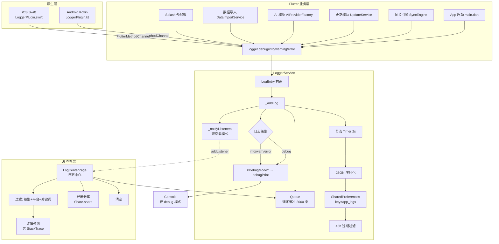

# 14. 日志规范

> 文档版本：v1.0
> 最后更新：2026-07-25
> 作者：wait
> 信息源：项目源码（d:\DevTools\project\BeeCount）+ 代码静态审查

---

## 1. 背景

BeeCount 作为离线优先、隐私优先的记账应用，**不集成任何远程崩溃上报**（无 Sentry / Crashlytics / Bugly），所有日志仅落本地。日志系统需在以下场景发挥作用：

1. **用户排障**：用户反馈问题时通过日志中心导出文本分享给开发者
2. **同步调试**：四层同步架构 + 5 个云后端，问题排查依赖详细日志链路
3. **更新追踪**：APK 自更新涉及原生 Intent + MethodChannel，`UPDATE_CRASH:` 前缀便于追踪崩溃
4. **性能分析**：Splash 阶段并行预加载耗时埋点
5. **原生桥接**：Android Kotlin 与 iOS Swift 通过 MethodChannel 反向上报到 Flutter 日志系统

本文档梳理项目日志架构、使用规范、已知反模式与改进建议，为新代码编写、问题排查、性能分析提供参考。

---

## 2. 核心概念

| 概念 | 含义 |
|---|---|
| **LoggerService** | 单例日志服务，统一管理 debug/info/warning/error 四级日志 |
| **LogEntry** | 日志条目，含 timestamp/level/platform/tag/message/error/stackTrace |
| **LogPlatform** | 日志来源平台（flutter/android/ios） |
| **Tag** | 模块标识，用于过滤与定位（如 SyncEngine、UpdateInstaller） |
| **循环缓冲** | 内存 Queue<LogEntry>，最多 2000 条 |
| **48h 过期** | 持久化时过滤超过 48 小时的条目 |
| **节流保存** | 2 秒延时合并多次写入为一次磁盘 IO |
| **UPDATE_CRASH:** | APK 安装流程的日志前缀，便于追踪崩溃 |
| **timed() 包装器** | Splash 阶段的耗时埋点辅助函数 |
| **LoggerPlugin** | 原生侧（Android/iOS）的 MethodChannel 桥接插件 |

---

## 3. 日志系统整体架构



---

## 4. 日志服务详细设计

### 4.1 LoggerService 类结构与单例

**实现位置**：[lib/services/system/logger_service.dart:141-414](file:///d:/DevTools/project/BeeCount/lib/services/system/logger_service.dart)

```dart
class LoggerService {
  static final LoggerService _instance = LoggerService._internal();
  factory LoggerService() => _instance;
  LoggerService._internal() {
    _setupNativeBridge();
  }
  // ...
}
final logger = LoggerService();  // 全局单例
```

采用"饿汉单例 + factory"模式，进程内全局唯一 `logger` 实例，构造时立即建立原生 MethodChannel 桥接。

### 4.2 日志级别分级

**实现位置**：[logger_service.dart:9-40](file:///d:/DevTools/project/BeeCount/lib/services/system/logger_service.dart)

```dart
enum LogLevel { debug, info, warning, error }
```

每级提供 `displayName`（DEBUG/INFO/WARN/ERROR）和 `emoji` 两套展示形式。

### 4.3 日志输出方法

**实现位置**：[logger_service.dart:278-324](file:///d:/DevTools/project/BeeCount/lib/services/system/logger_service.dart)

```dart
void debug(String tag, String message, [dynamic data]) {
  final msg = data != null ? '$message | Data: $data' : message;
  _addLog(LogEntry(
    timestamp: DateTime.now(),
    level: LogLevel.debug,
    platform: LogPlatform.flutter,
    tag: tag,
    message: msg,
  ));
}

// info / warning 同上，分别改为 level.info / level.warning

void error(String tag, String message, [dynamic error, StackTrace? stackTrace]) {
  // error 多了 error 与 stackTrace 参数
}
```

注意：`debug/info/warning` 通过可选 `data` 参数拼到 message 末尾（`| Data: ...`），`error` 才单独保留 `error` 与 `stackTrace` 字段。

### 4.4 日志格式

**实现位置**：[logger_service.dart:109-134](file:///d:/DevTools/project/BeeCount/lib/services/system/logger_service.dart)

`LogEntry.toFormattedString()` 输出多行文本：

```
[HH:mm:ss.SSS] [INFO] [Flutter] [App] 应用启动，日志系统已初始化
  Error: ...        // 仅 error 不为 null 时
  Stack Trace:      // 仅 stackTrace 不为 null 时
  <堆栈每行缩进 2 空格>
```

字段顺序：`时间戳 → 级别 → 平台 → Tag → 消息`，再追加可选 Error / StackTrace。

### 4.5 日志输出目标

- **Console**：[logger_service.dart:202-205](file:///d:/DevTools/project/BeeCount/lib/services/system/logger_service.dart)，`if (kDebugMode) debugPrint(entry.toFormattedString())` —— 仅 debug 模式打 console
- **内存缓冲**：`Queue<LogEntry>` 循环缓冲，最多 2000 条（`_maxLogs`，第 153 行）
- **持久化**：`SharedPreferences` 异步落盘
- **远程上报**：`[未实现]` —— 全项目无任何远程上报代码

---

## 5. 日志持久化

### 5.1 持久化载体

**实现位置**：[logger_service.dart:218-275](file:///d:/DevTools/project/BeeCount/lib/services/system/logger_service.dart)

日志通过 `SharedPreferences` 的 string key `app_logs`（第 149 行）以 JSON 数组形式保存，**不是文件**。

```dart
static const _storageKey = 'app_logs';
static const _maxStorageHours = 48; // 保留48小时
```

### 5.2 日志轮转

- **按数量**：内存循环缓冲，超过 2000 条丢弃最旧（[logger_service.dart:195-198](file:///d:/DevTools/project/BeeCount/lib/services/system/logger_service.dart)）
- **按时间**：48 小时过期窗口。加载时过滤（第 225-234 行），保存时再过滤一次（第 259-263 行）
- **按文件大小 / 按天数滚动文件**：`[未实现]`（无文件，无文件轮转）

### 5.3 保存节流

**实现位置**：[logger_service.dart:249-275](file:///d:/DevTools/project/BeeCount/lib/services/system/logger_service.dart)

```dart
// 每次 _addLog 重置一个 2 秒延时 Timer
// 2 秒内多次写合并为一次磁盘写入
// _isSaving 标志防止重入
```

**优化效果**：高频日志场景下避免每次写盘，2 秒内合并写入。

### 5.4 加载

`_loadLogs()`（[logger_service.dart:215-247](file:///d:/DevTools/project/BeeCount/lib/services/system/logger_service.dart)）懒加载，首次访问 `logs` getter 时触发，反序列化后丢弃超过 48h 的条目；同时 `_isLoaded` 标志防重复加载。

### 5.5 文件命名规则

`[未实现]`（无文件命名，所有日志共用一个 SharedPreferences key）。

---

## 6. 日志查看界面

**实现位置**：[lib/pages/settings/log_center_page.dart](file:///d:/DevTools/project/BeeCount/lib/pages/settings/log_center_page.dart)（全文 554 行）

### 6.1 入口

两处入口：
- [beecount_cloud_sync_page.dart:332](file:///d:/DevTools/project/BeeCount/lib/pages/cloud/beecount_cloud_sync_page.dart) —— 云同步页面跳转
- [about_page.dart:318](file:///d:/DevTools/project/BeeCount/lib/pages/settings/about_page.dart) —— 关于页面跳转

### 6.2 界面结构

`LogCenterPage` 为 `ConsumerStatefulWidget`，使用 Riverpod 监听主题色。布局自上而下：

1. `PrimaryHeader`（带返回 + 导出/清空图标按钮）
2. 搜索框
3. 过滤器 `SectionCard`：日志级别 `FilterChip`×4 + 平台 `FilterChip`×N（平台 chip 在 Android 隐藏 iOS、反之亦然）
4. 统计行：总数 + 已过滤数
5. `ListView.builder` 日志列表，倒序显示（最新在顶）

### 6.3 过滤与搜索

`_filteredLogs` getter：级别 + 平台 + 关键词三重过滤；关键词匹配 `message` 与 `tag`（不区分大小写）。

### 6.4 日志详情

点击弹窗显示完整信息（含 StackTrace，等宽字体），提供"复制"和"关闭"按钮。长按 `_copyLog` 复制到剪贴板。

### 6.5 导出 / 分享

```dart
Future<void> _exportLogs() async {
  try {
    final text = logger.exportAsText();
    await Share.share(text, subject: 'BeeCount 日志导出');
  } catch (e) {
    if (mounted) {
      showToast(context, AppLocalizations.of(context).logCenterExportFailed);
    }
  }
}
```

使用 `share_plus` 调起系统分享面板（不是写文件、不是上传）。`logger.exportAsText()` 在 [logger_service.dart:333-347](file:///d:/DevTools/project/BeeCount/lib/services/system/logger_service.dart) 拼接全部日志为纯文本。

### 6.6 清空

二次确认弹窗后调用 `logger.clear()`（仅清内存，**不会**主动清 SharedPreferences，下一轮节流保存时落盘覆盖）。

### 6.7 实时刷新

`initState` 注册 `logger.addListener`，日志变更触发 `setState`。`LoggerService._notifyListeners`（第 182-186 行）简单观察者模式。

---

## 7. 日志使用规范

### 7.1 调用样本

```dart
// lib/main.dart:52
logger.info('App', '应用启动，日志系统已初始化');
// lib/main.dart:290
logger.error('Main', '应用模式初始化失败', e, stackTrace);
// lib/main.dart:349
logger.warning('AppLink', 'overlay 未就绪,toast 改记日志: $message');
// lib/cloud/sync/sync_engine.dart:204
logger.info('SyncEngine', '上传账本 ledger=$ledgerId');
// lib/cloud/sync/sync_engine.dart:300
logger.error('SyncEngine', '获取同步状态失败', e, st);
// lib/cloud/sync/sync_engine_apply.dart:83
logger.debug('SyncEngine', 'pull: 删除交易 $syncId');
// lib/cloud/transactions_sync_manager.dart:528
logger.debug('Fingerprint', '交易数: ${canon.length}, 指纹: ${fp.substring(0, 16)}...');
```

### 7.2 Tag 命名约定

通过全量统计，tag 命名呈现以下约定（**事实标准**，非文档强制）：

| Tag | 出现文件 | 用途 |
|---|---|---|
| `App` / `Main` / `AppLink` | main.dart | 应用生命周期、深链 |
| `SyncEngine` | lib/cloud/sync/sync_engine*.dart | 增量同步主流程 |
| `CloudSync` | lib/cloud/transactions_sync_manager.dart | 旧版文件式云同步 |
| `SyncDiff` | lib/cloud/sync_diff_service.dart | 增量 diff 应用 |
| `SyncCoordinator` | sync_coordinator.dart | 同步协调器 |
| `ChangeTracker` | change_tracker.dart | 本地变更追踪 |
| `UpdateInstaller` / `UpdateService` | lib/services/update/* | 自更新 |
| `GitHubMirror` | github_mirror_service.dart | GitHub 镜像测速 |
| `AIChat` | lib/pages/ai/ai_chat_page.dart | AI 记账 |
| `avatar_sync` | sync_engine_profile.dart | 头像同步（snake_case 风格） |
| `currency_providers` | currency_providers.dart | snake_case 风格 |
| `OrphanGC` | main.dart | 孤儿文件 GC |
| `TransactionsJson` / `Fingerprint` | transactions_json.dart | 导出/指纹 |
| `LoggerPlugin`（Android） / `MainActivity`（Android） | android 原生侧 | 原生日志 |

**`[待补充]`**：Tag 命名规范未文档化（`SyncEngine` 用 PascalCase 但 `avatar_sync`、`currency_providers` 用 snake_case，混用）。建议在工程文档中明确：模块名 PascalCase、与文件主名一致。

### 7.3 日志级别使用约定

| 级别 | 使用场景 | 示例 |
|---|---|---|
| `debug` | 细粒度单条变更、调试信息 | `pull: 删除交易 $syncId` |
| `info` | 流程入口/出口、阶段性进度、耗时埋点 | `上传账本 ledger=$ledgerId` |
| `warning` | 可恢复异常、跳过逻辑 | `远端 ledger 列表查询失败,按已存在处理` |
| `error` | 阻断性失败、catch 块 | `获取同步状态失败` |

### 7.4 错误日志标准模式

**主流模式**（同步相关代码 100% 遵循）：

```dart
try {
  ...
} catch (e, st) {
  logger.error('SyncEngine', '获取同步状态失败', e, st);
}
```

即 `catch (e, st)` 同时捕获 error 与 stackTrace，并完整传给 `logger.error`。

### 7.5 反模式：堆栈单独记录

**反模式示例**（[transactions_sync_manager.dart:185-186](file:///d:/DevTools/project/BeeCount/lib/cloud/transactions_sync_manager.dart)）：

```dart
// ❌ 反模式
logger.error('CloudSync', '上传失败: $ledgerId', e);
logger.error('CloudSync', '堆栈', stack);

// ✅ 正确模式
logger.error('CloudSync', '上传失败: $ledgerId', e, stack);
```

这种反模式把 stackTrace 拆成第二条日志，导致 `LogEntry.stackTrace` 字段为空，详情页无法在"Stack Trace"区域展示。建议工程文档明确禁止。

---

## 8. 性能日志

### 8.1 Stopwatch 使用模式

`Stopwatch` 共 7 处，全部用于耗时埋点：

```dart
// lib/cloud/sync_diff_service.dart:349
final sw = Stopwatch()..start();
...
logger.info('SyncDiff', '批量更新: size=${updates.length} 成功=$modifiedCount 耗时=${sw.elapsedMilliseconds}ms');

// lib/services/data_import_service.dart:235 / 275 / 376 / 470 / 484
final sw = Stopwatch()..start();
...
logger.info('AccountImport', '账户导入完成: 新增=$created 已存在=${accounts.length - created} 耗时=${sw.elapsedMilliseconds}ms');

// lib/services/update/github_mirror_service.dart:113-136
final stopwatch = Stopwatch()..start();
...
final latency = stopwatch.elapsedMilliseconds;
logger.info('GitHubMirror', '镜像 ${mirror.name} 测试成功，延迟: ${latency}ms');
```

模式统一：`..start()` 启动 → 业务执行 → `elapsedMilliseconds` 拼接到 message。

### 8.2 Splash / 首屏 timed 包装器

**实现位置**：[lib/providers/ui_state_providers.dart:229-234](file:///d:/DevTools/project/BeeCount/lib/providers/ui_state_providers.dart)

```dart
Future<T> timed<T>(String name, Future<T> future) async {
  final start = DateTime.now();
  final result = await future;
  logger.info(tag, '$name: ${DateTime.now().difference(start).inMilliseconds}ms');
  return result;
}
```

被首屏并行预加载 6 个任务复用，如 `timed('月度统计', ...)`、`timed('交易列表(前20条)', ...)`。

**注意**：此处用 `DateTime.now().difference` 而非 `Stopwatch`，与 8.1 节风格不一致 —— 工程文档可统一为 `Stopwatch`。

### 8.3 同步耗时日志

`sync_diff_service.dart` 等处记录"批量更新耗时=Nms"，但 `sync_engine.dart` 主流程**未**显式记录整体同步耗时（仅记录 push/pull 数量与结果）。`[待补充]`：建议在 `syncLedger` 入口/出口加 Stopwatch。

---

## 9. 更新模块日志

### 9.1 UPDATE_CRASH 前缀

**Flutter 侧**（[lib/services/update/update_installer.dart:19-121](file:///d:/DevTools/project/BeeCount/lib/services/update/update_installer.dart)、[lib/services/system/update_service.dart:206-396](file:///d:/DevTools/project/BeeCount/lib/services/system/update_service.dart)）—— 共 60+ 条 `UPDATE_CRASH:` 前缀日志，覆盖 APK 安装流程的每个关键步骤：

```dart
logger.info('UpdateInstaller', 'UPDATE_CRASH: === 开始APK安装流程 ===');
logger.info('UpdateInstaller', 'UPDATE_CRASH: 文件路径: $filePath');

if (const bool.fromEnvironment('dart.vm.product')) {
  logger.info('UpdateInstaller', 'UPDATE_CRASH: 生产环境，使用原生Intent方式安装');
}

// 异常分支
logger.error('UpdateInstaller', 'UPDATE_CRASH: ❌ 安装APK过程中发生异常', e);
logger.error('UpdateInstaller', 'UPDATE_CRASH: 异常堆栈: $stackTrace');  // 注：此处堆栈被拼进 message
logger.error('UpdateInstaller', 'UPDATE_CRASH: PlatformException code: ${e.code}');
```

**Android 原生侧**（`android/app/src/main/kotlin/com/tntlikely/beecount/MainActivity.kt:557-618`）—— 17 条 `UPDATE_CRASH:` 前缀 `android.util.Log.d/e`，覆盖：复制 APK → FileProvider 创建 URI → 启动 Intent → 失败分支。

### 9.2 关键步骤埋点

**实现位置**：[update_service.dart:206-234](file:///d:/DevTools/project/BeeCount/lib/services/system/update_service.dart)

```dart
logger.info('UpdateService', 'UPDATE_CRASH: 🚀 用户确认安装，开始启动安装程序');
logger.info('UpdateService', 'UPDATE_CRASH: 当前构建模式: ${const bool.fromEnvironment('dart.vm.product') ? "生产模式" : "开发模式"}');
logger.info('UpdateService', 'UPDATE_CRASH: 当前flavor: ${const String.fromEnvironment('flavor', defaultValue: 'unknown')}');
```

集中埋点：用户确认安装 → 构建模式判断 → 生产预检查 → 调用 `UpdateInstaller.installApk` → 结果判定。

### 9.3 反模式提示

[update_installer.dart:83/121](file:///d:/DevTools/project/BeeCount/lib/services/update/update_installer.dart) 把 stackTrace 拼进 message（`'UPDATE_CRASH: 异常堆栈: $stackTrace'`），未使用 `logger.error` 第 4 参数，导致详情页 Stack Trace 区为空。建议工程文档统一为 `logger.error(tag, msg, e, st)`。

---

## 10. 云同步日志

### 10.1 sync_engine.dart 主流程

[lib/cloud/sync/sync_engine.dart](file:///d:/DevTools/project/BeeCount/lib/cloud/sync/sync_engine.dart) 内 50+ 处 `logger.*` 调用，级别使用规范：

- **info**：流程入口/出口、阶段性进度（如 `:204 上传账本`、`:221 上传完成：增量推送 $pushed 条变更`、`:372 开始同步`、`:497 同步完成: $result`）
- **debug**：细粒度单条变更（如 `:747`、`:894 legacy backfill: 无需补登记`、`:964`）
- **warning**：可恢复异常、跳过逻辑（如 `:433 远端 ledger 列表查询失败,按已存在处理`、`:962 push: 本地账本已删除且无待推送变更,跳过`、`:1330 全量拉取: 服务端无数据`）
- **error**：阻断性失败（如 `:300 获取同步状态失败`、`:500 同步失败`、`:1239`、`:1349 附件下载失败（不阻塞拉取）`）

### 10.2 子模块日志

| 文件 | Tag | 说明 |
|---|---|---|
| `sync_engine_apply.dart` | `SyncEngine` | pull 阶段逐条变更应用，大量 debug |
| `sync_engine_pull.dart` | `AppCursorStore` / `SyncErrorStore` / `LookupCache` | 分页拉取、错误存储 |
| `sync_engine_profile.dart` | `avatar_sync` | 头像同步（小写 tag，与 SyncEngine 风格不一致） |
| `sync_engine_attachments.dart` | `SyncEngine` | 附件/自定义图标上传 |
| `sync_coordinator.dart` | `SyncCoordinator` | 监听 local_changes |
| `change_tracker.dart` | `ChangeTracker` | 标记变更已推送 |
| `sync_diff_service.dart` | `SyncDiff` | 批量 diff 应用 + 耗时 |
| `transactions_sync_manager.dart` | `CloudSync` | 旧版文件式云同步（与新版 `SyncEngine` 共存） |

### 10.3 日志级别一致性

整体规范，但 `transactions_sync_manager.dart`（旧版）存在第 7.5 节提到的"堆栈单独成日志"反模式（6 处）。`[待补充]`：建议改造或废弃旧版。

---

## 11. 日志开关与级别控制

### 11.1 kDebugMode 开关

**实现位置**：[logger_service.dart:202-205](file:///d:/DevTools/project/BeeCount/lib/services/system/logger_service.dart)

```dart
if (kDebugMode) {
  debugPrint(entry.toFormattedString());
}
```

`kDebugMode` 来自 `package:flutter/foundation.dart`，等同于 `!bool.fromEnvironment('dart.vm.product') && !kReleaseMode`。

其他使用点：
- [lib/app.dart:784](file:///d:/DevTools/project/BeeCount/lib/app.dart) —— UI 行为开关
- [lib/styles/header_skins.dart:149](file:///d:/DevTools/project/BeeCount/lib/styles/header_skins.dart) —— 调试皮肤
- [lib/pages/maintenance/orphan_cleanup_page.dart:43](file:///d:/DevTools/project/BeeCount/lib/pages/maintenance/orphan_cleanup_page.dart) —— 维护入口可见性
- [lib/services/maintenance/orphan_seeder.dart:7](file:///d:/DevTools/project/BeeCount/lib/services/maintenance/orphan_seeder.dart) —— 注释说明"kDebugMode 守门,正式包不会暴露入口"

### 11.2 dart.vm.product 控制

仅出现在自更新模块：

```dart
// lib/services/update/update_installer.dart:48
if (const bool.fromEnvironment('dart.vm.product')) { ... }
// lib/services/system/update_service.dart:207 / 218 / 233
logger.info('UpdateService', 'UPDATE_CRASH: 当前构建模式: ${const bool.fromEnvironment('dart.vm.product') ? "生产模式" : "开发模式"}');
```

release 模式下走原生 Intent 安装，debug 模式下走 OpenFilex。

### 11.3 release 模式下日志级别

**`[未实现]`**：**没有**级别过滤逻辑。所有 `debug/info/warning/error` 均会进入内存缓冲与 SharedPreferences 持久化，与构建模式无关。release 包也会落盘 debug 级别日志（仅 console 输出被 `kDebugMode` 屏蔽）。

**建议**：release 包应通过 `kReleaseMode` 跳过 `debug` 级别入库，避免 SharedPreferences 膨胀（当前 2000 条循环缓冲 + 每 2s 全量 JSON 序列化，在高频日志场景对性能/存储有压力）。

---

## 12. 第三方日志

### 12.1 drift 日志

**`[未实现]`**：项目使用 drift，但**未**配置 drift 自带的 `printDrift` / `Verbosity` / 自定义 `QueryExecutor` listener。数据库 SQL 执行无日志输出。

迁移日志使用裸 `print()`（详见第 13 节反模式）：

```dart
// lib/data/db.dart:539 等 30+ 处
print('[DB Migration] 开始迁移到 v7: 周期账单支持转账');
```

### 12.2 dio 日志

`packages/flutter_ai_kit_openai/lib/src/providers/openai_*.dart` 共 3 处使用 dio 自带 `LogInterceptor`：

```dart
// packages/flutter_ai_kit_openai/lib/src/providers/openai_chat_provider.dart:57
dio.interceptors.add(LogInterceptor(...));
// 同包 openai_vision_provider.dart:56 / openai_whisper_provider.dart:51
```

注意：这是 **AI Kit 子包**（`packages/flutter_ai_kit_openai`）内部行为，主工程 `lib/` 下无 dio LogInterceptor 配置。日志直接走 dio 默认 `print`，不进入 `LoggerService`。

### 12.3 其他第三方库日志

- **Android 原生**：`android.util.Log.d/e`（`LoggerPlugin.kt`、`MainActivity.kt`、`ScreenshotObserver.kt`）—— 走 logcat，同时通过 `LoggerPlugin.log()` 反向桥接到 Flutter `LoggerService`
- **iOS 原生**：`print("[\(tag)] \(message)")`（`ios/Runner/LoggerPlugin.swift:17`）—— 走 NSLog/stdout，同时通过 `FlutterMethodChannel` 桥接到 Flutter
- 其他第三方库（path_provider、share_plus、flutter_riverpod、home_widget 等）未做日志劫持

---

## 13. 裸 print() 反模式

Grep `^\s*print\(` 命中 80+ 处，主要集中在：

| 文件 | 数量 | 内容 |
|---|---|---|
| `lib/main.dart` | ~20 处 | 启动初始化、提醒恢复、小组件更新 |
| `lib/data/db.dart` | 30+ 处 | 数据库迁移步骤（v7~v24 每个迁移步骤） |
| `lib/widget/widget_manager.dart` | ~8 处 | 小组件渲染调试 |
| `lib/utils/notification_ios.dart` | ~5 处 | iOS 通知调试 |
| `lib/cloud/transactions_sync_manager.dart` | 2 处 | 同步状态缓存命中/未命中 |
| `lib/app.dart` | 2 处 | 前台恢复小组件更新 |

**说明**：这些 `print()` 在 release 包也会输出到 console，且不进入 `LoggerService`，无法在日志中心查看。建议工程文档明确：
1. 所有业务/迁移日志改用 `logger.info/warning/error`
2. 仅保留纯调试、与原生 Plugin 初始化强相关的临时 print，并用 `kDebugMode` 包裹

---

## 14. 改进建议汇总

| 维度 | 现状 | 建议 |
|---|---|---|
| 核心实现 | 单例 + 4 级别 + 平台桥接，结构清晰 | 保持 |
| 持久化 | SharedPreferences + 48h/2000 条 | 高频场景下 JSON 全量序列化有性能风险，建议改为文件分片（按天/按大小滚动） |
| 查看 UI | 完整（过滤/搜索/详情/分享/清空） | 缺"按时间范围筛选"，可补 |
| Tag 规范 | 事实标准但不统一（PascalCase 与 snake_case 混用） | 文档化命名约定 |
| 错误日志 | 多数遵循 `(e, st)` 模式 | 6+ 处"堆栈单独成日志"反模式需重构 |
| 远程上报 | 未实现 | 评估是否接入 Sentry/Crashlytics |
| 级别控制 | release 仍会落盘 debug 日志 | 加 `kReleaseMode` 过滤 |
| 性能日志 | Stopwatch 模式良好，存在 `DateTime.difference` 混用 | 统一为 Stopwatch |
| UPDATE_CRASH | 完整埋点 | stackTrace 拼进 message 的反模式需修正 |
| 第三方 | drift 无日志、AI Kit 子包有 dio LogInterceptor | 评估 drift SQL 日志开关 |
| print() | 80+ 处裸 print | 业务/迁移日志改走 logger |

---

## 15. 参考与延伸阅读

### 15.1 相关文档
- [09-error-handling.md](file:///d:/DevTools/project/BeeCount/docoments/09-error-handling.md)：错误处理与日志集成
- [11-performance.md](file:///d:/DevTools/project/BeeCount/docoments/11-performance.md)：性能埋点（timed 包装器）
- [13-build-release.md](file:///d:/DevTools/project/BeeCount/docoments/13-build-release.md)：UPDATE_CRASH 日志

### 15.2 关键源码文件
- [lib/services/system/logger_service.dart](file:///d:/DevTools/project/BeeCount/lib/services/system/logger_service.dart)：日志服务核心
- [lib/pages/settings/log_center_page.dart](file:///d:/DevTools/project/BeeCount/lib/pages/settings/log_center_page.dart)：日志中心 UI
- [lib/cloud/sync/sync_engine.dart](file:///d:/DevTools/project/BeeCount/lib/cloud/sync/sync_engine.dart)：同步日志
- [lib/services/update/update_installer.dart](file:///d:/DevTools/project/BeeCount/lib/services/update/update_installer.dart)：UPDATE_CRASH 日志
- [lib/providers/ui_state_providers.dart](file:///d:/DevTools/project/BeeCount/lib/providers/ui_state_providers.dart)：timed 包装器
- [android/app/src/main/kotlin/com/tntlikely/beecount/LoggerPlugin.kt](file:///d:/DevTools/project/BeeCount/android/app/src/main/kotlin/com/tntlikely/beecount/LoggerPlugin.kt)：Android 日志桥接
- [ios/Runner/LoggerPlugin.swift](file:///d:/DevTools/project/BeeCount/ios/Runner/LoggerPlugin.swift)：iOS 日志桥接

### 15.3 外部参考
- Flutter 日志最佳实践：https://docs.flutter.dev/testing/errors
- dart developer.Log：https://api.dart.dev/stable/dart-developer/log.html
