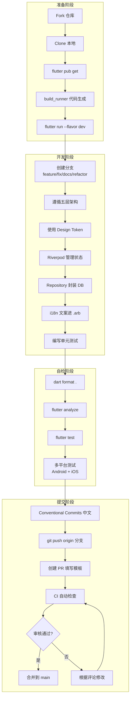
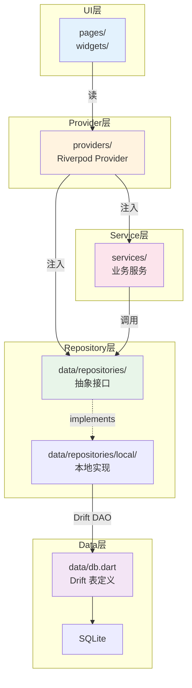
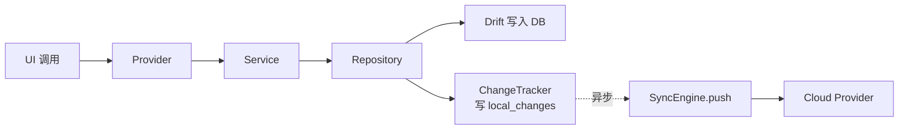

# 15. 开发规范

> 文档版本：v1.0
> 最后更新：2026-07-25
> 作者：wait
> 信息源：项目源码（d:\DevTools\project\PiggyCount）+ [docs/contributing/CONTRIBUTING_ZH.md](file:///d:/DevTools/project/PiggyCount/docs/contributing/CONTRIBUTING_ZH.md) + [analysis_options.yaml](file:///d:/DevTools/project/PiggyCount/analysis_options.yaml) + [docs/design/DESIGN_TOKENS.md](file:///d:/DevTools/project/PiggyCount/docs/design/DESIGN_TOKENS.md)

---

## 1. 背景

本文档面向**新加入 PiggyCount 项目的开发者**，系统化整理项目内的开发约定与代码规范。PiggyCount 是一款已有相当规模（lib/ 目录 250+ Dart 文件）的 Flutter 应用，包含五层架构、四层同步引擎、多后端云服务集成、AI 集成、复杂 UI 主题系统等。若开发者仅凭"个人 Dart 经验"提交代码，极易破坏既有架构一致性，造成：

- **架构分层混乱**：在 UI 层直连数据库、在 Repository 中调用 Provider 等
- **暗黑模式适配缺失**：直接使用 `Colors.white`/`Colors.black54` 而非 Token 系统
- **状态管理不一致**：混用 StatefulWidget 状态与 Riverpod，导致状态分散难以测试
- **同步逻辑绕过**：直接写 DB 而不经 Repository，造成本地变更未进入 `local_changes` 表，云同步丢失数据
- **国际化遗漏**：UI 文案直接写中文硬编码，新语言无法补全

本文档梳理项目所有**已落地的开发约定**，覆盖代码风格、命名、架构分层、状态管理、数据库、UI、测试、提交、CI 等全链路，帮助新开发者快速融入。

---

## 2. 核心概念

| 概念 | 含义 |
|---|---|
| **Effective Dart** | Dart 官方代码风格指南，项目通过 `flutter_lints` 强制执行 |
| **Design Token 系统** | `BeeTokens` / `BeeDimens` / `BeeTextTokens` 等，UI 颜色与尺寸的唯一来源 |
| **五层架构** | UI → Provider → Service → Repository → Data，禁止跨层调用 |
| **Riverpod 2.5** | 项目状态管理与依赖注入框架，所有状态都应通过 Provider 暴露 |
| **autoDispose** | Riverpod 自动释放修饰符，离开页面即释放资源，避免内存泄漏 |
| **Drift** | SQLite ORM，所有数据库操作必须通过 Repository 层封装 |
| **离线优先** | 写操作必须写入本地 DB 并记入 `local_changes`，云同步是异步的旁路 |
| **Conventional Commits** | 约定式提交规范，项目要求中文描述 |
| **PR Checklist** | 提交 PR 前的自检清单（`dart format`、`flutter analyze`、测试覆盖） |

---

## 3. 整体开发流程



---

## 4. 开发环境

### 4.1 系统要求

| 项 | 要求 | 来源 |
|---|---|---|
| Flutter SDK | 3.27.0+ | [pubspec.yaml](file:///d:/DevTools/project/PiggyCount/pubspec.yaml) environment sdk `^3.6.0` |
| Dart SDK | 3.6.0+ | 同上 |
| Android minSdk | 23 | [android/app/build.gradle](file:///d:/DevTools/project/PiggyCount/android/app/build.gradle) |
| Android compileSdk | 36 | 同上 |
| iOS最低版本 | 15.5 | [README.md](file:///d:/DevTools/project/PiggyCount/README.md) |
| IDE | VS Code / Android Studio | 推荐 Flutter 插件 |

### 4.2 初始化步骤

```bash
# 1. Clone 项目
git clone https://github.com/<your-fork>/PiggyCount.git
cd PiggyCount

# 2. 添加上游
git remote add upstream https://github.com/mecoren/PiggyCount.git

# 3. 安装依赖
flutter pub get

# 4. 代码生成（Drift、JsonSerializable、freezed 等）
dart run build_runner build --delete-conflicting-outputs

# 5. 运行（dev flavor 是默认 flavor）
flutter run --flavor dev -d android
# 或
flutter run -d ios
```

> ⚠️ **必须运行 build_runner**：项目使用 Drift 2.20，所有表结构修改后必须重新生成 `db.g.dart`。同时项目内大量使用 JsonSerializable、freezed 等代码生成包。

### 4.3 常用命令速查

```bash
# 代码格式化（必须）
dart format .

# 静态分析（必须）
flutter analyze

# 运行测试
flutter test

# 监听文件变化自动生成代码（开发时推荐）
dart run build_runner watch

# 构建发布 APK（注意 --flavor prod）
flutter build apk --flavor prod --release

# 生成 launcher icons
dart run flutter_launcher_icons
```

---

## 5. 项目目录结构

### 5.1 完整目录树

```
PiggyCount/
├── android/                  # Android 原生工程
├── ios/                      # iOS 原生工程
├── lib/                      # Dart 主代码
│   ├── ai/                   # AI 集成层（providers/core/privacy）
│   ├── cloud/                # 云同步层（sync_engine 系列）
│   ├── data/                 # 数据层（db/repositories/models）
│   │   └── repositories/
│   │       ├── local/        # 本地 Repository 实现
│   │       └── *_repository.dart  # 抽象接口
│   ├── l10n/                 # 国际化资源（.arb 文件）
│   ├── models/               # 业务模型
│   ├── pages/                # UI 页面（按业务模块分目录）
│   ├── providers/            # Riverpod Provider 定义
│   ├── services/             # 业务服务层
│   │   ├── ai/               # AI 记账服务
│   │   ├── automation/       # 自动记账
│   │   ├── billing/          # 账单创建
│   │   ├── currency/         # 汇率
│   │   ├── data/             # 数据服务（category/migration/seed 等）
│   │   ├── export/           # 导出（CSV/海报）
│   │   ├── import/           # 导入（CSV/支付宝/微信账单）
│   │   ├── maintenance/      # 孤儿文件清理
│   │   ├── platform/         # 平台集成（app_link/share/quick_actions）
│   │   ├── security/         # AppLock
│   │   ├── system/           # 系统服务（logger/reminder/update）
│   │   ├── ui/               # UI 服务
│   │   └── update/           # OTA 更新
│   ├── styles/               # 主题与 Design Token
│   │   ├── tokens.dart       # 核心 Token 系统
│   │   └── header_skins/     # 顶部皮肤
│   ├── utils/                # 工具函数
│   ├── widget/               # 桌面小组件
│   ├── widgets/              # 通用组件库
│   │   ├── ai/               # AI 相关组件
│   │   ├── analytics/        # 统计组件
│   │   ├── biz/              # 业务组件（列表/选择器/输入框）
│   │   ├── category/         # 分类选择
│   │   ├── charts/           # 图表
│   │   ├── currency/         # 币种
│   │   ├── posters/          # 海报
│   │   └── ui/               # UI 基础组件
│   ├── app.dart              # 应用根 Widget
│   ├── main.dart             # 入口
│   ├── providers.dart        # Provider 汇总导出
│   └── theme.dart            # 主题定义
├── packages/                 # 本地路径包
│   ├── flutter_ai_kit/       # AI 抽象包
│   └── flutter_cloud_sync/   # 云同步抽象包
├── test/                     # 测试代码
├── docs/                     # 项目文档（贡献指南、设计 token）
├── docoments/                # 工程文档（本目录）
├── assets/                   # 资源（图标、皮肤、头像）
├── demo/                     # 演示数据
└── analysis_options.yaml     # lint 配置
```

### 5.2 文件归属原则

新增代码时按以下规则选择目录：

| 代码类型 | 目录 | 示例 |
|---|---|---|
| 业务页面 | `lib/pages/<module>/` | `lib/pages/budget/budget_edit_page.dart` |
| 业务无关通用组件 | `lib/widgets/biz/` 或 `lib/widgets/ui/` | `lib/widgets/biz/amount_editor_sheet.dart` |
| 业务专用组件 | `lib/pages/<module>/widgets/` | `lib/pages/budget/widgets/budget_progress_bar.dart` |
| Riverpod Provider | `lib/providers/` | `lib/providers/budget_providers.dart` |
| 业务服务 | `lib/services/<module>/` | `lib/services/currency/exchange_rate_service.dart` |
| 数据库表/DAO | `lib/data/db.dart` 或 `lib/data/repositories/` | |
| 抽象接口 | `lib/data/repositories/<name>_repository.dart` | `lib/data/repositories/account_repository.dart` |
| 本地实现 | `lib/data/repositories/local/local_<name>_repository.dart` | `local_account_repository.dart` |
| 工具函数 | `lib/utils/` | `lib/utils/format_utils.dart` |
| 主题相关 | `lib/styles/` | `lib/styles/tokens.dart` |

---

## 6. 代码风格规范

### 6.1 Lint 配置

**实现位置**：[analysis_options.yaml](file:///d:/DevTools/project/PiggyCount/analysis_options.yaml)

```yaml
include: package:flutter_lints/flutter.yaml
```

项目采用 Flutter 官方推荐的 `flutter_lints` 包，未自定义额外规则。**所有 PR 必须通过 `flutter analyze` 无错误**（warning 视情况而定）。

### 6.2 命名规范

遵循 [Effective Dart](https://dart.dev/guides/language/effective-dart) 规范：

| 类型 | 规则 | 示例 |
|---|---|---|
| 类名/枚举/typedef | PascalCase | `LedgerRepository`、`SyncEngine`、`CloudSyncException` |
| 文件名 | snake_case.dart | `local_account_repository.dart`、`sync_engine.dart` |
| 函数/变量/参数 | camelCase | `getRecentTransactions`、`ledgerId`、`categorySyncId` |
| 常量 | lowerCamelCase | `kAiPrivacyConsentVersion`、`_keyPinHash` |
| 私有成员 | 下划线开头 | `_instance`、`_openConnection`、`_pushInFlight` |
| Provider | 后缀 `Provider` | `ledgerRepositoryProvider`、`monthlyTotalsProvider` |
| 异常类 | 后缀 `Exception` | `CloudNotAuthenticatedException`、`CloudSyncException` |
| 抽象接口 | 无 I 前缀，无 abstract 前缀 | `AccountRepository`（不是 `IAccountRepository`） |
| 本地实现 | `Local` 前缀 | `LocalAccountRepository` |

### 6.3 格式化

- **行宽**：80 字符（Dart 默认）
- **缩进**：2 空格
- **末尾换行**：保留
- **使用 `dart format` 自动格式化**，禁止手动调整格式

### 6.4 import 顺序

按以下分组，组内字母序，组间空行：

```dart
// 1. Dart SDK
import 'dart:async';
import 'dart:convert';
import 'dart:io';

// 2. Flutter / 第三方包
import 'package:flutter/material.dart';
import 'package:flutter_riverpod/flutter_riverpod.dart';
import 'package:drift/drift.dart';

// 3. 项目内绝对路径
import 'package:piggycount/data/db.dart';
import 'package:piggycount/providers/providers.dart';

// 4. 相对路径（仅在同模块内使用）
import '../widgets/biz/transaction_list_item.dart';
import 'local_account_repository.dart';
```

> ⚠️ **避免混用**：同一文件内不要同时使用 `package:piggycount/...` 与 `../../...` 相对路径。建议跨模块用绝对路径，同模块用相对路径。

### 6.5 空安全

- 充分利用 Dart 空安全特性
- 避免使用 `!` 强制解包，使用 `?.` 和 `??` 替代
- 函数参数使用 `required` 或提供默认值
- 不要将可空字段定义为 `late`，使用 `?` 显式声明

```dart
// ❌ 避免
String name = user!.name!;
final parts = path!.split('/').last;

// ✅ 推荐
final name = user?.name ?? '';
final parts = path?.split('/').lastOrNull ?? '';
```

### 6.6 注释规范

- **公共 API**：使用 `///` 文档注释，说明用途、参数、返回值
- **复杂逻辑**：用行内 `//` 注释说明"为什么"，不是"做什么"
- **临时禁用代码**：禁止提交注释掉的代码块，使用 git 历史保留
- **TODO**：可写 `// TODO(username): 描述`，必须带 owner

```dart
/// 计算指定月份的收支总额
///
/// [ledgerId] 账本ID
/// [year] 年份
/// [month] 月份（1-12）
/// 返回包含收入和支出的 Map，若账本不存在返回 null
Future<({double income, double expense})?> calculateMonthlyTotal(
  int ledgerId,
  int year,
  int month,
) async {
  // ...
}
```

---

## 7. 架构分层规范

### 7.1 五层架构



### 7.2 分层规则（强制）

| 层 | 允许调用 | 禁止调用 |
|---|---|---|
| UI（pages/widgets） | Provider、Service（通过 Provider 注入） | ❌ 直接访问 Repository、数据库 |
| Provider（providers） | Service、Repository、其他 Provider | ❌ 直接访问数据库 |
| Service（services） | Repository、其他 Service | ❌ 直接访问数据库、Provider |
| Repository | Drift Database、其他 Repository | ❌ Provider、UI |
| Data（db.dart） | SQLite | ❌ 任何上层 |

### 7.3 状态管理规范

#### 7.3.1 必须使用 Riverpod

- 所有跨组件共享状态必须通过 Riverpod Provider 暴露
- Provider 命名后缀 `Provider`
- Provider 类型选择：

| 场景 | Provider 类型 | 示例 |
|---|---|---|
| 异步只读数据 | `FutureProvider` | `monthlyTotalsProvider` |
| 异步带参数 | `FutureProvider.family` | `monthlyTotalsProvider family(ledgerId, year, month)` |
| 流式数据 | `StreamProvider` | `ledgerStreamProvider` |
| 可变状态 | `StateNotifierProvider` 或 `NotifierProvider` | `currentLedgerProvider` |
| 全局服务 | `Provider` | `databaseProvider`、`repositoryProvider` |
| 配置项 | `Provider` + override | `appConfigProvider` |

#### 7.3.2 autoDispose 使用

**实现位置**：[statistics_providers.dart](file:///d:/DevTools/project/PiggyCount/lib/providers/statistics_providers.dart) 等多处

```dart
// ✅ 推荐：列表/统计类 provider 用 autoDispose，离开页面即释放
final ledgerCountProvider = FutureProvider.autoDispose<int>((ref) async { ... });

final monthlyTotalsProvider = FutureProvider.family
    .autoDispose<({double dayCount, double txCount}), int>((ref, ledgerId) async { ... });

// ❌ 避免：全局共享数据不需要 autoDispose（如当前用户、主题色）
final currentLedgerProvider = StateProvider<Ledger?>((ref) => null);
```

#### 7.3.3 禁止在 Widget 中直连数据库

```dart
// ❌ 错误
class _MyPageState extends State<MyPage> {
  List<Transaction> _list = [];

  @override
  void initState() {
    super.initState();
    final db = AppDatabase();
    db.getAllTransactions().then((list) {
      setState(() => _list = list);
    });
  }
}

// ✅ 正确
class MyPage extends ConsumerWidget {
  @override
  Widget build(BuildContext context, WidgetRef ref) {
    final listAsync = ref.watch(transactionsProvider);
    return listAsync.when(
      data: (list) => ListView(...),
      loading: () => const CircularProgressIndicator(),
      error: (e, _) => Text('Error: $e'),
    );
  }
}
```

---

## 8. 数据库规范

### 8.1 表定义规范

**实现位置**：[lib/data/db.dart](file:///d:/DevTools/project/PiggyCount/lib/data/db.dart)

- **表名**：使用复数形式（`Transactions`、`Categories`、`Ledgers`）
- **字段名**：camelCase
- **主键**：本地 `id`（int 自增）+ 同步用 `syncId`（UUID 字符串）
- **外键**：使用 `references()`，但 SQLite 默认未启用外键约束
- **索引**：高频查询字段必须创建索引（同步路径字段、外键字段）

```dart
class Transactions extends Table with AutoIncrementMixin {
  IntColumn get ledgerId => integer().references(Ledgers, #id)();
  TextColumn get syncId => text().nullable()();
  RealColumn get amount => real()();
  RealColumn get nativeAmount => real().nullable()();
  TextColumn get note => text().nullable()();
  DateTimeColumn get happenedAt => dateTime()();
  // ...

  @override
  List<Set<Column>> get uniqueKeys => [
    {syncId},
  ];
}
```

### 8.2 Schema 版本与迁移

- 当前 schemaVersion = 31（详见 [07-data-model.md](file:///d:/DevTools/project/PiggyCount/docoments/07-data-model.md)）
- 新增表/字段必须新增 schemaVersion + MigrationStep
- 迁移必须幂等（使用 `CREATE INDEX IF NOT EXISTS`、`ALTER TABLE ADD COLUMN` 前判断）
- 禁止删除字段（向后兼容），若必须删除，使用 `_deprecated_` 前缀保留

### 8.3 查询规范

- **必须通过 Repository**：禁止 UI 层直接调用 `db.select(db.transactions).get()`
- **使用 Stream 监听变更**：响应式 UI 使用 `watch()` 返回 Stream
- **避免 N+1**：批量查询使用 `getAllByIds`、`Map<int, X>` 缓存
- **使用整页事务**：批量写入用 `db.transaction(() async { ... })`
- **参数化查询**：禁止字符串拼接 SQL，使用 `Variable<T>` 绑定

```dart
// ✅ 推荐：参数化
final result = await db.customSelect(
  'SELECT * FROM transactions WHERE ledger_id = ? AND category_sync_id_override = ?',
  variables: [Variable.withInt(ledgerId), Variable.withString(categorySyncId)],
).get();

// ❌ 禁止：字符串拼接（SQL 注入风险）
final sql = "SELECT * FROM transactions WHERE ledger_id = $ledgerId";
```

### 8.4 索引规范

新增索引需评估读写比例。高频查询字段加索引：

| 优先级 | 字段 | 用途 |
|---|---|---|
| 高 | `syncId`（各表） | 同步路径反查 |
| 高 | `(ledger_id, happened_at)` | 交易列表分页 [待补充：尚未创建] |
| 中 | `category_id` / `account_id` | 按分类/账户筛选 |
| 中 | `tag_id` | 按标签筛选 |
| 低 | `note` | 全文搜索（当前未实现） |

---

## 9. UI 开发规范

### 9.1 Design Token 系统（强制）

**实现位置**：[lib/styles/tokens.dart](file:///d:/DevTools/project/PiggyCount/lib/styles/tokens.dart)

> ⚠️ **强制规则**：所有 UI 组件**必须使用 Design Token**，禁止直接使用 `Colors.white`/`Colors.black`/`Colors.grey.shadeXXX`。

#### 9.1.1 颜色 Token

```dart
// ✅ 正确
Container(
  color: BeeTokens.surface(context),
  child: Text(
    'Hello',
    style: TextStyle(color: BeeTokens.textPrimary(context)),
  ),
)

// ❌ 错误：暗黑模式下会出错
Container(
  color: Colors.white,
  child: Text(
    'Hello',
    style: TextStyle(color: Colors.black87),
  ),
)
```

#### 9.1.2 常用 Token 速查

| Token | 用途 |
|---|---|
| `BeeTokens.scaffoldBackground(context)` | 页面背景（亮：#FAFAFA，暗：纯黑） |
| `BeeTokens.surface(context)` | 卡片背景（亮：白，暗：#1C1C1E） |
| `BeeTokens.surfaceSecondary(context)` | 嵌套卡片（亮：#F5F5F5，暗：#2C2C2E） |
| `BeeTokens.textPrimary(context)` | 主要文字 |
| `BeeTokens.textSecondary(context)` | 次要文字 |
| `BeeTokens.divider(context)` | 分割线 |
| `BeeTokens.success/warning/error/info(context)` | 语义色 |
| `BeeDimens.p8/p12/p16` | 间距 |
| `BeeDimens.radius12/radius16` | 圆角 |
| `BeeTextTokens.title/body/label(context)` | 文本样式 |
| `BeeTokens.cardDivider(context, indent: 48)` | 卡片内分割线 |

#### 9.1.3 静态场景（无 BuildContext）

在 `CustomPainter`、主题定义等无法访问 `BuildContext` 的场景，使用静态常量：

```dart
// ✅ CustomPainter 中
final paint = Paint()..color = BeeTokens.primaryTextStatic;
```

> 这些常量仅返回亮色模式值，暗黑模式必须通过带 context 的方法获取。

### 9.2 Widget 编写规范

#### 9.2.1 const 构造器

- 优先使用 `const` 构造函数
- 静态常量列表/Map 使用 `const`
- 大量参数支持 const 时，整个 Widget 标 `const`

```dart
// ✅ 正确
const _kPieColors = [Color(0xFFFF6B6B), Color(0xFF4ECDC4)];
return const TransactionListItem(transaction: tx);
```

#### 9.2.2 拆分 Widget

- 单个 `build()` 方法超过 100 行时，必须拆分为子 Widget
- 业务页面拆分时，子 Widget 放在同目录 `widgets/` 子目录
- 命名：`<page>_<purpose>.dart`（如 `budget_progress_bar.dart`）

#### 9.2.3 RepaintBoundary

- 长列表 item、复杂图表、动画组件用 `RepaintBoundary` 包裹
- 避免滚动时引发不必要的重绘
- 示例：[annual_report_page.dart](file:///d:/DevTools/project/PiggyCount/lib/pages/report/annual_report_page.dart)

#### 9.2.4 Key 使用

- 列表项使用 `ValueKey(item.id)`，**不要拼接 index**
- 状态保留使用 `GlobalKey`
- Dismissible/ReorderableListView 必须用稳定 Key

```dart
// ✅ 正确
Dismissible(
  key: ValueKey(it.t.id),
  // ...
)

// ❌ 错误：index 变化导致 key 失效
Dismissible(
  key: Key('tx-${it.t.id}-$index'),
  // ...
)
```

### 9.3 性能优化要点

- **预加载 + Stream 切换**：首屏用快照数据，100ms 后切 Stream（参考 [transaction_list.dart](file:///d:/DevTools/project/PiggyCount/lib/widgets/biz/transaction_list.dart)）
- **FlutterListView**：长列表用 `flutter_list_view` 包，支持精准 `jumpToIndex`
- **避免在 build 中创建对象**：用 `const` 或成员变量缓存
- **autoDispose**：列表/统计类 Provider 必须加 `autoDispose`

### 9.4 国际化（i18n）规范

**实现位置**：[lib/l10n/](file:///d:/DevTools/project/PiggyCount/lib/l10n)

#### 9.4.1 添加新文案

1. 在 `app_zh.arb` 添加中文文案
2. 在 `app_en.arb` 添加英文文案（必填，否则英文显示 key）
3. 可选：在 `app_zh_TW.arb`、`app_ko.arb` 添加其他语言
4. 运行 `flutter gen-l10n` 或 `flutter pub get` 重新生成本地化类
5. UI 中通过 `AppLocalizations.of(context)!.someKey` 引用

#### 9.4.2 禁止硬编码

```dart
// ❌ 禁止
Text('保存')
ElevatedButton(onPressed: ..., child: const Text('确定'))

// ✅ 正确
final l10n = AppLocalizations.of(context)!;
Text(l10n.save)
ElevatedButton(onPressed: ..., child: Text(l10n.confirm))
```

#### 9.4.3 命名约定

- key 用 camelCase
- 模块前缀：`budget_`、`transaction_`、`account_` 等
- 动作类后缀：`_title`、`_desc`、`_btn`、`_hint`

---

## 10. 同步引擎开发规范

### 10.1 修改原则

⚠️ **同步引擎是项目最核心模块**，修改前必须阅读 [06-data-sync-and-offline.md](file:///d:/DevTools/project/PiggyCount/docoments/06-data-sync-and-offline.md) 与 [09-error-handling.md](file:///d:/DevTools/project/PiggyCount/docoments/09-error-handling.md)。

- 修改 push/pull 流程必须有对应单元测试
- 新增 CloudSyncException 子类必须同步更新错误处理表
- 单飞锁、LookupCache、Lazy prime 等优化不能移除

### 10.2 写操作的同步路径

任何修改本地 DB 的操作必须：

1. 通过 Repository 写入
2. Repository 内部使用 `ChangeTracker` 在 `local_changes` 表插入变更记录
3. 由 `SyncEngine.push` 异步拉取并推送至云端



⚠️ **绕过 Repository 直接写 DB** 是严重 bug，会导致本地变更无法同步到云端，用户在其他设备看不到数据。

---

## 11. 测试规范

### 11.1 测试分层

| 类型 | 目录 | 范围 | 占比目标 |
|---|---|---|---|
| 单元测试 | `test/` | Repository、Service、纯函数 | 70% |
| Widget 测试 | `test/widget/` | 单个 Widget 行为 | 20% |
| 集成测试 | `integration_test/` | 关键流程（记账、同步、导出） | 10% |

### 11.2 测试工具

- **mocktail**：Mock 依赖项（[pubspec.yaml dev_dependencies](file:///d:/DevTools/project/PiggyCount/pubspec.yaml)）
- **drift 内存数据库**：`NativeDatabase.memory()`，不污染真实数据库
- **FakePiggyCountCloudProvider**：SyncEngine E2E 测试用（详见 [10-testing-strategy.md](file:///d:/DevTools/project/PiggyCount/docoments/10-testing-strategy.md)）

### 11.3 命名约定

```dart
// 测试文件：test/<被测路径镜像>.dart
test/repositories/local_account_repository_test.dart

// 测试类与用例
describe('LocalAccountRepository', () {
  test('getAll returns empty list when db is empty', () async { ... });
  test('insert writes to local_changes for sync', () async { ... });
});
```

### 11.4 必测场景

新增功能必须覆盖：

1. **正常路径**：标准输入产出预期输出
2. **空数据**：空列表、null 返回、首次启动
3. **边界**：超大列表、负数、特殊字符
4. **错误路径**：DB 异常、网络失败、超时
5. **同步兼容**：写操作是否产生 `local_changes` 记录

---

## 12. Git 提交规范

### 12.1 分支命名

```bash
# 新功能
git checkout -b feature/<feature-name>
# 例：feature/multi-currency-support

# Bug 修复
git checkout -b fix/<bug-description>
# 例：fix/webdav-sync-401-error

# 重构
git checkout -b refactor/<module-name>
# 例：refactor/transaction-repository

# 文档
git checkout -b docs/<doc-name>
# 例：docs/update-cloud-setup-guide
```

### 12.2 Conventional Commits（中文）

格式：

```
<类型>: <简短描述>

[可选的详细描述]

[可选的脚注]
```

| 类型 | 用途 | 示例 |
|---|---|---|
| `feat` | 新功能 | `feat: 添加预算超支提醒` |
| `fix` | Bug 修复 | `fix: 修复 WebDAV 同步时密码丢失` |
| `refactor` | 重构（不改功能） | `refactor: 重构数据库查询逻辑` |
| `style` | 格式调整 | `style: 统一 import 顺序` |
| `perf` | 性能优化 | `perf: 优化首页列表渲染性能` |
| `test` | 测试 | `test: 补充 SyncEngine 单元测试` |
| `docs` | 文档 | `docs: 更新贡献指南` |
| `chore` | 构建/工具 | `chore: 升级 drift 到 2.21` |
| `ci` | CI 配置 | `ci: 添加 iOS 自动签名` |
| `revert` | 回滚 | `revert: 回滚多币种功能` |

### 12.3 提交信息要求

- 简短描述 ≤ 50 字符
- 使用祈使句（"添加"而非"添加了"）
- 详细描述说明"为什么"而非"是什么"
- 中文撰写

```bash
# ✅ 推荐
git commit -m "feat: 添加多币种支持

- 账户层增加 currency 字段
- 交易记录 nativeAmount 自动换算
- 支持手动覆盖汇率"

# ❌ 避免
git commit -m "添加了多币种功能，修改了一些文件"
```

### 12.4 PR 流程

#### 12.4.1 PR 标题

遵循 Conventional Commits：

```
feat: 添加多币种支持
fix: 修复 WebDAV 同步失败问题
```

#### 12.4.2 PR 描述模板

```markdown
## 变更类型
- [ ] 新功能
- [ ] Bug 修复
- [ ] 文档更新
- [ ] 代码重构
- [ ] 性能优化
- [ ] 其他

## 变更说明
简要描述这个 PR 做了什么。

## 相关 Issue
Closes #123

## 测试情况
- [ ] 已在 Android 上测试
- [ ] 已在 iOS 上测试
- [ ] 添加了单元测试
- [ ] 添加了集成测试

## 截图（如适用）
[附上截图或 GIF]

## 检查清单
- [ ] 代码遵循项目规范
- [ ] 已运行 `dart format` 格式化代码
- [ ] 已运行 `flutter analyze` 无警告
- [ ] 已更新相关文档
- [ ] 提交信息符合规范
```

#### 12.4.3 PR 最佳实践

- **保持小而专注**：一个 PR 只做一件事，目标 ≤ 500 行改动
- **及时更新**：与主分支保持同步，`git fetch upstream && git rebase upstream/main`
- **响应评论**：积极回复审查意见
- **完善测试**：新功能必须有测试覆盖
- **更新文档**：API/行为变更同步更新文档

---

## 13. CI/CD 自动检查

### 13.1 触发流程

PR 提交到 `main` 分支时自动触发 GitHub Actions 检查。

### 13.2 检查项

- **代码格式**：`dart format --set-exit-if-changed .`
- **静态分析**：`flutter analyze`
- **测试**：`flutter test`
- **构建**：Android APK + iOS IPA 构建（可选，仅 release tag 触发）

### 13.3 CI 必过项

PR 合并前必须满足：

- `dart format` 无修改需求
- `flutter analyze` 无 error
- `flutter test` 全部通过
- CI 构建成功

详见 [13-build-release.md](file:///d:/DevTools/project/PiggyCount/docoments/13-build-release.md)。

---

## 14. 代码生成

### 14.1 必须运行 build_runner 的场景

修改以下文件后必须重新生成代码：

| 文件 | 生成内容 |
|---|---|
| `lib/data/db.dart` | `db.g.dart`（Drift 表结构、查询类） |
| 任何 `@JsonSerializable()` 类 | `*.g.dart`（JSON 序列化） |
| 任何 `@freezed` 类 | `*.freezed.dart` |
| `pubspec.yaml` 添加依赖 | `pubspec.lock` |

### 14.2 命令

```bash
# 一次性构建
dart run build_runner build --delete-conflicting-outputs

# 监听文件变化自动生成（开发推荐）
dart run build_runner watch
```

⚠️ `--delete-conflicting-outputs` 防止旧文件冲突，推荐每次都用。

### 14.3 提交生成文件

**必须提交** `*.g.dart`、`*.freezed.dart` 到版本控制。不要加入 `.gitignore`。

---

## 15. 翻译贡献规范

### 15.1 当前支持的语言

| 语言 | 代码 | 文件 | 维护方 |
|---|---|---|---|
| 简体中文 | zh | `app_zh.arb` | 官方 |
| 繁体中文 | zh_Hant | `app_zh_TW.arb` | 官方 |
| English | en | `app_en.arb` | 官方 |
| 한국어 | ko | `app_ko.arb` | 社区 |

### 15.2 添加新语言

```bash
# 1. 创建 .arb 文件
lib/l10n/app_<语言代码>.arb
# 例：lib/l10n/app_it.arb

# 2. 复制 app_en.arb 内容，翻译所有字符串

# 3. 运行代码生成
flutter pub get

# 4. 测试
flutter run

# 5. 提交
git commit -m "feat: 添加意大利语翻译"
```

详见 [docs/contributing/CONTRIBUTING_ZH.md](file:///d:/DevTools/project/PiggyCount/docs/contributing/CONTRIBUTING_ZH.md) 翻译贡献章节。

---

## 16. 常见陷阱与最佳实践

### 16.1 陷阱清单

| 陷阱 | 后果 | 正确做法 |
|---|---|---|
| 直接 `Colors.white` | 暗黑模式下不可见 | `BeeTokens.surface(context)` |
| UI 直连数据库 | 同步丢失、状态分散 | 通过 Provider + Repository |
| 直接 `setState` 跨页面状态 | 状态不共享、难测试 | Riverpod Provider |
| FutureProvider 不加 autoDispose | 内存泄漏、过期数据 | 加 `autoDispose` |
| 拼接 SQL 字符串 | SQL 注入 | `Variable<T>` 绑定 |
| 硬编码中文文案 | 无法国际化 | `.arb` 文件 + `AppLocalizations.of(context)!` |
| 修改 DB schema 不升 version | 启动崩溃 | 升级 schemaVersion + 写 Migration |
| 删除 Drift 字段 | 老用户数据丢失 | 保留字段加 `_deprecated_` 前缀 |
| 列表 key 拼 index | 排序错乱、动画异常 | `ValueKey(item.id)` |
| build() 中创建新对象 | 不必要重建、卡顿 | `const` 或成员变量 |
| 不运行 build_runner | 编译错误 | 修改 db.dart / freezed 后立即运行 |
| 同步引擎绕过单飞锁 | 并发 push 数据冲突 | 复用现有 `_pushInFlight` 等锁 |

### 16.2 最佳实践

#### 16.2.1 Provider 设计

- 一个 Provider 只负责一项职责
- 复杂业务用 `Notifier` 类替代 `StateProvider`
- 避免在 Provider 内部直接访问 BuildContext（除非 family 参数）

#### 16.2.2 异步错误处理

- 所有 `async` 方法必须有错误处理（try/catch 或 `.catchError`）
- 网络请求必须设超时（参考 [11-performance.md](file:///d:/DevTools/project/PiggyCount/docoments/11-performance.md) 4.4.3 节）
- 关键路径失败必须 `logger.error()` 记录（参考 [14-logging.md](file:///d:/DevTools/project/PiggyCount/docoments/14-logging.md)）

#### 16.2.3 文件组织

- 单文件 ≤ 500 行，超过必须拆分
- 同类 Widget 放同一目录
- 抽象与实现分文件（接口 `xxx_repository.dart`，实现 `local_xxx_repository.dart`）

#### 16.2.4 性能敏感操作

- 大数据解析放 `compute()` isolate（参考 [import_confirm_page.dart:71](file:///d:/DevTools/project/PiggyCount/lib/pages/data/import_confirm_page.dart)）
- 图片加载使用 `cached_network_image` 缓存
- 长列表用 `FlutterListView` 而非 `ListView.builder`

---

## 17. 开发者检查清单

### 17.1 提交前自检

- [ ] 运行 `dart format .` 无修改
- [ ] 运行 `flutter analyze` 无 error
- [ ] 运行 `flutter test` 全部通过
- [ ] 运行 `dart run build_runner build --delete-conflicting-outputs`（如修改了 db.dart / freezed）
- [ ] 新功能有对应单元测试
- [ ] UI 使用 Design Token，暗黑模式正常
- [ ] UI 文案进入 `.arb` 文件，无硬编码
- [ ] 提交信息符合 Conventional Commits 中文规范
- [ ] PR 描述模板填写完整
- [ ] 在 Android 与 iOS 双平台测试通过

### 17.2 Code Review 要点

- [ ] 架构分层正确（UI → Provider → Service → Repository → Data）
- [ ] 无直接数据库访问
- [ ] 无硬编码颜色/尺寸（使用 Token）
- [ ] 状态管理使用 Riverpod
- [ ] 同步路径完整（写操作进 `local_changes`）
- [ ] 异步错误已处理
- [ ] 列表使用稳定 Key
- [ ] 长列表使用 FlutterListView
- [ ] 无未使用的 import / 变量
- [ ] 注释清晰，复杂逻辑有"为什么"说明

---

## 18. 参考资源

### 18.1 项目内文档

- [README.md](file:///d:/DevTools/project/PiggyCount/README.md) — 项目介绍
- [docs/contributing/CONTRIBUTING_ZH.md](file:///d:/DevTools/project/PiggyCount/docs/contributing/CONTRIBUTING_ZH.md) — 完整贡献指南
- [docs/design/DESIGN_TOKENS.md](file:///d:/DevTools/project/PiggyCount/docs/design/DESIGN_TOKENS.md) — Design Token 完整对照表
- [PRIVACY.md](file:///d:/DevTools/project/PiggyCount/PRIVACY.md) — 隐私政策
- [LICENSE](file:///d:/DevTools/project/PiggyCount/LICENSE) — BSL 许可证

### 18.2 工程文档系列

- [01-project-overview.md](file:///d:/DevTools/project/PiggyCount/docoments/01-project-overview.md) — 项目总览
- [04-system-architecture.md](file:///d:/DevTools/project/PiggyCount/docoments/04-system-architecture.md) — 系统架构
- [06-data-sync-and-offline.md](file:///d:/DevTools/project/PiggyCount/docoments/06-data-sync-and-offline.md) — 数据同步
- [07-data-model.md](file:///d:/DevTools/project/PiggyCount/docoments/07-data-model.md) — 数据模型
- [08-api-and-data-access.md](file:///d:/DevTools/project/PiggyCount/docoments/08-api-and-data-access.md) — 数据访问层
- [10-testing-strategy.md](file:///d:/DevTools/project/PiggyCount/docoments/10-testing-strategy.md) — 测试策略
- [11-performance.md](file:///d:/DevTools/project/PiggyCount/docoments/11-performance.md) — 性能优化
- [12-security.md](file:///d:/DevTools/project/PiggyCount/docoments/12-security.md) — 安全机制
- [13-build-release.md](file:///d:/DevTools/project/PiggyCount/docoments/13-build-release.md) — 构建发布
- [14-logging.md](file:///d:/DevTools/project/PiggyCount/docoments/14-logging.md) — 日志规范

### 18.3 外部资源

- [Effective Dart](https://dart.dev/guides/language/effective-dart)
- [Flutter 官方文档](https://flutter.dev/docs)
- [Riverpod 2.5 文档](https://riverpod.dev/)
- [Drift 文档](https://drift.simonbinder.eu/)
- [Conventional Commits](https://www.conventionalcommits.org/zh-hans/)

---

## 19. 信息缺口

- **[待补充]** 项目当前未配置 `dart_code_metrics` 等额外静态分析工具，若未来引入需更新本文档第 6.1 节
- **[待补充]** `integration_test/` 目录下集成测试用例较少，关键流程（首次同步、快照格式升级重传）的集成测试规范待补充
- **[待确认]** `.vscode/launch.json` 与 `.vscode/settings.json` 的推荐配置未在本文档展开，新开发者可参考但非强制
- **[待补充]** 各 `services/<module>/` 内部的服务设计模式（如 `ExchangeRateService` 的缓存策略）未在本文档详述，建议未来按模块补充专门文档

---

本文档作为新开发者入门 PiggyCount 的速查手册，建议在提交第一个 PR 前完整阅读。后续若有规范变更，请通过 PR 同步更新本文档。
