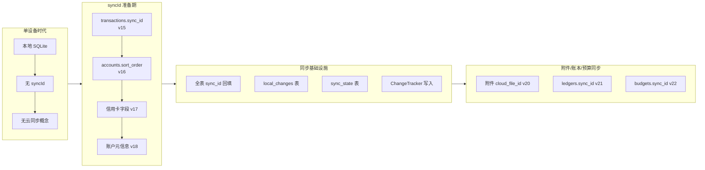
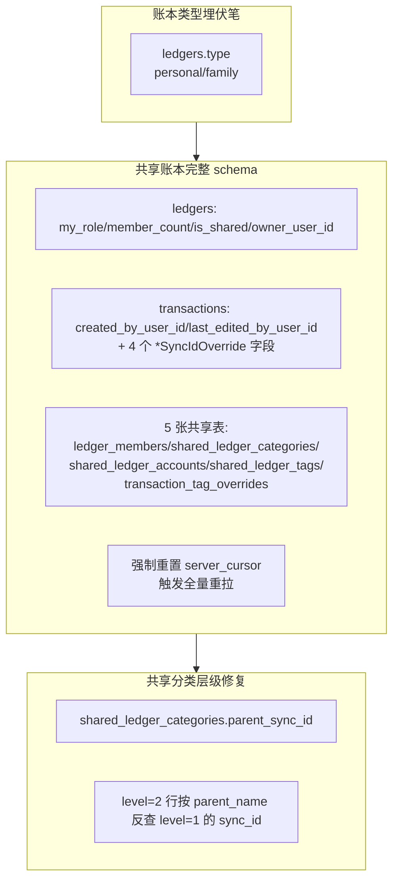
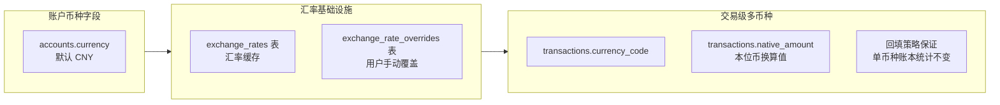

# 17. 版本演进

> 文档版本：v1.0
> 最后更新：2026-07-25
> 作者：wait
> 信息源：项目源码（[lib/data/db.dart](file:///d:/DevTools/project/BeeCount/lib/data/db.dart) MigrationStrategy）+ [pubspec.yaml](file:///d:/DevTools/project/BeeCount/pubspec.yaml) + [README.md](file:///d:/DevTools/project/BeeCount/README.md) + 各模块代码注释

---

## 1. 背景

BeeCount 是一款**持续迭代**的开源记账应用，从最初的"单设备记账"逐步演进为"多端实时协同 + AI 智能记账 + 多币种 + 共享账本"的复杂系统。理解版本演进有助于：

1. **理解架构决策的来龙去脉**：为何同步引擎设计为四层？为何有 `*SyncIdOverride` 字段？
2. **避免重蹈历史覆辙**：v23 移除了"运行时图标推导"的"毒瘤代码"，v24 用幂等 ALTER 修复了 v25 失败导致的卡死
3. **新功能开发参考**：参考类似功能（如多币种、共享账本）的演进路径，复用既有模式
4. **数据库迁移设计**：30 个 schemaVersion 迁移步骤是绝佳的学习样本

本文档基于 **schemaVersion 1→31** 的迁移历史（[db.dart:445-1160](file:///d:/DevTools/project/BeeCount/lib/data/db.dart)）与代码注释，重建项目演进时间线。

> ⚠️ **重要说明**：
> - **应用版本号**（如 3.2.0）与 **schemaVersion**（如 v24）是**独立**的概念
> - pubspec.yaml 中 `version: 0.0.1` 是占位符，CI 构建时通过 `sed` 替换为 git tag + run_number（详见 [13-build-release.md](file:///d:/DevTools/project/BeeCount/docoments/13-build-release.md)）
> - 项目源码中**未发现 CHANGELOG.md**，应用版本与 schemaVersion 的精确对应关系 [待确认]
> - 本文以 schemaVersion 为主线，应用版本号为 [推断]

---

## 2. 核心概念

| 概念 | 含义 |
|---|---|
| **schemaVersion** | Drift 数据库 schema 版本号，每次表结构变更 +1 |
| **onUpgrade 迁移** | `MigrationStrategy.onUpgrade` 回调，按 `if (from < N)` 顺序执行 |
| **幂等迁移** | 使用 `IF NOT EXISTS`、`_addColumnIfMissing` 等 helper，避免重跑失败 |
| **回填（backfill）** | 新字段添加后用 SQL UPDATE 为存量数据填充默认值 |
| **override 字段** | 共享账本场景下，本地账本与云端实体解耦的"覆盖"字段（如 `category_sync_id_override`） |
| **DDL 隐式 commit** | SQLite DDL 不可回滚，onUpgrade 中途失败时前面已执行的部分会保留 |
| **syncId** | UUID 字符串，跨设备同步时识别同一实体的唯一标识 |
| **local_changes 表** | 离线优先核心表，记录本地变更待推送至云端 |

---

## 3. 整体演进概览

```mermaid
timeline
    title BeeCount 版本演进时间线（按 schemaVersion）
    section 单设备基础（v1-v14）
        v1  : 初始版本<br/>账本/交易/账户/分类
        v2  : 分类排序
        v3  : 周期账单
        v4  : 账户初始余额
        v5  : 账户独立改造<br/>currency/created_at
        v6  : 二级分类
        v7  : 周期账单支持转账
        v8  : AI 对话助手
        v9  : 账本类型<br/>支持家庭账本
        v10 : 标签功能
        v11 : 预算功能
        v12 : 交易附件
        v13 : 分类自定义图标
        v14 : 转账记录迁移到<br/>虚拟转账分类
    section 同步基础设施（v15-v22）
        v15 : 交易 syncId
        v16 : 账户排序
        v17 : 信用卡字段
        v18 : 账户元信息
        v19 : 同步基础设施<br/>syncId 全表 + local_changes
        v20 : 附件云端同步字段
        v21 : ledgers.sync_id
        v22 : budgets.sync_id
    section 共享账本与多币种（v23-v31）
        v23 : 分类图标 backfill<br/>移除运行时推导
        v24 : 共享账本完整 schema
        v25 : SharedLedgerCategories<br/>parent_sync_id
        v26 : sync_pull_errors 表
        v27 : 账本自定义<br/>每月起始日
        v28 : 多币种 MVP<br/>exchange_rates
        v29 : 账单标记<br/>不计入收支/预算
        v30 : 交易级多币种
        v31 : 账户隐藏
```



---

## 4. 详细的演进阶段

### 4.1 阶段一：单设备基础功能（v1-v14）

#### v1：初始版本

- **核心表**：`ledgers`、`transactions`、`accounts`、`categories`
- **定位**：基础记账应用，单设备使用
- **[推断]** 应用版本：1.0.x

#### v2：分类排序（[db.dart:450-464](file:///d:/DevTools/project/BeeCount/lib/data/db.dart)）

```sql
ALTER TABLE categories ADD COLUMN sort_order INTEGER NOT NULL DEFAULT 0;
-- 回填：按 id 顺序赋值 sortOrder
UPDATE categories SET sort_order = (
  SELECT COUNT(*) FROM categories AS c2 WHERE c2.id <= categories.id
) - 1;
```

- **意义**：用户可自定义分类顺序
- **回填策略**：按 id 顺序赋值，确保存量数据有合理排序

#### v3：周期账单（[db.dart:465-472](file:///d:/DevTools/project/BeeCount/lib/data/db.dart)）

- **新增表**：`recurring_transactions`
- **新增字段**：`transactions.recurring_id`
- **场景**：每月房租、工资等固定收支自动记账

#### v4：账户初始余额（[db.dart:473-477](file:///d:/DevTools/project/BeeCount/lib/data/db.dart)）

```sql
ALTER TABLE accounts ADD COLUMN initial_balance REAL NOT NULL DEFAULT 0.0;
```

- **意义**：账户余额计算从"仅交易累加"改为"初始余额 + 交易累加"
- **影响**：报表统计逻辑同步更新

#### v5：账户独立改造（[db.dart:478-513](file:///d:/DevTools/project/BeeCount/lib/data/db.dart)）

- **新增字段**：`accounts.currency`（默认 CNY）、`accounts.created_at`、`accounts.updated_at`
- **设计**：数据迁移逻辑统一交给 `MigrationService` 处理，避免在 onUpgrade 中重复
- **意义**：为多币种账户埋下伏笔

#### v6：二级分类（[db.dart:514-537](file:///d:/DevTools/project/BeeCount/lib/data/db.dart)）

- **新增字段**：`categories.parent_id`、`categories.level`（默认 1）
- **回填**：所有现有分类 level 设为 1
- **意义**：支持父子分类层级（如 餐饮 > 外卖/堂食）

#### v7：周期账单支持转账（[db.dart:538-592](file:///d:/DevTools/project/BeeCount/lib/data/db.dart)）

- **改造**：`recurring_transactions.category_id` 改为可空，新增 `to_account_id`
- **迁移方式**：因 SQLite 不支持修改列约束，使用**重建表**模式：
  1. 创建 `recurring_transactions_new` 新表
  2. 复制数据（`to_account_id` 填 NULL）
  3. DROP 旧表
  4. RENAME 新表
- **意义**：周期账单支持信用卡还款等转账场景

#### v8：AI 对话助手（[db.dart:593-600](file:///d:/DevTools/project/BeeCount/lib/data/db.dart)）

- **新增表**：`conversations`、`messages`
- **意义**：首次引入 AI 能力，基于 flutter_ai_kit 抽象包
- **后续演进**：AI 集成逐步扩展至 OCR、语音、截图识别（详见 [05-core-modules.md](file:///d:/DevTools/project/BeeCount/docoments/05-core-modules.md)）

#### v9：账本类型（[db.dart:601-620](file:///d:/DevTools/project/BeeCount/lib/data/db.dart)）

```sql
ALTER TABLE ledgers ADD COLUMN type TEXT NOT NULL DEFAULT 'personal';
```

- **意义**：支持 `personal` / `family` 等账本类型，为后续共享账本埋伏笔

#### v10：标签功能（[db.dart:621-641](file:///d:/DevTools/project/BeeCount/lib/data/db.dart)）

- **新增表**：`tags`、`transaction_tags`（多对多关联）
- **索引**：`idx_transaction_tags_transaction`、`idx_transaction_tags_tag`
- **意义**：交易支持多标签 + 颜色标记，灵活筛选

#### v11：预算功能（[db.dart:642-660](file:///d:/DevTools/project/BeeCount/lib/data/db.dart)）

- **新增表**：`budgets`
- **索引**：`idx_budgets_ledger`、`idx_budgets_category`、`idx_budgets_ledger_type`（复合索引）
- **意义**：月度总预算 + 分类预算 + 超支提醒

#### v12：交易附件（[db.dart:661-675](file:///d:/DevTools/project/BeeCount/lib/data/db.dart)）

- **新增表**：`transaction_attachments`
- **索引**：`idx_attachments_transaction`
- **意义**：交易可关联图片/文件附件

#### v13：分类自定义图标（[db.dart:676-709](file:///d:/DevTools/project/BeeCount/lib/data/db.dart)）

- **新增字段**：`categories.icon_type`（默认 'material'）、`categories.custom_icon_path`、`categories.community_icon_id`
- **意义**：支持 Material / 自定义路径 / 社区图标包三种图标来源

#### v14：转账记录迁移（[db.dart:710-716](file:///d:/DevTools/project/BeeCount/lib/data/db.dart)）

- **执行**：`SeedService.migrateTransferTransactions(this)`
- **意义**：将历史转账记录统一关联到"虚拟转账分类"，简化报表统计逻辑
- **设计**：转账不再特殊处理，作为普通交易走 category_id

---

### 4.2 阶段二：同步基础设施（v15-v22）

#### v15：交易 syncId（[db.dart:717-747](file:///d:/DevTools/project/BeeCount/lib/data/db.dart)）

- **新增字段**：`transactions.sync_id`（TEXT）
- **回填**：使用 SQLite `randomblob` 生成 UUID v4 格式字符串
  ```sql
  UPDATE transactions SET sync_id =
    lower(hex(randomblob(4))) || '-' ||
    lower(hex(randomblob(2))) || '-4' ||
    substr(lower(hex(randomblob(2))),2) || '-' ||
    substr('89ab', abs(random()) % 4 + 1, 1) ||
    substr(lower(hex(randomblob(2))),2) || '-' ||
    lower(hex(randomblob(6)))
  WHERE sync_id IS NULL;
  ```
- **索引**：`idx_transactions_sync_id`
- **意义**：**云同步的起点**，每个交易有跨设备唯一标识

#### v16：账户排序（[db.dart:748-771](file:///d:/DevTools/project/BeeCount/lib/data/db.dart)）

- **新增字段**：`accounts.sort_order`
- **回填**：按 type 分组，组内按 created_at 排序赋值

#### v17：信用卡字段（[db.dart:772-804](file:///d:/DevTools/project/BeeCount/lib/data/db.dart)）

- **新增字段**：`accounts.credit_limit`、`accounts.billing_day`、`accounts.payment_due_day`
- **意义**：信用卡还款提醒、账单日管理

#### v18：账户元信息（[db.dart:805-837](file:///d:/DevTools/project/BeeCount/lib/data/db.dart)）

- **新增字段**：`accounts.bank_name`、`accounts.card_last_four`、`accounts.note`
- **意义**：账户详情更丰富，支持银行卡后四位识别

#### v19：同步基础设施（[db.dart:838-915](file:///d:/DevTools/project/BeeCount/lib/data/db.dart)）

**关键里程碑**：这一版是同步引擎的真正起点。

- **为 accounts/categories/tags 添加 sync_id**：全部使用 randomblob UUID v4 回填
- **新增表**：
  - `local_changes`：记录本地变更，待 SyncEngine.push 推送
  - `sync_state`：记录每个 ledger 的 server_cursor（增量同步游标）
- **索引**：`idx_accounts_sync_id`、`idx_categories_sync_id`、`idx_tags_sync_id`
- **意义**：**离线优先架构正式落地**，写操作进 `local_changes`，异步同步

#### v20：附件云端同步字段（[db.dart:916-940](file:///d:/DevTools/project/BeeCount/lib/data/db.dart)）

- **新增字段**：`transaction_attachments.cloud_file_id`、`transaction_attachments.cloud_sha256`
- **意义**：附件支持云端存储，sha256 用于去重与完整性校验

#### v21：ledgers.sync_id（[db.dart:941-961](file:///d:/DevTools/project/BeeCount/lib/data/db.dart)）

```sql
ALTER TABLE ledgers ADD COLUMN sync_id TEXT;
-- 关键设计：把现有 ledger.id 转字符串回填成 syncId
UPDATE ledgers SET sync_id = CAST(id AS TEXT) WHERE sync_id IS NULL;
```

- **设计巧思**：旧设备已推到 server 的 `external_id` = 当时的 `id.toString()`，新列回填相同值保证兼容
- **索引**：`idx_ledgers_sync_id`

#### v22：budgets.sync_id（[db.dart:962-982](file:///d:/DevTools/project/BeeCount/lib/data/db.dart)）

```sql
ALTER TABLE budgets ADD COLUMN sync_id TEXT;
-- 用 32 位随机 hex 当 syncId（非标准 UUID 格式，但 server 只要求非空）
UPDATE budgets SET sync_id = lower(hex(randomblob(16))) WHERE sync_id IS NULL;
```

- **索引**：`idx_budgets_sync_id`
- **设计差异**：与 v21 不同，budgets 用 32 位 hex 而非 UUID v4 格式，原因是 server 侧校验只要求非空字符串

---

### 4.3 阶段三：共享账本与多币种（v23-v31）

#### v23：分类图标 backfill（[db.dart:983-1015](file:///d:/DevTools/project/BeeCount/lib/data/db.dart)）

**重要重构**：移除"运行时图标推导"的历史包袱。

```dart
// v23 之前：icon 为空时按 name 中文关键字模糊匹配推导图标
//   - 改名就换图标（用户会懵）
//   - 只认中文，英语/繁中走不到
//   - web/server 必须复刻同一套 40 条正则，维护两份
// v23：一次性把 icon IS NULL 的分类按 byName 推算结果写回 DB
```

- **执行**：`CategoryService.resolveIconNameByName(name)` 推导并写回
- **意义**：**渲染层 `getCategoryIconData` 只认 icon 字段，不再 byName 推导**
- **协同**：服务端 alembic 0002 同步执行同名 backfill，两端一致
- **设计模式**："迁 read-time 到 write-time"，典型的反规范化优化

#### v24：共享账本完整 schema（[db.dart:1016-1070](file:///d:/DevTools/project/BeeCount/lib/data/db.dart)）

**关键里程碑**：共享账本功能一次性落地。

- **ledgers 新增字段**：
  - `my_role`（默认 'owner'）
  - `member_count`（默认 1）
  - `is_shared`（默认 0）
  - `owner_user_id`
- **transactions 新增 override 字段**：
  - `created_by_user_id`、`last_edited_by_user_id`
  - `category_sync_id_override`、`account_sync_id_override`
  - `to_account_sync_id_override`、`tag_sync_ids_override`
- **新增 5 张共享表**：
  - `ledger_members`
  - `shared_ledger_categories`
  - `shared_ledger_accounts`
  - `shared_ledger_tags`
  - `transaction_tag_overrides`
- **关键设计：幂等 ALTER**
  ```dart
  // 用户从 3.1.3 升级到带 bug 的 3.2.0 时 v25 ALTER 失败，
  // 但 v24 的 DDL 已经隐式 commit（SQLite DDL 不可回滚），
  // user_version 仍 23。装新版本再跑 onUpgrade(from=23) 时
  // v24 第一句又会 duplicate column 卡死。每条都要幂等。
  await _addColumnIfMissing('ledgers', 'my_role', "ALTER TABLE ...");
  ```
- **强制全量重拉**：`UPDATE sync_state SET server_cursor = 0`，确保下次启动用最新 override 逻辑重写

#### v25：SharedLedgerCategories.parent_sync_id（[db.dart:1071-1102](file:///d:/DevTools/project/BeeCount/lib/data/db.dart)）

- **新增字段**：`shared_ledger_categories.parent_sync_id`
- **回填**：对每个 level=2 行，在同 ledger_sync_id + kind 内按 parent_name 反查 level=1 行的 syncId 填入
- **强制全量重拉**：重置 server_cursor 让 pull 重拉 user-global category change

#### v26：sync_pull_errors 表（[db.dart:1103-1110](file:///d:/DevTools/project/BeeCount/lib/data/db.dart)）

- **新增表**：`sync_pull_errors`
- **设计目的**：pull apply 抛错时写入此表，不影响主表数据完整性
- **UI 联动**：设置 → 云服务 页面显示"同步异常"banner，提供重试/跳过操作
- **详见**：[09-error-handling.md](file:///d:/DevTools/project/BeeCount/docoments/09-error-handling.md)

#### v27：账本自定义每月起始日（[db.dart:1111-1117](file:///d:/DevTools/project/BeeCount/lib/data/db.dart)）

```sql
ALTER TABLE ledgers ADD COLUMN month_start_day INTEGER NOT NULL DEFAULT 1;
```

- **意义**：支持 1-28 号自定义每月起始日（如发薪日 25 号开始算新月）
- **报表影响**：月度统计按 `month_start_day` 切分，而非自然月

#### v28：多币种 MVP（[db.dart:1118-1126](file:///d:/DevTools/project/BeeCount/lib/data/db.dart)）

- **新增表**：
  - `exchange_rates`：汇率缓存
  - `exchange_rate_overrides`：用户手动覆盖的汇率
- **唯一索引**：`idx_rate_override_pair` ON `(base_currency, quote_currency)`
- **意义**：多币种账户的基础设施

#### v29：账单标记（[db.dart:1127-1134](file:///d:/DevTools/project/BeeCount/lib/data/db.dart)）

- **新增字段**：
  - `transactions.exclude_from_stats`（默认 0）
  - `transactions.exclude_from_budget`（默认 0）
- **场景**：内部转账不计入收支统计，报销款不计入预算

#### v30：交易级多币种（[db.dart:1135-1153](file:///d:/DevTools/project/BeeCount/lib/data/db.dart)）

- **新增字段**：`transactions.currency_code`、`transactions.native_amount`
- **回填策略**：
  ```sql
  -- currency_code = 账户币种（无账户 → 账本本位币，再 fallback CNY）
  UPDATE transactions SET currency_code = COALESCE(
    (SELECT a.currency FROM accounts a WHERE a.id = transactions.account_id),
    (SELECT l.currency FROM ledgers l WHERE l.id = transactions.ledger_id),
    'CNY')
  WHERE currency_code IS NULL;
  -- native_amount = amount（隐含汇率 1.0）→ 单币种账本统计结果不变
  UPDATE transactions SET native_amount = amount WHERE native_amount IS NULL;
  ```
- **设计要点**：回填保证单币种账本统计结果**不变**（向后兼容）
- **测试约束**：SQL 与 [test/data/migration_v30_test.dart](file:///d:/DevTools/project/BeeCount/test/data/migration_v30_test.dart) 常量保持一字不差

#### v31：账户隐藏（[db.dart:1154-1159](file:///d:/DevTools/project/BeeCount/lib/data/db.dart)）

```sql
ALTER TABLE accounts ADD COLUMN hidden INTEGER NOT NULL DEFAULT 0;
```

- **意义**：用户可隐藏不常用账户，不在主界面显示，但交易记录保留

---

## 5. 关键架构演进

### 5.1 从单设备到云同步（v15-v22）



### 5.2 从单账本到共享账本（v9, v24, v25）



### 5.3 从单币种到多币种（v5, v28, v30）



---

## 6. 数据库迁移设计模式

### 6.1 幂等 ALTER 模式

**问题**：SQLite DDL 隐式 commit 不可回滚，onUpgrade 中途失败后重跑会遇到 "duplicate column" 错误。

**解决方案**：`_addColumnIfMissing` helper（[db.dart:1169+](file:///d:/DevTools/project/BeeCount/lib/data/db.dart)）

```dart
Future<void> _addColumnIfMissing(
  String table,
  String column,
  String alterSql,
) async {
  final info = await customSelect('PRAGMA table_info($table)').get();
  final exists = info.any((row) => row.data['name'] == column);
  if (!exists) {
    await customStatement(alterSql);
  }
}
```

### 6.2 回填（backfill）模式

**典型场景**：新增字段后为存量数据填充默认值。

```sql
-- 模式 1：使用随机 UUID 回填（v15, v19）
UPDATE transactions SET sync_id = <uuid生成SQL> WHERE sync_id IS NULL;

-- 模式 2：使用关联查询回填（v30）
UPDATE transactions SET currency_code = COALESCE(
  (SELECT a.currency FROM accounts a WHERE a.id = transactions.account_id),
  (SELECT l.currency FROM ledgers l WHERE l.id = transactions.ledger_id),
  'CNY')
WHERE currency_code IS NULL;

-- 模式 3：使用现有字段转换回填（v21）
UPDATE ledgers SET sync_id = CAST(id AS TEXT) WHERE sync_id IS NULL;
```

### 6.3 表重建模式（v7）

**场景**：SQLite 不支持修改列约束（如 NOT NULL → nullable）。

**步骤**：
1. 创建新表 `_new`
2. INSERT INTO _new SELECT ... FROM old
3. DROP TABLE old
4. ALTER TABLE _new RENAME TO old

### 6.4 强制全量重拉模式（v24, v25）

**场景**：schema 变更需要重新走 pull 路径填回 override 字段。

```sql
UPDATE sync_state SET server_cursor = 0;
```

**代价**：下次启动会触发全量 pull，可能耗时较长。

### 6.5 索引创建模式

所有索引使用 `CREATE INDEX IF NOT EXISTS` 保证幂等。

---

## 7. 历史教训

### 7.1 v23：移除运行时图标推导

**原始设计**：`category.icon` 允许为空，渲染时按 `getCategoryIconByName` 中文关键字模糊匹配推导图标。

**问题**：
- 改名就换图标（用户会懵）
- 只认中文，英语/繁中走不到
- web/server 必须复刻同一套 40 条正则，维护两份

**v23 修复**：一次性把 icon IS NULL/'' 的分类按 byName 推算结果写回 DB，之后渲染层只认 icon 字段。

**教训**：**read-time 推导是技术债，应尽早迁到 write-time 固化**。

### 7.2 v24：幂等 ALTER 的必要性

**背景**：用户从 3.1.3 升级到带 bug 的 3.2.0 时 v25 ALTER 失败，但 v24 的 DDL 已经隐式 commit，user_version 仍 23。装新版本再跑 onUpgrade(from=23) 时 v24 第一句又会 duplicate column 卡死。

**修复**：每条 ALTER / createTable 都包"存在则跳过"防御。

**教训**：**所有 DDL 必须幂等**，SQLite DDL 不可回滚的特性决定了这一点。

### 7.3 v30：回填保证向后兼容

**设计**：v30 引入交易级多币种，回填时 `native_amount = amount`（隐含汇率 1.0）。

**意义**：单币种账本统计结果**完全不变**，老用户无感知升级。

**教训**：**新字段回填应保证旧逻辑计算结果不变**，避免破坏向后兼容。

---

## 8. 版本演进与应用版本对应关系

> ⚠️ **以下应用版本号为 [推断]**，基于代码注释中提到的少数版本号（如 v24 注释中的 "3.1.3"、"3.2.0"）和功能复杂度推测。**精确对应关系 [待确认]**，需项目维护者提供 CHANGELOG。

| 应用版本 [推断] | schemaVersion 范围 | 主要功能 |
|---|---|---|
| 1.0.x | v1 | 基础记账（账本/交易/账户/分类） |
| 1.1.x - 1.4.x | v2 - v5 | 分类排序、周期账单、账户初始余额、账户独立改造 |
| 1.5.x - 1.9.x | v6 - v9 | 二级分类、周期转账、AI 对话、家庭账本 |
| 2.0.x - 2.4.x | v10 - v14 | 标签、预算、附件、自定义图标、转账迁移 |
| 2.5.x - 2.8.x | v15 - v18 | syncId 准备、账户排序、信用卡、账户元信息 |
| 3.0.x | v19 - v22 | **同步基础设施**、附件同步、账本/预算同步 |
| 3.1.x | v23 | 分类图标 backfill、共享账本预研 |
| 3.2.x | v24 | **共享账本完整落地** |
| 3.2.x+ | v25 - v26 | 共享分类层级修复、同步错误隔离 |
| 3.3.x | v27 | 账本自定义每月起始日 |
| 3.4.x | v28 - v29 | 多币种 MVP、账单标记 |
| 3.5.x [推断当前] | v30 - v31 | 交易级多币种、账户隐藏 |

---

## 9. 后续版本规划

基于 [16-known-issues.md](file:///d:/DevTools/project/BeeCount/docoments/16-known-issues.md) 的改进路线，预期后续版本可能包含：

### 9.1 短期（v32 - v33）

- **v32**：`transactions` 表添加 `(ledger_id, happened_at)` 复合索引（参考 [11-performance.md](file:///d:/DevTools/project/BeeCount/docoments/11-performance.md) 4.1.1 节）
- **v33**：凭证存储迁移到 flutter_secure_storage（参考 [12-security.md](file:///d:/DevTools/project/BeeCount/docoments/12-security.md)）

### 9.2 中期（v34 - v36）

- **v34**：SQLite 加密（sqlcipher）迁移
- **v35**：AI 调用前敏感数据脱敏机制
- **v36**：同步冲突字段级合并

### 9.3 长期

- 关键服务证书锁定
- 多语言 .arb 一致性 CI 检查
- 大文件拆分重构

---

## 10. 信息缺口

- **[待确认]** 应用版本号（如 3.2.0）与 schemaVersion 的精确对应关系，建议项目维护者补充 CHANGELOG.md
- **[待补充]** GitHub Releases 的版本发布历史未在本文档展开，建议未来从 [Releases 页面](https://github.com/TNT-Likely/BeeCount/releases) 提取
- **[待补充]** 重大 Bug 修复历史（如 v24 修复 v25 失败导致的卡死）的具体时间线
- **[推断]** 第 8 节应用版本号为基于代码注释的推测，可能与实际发布版本存在偏差
- **[待补充]** 各同步后端（BeeCount Cloud / Supabase / WebDAV / S3 / iCloud）的引入时间线未在 schemaVersion 中体现，需从 git 历史或代码注释中提取

---

本文档基于 schemaVersion 1→31 的完整迁移历史整理，是理解 BeeCount 架构演进的**核心参考**。新开发者建议按 v1→v31 顺序阅读第 4 节，理解每个版本的设计决策与历史背景。
